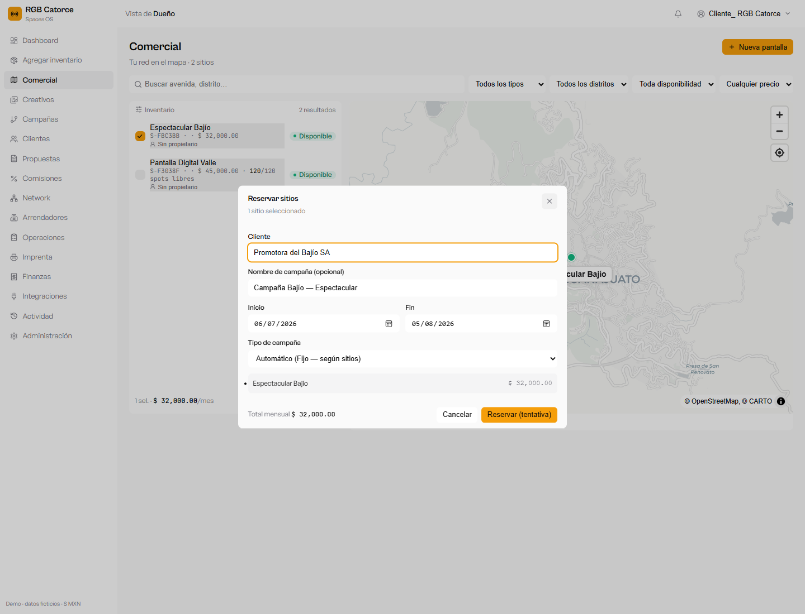
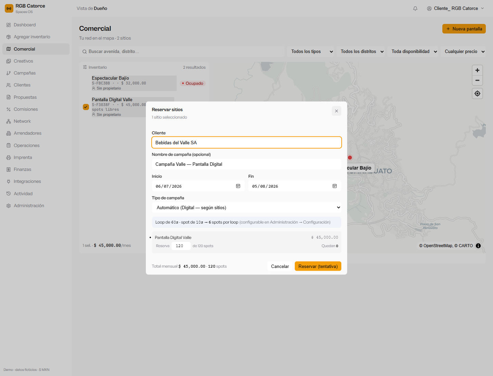
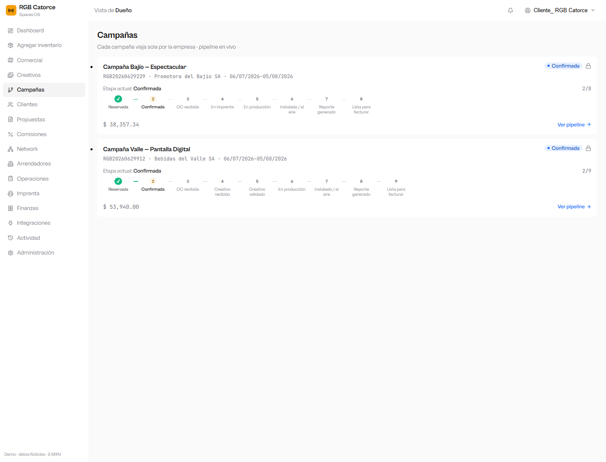
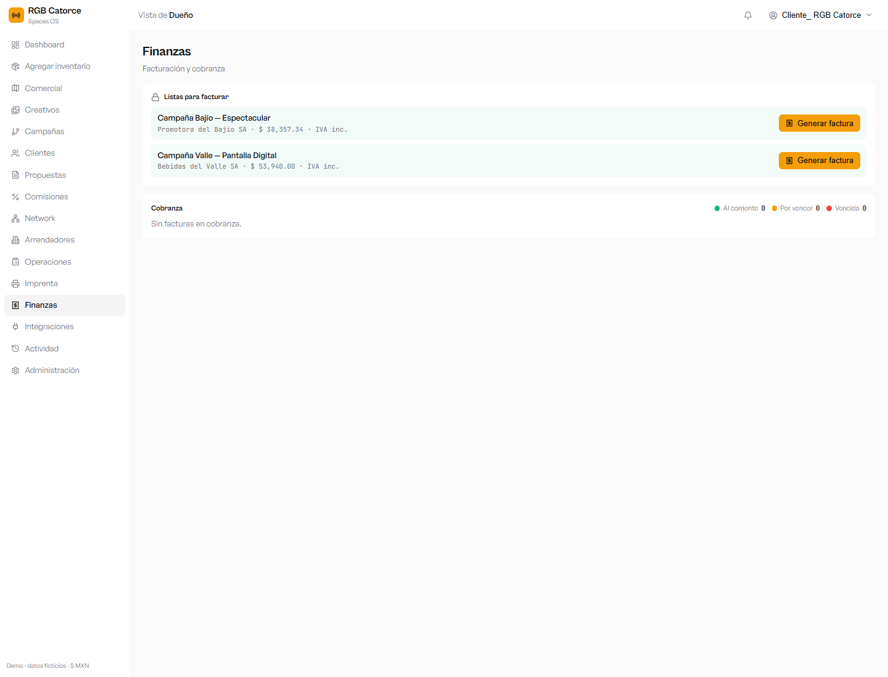
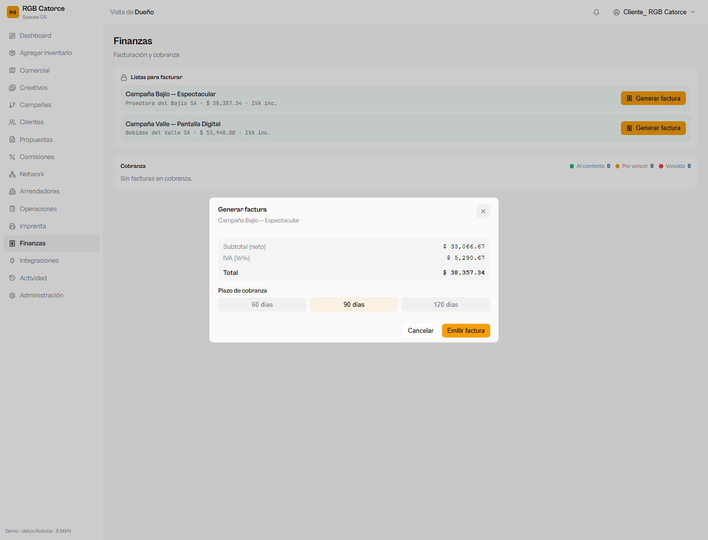
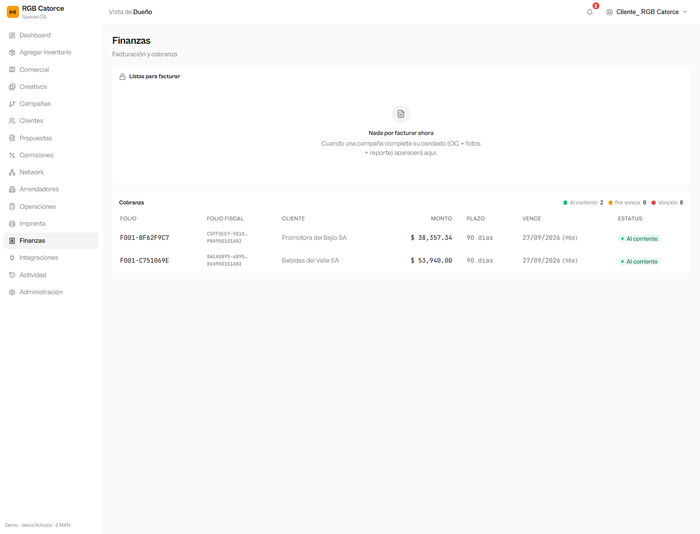

# SPACES OS — Manual: 2 campañas (fija y digital) reservadas, confirmadas y pagadas

> Recorrido completo probado de punta a punta en el sistema: se crean **dos campañas**
> —una sobre una pantalla **fija (OOH)** y otra sobre una **digital (DOOH)**— se
> **confirman** y se **facturan** (su pago). Capturas reales del demo.
> Datos ficticios · moneda MXN · IVA por cliente.

---

## Resumen del recorrido

| Campaña | Pantalla | Tipo | Cliente | Total facturado |
|---|---|---|---|---|
| **Bajío — Espectacular** | Espectacular Bajío (León, Gto.) | **Fija / OOH** | Promotora del Bajío SA | **$ 38,357.34** |
| **Valle — Pantalla Digital** | Pantalla Digital Valle (Guadalajara) | **Digital / DOOH** | Bebidas del Valle SA | **$ 53,940.00** |

Ambas quedaron **confirmadas** y con su **factura emitida** (al corriente, plazo 90 días).

---

## 1. Campaña 1 — Pantalla FIJA (OOH)

1. Entra a **Comercial**. Selecciona la pantalla **fija** (casilla a la izquierda) y pulsa **Reservar**.
2. Captura el **Cliente** (*Promotora del Bajío SA*), el **Nombre de la campaña** y las **fechas**.
3. El **Tipo de campaña** queda en *Automático* → como la pantalla es fija, será **OOH** (con imprenta, sin creativos digitales).
4. Pulsa **Reservar (tentativa)**.

*Reserva de una pantalla fija: cliente, nombre y fechas de la campaña.*

5. En la barra **Reservas tentativas**, pulsa **Confirmar** → la campaña queda **confirmada** y la pantalla pasa a **ocupada**.

---

## 2. Campaña 2 — Pantalla DIGITAL (DOOH)

1. En **Comercial**, selecciona la pantalla **digital** y pulsa **Reservar**.
2. Captura el **Cliente** (*Bebidas del Valle SA*), el **Nombre** y las **fechas**.
3. En digital se muestra la estructura del **loop** (de Ajustes): *loop de 60 s · spot de 10 s → 6 spots por loop*, y eliges **cuántos spots** reservar (aquí, 120 de 120).
4. **Reservar (tentativa)** → **Confirmar**. Como la pantalla es digital, la campaña es **DOOH** (con creativos, sin imprenta).

*Reserva de una pantalla digital: spots a reservar y estructura del loop.*

---

## 3. Ambas campañas y su avance

En **Campañas** aparecen las dos, cada una con su **pipeline** (todas las etapas y cómo van). El pipeline se adapta al tipo: la fija pasa por **imprenta**; la digital por **creativos**.

*Las dos campañas (OOH y DOOH) con su avance por etapas.*

---

## 4. Facturación (su pago)

Una campaña se factura cuando completa su **candado** (OC + fotos comprobatorias + reporte). Entonces aparece en **Finanzas**.

1. Entra a **Finanzas**. Ambas campañas aparecen en **Listas para facturar**.

*Las dos campañas con candado completo, listas para facturar.*

2. En cada una pulsa **Generar factura**, revisa el desglose (**Subtotal + IVA del cliente = Total**), elige el **plazo de cobranza** y pulsa **Emitir factura**.

*Desglose fiscal y plazo antes de emitir la factura.*

3. Las dos facturas se emiten (con su **folio fiscal** simulado y **RFC**) y pasan a **Cobranza** con su semáforo.

*Las dos facturas emitidas y en cobranza (al corriente, 90 días).*

---

*Demo · datos ficticios. El folio fiscal es simulado (sin timbrado real). El IVA aplicado es el configurado por cada cliente. Recorrido probado de extremo a extremo: reservar → confirmar → facturar, tanto en fija (OOH) como en digital (DOOH).*
