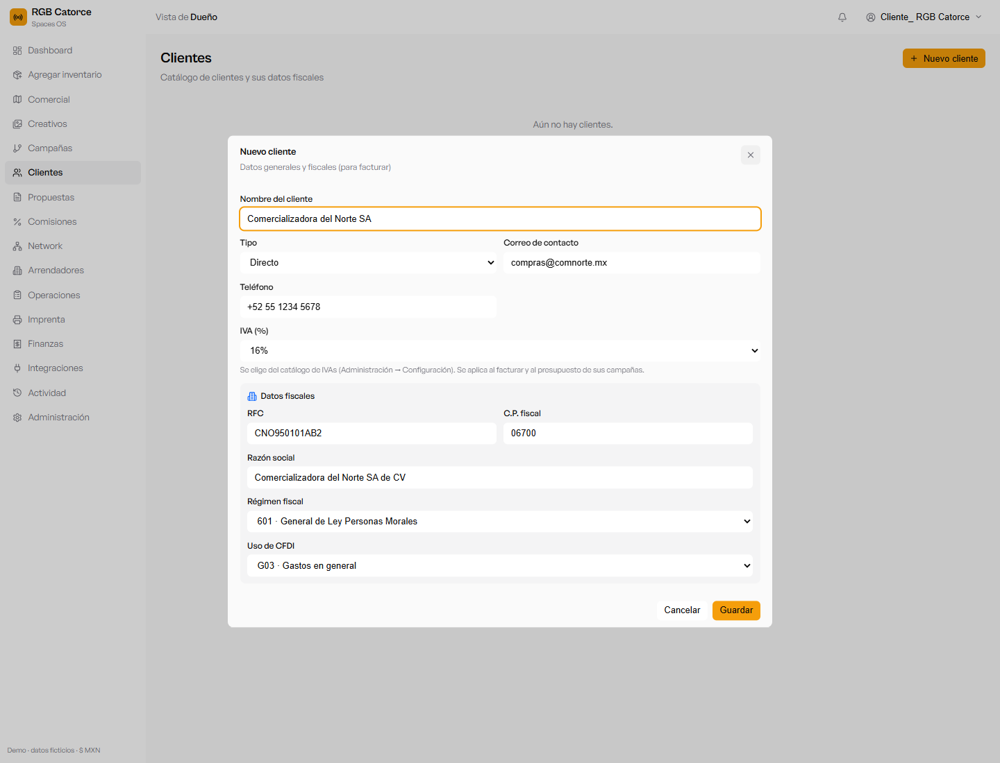
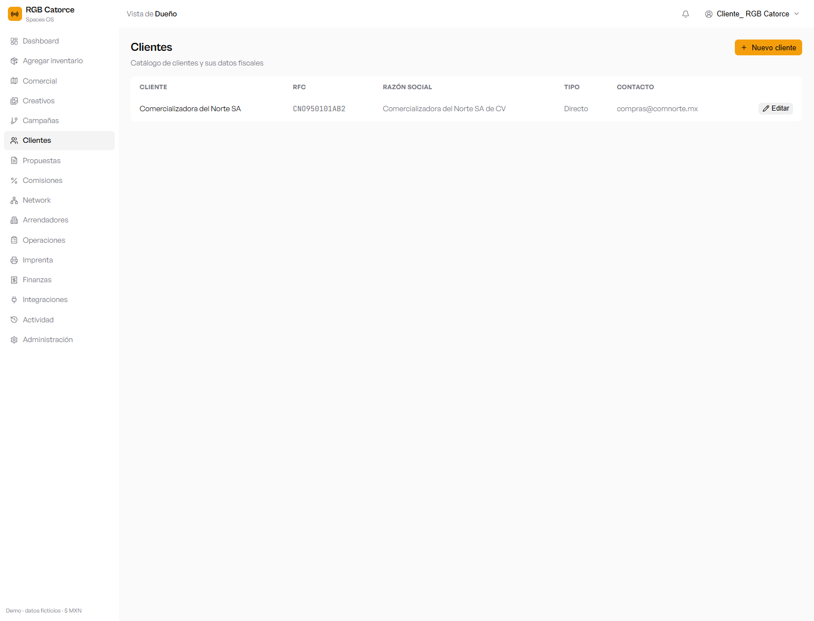
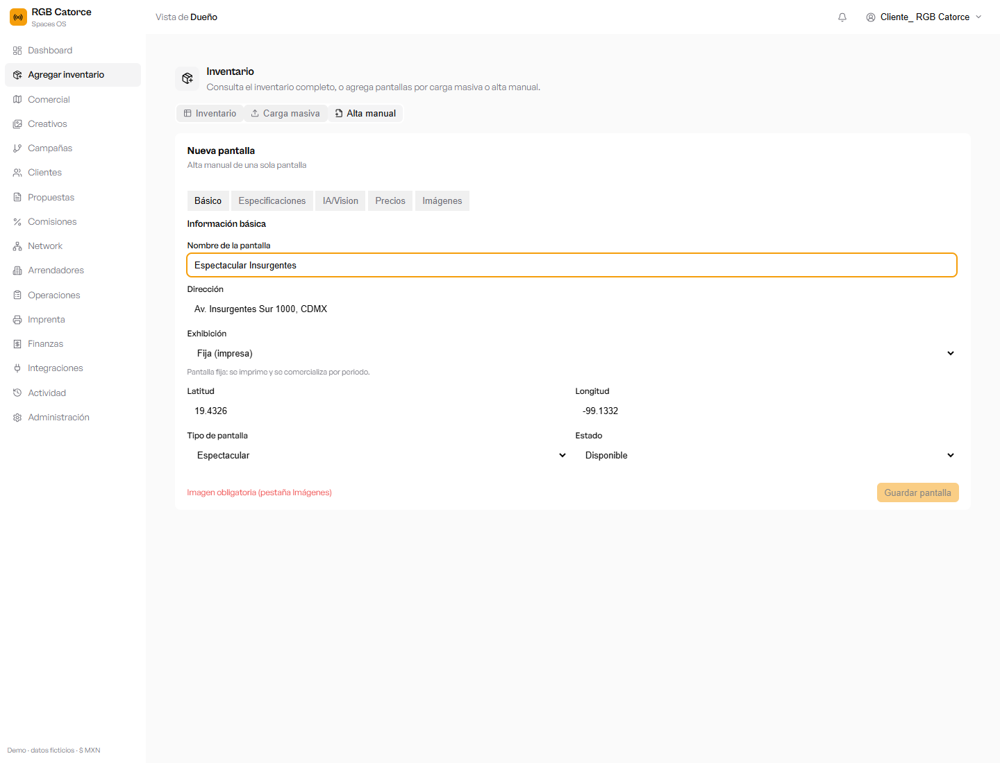
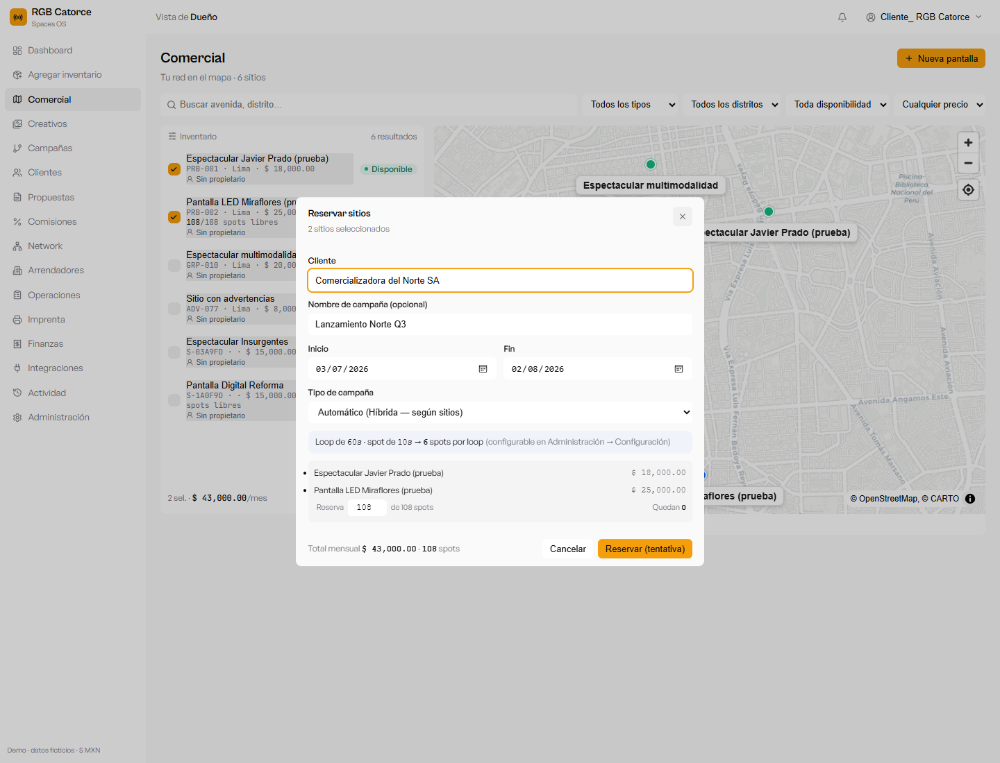
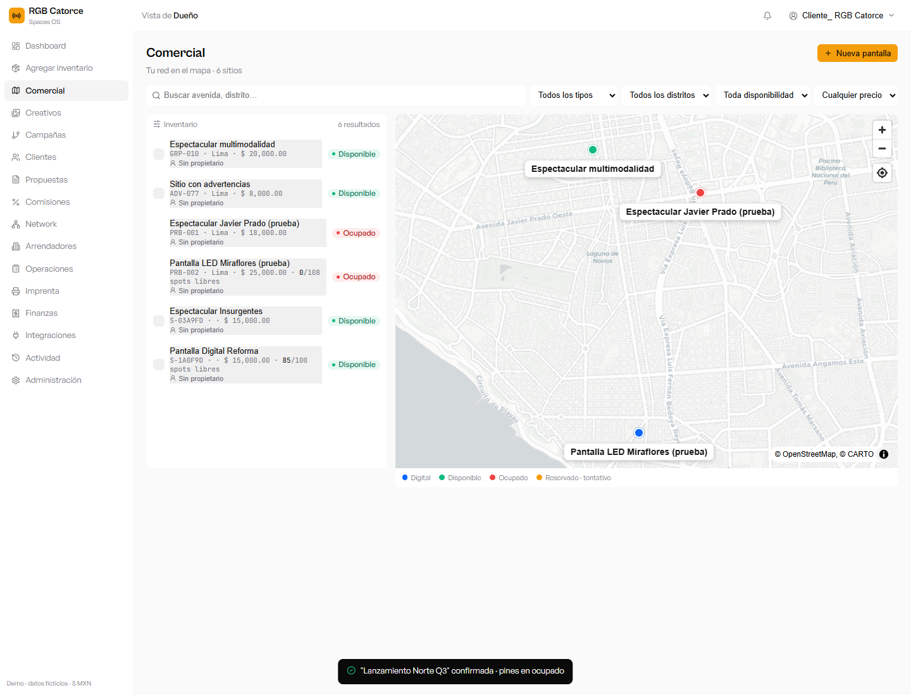
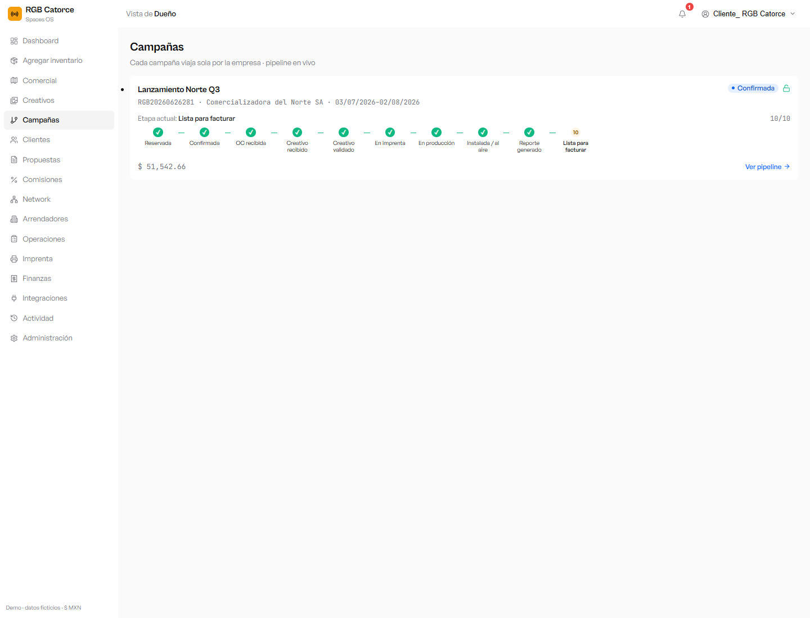
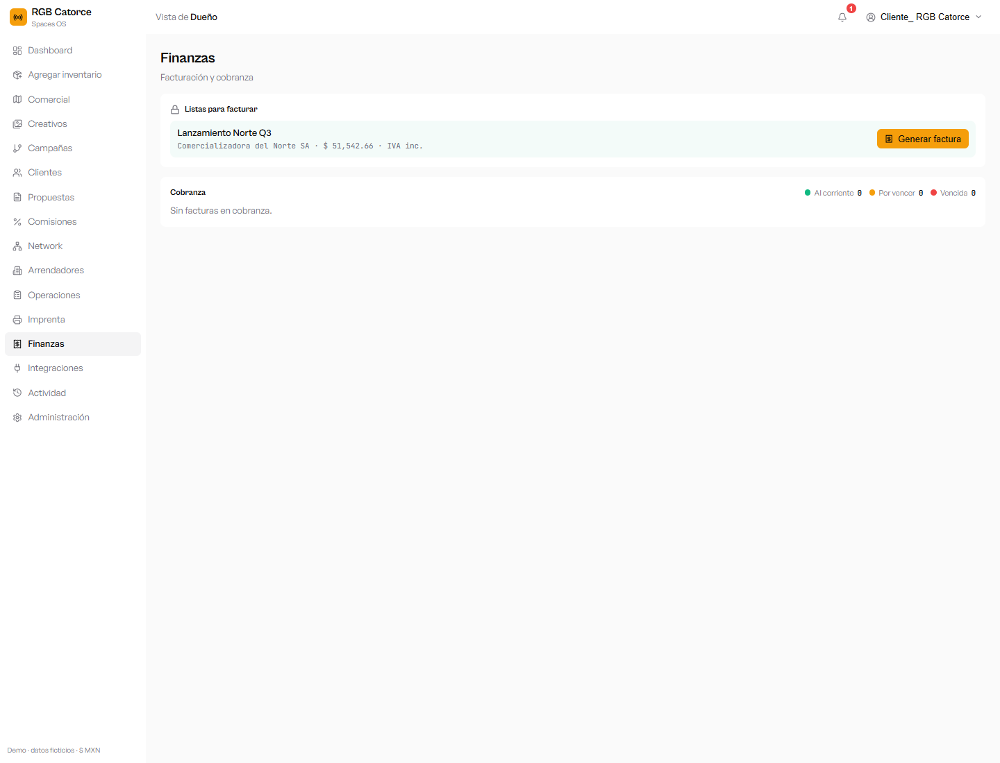
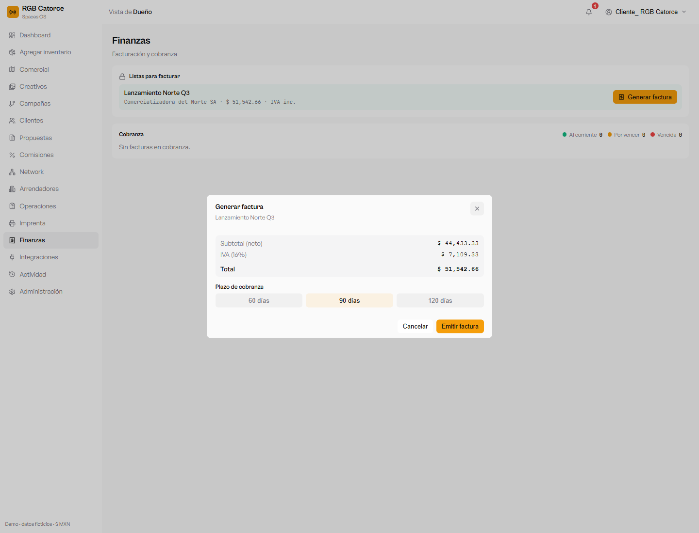
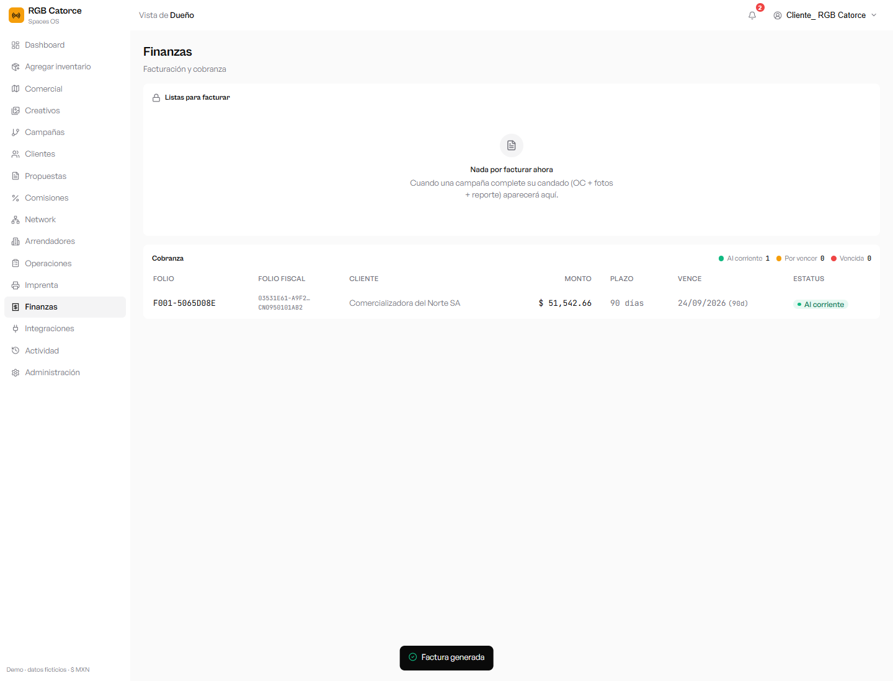

# SPACES OS — Manual de procesos (paso a paso)

> Guía con capturas de los procesos principales: crear un cliente, subir pantallas
> (fija y digital), crear una campaña y facturarla (su pago).
> Demo local · datos ficticios · moneda MXN · IVA por cliente.

---

## 1. Crear un cliente

El cliente es a quién se le factura. Conviene capturar sus datos fiscales desde el inicio.

1. En el menú entra a **Clientes**.
2. Pulsa **+ Nuevo cliente** (arriba a la derecha).
3. Llena los datos:
   - **Nombre del cliente** y **Tipo** (Directo o Agencia).
   - **Correo** y **Teléfono** de contacto.
   - **IVA (%)**: se elige del catálogo definido en Ajustes (Administración → Configuración).
   - **Datos fiscales**: **RFC**, **C.P. fiscal**, **Razón social**, **Régimen fiscal** y **Uso de CFDI** (necesarios para facturar).
4. Pulsa **Guardar**.

*Alta de cliente con sus datos fiscales.*

El cliente aparece en el catálogo, listo para usarse en campañas y propuestas.

*Catálogo de clientes tras crear el cliente.*

---

## 2. Subir pantallas (fija y digital)

Las pantallas (inventario) se dan de alta una por una o por carga masiva. Aquí, una por una.

1. Entra a **Agregar inventario** y abre la pestaña **Alta manual**.
2. En **Básico** captura **Nombre**, **Dirección**, coordenadas y **Tipo de pantalla**.
3. Elige la **Exhibición**:
   - **Fija (impresa):** se imprime y se comercializa por periodo.
   - **Digital (pantalla):** se comercializa por **spots** (loop). Completa la pestaña **Especificaciones**.
4. En la pestaña **Imágenes** sube la **imagen promocional** (obligatoria).
5. Pulsa **Guardar pantalla**.

### Pantalla fija

*Alta manual con Exhibición = Fija.*

### Pantalla digital

*Alta manual con Exhibición = Digital (pantalla por spots).*

> Las pantallas digitales (DOOH) usan spots según el **loop** definido en Ajustes; las fijas (OOH) se imprimen.

---

## 3. Crear una campaña

Una campaña se arma reservando pantallas para un cliente y confirmando la reserva.

1. Entra a **Comercial**. En la lista/mapa, **selecciona** las pantallas disponibles (casilla a la izquierda).
2. Pulsa **Reservar**.
3. En el diálogo captura el **Cliente**, el **Nombre de la campaña** y las **fechas**. Para pantallas digitales verás cuántos **spots por loop** hay.
4. Pulsa **Reservar (tentativa)** → la campaña queda como reserva **tentativa**.

*Reserva de pantallas: cliente, nombre y fechas de la campaña.*

5. En la barra **Reservas tentativas**, pulsa **Confirmar** para comprometer la campaña.

*La campaña queda confirmada (sitios ocupados).*

La campaña aparece en **Campañas** con su **pipeline**, donde se ve cómo van todas sus etapas.

*Campañas: cada una muestra su avance por etapas.*

---

## 4. Facturar la campaña (su pago)

Una campaña se factura cuando completa su **candado**: **OC recibida + fotos comprobatorias + reporte de publicación**. Entonces aparece en Finanzas.

1. Entra a **Finanzas**. La campaña lista aparece en **Listas para facturar**.
2. Pulsa **Generar factura**.

*La campaña con el candado completo aparece lista para facturar.*

3. Revisa el desglose (**Subtotal + IVA del cliente = Total**), elige el **Plazo de cobranza** (60 / 90 / 120 días) y pulsa **Emitir factura**.

*Desglose fiscal y plazo de cobranza antes de emitir.*

4. La factura se emite (con su **folio fiscal** simulado) y pasa a **Cobranza** con su semáforo (al corriente / por vencer / vencida).

*Factura emitida y en cobranza, con folio fiscal, monto, plazo y vencimiento.*

---

*Demo · datos ficticios. El folio fiscal es simulado (sin timbrado real). El IVA aplicado es el configurado por cliente.*
