# SPACES OS — Manual de usuario

> Versión al **26/06/2026** · Demo local (Web `:3000` · Postgres `:5433`).
> Guía práctica de cómo usar cada módulo, paso a paso.

---

## 1. Acceso y navegación

- **Entrar:** `http://localhost:3000/spaces-dooh/demo/login`. Datos ficticios; moneda MXN; IVA 16%.
- **Menú lateral (izquierda):** muestra solo los módulos de tu rol. En **celular** se oculta y aparece un **botón ☰** (drawer retráctil); se cierra al elegir una opción.
- **Sección activa:** el menú resalta dónde estás, incluso en pantallas de detalle (p. ej. ver una OT marca *Operaciones*; el detalle de una campaña marca *Campañas*).
- **Migas de pan ("cómo llegué"):** en las pantallas de detalle hay una ruta clicable arriba (p. ej. *Operaciones › OT-0142*) y un "volver" que regresa al origen real desde donde entraste.

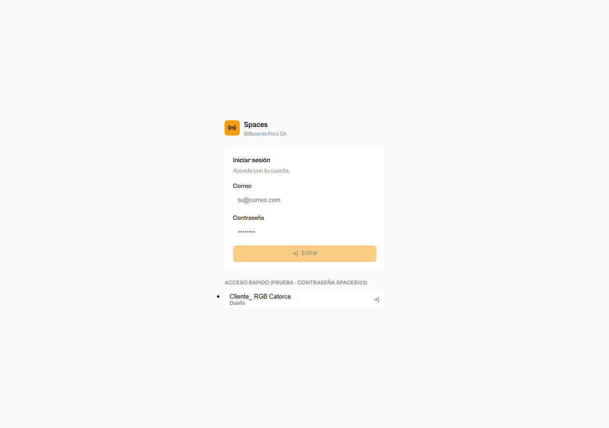
*Inicio de sesión.*

### Roles
Dueño, Comercial, Operaciones, Imprenta, Finanzas y Cliente externo (este último solo ve su portal). Cada acción se valida por permisos en el servidor.

---

## 2. Dashboard (Dueño)

Vista de negocio de un vistazo:
- **KPIs:** ingreso contratado del mes, margen, por cobrar, ocupación de la red.
- **Costos del mes:** desglose espacios + impresión + operación.
- **Ocupación** por día/semana/mes, **alertas** (rentas vencidas, contratos por vencer, cobranzas, incidencias), **mapa** de la red y **campañas por finalizar**.

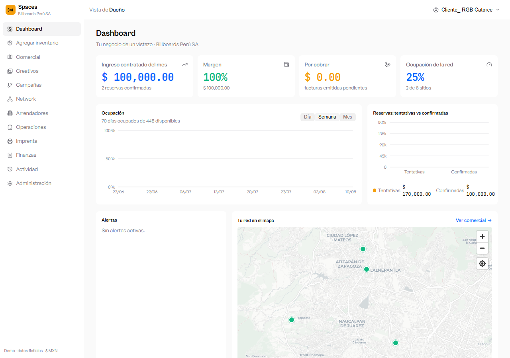
*Dashboard: KPIs, costos del mes, ocupación y mapa de la red.*

---

## 3. Inventario

Entra a **Inventario** (Dueño). Tiene tres pestañas:

1. **Inventario (listado):** tabla con todas las pantallas y columnas **Pantalla, Tipo, Ubicación, Medio (Digital/Fija), Tarifa, Estatus, Propietario, Renta y "Cada cuándo" (periodicidad de pago)**. Tiene **buscador** (nombre/código/distrito). **Haz clic en una fila** para abrir la ficha del sitio.
2. **Carga masiva:** sube un Excel/CSV con la plantilla para dar de alta muchas pantallas.
3. **Alta manual:** formulario para registrar una pantalla, con la opción de **Computer Vision** (medición de audiencia/AdMobilize).

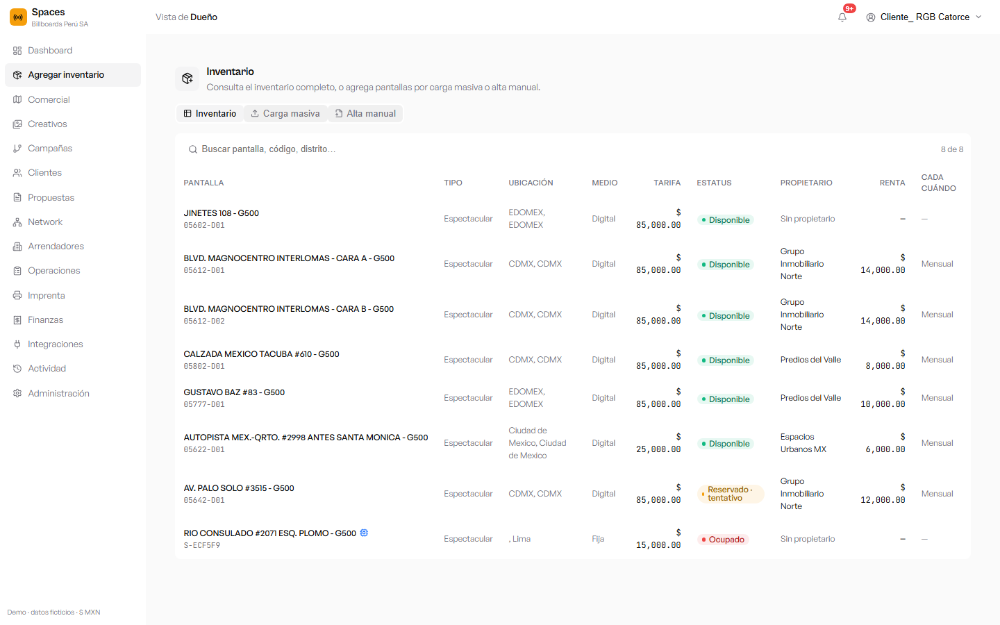
*Tabla de inventario con columnas (incluye Propietario, Renta y periodicidad). La fila es clicable para abrir la ficha.*

---

## 4. Comercial (Dueño, Comercial)

Es el centro de venta: **mapa + lista de inventario** con filtros (tipo, distrito, disponibilidad, precio).

- **Colores:** azul = digital · verde = disponible · rojo = ocupado · ámbar = reservado (mapa y badges). El nombre del lugar aparece al acercar el zoom y al pasar el mouse.
- **Lista:** cada fila muestra código, distrito, tarifa y **Propietario** del espacio.
- **Reservar:** marca uno o varios sitios libres → **Reservar** (crea reserva *tentativa*). Luego, en la barra de tentativas, **Confirmar** o **Extender**.
- **Ficha del sitio (clic en un sitio):** características técnicas, datos comerciales, IA/Computer Vision, **Propietario y renta** (dueño, monto, *cada cuándo se paga*, vigencia, último/próximo pago) y disponibilidad por fechas. Desde aquí puedes **editar** o **eliminar** la pantalla.

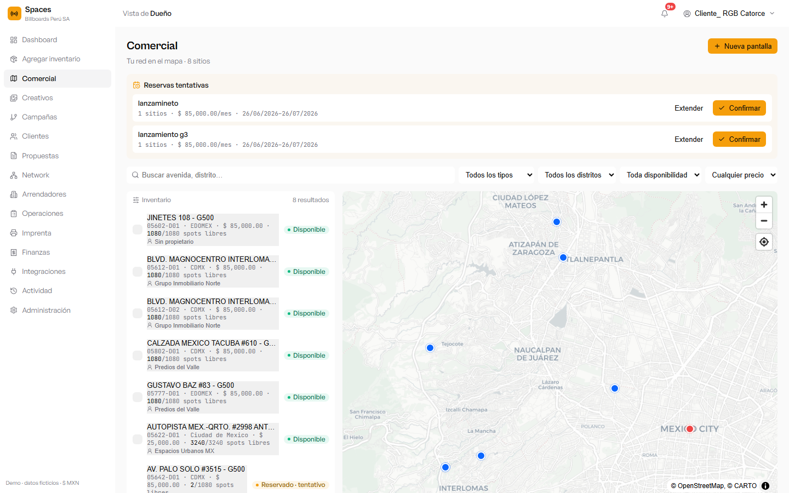
*Comercial: lista con propietario por fila + mapa con colores por estatus.*

---

## 5. Clientes (Dueño, Comercial)

Catálogo con datos fiscales (RFC, razón social, régimen, CP, uso CFDI) e **IVA (%)** por cliente.

- **Tipo de cliente:** *Directo* o *Agencia*.
- **La comisión es de la AGENCIA:** al crear/editar un cliente **tipo Agencia** capturas su **comisión (%)** y la **negociación**:
  - **¿Hay negociación con la agencia?** Sí/No.
  - Si es **Sí:** registras los **términos** y marcas **"Negociación validada"**.
  - **Regla:** mientras la negociación NO esté validada, **no se pueden crear ni aprobar propuestas** con esa agencia.
- Una agencia se **asocia a un cliente directo**; esa relación se guarda y se reutiliza.

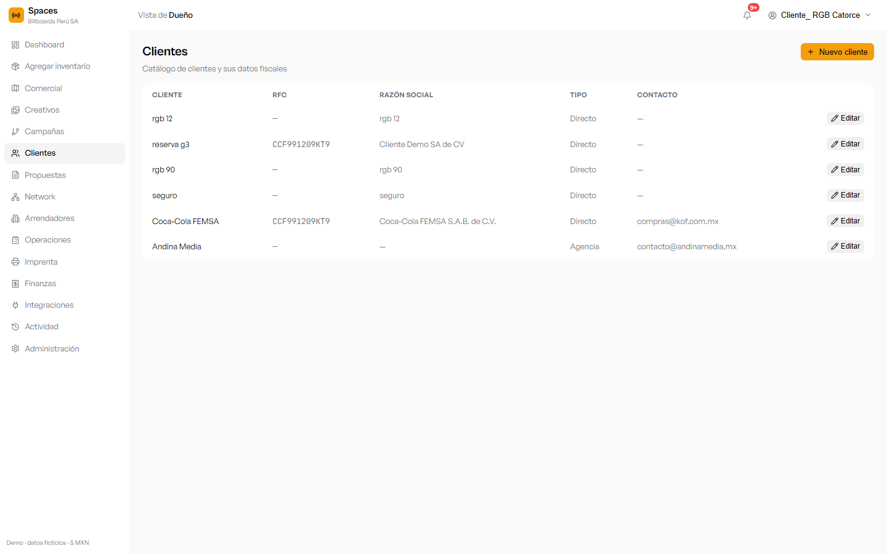
*Catálogo de clientes (directos y agencias) con sus datos fiscales.*

---

## 5b. Comisiones (Dueño, Comercial)

Pantalla dedicada para **ajustar la comisión** en un solo lugar:

- **Nueva agencia:** botón para dar de alta una agencia (cliente tipo Agencia) con su **comisión** y, si aplica, su **negociación**, sin salir de esta pantalla.
- **Agencias y su comisión:** edita la **comisión (%)** de cada agencia (escribe el valor y **Guardar**). Muestra el estado de la **negociación** con un botón **Validar** (o *Quitar*) y cuántos clientes tiene asociados.
- **Clientes y su agencia:** asigna a cada cliente directo su **agencia**; la columna **Comisión aplicada** muestra la comisión que hereda de esa agencia.

> La comisión es **por agencia**. Si la negociación de una agencia no está validada, no se pueden crear ni aprobar propuestas con ella (ver §6).

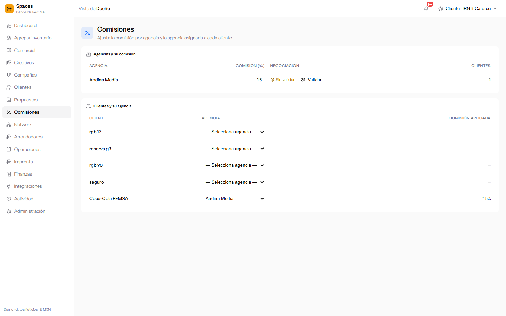
*Ajuste de comisión por agencia y asignación de agencia por cliente.*

---

## 6. Propuestas (Dueño, Comercial)

Cotizaciones por el **método del divisor** (precio de lista bruto → neto según comisión de agencia).

### Crear una propuesta
1. **Nueva propuesta** → nombre, **Cliente** y **Agencia**. Al elegir el cliente, su agencia y comisión se **precargan** (la comisión viene de la agencia).
2. Si la agencia tiene **negociación sin validar**, aparece un aviso y **no deja crear** hasta validarla en Clientes.
3. Elige fechas y **sitios**; el divisor calcula bruto → neto e IVA en vivo. **Crear propuesta**.

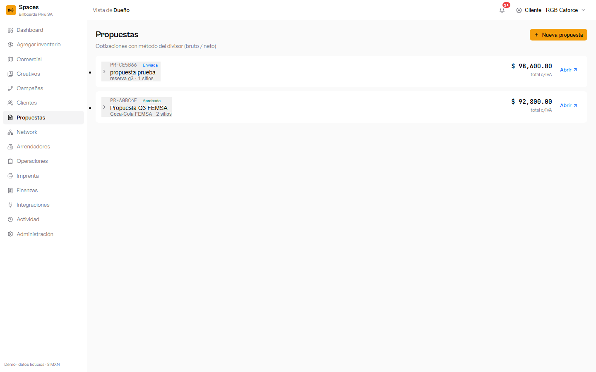
*Lista de propuestas con su estatus y total. Botón "Abrir" para el detalle.*

### Detalle de la propuesta (botón "Abrir")
- **Encabezado:** nombre, estatus y el **Código para el cliente** (folio).
- **Metadatos:** fechas, anunciante, agencia, comisión.
- **Resumen económico:** total c/IVA, neto, IVA, sitios.
- **Sitios y renta:** por sitio, propietario + renta y el precio de la propuesta, con **aprobación por sitio** (casilla).
- **Costo (método del divisor):** bruto → comisión → neto → IVA → total, y los totales **aprobados**.

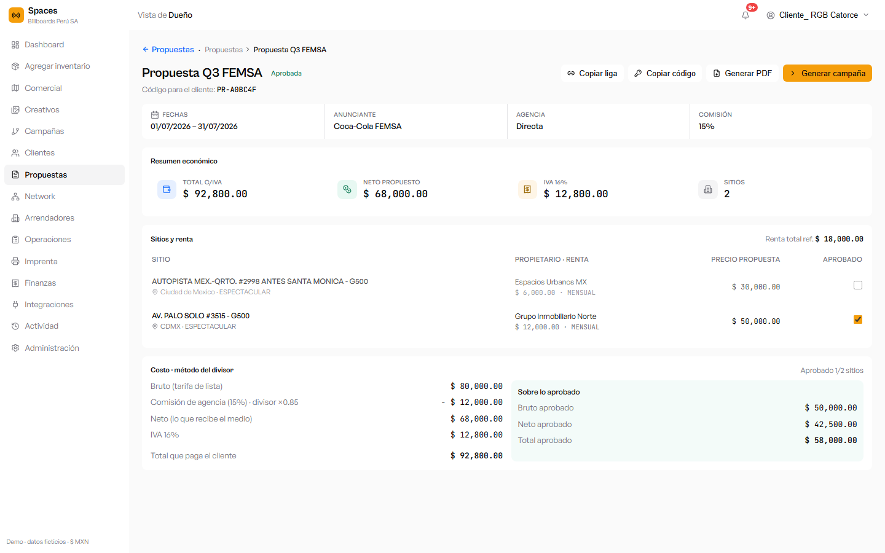
*Detalle de la propuesta: código, copiar liga/código, sitios y renta, y costo por el método del divisor.*

### Compartir la propuesta con el cliente
- **Copiar liga:** copia un enlace **público de solo lectura** que el cliente abre **sin login**.
- **Copiar código:** copia el **código** (folio, p. ej. `PR-A0BC4F`). El cliente entra a **`/demo/propuesta`**, teclea el código y ve su propuesta (estilo Hivestack).
- **Generar PDF:** (placeholder; por ahora no hace nada).

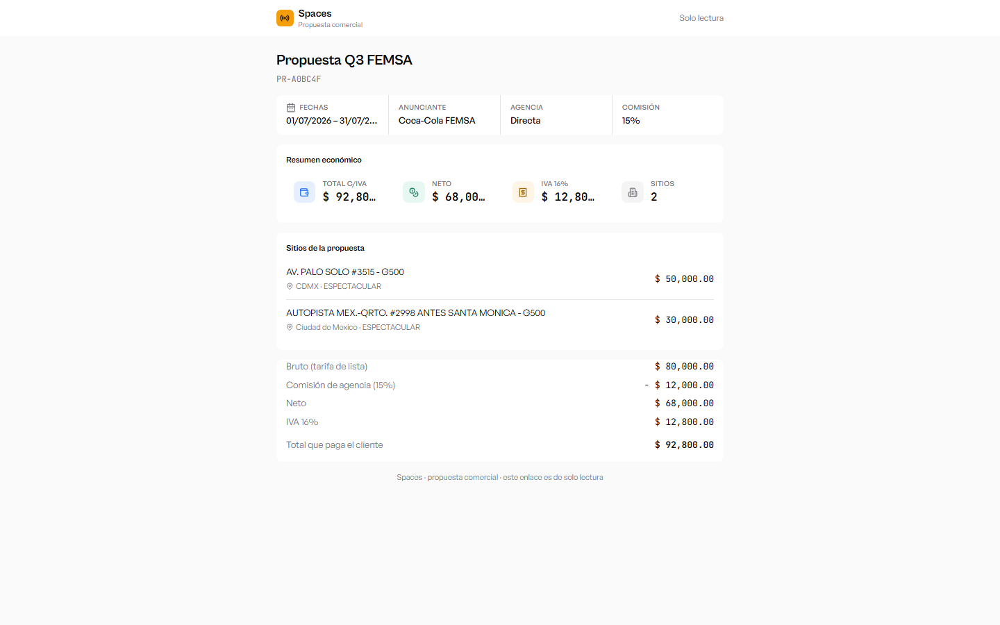
*Vista pública (solo lectura) que abre el cliente sin login.*

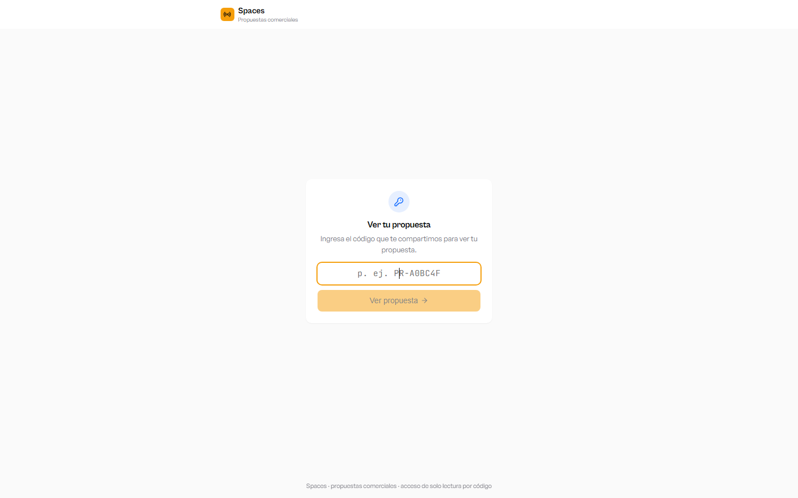
*Página de código: el cliente teclea el folio para ver su propuesta (estilo Hivestack).*

### Aprobar y convertir en campaña
- **Enviar / Aprobar / Rechazar** cambian el estatus. Al **Aprobar**, la propuesta queda **inmutable** (los sitios ya no se editan) y aparece **"Generar campaña"**.
- **Generar campaña:** crea la campaña (**Confirmada**) + reservas, **solo con los sitios aprobados**, con precio neto de comisión; hereda la **agencia**. (Requiere cliente asignado y al menos un sitio aprobado.)

---

## 7. Campañas y Pipeline (Dueño, Comercial)

Cada campaña viaja por la empresa con un **pipeline de 10 etapas** que se **deriva del estado real**. Las etapas dependen del medio: **DOOH** (digital, sin imprenta), **OOH** (fija, sin creativos) o **Híbrida** (ambas).

En el **detalle de campaña:** pipeline, **validación de publicación**, candado de facturación, comercial, rentabilidad (margen), reporte de cumplimiento, ODC, sitios, imprenta, OT, creatividades y evidencias.

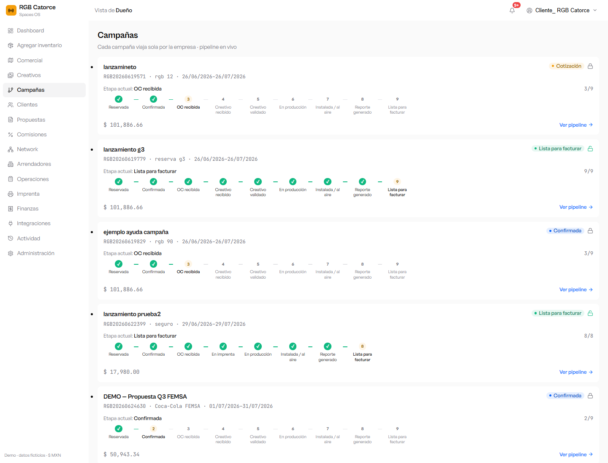
*Campañas con su pipeline en vivo y la cola "Por validar".*

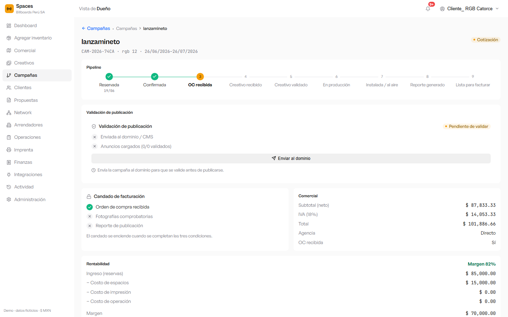
*Detalle de campaña con el pipeline y el panel de validación de publicación.*

### Validación de publicación (antes de salir al aire)
1. **Enviar al dominio:** marca la campaña como enviada al CMS; deja la validación *Pendiente*. En digital exige al menos un anuncio cargado.
2. **Verificar los anuncios:** el panel muestra cada creativo con su estatus.
3. **Aprobar** → la campaña pasa a **Activa** (al aire) con sello de quién/cuándo. **Rechazar** → con motivo; se baja el envío para corregir y reenviar.
- En la lista de **Campañas** hay una cola **"Por validar"** con las campañas que esperan revisión.

---

## 8. Creativos (Dueño, Comercial)

Por campaña digital: subir imágenes o código (HTML), **aprobar/rechazar** cada creativo y **asignar** cuál va en cada spot (y cuántas veces). Una campaña **fija (OOH) no recibe creativos**.

---

## 9. Operaciones (Dueño, Operaciones)

Órdenes de trabajo (OT) de cuadrilla (montaje/mantenimiento).
- **Nueva OT:** al elegir la **campaña**, el **sitio se autoselecciona** desde su reserva.
- **Ver/Abrir OT:** se abre **dentro del shell** (conserva el menú y marca *Operaciones*), con migas de "cómo llegué".
- **Cierre en campo:** checklist + **foto comprobatoria** + **sello de ubicación**; al cerrar, la evidencia alimenta el pipeline y el candado de facturación.

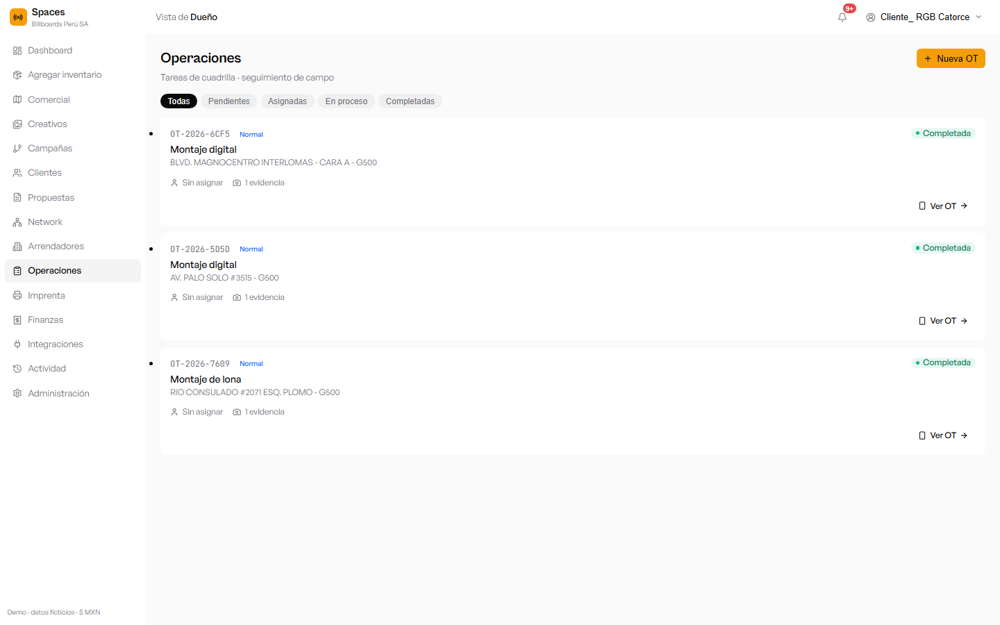
*Operaciones: órdenes de trabajo con su estatus y prioridad.*

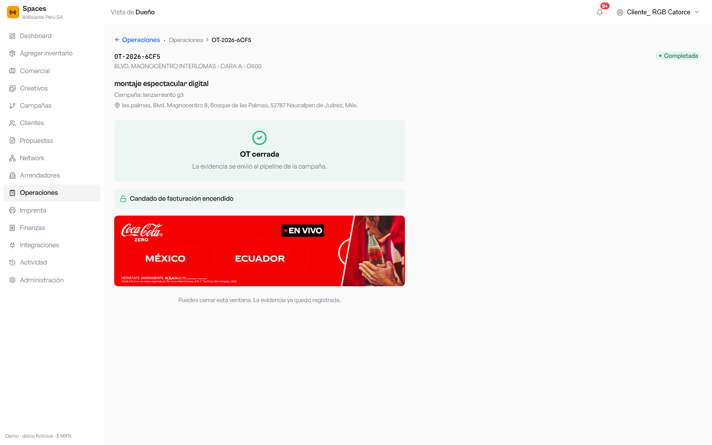
*Detalle de OT dentro del shell (menú visible) con checklist, foto y ubicación.*

---

## 10. Imprenta (Dueño, Imprenta)

Órdenes de impresión + **prueba de color** (probatorio). Rechaza órdenes de campañas DOOH (digital).

---

## 11. Finanzas (Dueño, Finanzas)

- **Factura:** exige RFC + razón social; aplica el **IVA del cliente**; genera **folio fiscal simulado**.
- **Cobranza:** plazos 60/90/120, semáforo (al corriente / por vencer / vencida) y abonos parciales.

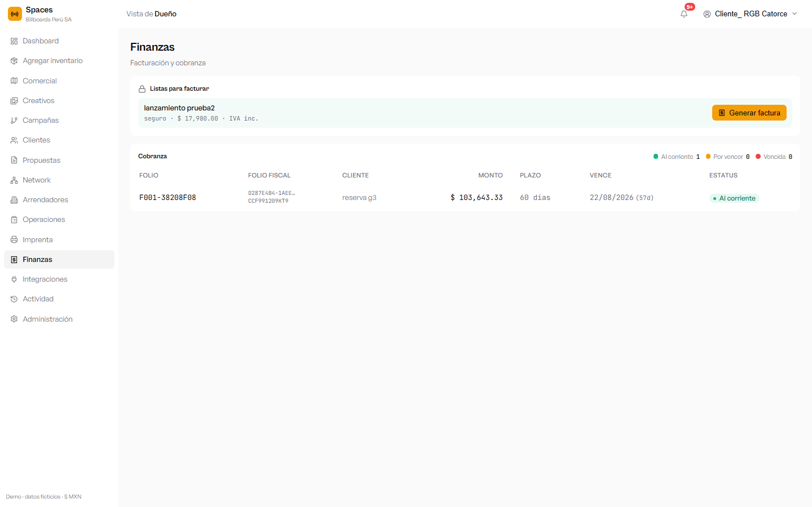
*Finanzas: facturación y cobranza con semáforo.*

---

## 12. Arrendadores / Propietarios (Dueño)

- **Propietarios:** alta del dueño del predio.
- **Contratos:** tabla con propietario, sitio, **renta**, **"Cada cuándo" (periodicidad)**, vencimiento y estatus.
- **Pagos de renta:** registro de pagos con su fecha y semáforo.

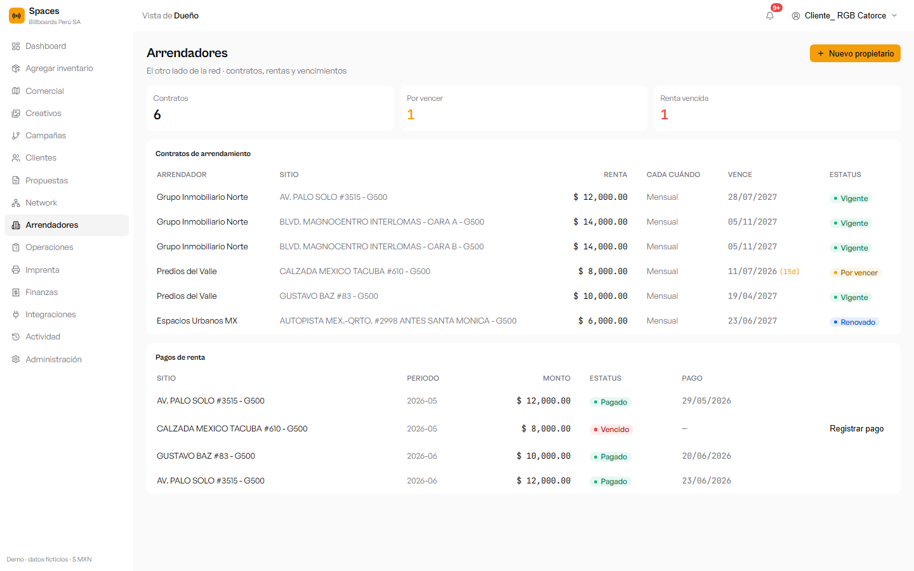
*Arrendadores: contratos con propietario, renta, periodicidad y pagos.*

---

## 13. Actividad (Dueño)

Bitácora de **quién hizo qué y cuándo**, con **filtros combinables**:
- **Fecha** (día), **Hora** (00:00–23:59) y **Quién** (usuario).
- Contador "X de Y" y botón **Limpiar**.

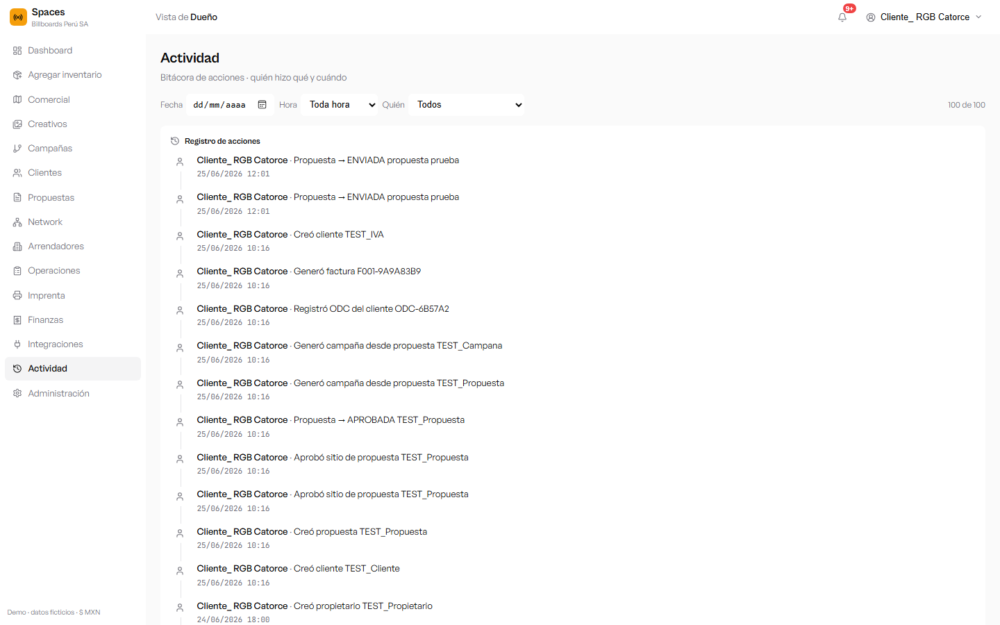
*Bitácora con filtros por fecha, hora y usuario.*

---

## 14. Network, Integraciones y Administración (Dueño)

- **Network:** sitios compartidos a la red programática.
- **Integraciones:** AdMobilize / CMS / CFDI (simulados hasta tener llaves).
- **Administración:** configuración del negocio y usuarios/roles.

---

## 15. Portal del cliente externo

El cliente externo entra solo a **su portal** (sin módulos internos), donde sigue el avance de su campaña y sus evidencias. Las propuestas se comparten aparte por **liga o código** (sección 6).

---

*Demo · datos ficticios. La funcionalidad de negocio está completa y demostrable; los pendientes de producción (multi-tenant, timbrado fiscal legal e integraciones reales) se detallan en el informe.*
