# SPACE EYE — Diagramas

> Complemento visual de los manuales. Los diagramas están en formato Mermaid: se
> ven renderizados en GitHub, VS Code y la mayoría de visores de Markdown.
> Última revisión: 12 de agosto de 2026.

---

## Índice

1. [Diagrama general: SPACE EYE de principio a fin](#1-diagrama-general-space-eye-de-principio-a-fin)
2. [Arquitectura de despliegue](#2-arquitectura-de-despliegue)
3. [Autenticación](#3-autenticación)
4. [Flujo de una fotografía](#4-flujo-de-una-fotografía)
5. [Comunicación equipo → servidor](#5-comunicación-equipo--servidor)
6. [Fotos programadas](#6-fotos-programadas)
7. [Vista en vivo](#7-vista-en-vivo)
8. [Telemetría](#8-telemetría)
9. [Verificación con IA](#9-verificación-con-ia)
10. [Detección de creativo nuevo](#10-detección-de-creativo-nuevo)
11. [Manejo de errores](#11-manejo-de-errores)
12. [Flujo de datos y su costo](#12-flujo-de-datos-y-su-costo)
13. [Comunicación con SPACE OS](#13-comunicación-con-space-os)

---

## 1. Diagrama general: SPACE EYE de principio a fin

Todo el sistema en una vista.

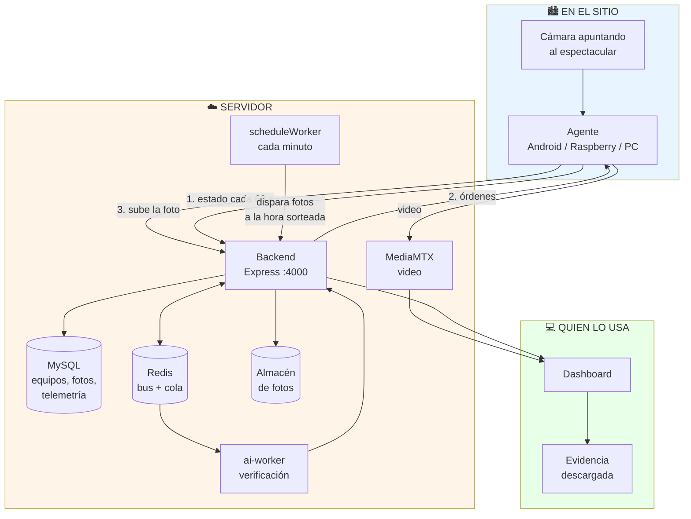

**Lectura en una frase:** el agente vigila la pantalla y reporta; el servidor
guarda, ordena y programa; el dashboard muestra y entrega la evidencia.

---

## 2. Arquitectura de despliegue

Lo que corre en el droplet `159.203.188.58` y sus puertos.

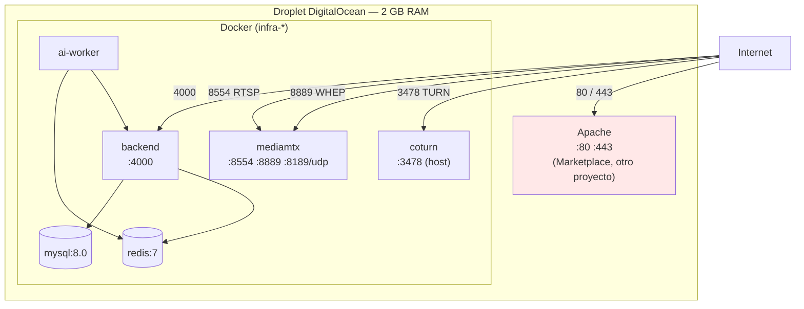

> ⚠️ **Apache sirve otro proyecto en el mismo droplet.** No habilitar nginx: pelea
> por el puerto 80 y tumba Apache en el siguiente reinicio.

---

## 3. Autenticación

Tres identidades distintas, con secretos distintos.

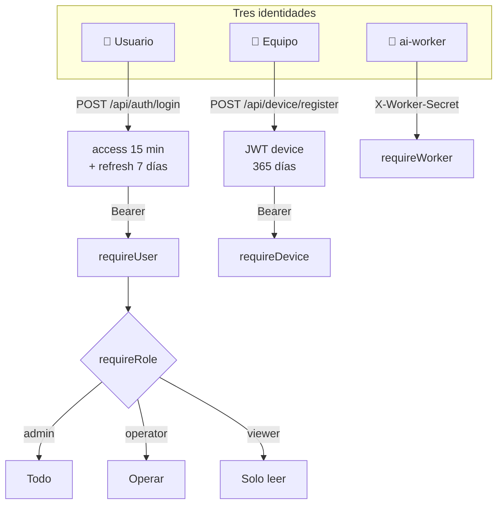

### Sesión deslizante

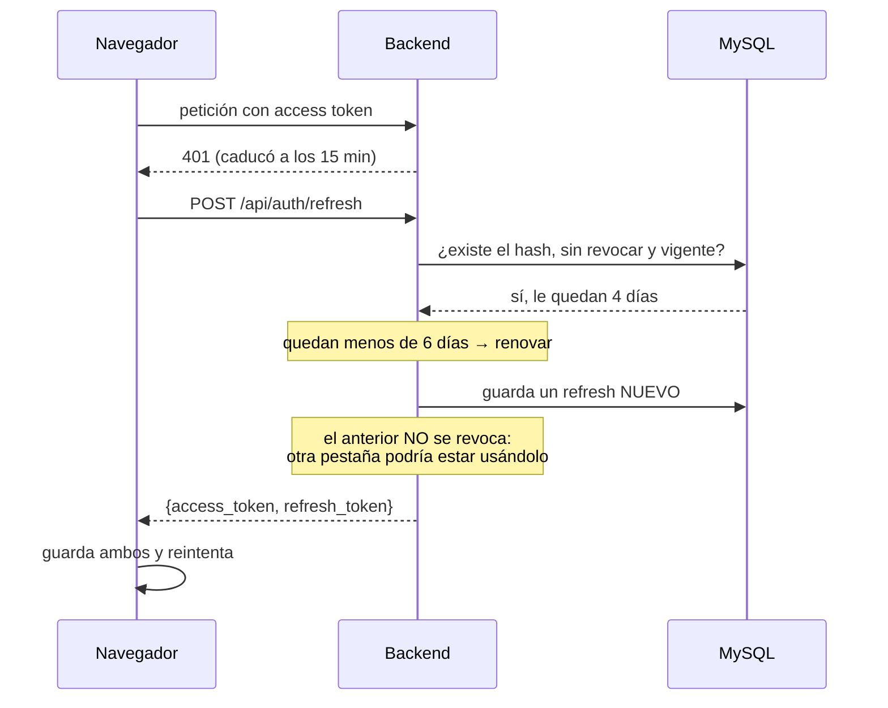

**Por qué importa:** antes la sesión moría a los 7 días exactos y todo el mundo
tenía que volver a capturar contraseña el mismo día.

---

## 4. Flujo de una fotografía

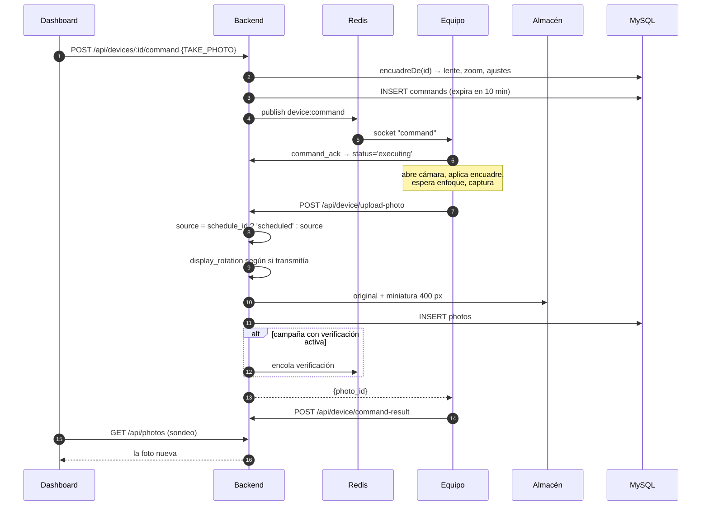

**Dónde falla en la práctica:**

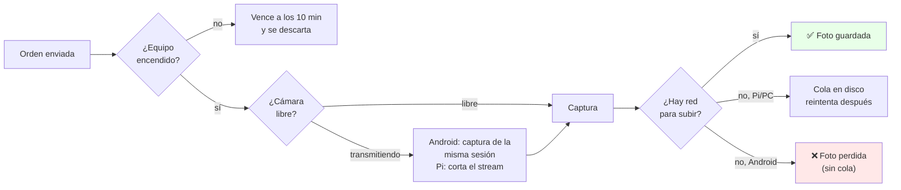

---

## 5. Comunicación equipo → servidor

Dos caminos para las órdenes: socket (inmediato) y sondeo (respaldo).

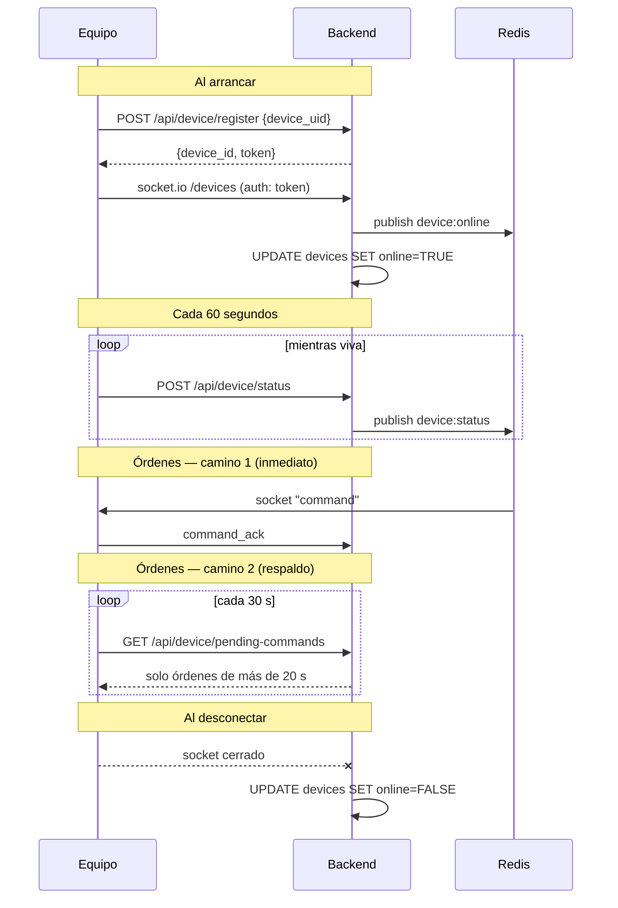

> **Los 20 segundos de gracia** existen para que una orden no llegue por los dos
> caminos y el equipo la ejecute dos veces.

---

## 6. Fotos programadas

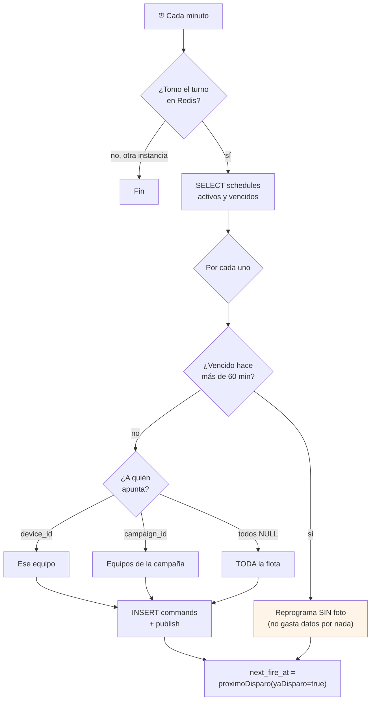

### Cómo se sortea la hora en una franja

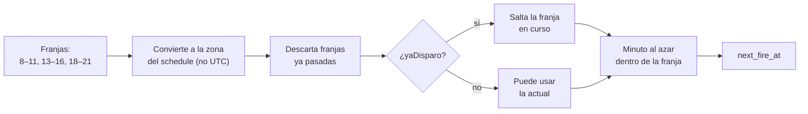

> El **cierre no cuenta**: "de 8 a 10" es 08:00–09:59. Si contara, dos franjas
> pegadas se pisarían en el borde.

---

## 7. Vista en vivo

Dos arquitecturas según el tipo de equipo.

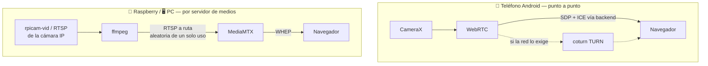

### Los tres cortes de seguridad

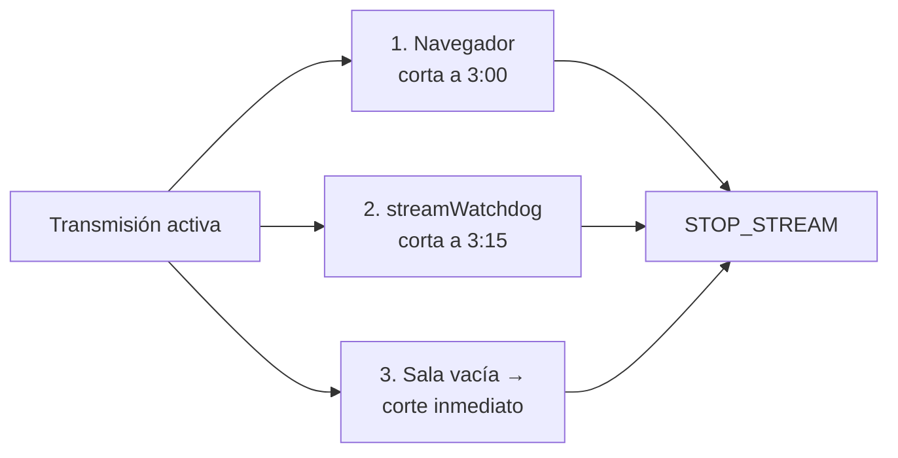

**Por qué tres:** transmitir consume datos sin parar. Si el navegador se cierra de
golpe, los otros dos garantizan el corte.

---

## 8. Telemetría

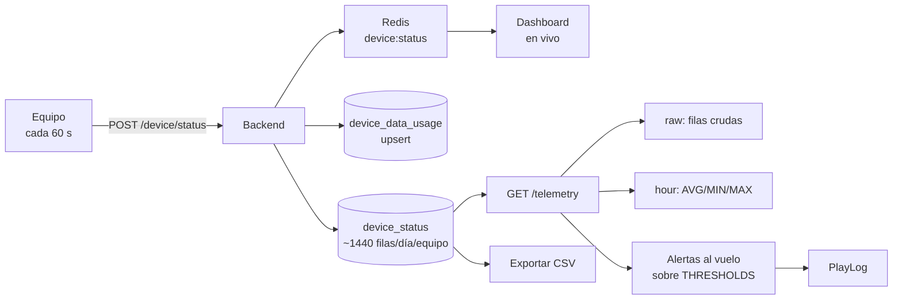

| Alerta | Umbral |
|---|---|
| CPU caliente | > 60 °C |
| Batería caliente | > 45 °C |
| Batería baja | < 20 % |
| Señal débil | < −105 dBm |
| Poco espacio | < 500 MB |
| Sin reportar | > 10 min |

> **Riesgo:** sin política de retención, ~3 millones de filas al año.

---

## 9. Verificación con IA

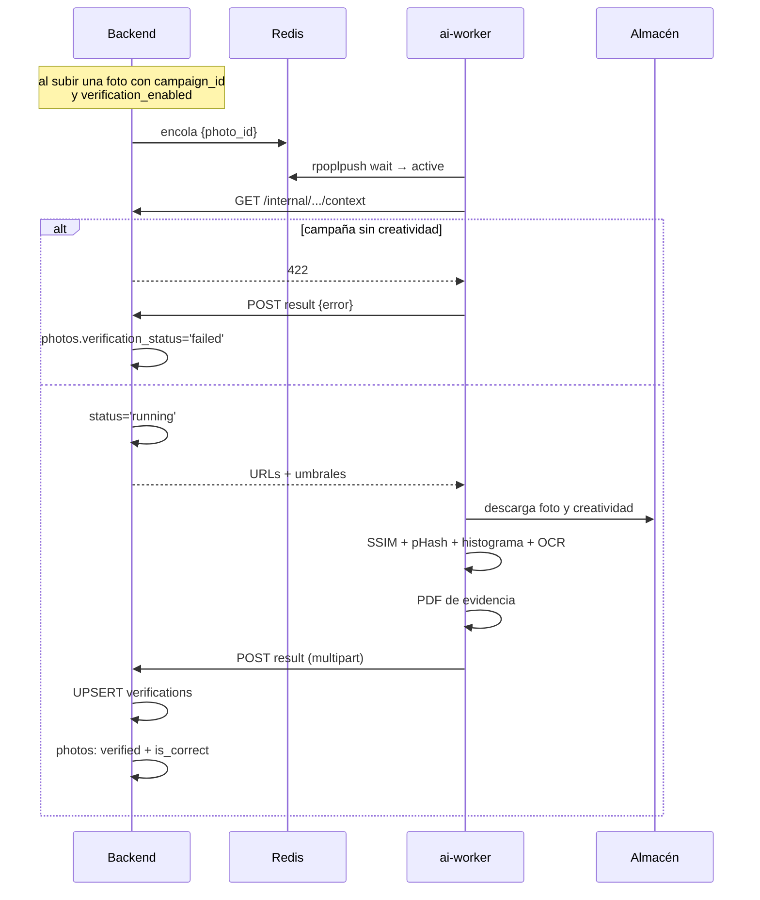

> **Estado real:** 1 campaña, sin creatividad, sin equipos. **No está en uso.**

---

## 10. Detección de creativo nuevo

Diseñado para **no gastar datos**: se comparan huellas, no fotos.

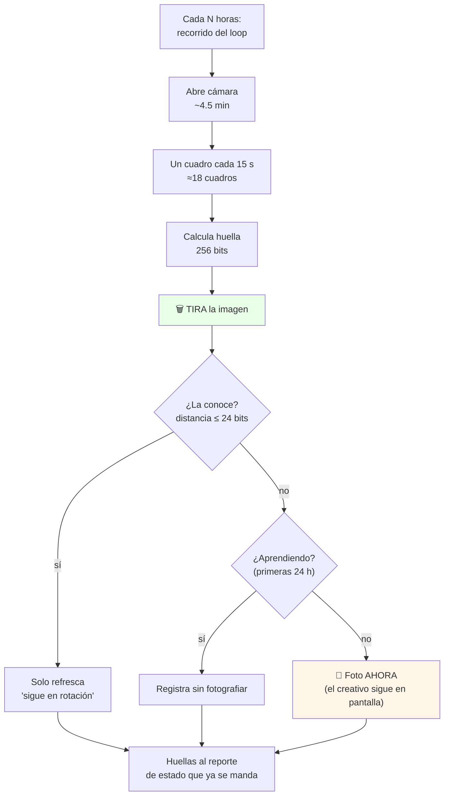

**El ahorro:** una foto son 1.5 MB; un recorrido completo con sus doce creativos
no llega a 1 KB. Detectar cuesta ~0.12 MB al mes contra los ~20 MB que ya gasta
cada equipo.

**Por qué la decisión vive en el equipo:** el creativo dura 20 segundos. Para
cuando el servidor mandara la orden, la pantalla ya habría cambiado.

---

## 11. Manejo de errores

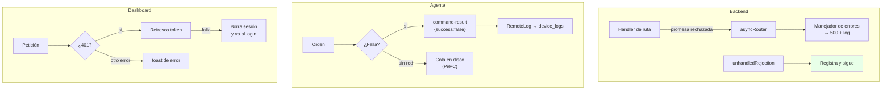

**El principio de fondo:** un fallo aislado **no puede tumbar el backend de toda
la flota**. Por eso `asyncRouter` y el `unhandledRejection`: se responde 500, se
registra, y el servidor sigue atendiendo a los demás equipos.

---

## 12. Flujo de datos y su costo

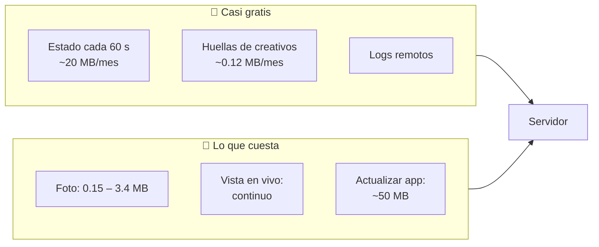

| Escenario | Consumo mensual por equipo |
|---|---|
| Solo telemetría | ~20 MB |
| + 3 fotos al día (equipo ligero, 400 KB) | ~56 MB |
| + 3 fotos al día (equipo pesado, 3.1 MB) | ~299 MB |

**La palanca sin usar:** la columna `devices.capture_quality` existe en la base
pero **ningún agente la aplica**. Bajar la calidad de captura reduciría el
consumo entre 5 y 7 veces sin quitar ni una foto de evidencia.

---

## 13. Comunicación con SPACE OS

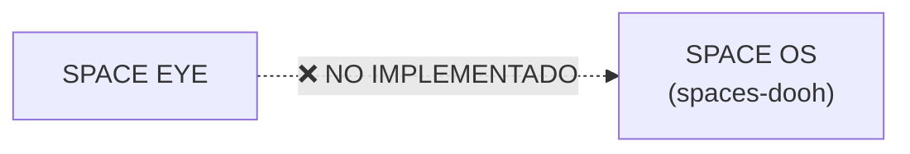

**No existe integración.** Se buscó en todo el código
(`grep -riE "spaceos|space-os|spaces-dooh"` sobre `.ts`, `.js`, `.kt`, `.py`,
`.yml`) y el único resultado está en `docs/PLAN_RASPBERRY_PI5.md`, como plan
entregado y pendiente de aprobación.

Lo que sí existe hoy: en el **mismo droplet** conviven SPACE EYE (puerto 4000, en
Docker) y el proyecto spaces-dooh (puertos 3000/3001, tras Apache). Comparten
servidor, pero **no se comunican entre sí**.

> Si algún día se integran, este diagrama debe actualizarse antes de escribir la
> primera línea de código.

---

*Estos diagramas describen el sistema tal como está hoy. Si cambias un flujo,
actualiza el diagrama en el mismo commit: un diagrama desactualizado engaña más
de lo que ayuda.*
