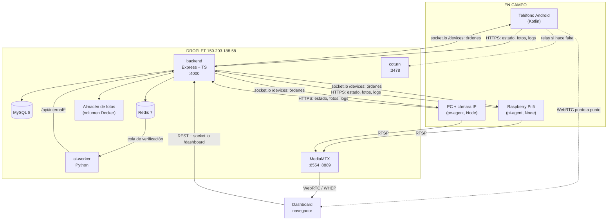
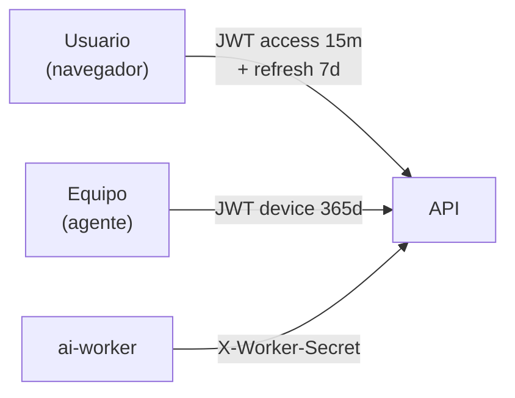
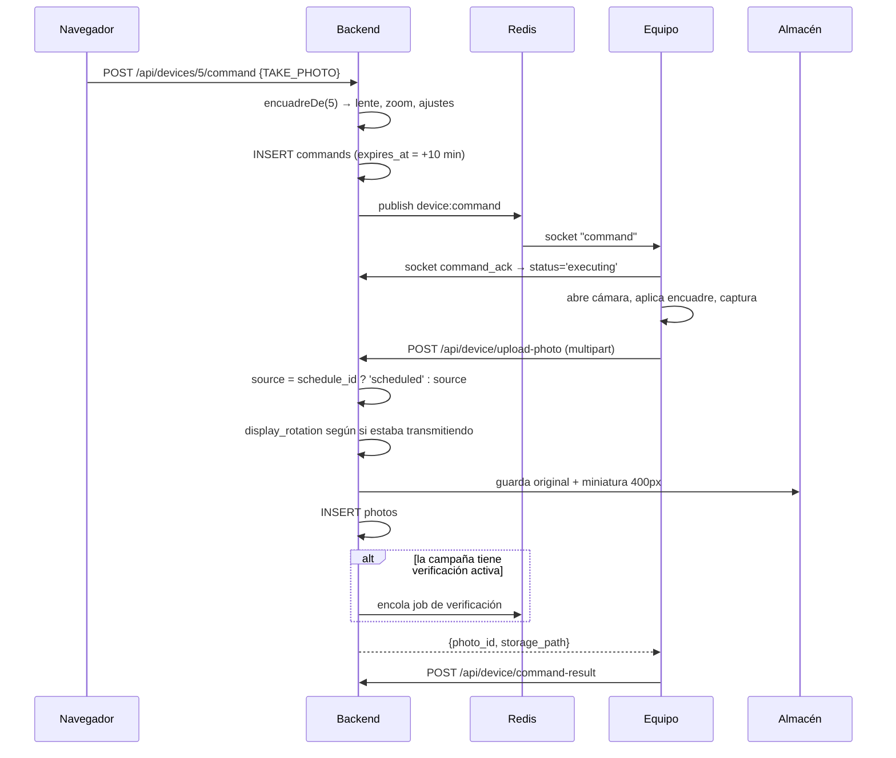
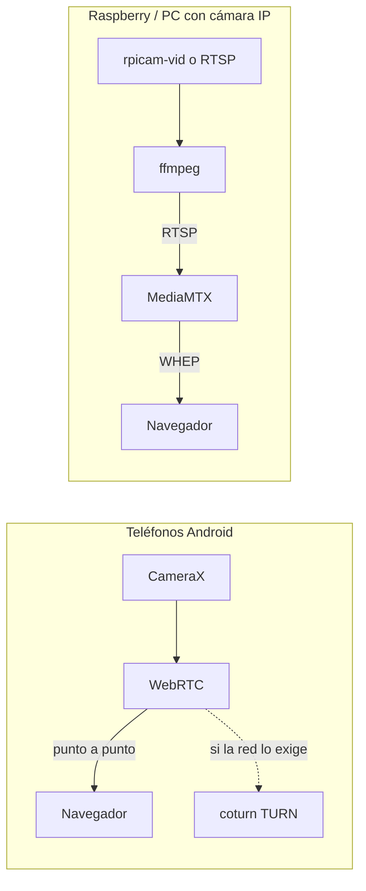
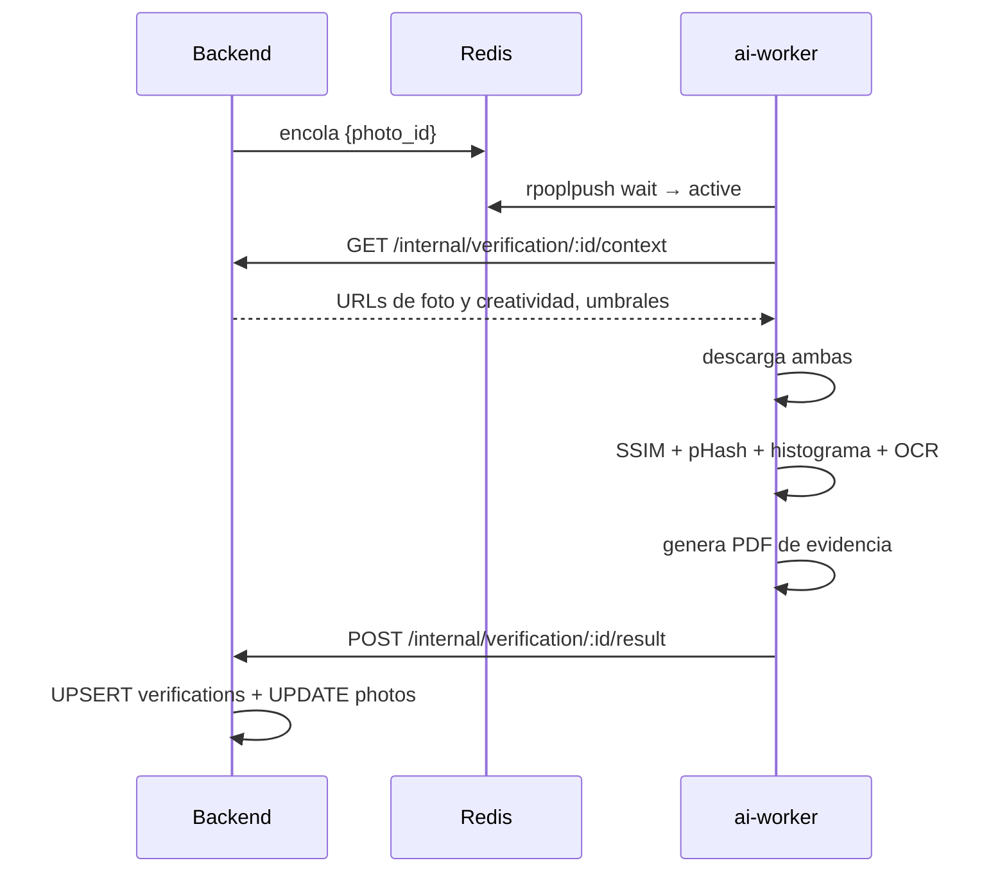

# SPACE EYE — Manual Técnico

> Para quien va a **mantener o extender** el sistema.
> Basado en el código real del repositorio. Última revisión: 12 de agosto de 2026.
>
> Todo lo que no pude confirmar leyendo el código está marcado como
> **Pendiente de validar**.

---

## Índice

1. [Arquitectura general](#1-arquitectura-general)
2. [Estructura del repositorio](#2-estructura-del-repositorio)
3. [Backend](#3-backend)
4. [Autenticación](#4-autenticación)
5. [Tabla completa de APIs](#5-tabla-completa-de-apis)
6. [Base de datos](#6-base-de-datos)
7. [Tiempo real: sockets y Redis](#7-tiempo-real-sockets-y-redis)
8. [Flujo de una fotografía](#8-flujo-de-una-fotografía)
9. [Fotos programadas](#9-fotos-programadas)
10. [Vista en vivo: dos arquitecturas](#10-vista-en-vivo-dos-arquitecturas)
11. [Verificación con IA](#11-verificación-con-ia)
12. [Telemetría](#12-telemetría)
13. [Frontend](#13-frontend)
14. [Los agentes de campo](#14-los-agentes-de-campo)
15. [Variables de entorno](#15-variables-de-entorno)
16. [Despliegue](#16-despliegue)
17. [Deuda técnica y riesgos](#17-deuda-técnica-y-riesgos)
18. [Troubleshooting](#18-troubleshooting)
19. [Glosario técnico](#19-glosario-técnico)

---

## 1. Arquitectura general



### Componentes

| Componente | Tecnología | Responsabilidad |
|---|---|---|
| **backend** | Node 20, Express 4, TypeScript | API REST, sockets, worker de programación, almacenamiento |
| **frontend** | HTML + Alpine.js + Tailwind (CDN) | Dashboard. Sin build: se sirve estático |
| **MySQL 8** | — | Toda la persistencia |
| **Redis 7** | — | Bus de mensajes entre procesos + cola de verificación |
| **ai-worker** | Python | Compara foto contra creatividad, genera PDF de evidencia |
| **MediaMTX** | — | Servidor de medios para equipos que no son teléfonos |
| **coturn** | — | TURN/STUN para WebRTC en redes móviles |

### Decisiones de arquitectura que conviene entender

**El frontend no tiene build.** Es HTML servido estático con Alpine.js por CDN.
Desplegar el dashboard es copiar archivos; no hay `npm run build`. Ventaja:
despliegue instantáneo. Desventaja: sin comprobación de tipos ni empaquetado, y
**dependencia de CDNs externos** (ver riesgos).

**Redis es un bus, no solo caché.** Los sockets de dispositivos y de dashboard
viven en el mismo proceso hoy, pero se comunican vía `publish/subscribe` de
Redis. Eso permitiría escalar a varias instancias sin reescribir nada.

**Dos arquitecturas de video distintas** conviviendo (ver sección 10). No es
accidente: los teléfonos hacen WebRTC punto a punto; la Raspberry y las PC no
pueden sin arrastrar GStreamer, así que empujan a un servidor de medios.

**No hay integración con SPACE OS.** Se buscó en todo el código
(`grep -riE "spaceos|space-os|spaces-dooh"`) y solo aparece en
`docs/PLAN_RASPBERRY_PI5.md`, como plan. **No existe código de integración.**

---

## 2. Estructura del repositorio

```
Space_eye/
├── backend/                 API + lógica de negocio
│   ├── migrations/          14 archivos .sql, aditivos e idempotentes
│   ├── scripts/             migrate, create-admin, prueba-horarios
│   └── src/
│       ├── app.ts           Express: middleware, estáticos, SPA fallback
│       ├── server.ts        Arranque: HTTP + socket.io + worker
│       ├── config/          database, redis, env
│       ├── controllers/     Lógica por dominio
│       ├── middleware/      auth (requireUser/Device/Worker/Role)
│       ├── routes/index.ts  TODAS las rutas en un archivo
│       ├── services/        photoStorage, verification (cola)
│       ├── sockets/         deviceSocket, dashboardSocket
│       ├── utils/           jwt, horarios, turn, apkInfo, streamWatchdog, iceDiag
│       └── workers/         scheduleWorker
├── frontend/
│   ├── public/              HTML por pantalla + space-eye.apk
│   └── src/js/              api, shell, socket, webrtc, whep, photo-utils, pages/
├── android/                 App Android (Kotlin)
├── pi-agent/                Agente Raspberry Pi (Node)
├── pc-agent/                Agente PC + cámara IP (Node)
├── ai-worker/               Verificación (Python)
├── infra/                   docker-compose, mediamtx, coturn, Caddy
└── docs/                    Documentación
```

### Índice de archivos importantes

| Archivo | Responsabilidad |
|---|---|
| `backend/src/routes/index.ts` | **Punto de entrada para entender la API.** Todas las rutas |
| `backend/src/controllers/dashboard.controller.ts` | 31 KB. Devices, fotos, schedules, campañas, comandos |
| `backend/src/controllers/device.controller.ts` | Lo que consumen los equipos: registro, estado, comandos, subida |
| `backend/src/services/photoStorage.service.ts` | Guardado de fotos, miniaturas, encolado de verificación |
| `backend/src/workers/scheduleWorker.ts` | Dispara las fotos programadas |
| `backend/src/utils/horarios.ts` | Cálculo de horarios con zona horaria. **Cubierto por pruebas** |
| `backend/src/sockets/deviceSocket.ts` | Canal con los equipos |
| `backend/src/sockets/dashboardSocket.ts` | Canal con los navegadores |
| `frontend/src/js/pages/device-detail.js` | 37 KB. La pantalla más compleja |
| `frontend/src/js/shell.js` | Encabezado común, modales, toasts |
| `frontend/src/js/photo-utils.js` | Render de la marca de datos y descargas |
| `android/.../WebRTCClient.kt` | 27 KB. Cámara + streaming + captura |
| `android/.../CommandHandler.kt` | 16 KB. Ejecuta las órdenes del servidor |
| `pi-agent/src/index.js` | Ciclo de vida del agente Raspberry |
| `pi-agent/src/huella.js` | Huella visual de creativos. **Cubierto por pruebas** |

---

## 3. Backend

### Arranque (`server.ts`)

```
connectRedis() → createApp() → http.createServer
   → setupDeviceNamespace(io) + setupDashboardNamespace(io)
   → import('./workers/scheduleWorker')     ← SIEMPRE, no solo en desarrollo
   → server.listen(PORT)
```

El worker de programación corre **dentro** del proceso del backend, no en un
contenedor aparte, porque el droplet tiene 2 GB y ya carga seis contenedores. Un
candado en Redis (`schedule:tick:<minuto>`) evita el disparo doble si algún día
se levanta más de una instancia.

### Middleware (`app.ts`)

| Orden | Qué |
|---|---|
| 1 | `helmet` (CSP desactivado porque el frontend usa CDNs) |
| 2 | `cors()` — **abierto a cualquier origen** (ver riesgos) |
| 3 | `rateLimit` — 1000 peticiones / 15 min sobre `/api/` |
| 4 | `express.json({ limit: '10mb' })` |
| 5 | Estáticos: `frontend/public` y `/src` |
| 6 | `/storage` si `STORAGE_DRIVER=local` |
| 7 | Rutas de API |
| 8 | SPA fallback → `index.html` |
| 9 | Manejador de errores → 500 + log |

### `asyncRouter` — por qué existe

Express 4 **no captura promesas rechazadas**: el error de un handler asíncrono
mataba el proceso entero, dejando sin servicio a toda la flota por un fallo
aislado. `utils/asyncRouter.ts` envuelve cada handler para que el error llegue al
manejador de errores. Junto con `process.on('unhandledRejection')` en
`server.ts`, es la red de seguridad del sistema.

**Regla: toda ruta nueva debe registrarse con `asyncRouter`, no con `express.Router`.**

---

## 4. Autenticación

Hay **tres identidades distintas**, con secretos distintos:



| Identidad | Middleware | Secreto | Vigencia |
|---|---|---|---|
| Usuario | `requireUser` | `JWT_SECRET` | access 15 min, refresh 7 días |
| Equipo | `requireDevice` | `JWT_DEVICE_SECRET` | 365 días |
| Worker | `requireWorker` | `WORKER_SECRET` (header) | — |

`requireRole('admin','operator')` se encadena después de `requireUser`.

### Sesión deslizante

`auth.controller.ts` implementa una sesión que se renueva sola:

- Al refrescar, si al refresh token le quedan **menos de 6 días**, se emite uno
  nuevo y se devuelve al cliente.
- **El anterior NO se revoca**: otra pestaña del mismo navegador podría estar a
  punto de usarlo.
- Resultado: quien usa el sistema no vuelve a capturar contraseña; solo caduca
  quien no entra en 7 días.

Los refresh tokens se guardan **hasheados con SHA-256** en `refresh_tokens`, con
la misma caducidad que lleva el JWT dentro.

> **Riesgo conocido:** cambiar la contraseña revoca **todos** los refresh tokens
> del usuario. Como casi toda la operación comparte una cuenta admin, un cambio
> de contraseña cierra la sesión de toda la empresa.

### Registro de un equipo

`POST /api/device/register` con `device_uid`. Si ya existe, actualiza sus datos;
si no, lo crea en estado `provisioning`. Devuelve un JWT de dispositivo.

> **Riesgo:** este endpoint **no exige ningún secreto de aprovisionamiento**.
> Cualquiera que conozca la URL puede registrar un equipo. Existe una rama
> `master` con esa protección, sin desplegar a propósito.

---

## 5. Tabla completa de APIs

Fuente: `backend/src/routes/index.ts`. Todas devuelven JSON.

### Autenticación

| Método | Endpoint | Auth | Cuerpo / Query | Respuesta |
|---|---|---|---|---|
| POST | `/api/auth/login` | — | `{email, password}` | `{access_token, refresh_token, user}` |
| POST | `/api/auth/refresh` | — | `{refresh_token}` | `{access_token, refresh_token?}` |
| POST | `/api/auth/logout` | — | `{refresh_token}` | `{ok}` |
| GET | `/api/auth/me` | Usuario | — | `{id, email, full_name, role}` |
| PUT | `/api/auth/password` | Usuario | `{current_password, new_password}` | `{ok}` |

Errores: `invalid_credentials` (401), `invalid_refresh_token` (401),
`current_password_incorrect` (401), `invalid_input` (400).

### Usuarios (admin)

| Método | Endpoint | Auth |
|---|---|---|
| GET | `/api/users` | admin |
| POST | `/api/users` | admin |
| PUT | `/api/users/:id` | admin |

### Equipos → servidor (JWT de dispositivo)

| Método | Endpoint | Qué hace |
|---|---|---|
| POST | `/api/device/register` | Alta o actualización. **Sin auth** |
| POST | `/api/device/status` | Telemetría + consumo + huellas de creativos |
| GET | `/api/device/pending-commands` | Sondeo de respaldo. Gracia de 20 s |
| POST | `/api/device/command-result` | Resultado de una orden |
| POST | `/api/device/upload-photo` | Sube la foto (multipart, máx 20 MB) |
| POST | `/api/device/log` | Registro remoto |
| GET | `/api/device/ice-servers` | STUN/TURN con credenciales temporales |
| GET | `/api/device/creativos` | Config de vigilancia + catálogo de huellas |

**`POST /api/device/status`** — campos principales: `battery_pct` (obligatorio),
`battery_temp`, `signal_dbm`, `network_type`, `gps_*`, `storage_free_mb`,
`cpu_temp`, `uptime_seconds`, `data_mobile_*`, `data_wifi_*`, `device_owner`,
`app_version_code`, `creativos:{vistas[],nuevas[]}`.

Efectos: inserta en `device_status`, marca el equipo en línea, refresca el
**nombre** de versión si el número coincide con la APK publicada, hace upsert del
consumo y publica `device:status` en Redis.

**`POST /api/device/upload-photo`** — multipart con el archivo en `photo` y
metadatos: `taken_at`, `command_id`, `schedule_id`, `campaign_id`, `gps_*`,
`source`, `watermark_baked`, `phash`.

> **Detalle importante:** el `source` que manda el equipo **no se respeta**. Si
> la foto trae `schedule_id`, el servidor la marca como `scheduled`. La APK manda
> `"on_demand"` escrito fijo, así que sin esta corrección el historial sería
> inservible.

### Dashboard → servidor (JWT de usuario)

| Método | Endpoint | Rol | Qué hace |
|---|---|---|---|
| GET | `/api/devices` | usuario | Lista. Filtros `status`, `search`, `group_id` |
| GET | `/api/devices/:id` | usuario | Ficha + último estado + consumo |
| GET | `/api/devices/:id/logs` | usuario | Registros remotos |
| GET | `/api/devices/:id/telemetry` | usuario | Serie + resumen + alertas |
| GET | `/api/devices/:id/telemetry/export` | usuario | CSV |
| PUT | `/api/devices/:id` | admin/operator | Editar datos del sitio |
| DELETE | `/api/devices/:id` | admin | Eliminar equipo |
| POST | `/api/devices/:id/command` | admin/operator | Enviar orden |
| PUT | `/api/devices/:id/stream-rotation` | admin | Giro del **video** |
| PUT | `/api/devices/:id/camera` | admin | Lente, zoom, ajustes, giro de foto |
| GET | `/api/devices/:id/stream-status` | usuario | ¿Ya publica en MediaMTX? |
| GET | `/api/app/version` | usuario | Versión de APK publicada |
| PUT | `/api/devices/:id/overlay` | admin | Marca de datos |
| POST | `/api/capture` | admin/operator | **Foto a varios equipos** |
| GET | `/api/photos` | usuario | Galería con filtros |
| DELETE | `/api/photos/:id` | admin/operator | Eliminar foto |
| GET/POST | `/api/schedules` | usuario / admin+op | Programaciones |
| PUT/DELETE | `/api/schedules/:id` | admin+op / admin | — |
| GET/POST | `/api/campaigns` | usuario / admin+op | Campañas |
| GET | `/api/campaigns/:id` | usuario | Campaña + equipos |
| GET | `/api/verifications` | usuario | Resultados |
| GET | `/api/devices/:id/creativos` | usuario | Catálogo del sitio |
| PUT | `/api/devices/:id/creativos` | admin/operator | Configurar vigilancia |
| POST | `/api/devices/:id/creativos/reaprender` | admin | Olvidar catálogo |
| PUT | `/api/creativos/:id` | admin/operator | Descartar un hallazgo |
| GET | `/api/ice-servers` | usuario | STUN/TURN para el navegador |

> **`POST /api/capture` con `device_ids: []` o `{}` dispara a TODA la flota.**
> Una lista vacía significa "todos". Para probar sin gastar datos móviles, usa un
> equipo concreto.

### Internos (ai-worker, `X-Worker-Secret`)

| Método | Endpoint | Qué hace |
|---|---|---|
| GET | `/api/internal/verification/:photoId/context` | Datos para verificar. Marca `running`. 422 si la campaña no tiene creatividad |
| POST | `/api/internal/verification/:photoId/result` | Resultado + PDF/aligned/diff |

### Órdenes que entienden los equipos

`TAKE_PHOTO`, `START_STREAM`, `STOP_STREAM`, `UPDATE_CONFIG`, `REBOOT_APP`,
`SYNC_SCHEDULE`, `CHANGE_QUALITY`, `UPDATE_APP`.

La app Android implementa: `TAKE_PHOTO`, `START_STREAM`, `STOP_STREAM`,
`REBOOT_APP`, `CHANGE_QUALITY`, `UPDATE_APP`.

> **Pendiente de validar:** `UPDATE_CONFIG` y `SYNC_SCHEDULE` existen en el ENUM
> de la base pero no encontré quién los implemente en los agentes.

---

## 6. Base de datos

MySQL 8, `utf8mb4`. Las migraciones son **aditivas e idempotentes**: usan
procedimientos que comprueban `information_schema` antes de alterar. Se pueden
correr varias veces sin daño.

> **Trampa conocida:** el directorio de migraciones está montado en
> `/docker-entrypoint-initdb.d`, que MySQL **solo ejecuta si la base está vacía**.
> En una base existente hay que aplicarlas a mano.

### Tablas

| Tabla | Qué guarda | Quién la usa |
|---|---|---|
| `roles`, `users`, `refresh_tokens` | Cuentas y sesiones | auth.controller |
| `device_groups` | Grupos de equipos | **Vacía: 0 filas en producción** |
| `devices` | Cada equipo y toda su configuración | Todo el sistema |
| `device_status` | Un reporte por minuto por equipo | Telemetría, PlayLog |
| `device_data_usage` | Último snapshot de consumo (upsert) | Ficha del equipo |
| `commands` | Órdenes enviadas y su estado | deviceSocket, scheduleWorker |
| `photos` | Metadatos de cada foto | Galería, verificación |
| `schedules` | Programaciones | scheduleWorker |
| `campaigns`, `campaign_devices` | Campañas y sus equipos | Verificación |
| `verifications` | Resultado de comparar foto vs creatividad | ai-worker |
| `device_creatives` | Huellas de los creativos de cada pantalla | Detección de creativo nuevo |
| `device_logs` | Registro remoto de los equipos | Ficha del equipo |
| `audit_log` | Auditoría | **Pendiente de validar: no encontré quién escriba aquí** |

### Columnas de `devices` que hay que entender

| Columna | Migración | Qué controla |
|---|---|---|
| `stream_rotation` | 003 | Giro del **video en el navegador**. No toca archivos |
| `camera_lens`, `camera_zoom` | 007 | Encuadre fijo del sitio |
| `overlay_x/y/enabled`, `overlay_style` | 004, 005 | Marca de datos |
| `capture_quality` | 001 | **Existe pero ningún agente la aplica** |
| `camera_ajustes` (JSON) | 012 | Color, exposición, perfil, enfoque fijo |
| `photo_rotation` | 013 | Referencia de giro para fotos sin visor |
| `device_owner`, `app_version_code` | 008 | Actualización remota |

**Tres "rotaciones" distintas que se confunden con facilidad:**

| Campo | Qué gira | Cuándo |
|---|---|---|
| `devices.stream_rotation` | El video en el navegador (CSS) | Al ver la vista en vivo |
| `devices.photo_rotation` | Nada por sí solo: es la referencia del equipo | — |
| `photos.display_rotation` | La foto **al mostrarla y descargarla** | Se decide foto por foto al recibirla |

El archivo guardado **nunca se gira**. Se intentó y se revirtió: girar obliga a
recomprimir y una foto de 1.2 MB quedaba en 630 KB.

### Consultas principales

| Consulta | Dónde | Nota |
|---|---|---|
| Último estado por equipo | `listDevices` | Subconsulta con `MAX(reported_at)`. **Se degradará al crecer `device_status`** |
| Programaciones vencidas | `scheduleWorker` | Cada minuto: `next_fire_at <= NOW()` |
| Rollup horario | `telemetry.controller` | `AVG/MIN/MAX` agrupado por hora |
| Catálogo de huellas | `creativos.controller` | `LIMIT 200` por equipo |

---

## 7. Tiempo real: sockets y Redis

Dos namespaces de socket.io, autenticados con JWT distintos:

| Namespace | Quién se conecta | Autenticación |
|---|---|---|
| `/devices` | Los agentes | JWT de dispositivo |
| `/dashboard` | Los navegadores | JWT de usuario (tipo `access`) |

### Canales de Redis

| Canal | Publica | Consume | Para qué |
|---|---|---|---|
| `device:command` | REST (sendCommand, capture, worker) | deviceSocket | Entregar órdenes |
| `device:status` | device.controller | dashboardSocket | Telemetría en vivo |
| `device:online` | deviceSocket | dashboardSocket | Semáforo online/offline |
| `camera:control` | dashboardSocket | deviceSocket | Ajustes de cámara en vivo |
| `webrtc:device_offer/ice` | deviceSocket | dashboardSocket | Señalización |
| `webrtc:dashboard_answer/ice` | dashboardSocket | deviceSocket | Señalización |
| `bull:verification:*` | photoStorage (BullMQ) | ai-worker | Cola de verificación |

### Salas

- `device:<id>` — el socket de ese equipo.
- `dashboard` — todos los navegadores.
- `watching:<id>` — quienes miran ese equipo. **Si queda vacía, el servidor corta
  la transmisión** (`stopIfNobodyWatching`).

---

## 8. Flujo de una fotografía



**Puntos donde suele fallar:**

1. Equipo apagado → la orden vence a los 10 min y se descarta.
2. Cámara ocupada transmitiendo → en Android se resuelve capturando desde la
   misma sesión; en la Raspberry se corta la transmisión primero.
3. Sin red al subir → el pi-agent y el pc-agent **encolan la foto en disco**
   (`rutas.cola`) y la reintentan después. **La app Android no tiene cola: si
   falla la subida, la foto se pierde.**

---

## 9. Fotos programadas

`scheduleWorker.ts` corre cada minuto:

```
1. Toma el turno en Redis (schedule:tick:<minuto>), NX EX 90
2. SELECT schedules WHERE active AND next_fire_at <= NOW() AND vigencia OK
3. Por cada uno:
     - Si el disparo lleva vencido más de 60 min → reprograma SIN tomar foto
     - Resuelve destinatarios:
         device_id → ese equipo
         group_id  → equipos del grupo
         campaign_id → equipos de la campaña
         los tres NULL → TODA la flota (status NOT IN inactive, maintenance)
     - INSERT commands + publish
     - UPDATE next_fire_at = proximoDisparo(schedule, yaDisparo=true)
```

> **Ojo:** nunca filtrar por `status='active'`. Todos los equipos en operación
> siguen en `provisioning`; ese campo nunca se promueve.

### Cálculo de horarios (`utils/horarios.ts`)

El backend corre en **UTC** y las franjas se escriben en hora de México. Todo se
calcula contra `schedule.timezone` con `Intl.DateTimeFormat`.

| Tipo | Cómo se calcula |
|---|---|
| `interval` | ahora + N minutos |
| `cron` | `cron-parser` con la zona |
| `specific_times` | Próxima hora de pared en la zona |
| `random_windows` | Minuto al azar dentro de la próxima franja |

Reglas de las franjas:
- La **hora de cierre no cuenta**: "de 8 a 10" es 08:00–09:59.
- `yaDisparo=true` salta la franja en curso para no disparar dos veces.
- Una franja puede cruzar la medianoche.

**Pruebas:** `npm run prueba:horarios` (sin red ni base de datos).

---

## 10. Vista en vivo: dos arquitecturas



Se decide por `app_version`: si empieza por `pi-agent` o `pc-agent`, usa el
servidor de medios (`usaServidorDeMedios()` en dashboard.controller).

**Seguridad del relay:** en cada `START_STREAM` el backend genera una **ruta al
azar de un solo uso** (`crypto.randomBytes(12)`). Los equipos no guardan
credenciales; la contraseña de publicación (`MEDIAMTX_PASS`) vive en
`backend/.env`.

> ⚠️ **Desplegar siempre con `--env-file backend/.env`** o `MEDIAMTX_PASS` queda
> vacía y la publicación se rompe.

**Tres cortes de seguridad** para que una transmisión no quede viva:
1. El navegador corta a los 3 minutos.
2. `streamWatchdog` corta a los 3 min 15 s.
3. Si nadie mira (`watching:<id>` vacía), corte inmediato.

---

## 11. Verificación con IA



Se encola **solo si** la foto trae `campaign_id` y la campaña tiene
`verification_enabled`.

> **Estado real:** hay 1 campaña en producción, sin creatividad cargada y sin
> equipos asignados. **La verificación no se está usando.** La pantalla de
> campañas no permite subir la creatividad, así que el contexto siempre
> respondería 422.

> **Deuda:** el worker implementa el protocolo de BullMQ **a mano** con comandos
> de Redis (`rpoplpush`, `hset`). Si BullMQ cambia su formato interno, se rompe
> en silencio.

---

## 12. Telemetría

`device_status` recibe una fila por equipo por minuto (~1440/día/equipo).

`telemetry.controller.ts` expone:
- `granularity=raw` — filas crudas.
- `granularity=hour` — rollup `AVG/MIN/MAX`, para rangos largos.
- Rango máximo: **92 días**. Por defecto, 24 h.
- **Alertas al vuelo**, sin tabla nueva, con los umbrales de la constante
  `THRESHOLDS`.

> **Riesgo de crecimiento:** no hay política de retención. Con 6 equipos son
> ~3 millones de filas al año. **La consulta de `listDevices` hace un
> `MAX(reported_at)` sobre toda la tabla en cada carga del dashboard.**

---

## 13. Frontend

Sin build. Cada pantalla es un HTML con Alpine.js.

| Archivo | Pantalla |
|---|---|
| `index.html` | Login |
| `dashboard.html` | Lista de equipos |
| `device-detail.html` | Ficha (45 KB, la más compleja) |
| `gallery.html` | Galería |
| `graficas.html` | Gráficas de flota |
| `ajustar-texto.html` | Marca de datos |
| `scheduler.html` | Programación |
| `campaigns.html` | Campañas |
| `verification.html` | Verificación |

**Módulos compartidos:**

| Archivo | Qué expone |
|---|---|
| `api.js` | `API.get/post/put/delete`, refresh automático, `requireAuth()` |
| `shell.js` | Encabezado, menú, `window.toast`, `window.confirmarEscribiendo` |
| `socket.js` | Cliente de `/dashboard` |
| `webrtc.js` | Cliente WebRTC punto a punto (teléfonos) |
| `whep.js` | Cliente WHEP (MediaMTX) |
| `photo-utils.js` | `giroDeFoto`, marca de datos, descargas, ZIP |

**El manejo de sesión caducada** merece atención: `api.js` borra la sesión
completa antes de ir al login, con un candado para que varias peticiones
simultáneas no naveguen a la vez. Sin eso se producía un bucle infinito entre
login y dashboard.

---

## 14. Los agentes de campo

### Ciclo de vida común

```
Arranque → registro (device_uid) → guarda token
  → bucle de estado (cada 60 s): POST /api/device/status
  → socket.io /devices: recibe órdenes al momento
  → sondeo de respaldo (cada 30 s): GET /api/device/pending-commands
  → ejecuta orden → sube resultado → registra log
```

### Android (`android/`)

| Pieza | Responsabilidad |
|---|---|
| `MonitorService` | Servicio en primer plano, `START_STICKY` |
| `CommandHandler` | Ejecuta las órdenes |
| `WebRTCClient` | CameraX, streaming y captura |
| `PhotoCapture` | Captura Camera2 (hoy solo respaldo) |
| `DeviceStatusCollector` | Telemetría |
| `DataUsageCollector` | Consumo real vía `NetworkStatsManager` |
| `AppUpdater` | Descarga, verifica SHA-256 e instala |
| `WatchdogWorker` | WorkManager cada 15 min |
| `BootReceiver` | Arranque tras reiniciar |

**Resiliencia** (ver `docs/ANDROID_RESILIENCE.md`): foreground service tipo
`dataSync` + `camera` solo al capturar (Android 14 prohíbe arrancar un FGS de
cámara desde segundo plano), reinicio ante crash, heartbeat con AlarmManager,
WakeLock y exención de batería.

**Desde la v0.12.0**, la foto **siempre** pasa por la misma sesión de CameraX,
haya stream o no. Antes había dos implementaciones con resultados distintos.

### pi-agent y pc-agent (Node)

| Archivo | Responsabilidad |
|---|---|
| `index.js` | Ciclo de vida, órdenes, cola de fotos |
| `camara.js` / `camera.js` | Captura |
| `transmision.js` | rpicam-vid/ffmpeg → RTSP |
| `telemetria.js` | Estado del sistema |
| `huella.js` | Huella visual (solo pi-agent) |
| `api.js` | Cliente HTTP |

**Cola de fotos:** si falla la subida, la foto se guarda en disco y se reintenta.
**Ventaja real sobre Android**, que no tiene cola.

**Instancia única (pc-agent):** aparta un puerto local (47713). Se agregó porque
en un sitio quedaron dos agentes corriendo y **cada foto se subía dos veces**.

### Qué pasa cuando algo falla

| Situación | Comportamiento |
|---|---|
| Sin internet | Reintenta; foto a la cola (Pi/PC). Android la pierde |
| Se pierde WiFi | NetworkManager reconecta (Pi). Android usa la red disponible |
| Sin datos móviles | Igual que sin internet |
| No se puede subir | Cola en disco (Pi/PC) |
| Reinicio del equipo | Arranque automático: BootReceiver, systemd, tarea de Windows |
| Falla la cámara | Se reporta el error y se registra en `device_logs` |
| Servidor no responde | Reintentos; el estado se pierde, no se acumula |
| Foto pendiente | Se sube al recuperar red |

---

## 15. Variables de entorno

`backend/src/config/env.ts` valida con zod. **Si falta una obligatoria, el
backend no arranca.**

| Variable | Obligatoria | Por defecto | Para qué |
|---|---|---|---|
| `NODE_ENV` | no | development | — |
| `PORT` | no | 4000 | — |
| `DB_HOST/PORT/USER/PASSWORD/NAME` | no | localhost / space_eye | MySQL |
| `REDIS_URL` | no | redis://127.0.0.1:6379 | Redis |
| `JWT_SECRET` | **sí** (mín 32) | — | Tokens de usuario |
| `JWT_DEVICE_SECRET` | **sí** (mín 32) | — | Tokens de equipo |
| `JWT_ACCESS_TTL` / `REFRESH_TTL` / `DEVICE_TTL` | no | 15m / 7d / 365d | — |
| `WORKER_SECRET` | no (mín 16) | dev-worker-secret-change-me | ai-worker |
| `PUBLIC_BASE_URL` | no | http://127.0.0.1:4000 | Enlaces a fotos |
| `STORAGE_DRIVER` | no | local | local o spaces |
| `STORAGE_DIR` | no | ./storage | — |
| `SPACES_*` | no | — | S3/DigitalOcean |
| `TURN_URL`, `TURN_SECRET` | no | vacío | TURN. Vacío = solo STUN |
| `MEDIAMTX_HOST/PORT/USER/PASS/API` | no | — | Servidor de medios |
| `MEDIASOUP_*` | no | — | **Pendiente de validar: no encontré uso en el código** |

---

## 16. Despliegue

**Producción:** droplet `159.203.188.58:4000`, proyecto en
`/var/www/Marketplace/space-eye`. Seis contenedores: backend, mysql, redis,
ai-worker, mediamtx, coturn.

> **Ojo:** en ese mismo droplet vive el Marketplace servido por **Apache**. No
> habilitar nginx: pelea por el puerto 80 y tumba Apache al reiniciar.

### Publicar cambios

```bash
# Frontend: copiar y listo (el usuario debe hacer Ctrl+Shift+R)
pscp frontend/... root@IP:/var/www/Marketplace/space-eye/frontend/...

# Backend: copiar + reconstruir
pscp backend/src/... root@IP:/var/www/Marketplace/space-eye/backend/src/...
docker compose -f infra/docker-compose.ip.yml --env-file backend/.env up -d --build backend

# Migraciones (initdb NO corre en base existente)
docker exec -i infra-mysql-1 mysql -uroot -p"$DB_PASSWORD" space_eye < backend/migrations/0XX.sql
```

**Siempre respaldar lo que se sobrescribe.** Hay respaldos previos en
`/root/backups/`.

### Publicar una APK

```powershell
.\scripts\publicar-apk.ps1 -ServerUrl "http://159.203.188.58:4000"
# luego pscp de space-eye.apk y space-eye.json
```

El script compila en modo **debug**, que es lo que firma con la llave de la
flota.

> 🔑 **La llave de firma es lo más crítico del proyecto.**
> `C:\Users\hm284\.android\debug.keystore`, SHA-256 `66e37f5f…ac98`, respaldada en
> `Space_eye_backups\llave-firma\`. Si se pierde, **ningún equipo en campo se
> puede actualizar nunca más**: el `device_uid` sale del ANDROID_ID, que depende
> de la firma, así que al reinstalar con otra llave cada sitio entra como equipo
> nuevo y pierde su historial.

---

## 17. Deuda técnica y riesgos

### Puntos únicos de falla

| Punto | Impacto | Mitigación actual |
|---|---|---|
| **Un solo droplet** | Cae todo | Ninguna. Sin réplica ni conmutación |
| **Llave de firma** | Flota inactualizable para siempre | Respaldo en disco local |
| **Redis** | Sin órdenes, sin verificación | `restart: unless-stopped` |
| **MySQL** | Sistema inservible | Volumen Docker. **Sin respaldo automático** |
| **CDNs externos** (Tailwind, Alpine, Chart.js) | Dashboard inutilizable | Ninguna |

### Riesgos de seguridad

| Riesgo | Detalle |
|---|---|
| **Todo va en HTTP plano** | Tokens y fotos viajan sin cifrar. Las cabeceras de seguridad las ignora el navegador sin HTTPS |
| **`/api/device/register` sin secreto** | Cualquiera puede dar de alta un equipo |
| **`cors()` abierto** | Cualquier origen puede llamar a la API |
| **Cuenta admin compartida** | Sin trazabilidad; cambiar la contraseña cierra la sesión de todos |
| **Credenciales en el repositorio** | Contraseñas de producción en documentos de trabajo |

### Deuda técnica

| Tema | Detalle |
|---|---|
| **`dashboard.controller.ts` con 31 KB** | Devices, fotos, schedules, campañas y comandos en un archivo |
| **Código duplicado pi-agent / pc-agent** | `index.js`, `api.js`, `transmision.js` casi calcados. Un arreglo hay que hacerlo dos veces |
| **`tamañoParaRecorte` con ñ** | Identificador con carácter no ASCII en Kotlin |
| **BullMQ implementado a mano** | El worker Python manipula las claves de Redis directamente |
| **Sin retención de `device_status`** | ~3 millones de filas al año, sin purga |
| **`capture_quality` inerte** | Columna que ningún agente aplica. La palanca más directa para bajar el consumo |
| **`device_groups` vacía** | Funcionalidad completa en base y worker, sin UI ni uso |
| **`audit_log` sin escritores** | **Pendiente de validar** |
| **Sin pruebas del backend** | `backend/tests/` está vacío. Solo hay pruebas de `horarios` y de la huella |
| **Migración 013 semi-huérfana** | `photo_rotation` quedó como referencia tras revertir el giro en servidor |

### Partes difíciles de mantener

1. **`device-detail.js` (37 KB)** — WebRTC, WHEP, telemetría, fotos, overlay y
   ajustes en un solo objeto Alpine.
2. **Orientación de las fotos** — tres campos distintos y dos caminos de captura.
   Ya provocó una reversión completa; está documentado en la migración 014.
3. **`WebRTCClient.kt` (27 KB)** — cámara, streaming, captura y controles.

---

## 18. Troubleshooting

### El equipo aparece offline

**Diagnóstico:** `SELECT online, last_seen_at FROM devices WHERE id=?` → ficha del
equipo → `device_logs` → PlayLog a 7 días.
**Causas:** sin corriente, sin red, app detenida, o **bajo voltaje** (Raspberry).
**Revisar:** `docker logs infra-backend-1`, registros del equipo. En la Pi,
`vcgencmd get_throttled` (≠ 0x0 = alimentación insuficiente).

### No toma fotografías

**Diagnóstico:**
```sql
SELECT id,status,created_at,expires_at FROM commands
 WHERE device_id=? AND command_type='TAKE_PHOTO' ORDER BY id DESC LIMIT 5;
```
`pending` = nunca la recibió (equipo apagado). `done` sin fila en `photos` = falló
la captura o la subida.
**Revisar:** `device_logs` categoría `photo`.

### La fotografía sale borrosa

**Causa nº 1: zoom digital alto.** Recorta el sensor y amplía.
**Diagnóstico:** `SELECT camera_zoom FROM devices WHERE id=?`. Compara el peso de
la foto: una foto muy recortada pesa menos.
**Solución:** bajar el zoom. En apps anteriores a la v0.12.0 el mismo valor
significaba cosas distintas según el teléfono.
**Causa nº 2:** en apps previas a la v0.12.0, la foto sin stream se disparaba sin
esperar el enfoque.

### La fotografía sale con mala orientación

**Diagnóstico:** distinguir cuál de las tres rotaciones aplica (sección 6).
**Solución:** ajustar `photo_rotation`; se refleja en `photos.display_rotation` de
las fotos nuevas. **Las fotos ya guardadas no cambian.**
**No hacer:** girar el archivo en el servidor. Ya se intentó: recomprime y
degrada.

### No se sincronizan imágenes

**Revisar:** cola local del agente (Pi/PC), `docker logs infra-backend-1`, espacio
en el volumen `storage_data`.
**Recordar:** Android no tiene cola; si falla la subida, la foto se pierde.

### No aparecen fotografías en la galería

**Diagnóstico:** ¿existe la fila en `photos`? ¿responde 200 la `storage_path`?
**Causa frecuente:** `STORAGE_DRIVER=local` sin el estático de `/storage`
montado, o `PUBLIC_BASE_URL` mal puesta.

### No funcionan los logs

`POST /api/device/log` requiere JWT de dispositivo válido. Si el token caducó
(365 días) el equipo debe re-registrarse.

### No se actualiza la telemetría

**Revisar:** ¿llegan filas nuevas a `device_status`? ¿el socket `/dashboard` está
conectado? La telemetría en vivo va por `device:status` en Redis.

### Problemas de almacenamiento

`storage_data` es un volumen Docker sin límite ni purga. **No hay política de
retención de fotos.** Vigilar `df -h` en el droplet.

### Problemas de conectividad (vista en vivo)

**Diagnóstico:** el aviso de diagnóstico en la ficha (`utils/iceDiag.ts`).
**Casos:** `sin_ipv4` (red IPv6 pura: cambiar APN), `sin_publicos` (puerto 3478
bloqueado), `sin_candidatos`.
**Para relay:** comprobar que 8554, 8889 y 8189/udp están abiertos y que
`MEDIAMTX_PASS` no quedó vacía.

### Errores de API

| Código | Significado | Dónde mirar |
|---|---|---|
| 401 `invalid_token` | Token caducado o secreto cambiado | `JWT_SECRET` |
| 401 `invalid_worker_secret` | `WORKER_SECRET` distinto entre backend y worker | Ambos `.env` |
| 403 `forbidden` | Rol insuficiente | `requireRole` de la ruta |
| 400 `invalid_input` | Zod rechazó el cuerpo | El esquema del controlador |
| 409 `apk_no_publicado` | Falta `space-eye.json` | `frontend/public/` |
| 503 `servidor_de_medios_no_configurado` | Falta `MEDIAMTX_PASS` | Desplegar con `--env-file` |
| 500 `server_error` | Excepción no controlada | `docker logs infra-backend-1` |

---

## 19. Glosario técnico

| Término | Significado |
|---|---|
| **Agente** | Software en el equipo de campo (Android, pi-agent, pc-agent) |
| **`device_uid`** | Identificador único del equipo. En Android sale del ANDROID_ID, ligado a la firma de la app |
| **Encuadre** | Lente + zoom guardados por equipo. Viaja en cada orden de foto |
| **Franja** | Rango horario dentro del cual se sortea el minuto de la foto |
| **Huella / pHash** | 256 bits que identifican una imagen. 32 bytes contra 1.5 MB de foto |
| **Marca de datos / overlay** | Texto sobre la foto. **No se graba en el archivo** |
| **Relay** | Camino de video vía MediaMTX, para equipos sin WebRTC propio |
| **SSIM** | Índice de similitud estructural, usado en verificación |
| **STUN / TURN** | Servidores que permiten a WebRTC atravesar NAT. TURN retransmite |
| **WHEP** | Protocolo para consumir WebRTC desde un servidor de medios |
| **Device owner** | Modo de Android que permite instalar sin confirmación manual |
| **`display_rotation`** | Giro que se aplica **al mostrar** la foto, decidido por foto |

---

## Anexo: por dónde empezar si eres nuevo

1. `backend/src/routes/index.ts` — el mapa de todo lo que el sistema hace.
2. `backend/src/controllers/device.controller.ts` — lo que hablan los equipos.
3. `frontend/src/js/pages/dashboard.js` — la pantalla más simple.
4. `backend/src/workers/scheduleWorker.ts` — el único proceso autónomo.
5. `docs/ESTADO_Y_HANDOFF.md` — la bitácora: qué se hizo y por qué.

**Antes de tocar nada en producción**, lee la sección de riesgos. Hay tres cosas
que pueden causar daño irreversible: perder la llave de firma, borrar un equipo,
y desplegar sin `--env-file`.
