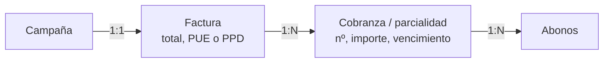

# Diseño — Cobro de campañas en parcialidades

Propuesta de diseño. **No implementado**: requiere confirmación de las decisiones
marcadas como ❓ antes de escribir código o migraciones.

---

## Problema

Hoy una campaña se cobra **una sola vez**: se genera una factura por el total y
una cobranza con plazo de 60/90/120 días. No hay forma de pactar "esta campaña
se paga en 12 mensualidades", que es lo habitual en contratos anuales de DOOH.

Estado verificado en la base actual:

| Hecho | Valor |
|---|---|
| Facturas por campaña | máx. **1** (índice único `facturas_campana_uq`) |
| Cobranzas por factura | máx. **1** en los datos, pero **sin** restricción que lo impida |
| `cobranzas.monto` | **no existe** — el importe se toma de la factura |
| Plazo de cobro | `cobranzas.plazo_dias` (60/90/120), elegido al facturar |

---

## Restricción que manda en el diseño

`facturas_campana_uq` es un índice **único** sobre `facturas.campana_id`, añadido
en la auditoría A-1 para impedir que un doble clic generara dos facturas de la
misma campaña. Es un guardarraíl contra duplicar dinero y **no conviene tirarlo**.

Eso descarta de entrada el modelo "una factura por cuota" sin más.

---

## Decisión propuesta: UNA factura, N parcialidades

Una campaña emite **una factura** por el total, y su cobro se divide en varias
**parcialidades**, cada una con su vencimiento e importe.

**Por qué, y no una factura por cuota:**

1. **Es como funciona el CFDI en México**, que es lo que el sistema ya modela
   (`serie`, `folio_fiscal`, `uso_cfdi`, `rfc`, `razon_social`). Un pago diferido
   se factura **una vez** con método `PPD` y se emite un *complemento de pago*
   por cada parcialidad. Emitir una factura por cuota sería facturar el mismo
   servicio N veces.
2. **Conserva el guardarraíl** `facturas_campana_uq` intacto.
3. **La tabla `cobranzas` ya lo admite estructuralmente**: tiene `factura_id` sin
   restricción de unicidad. Hoy se crea una fila; pasarían a crearse N.



### Lo que cambia en el esquema

```sql
alter table cobranzas
  add column numero        int,        -- 1..N; null = cobro único (histórico)
  add column total_cuotas  int,
  add column monto         numeric;    -- importe DE ESTA parcialidad

-- Una campaña no puede tener dos veces la misma cuota.
create unique index cobranzas_factura_cuota_uq
  on cobranzas (factura_id, numero) where numero is not null;

-- La suma de las parcialidades debe ser el total de la factura. No se puede
-- expresar como CHECK (es entre filas): va como constraint de dominio en el
-- repo, dentro de la transacción que las crea, y como verificación en la
-- migración.
alter table cobranzas add constraint cobranzas_monto_ck
  check (monto is null or monto > 0);
```

`monto` nullable y `numero` nullable a propósito: las cobranzas existentes
siguen siendo válidas y significan "cobro único, importe = el de la factura".
Sin eso, la migración obligaría a reescribir el histórico.

> ⚠️ **Efecto en el P&L que hay que arreglar sí o sí.** `dashboardMetrics`
> calcula lo por cobrar como `factura.monto − cobranza.montoPagado` **por cada
> cobranza**. Con N parcialidades por factura, contaría el total N veces. Al
> introducir parcialidades hay que cambiarlo a `cobranza.monto − montoPagado`.
> Es el punto de mayor riesgo del cambio: un error aquí infla la cartera.

---

## API

| Método | Ruta | Quién | Valida | Devuelve |
|---|---|---|---|---|
| `POST` | `/api/campanas/:id/facturar` | `finanzas.facturar` + candado de facturación | Campaña existe **y es de su tenant**; plan de cuotas coherente | Factura + parcialidades |
| `GET` | `/api/cobranzas?facturaId=` | `finanzas.ver` | Paginado (máx. 100) | Parcialidades |
| `POST` | `/api/cobranzas/:id/abonar` | `finanzas.crear` | La cobranza es de su tenant; importe > 0 y ≤ saldo | Cobranza actualizada |

**Cuerpo del plan de cuotas** (validado con Zod en el borde):

```ts
plan: {
  cuotas: number          // 2..36
  periodicidad: 'MENSUAL' | 'QUINCENAL' | 'BIMESTRAL' | 'TRIMESTRAL'
  primerVencimiento: string   // ISO date
} | null                   // null = cobro único, comportamiento actual
```

El **importe de cada cuota lo calcula el servidor**, nunca el cliente: total ÷ n
con el redondeo residual en la última cuota, para que la suma cuadre al centavo
con la factura. Aceptar importes del cliente permitiría facturar 100 000 y cobrar
parcialidades por 10.

---

## Validación en capas

| Capa | Qué valida |
|---|---|
| Cliente | Nº de cuotas y fecha; muestra la previsualización del calendario |
| Borde de API | Zod: `cuotas` entero 2..36, periodicidad del enum, fecha válida, rechaza campos desconocidos |
| Autorización | `finanzas.facturar` **y** que la campaña sea del tenant de la sesión |
| Dominio | Candado de facturación completo; campaña sin factura previa; Σ cuotas = total |
| Base de datos | `facturas_campana_uq`, `cobranzas_factura_cuota_uq`, `monto > 0`, FKs, `tenant_id` |

---

## Riesgos y cómo los cubre el diseño

| Riesgo | Mitigación |
|---|---|
| **Cartera inflada** por contar el total en cada parcialidad | Cambiar `porCobrar` a `cobranza.monto`; test que fije el invariante Σ parcialidades = total |
| **Doble facturación** por doble clic | `facturas_campana_uq` se conserva; la generación ya es idempotente |
| **Descuadre entre factura y cuotas** | Importes calculados en el servidor + verificación dentro de la misma transacción |
| **Fuga entre tenants (IDOR)** | Toda ruta comprueba propiedad del recurso, no solo la sesión; RLS fail-closed ya activa |
| **Cobros parciales que no suman** | `monto_pagado` por parcialidad, no global; el estado PAGADA exige saldo cero |
| **Histórico roto** | Columnas nullable: una cobranza sin `numero` sigue significando cobro único |

---

## Decisiones que necesito de ti

**❓1. ¿Complemento de pago (CFDI)?** ¿Se debe emitir un *REP* por cada
parcialidad cobrada, o basta con registrar el abono internamente? Si hace falta
el REP, el alcance crece: hay que modelar el complemento y su timbrado.

**❓2. ¿Quién define el plan de cuotas?** ¿Se pacta ya en la **propuesta** (y la
campaña lo hereda, como hicimos con la renta) o se decide al **facturar**? Lo
primero es más coherente con lo que se le prometió al cliente; lo segundo es más
simple.

**❓3. ¿Cuotas iguales o calendario libre?** Dividir el total entre N es el 90 %
de los casos. Un calendario libre (30 % al firmar, 70 % al cierre) es habitual en
campañas grandes y cambia el modelo: los importes dejarían de derivarse.

**❓4. ¿Qué pasa si una parcialidad vence impagada?** ¿Se bloquea la campaña, se
alerta y ya, o se detiene la publicación? Hoy solo hay recordatorios.

Con esas cuatro respuestas, el diseño queda cerrado y puedo implementarlo:
migración, repo, endpoint, UI de Finanzas y pruebas del invariante de importes.
