# Manual de Usuario — SPACES OS

**RGB Catorce (PIXELED)** · Plataforma de gestión de inventario y campañas OOH / DOOH

Este manual recorre **cada función** de la plataforma, con capturas de pantalla y los pasos para usarla: desde el inicio de sesión hasta las finanzas, pasando por inventario, disponibilidad, propuestas, campañas, creativos, operaciones y administración de usuarios.

---

## 1. Acceso e inicio de sesión

Ingresa a la liga de tu organización y captura tu **correo** y **contraseña**. Cada organización (CRM) tiene sus propios usuarios y datos aislados.

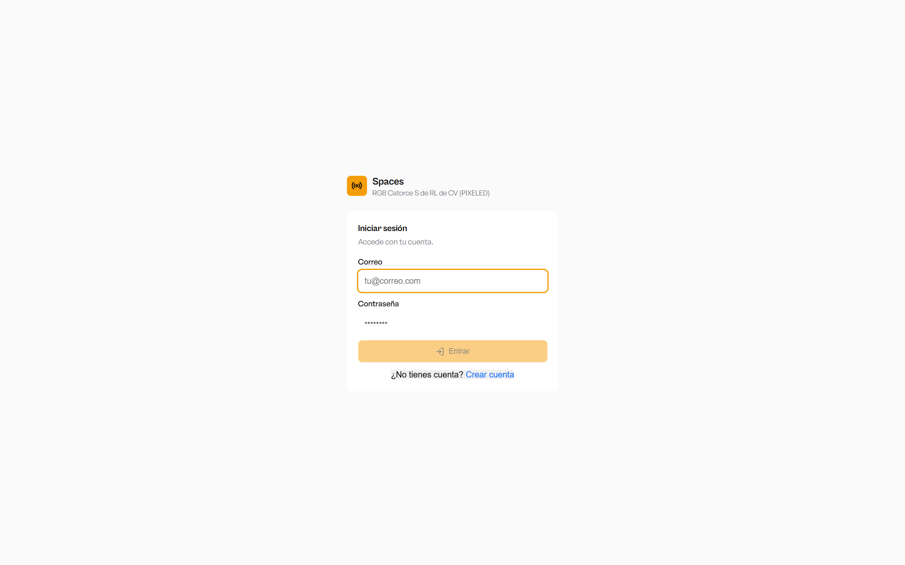

- El acceso es por rol: **Dueño, Comercial, Operaciones, Imprenta, Finanzas**. Cada rol ve solo los módulos que le corresponden.
- Tras iniciar sesión llegas al **Dashboard** (o a la pantalla principal de tu rol).

---

## 2. Dashboard — tu negocio de un vistazo

Resumen ejecutivo del mes: **ingreso contratado, margen, por cobrar y ocupación de la red**, con la curva de ocupación, la comparativa de reservas tentativas vs. confirmadas, las alertas activas y tu red en el mapa.

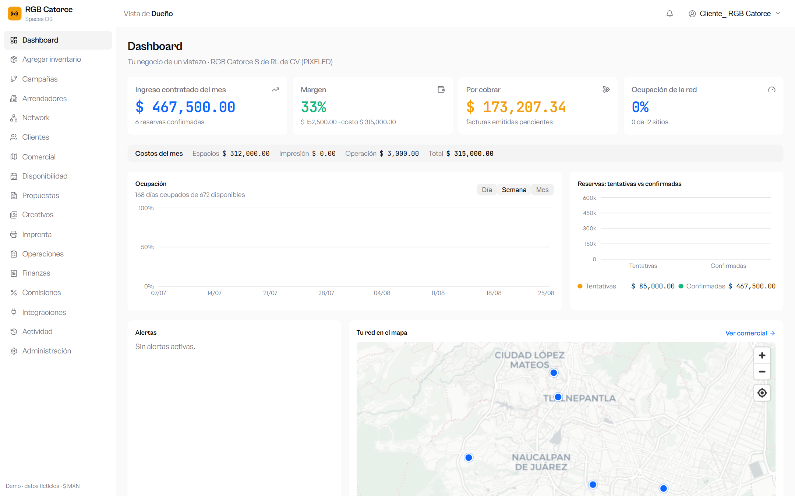

- **Ingreso contratado / Margen / Por cobrar / Ocupación**: los KPIs clave del negocio.
- **Ocupación** (día/semana/mes) y **Reservas: tentativas vs. confirmadas**.
- **Alertas**: contratos por vencer, cobranzas vencidas, OT vencidas, etc.

---

## 3. Agregar inventario

Da de alta tus pantallas/espacios: por **carga masiva** (Excel) o **alta manual**. Aquí consultas también el inventario completo con sus especificaciones, tarifas e imágenes.

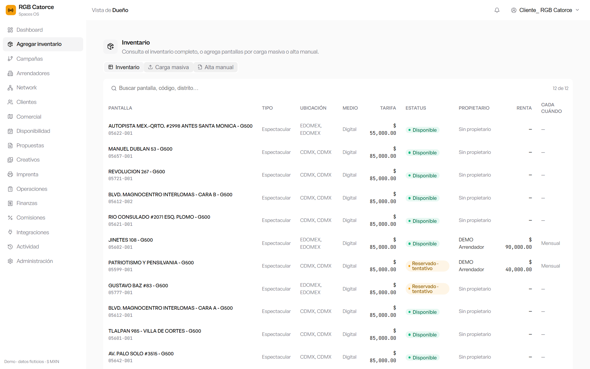

**Pasos:** elige la vía (Inventario / Carga masiva / Alta manual) → completa los datos del sitio (clave, tipo de medio, ubicación, medidas, tarifas, fotos) → guarda.

---

## 4. Comercial — mapa de la red

Vista de mapa y lista de todas tus pantallas con su estatus comercial (disponible, reservado, ocupado). Desde aquí **reservas** espacios para una campaña.

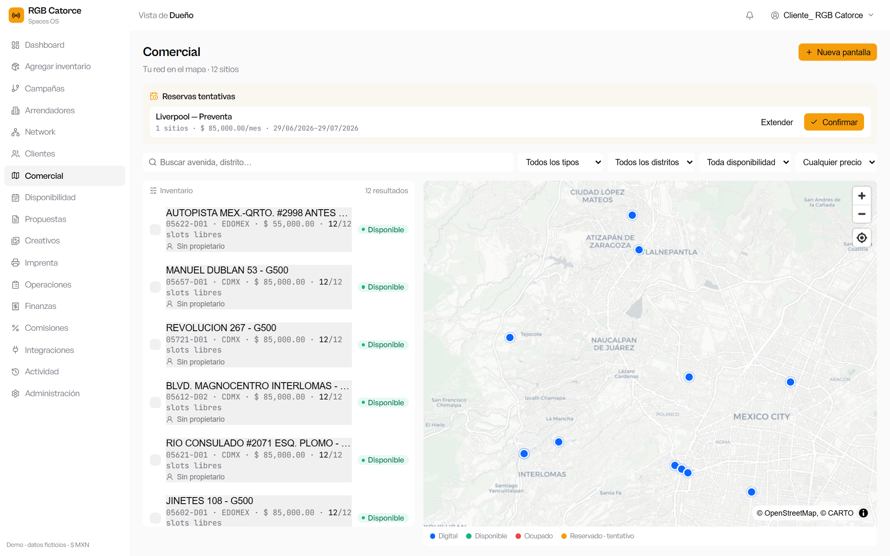

**Para reservar:** selecciona uno o varios sitios en el mapa/lista → elige fechas → **Reservar** (queda como *tentativa*) → luego **Confirmar**. El sistema evita el doble-booking (colisión de fechas).

---

## 5. Disponibilidad — calendario de ocupación futura

Responde *"¿qué tengo libre en septiembre?"*. Cruza las reservas vigentes (tentativas + confirmadas) contra el inventario y pinta cada pantalla × periodo como **libre, parcial u ocupado**, por **catorcena o mes**.

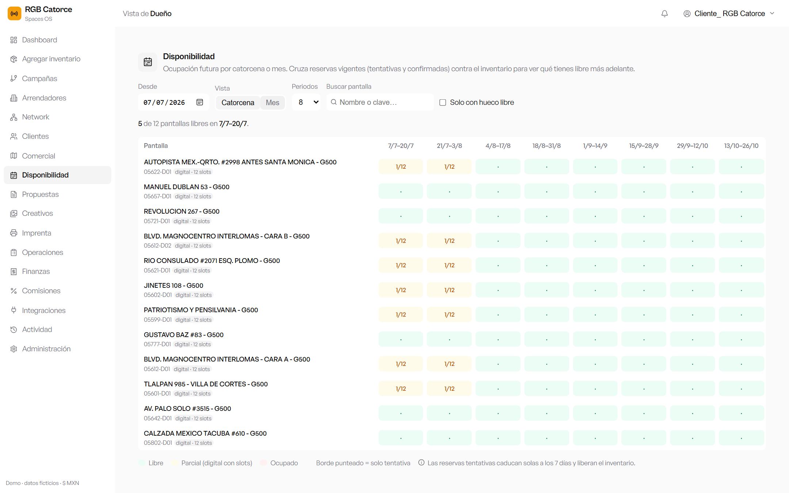

- Ajusta **Desde**, la **vista** (catorcena/mes) y el número de **periodos**.
- Filtra por pantalla o marca **"Solo con hueco libre"**.
- **Verde = libre**, **ámbar = parcial** (digital con slots, p. ej. 1/12), **rojo = ocupado**; borde punteado = solo tentativa.
- Las reservas **tentativas caducan solas a los 7 días** y liberan el inventario.

---

## 6. Clientes

Directorio de anunciantes y agencias con sus datos fiscales (RFC, razón social) y comisión de agencia.

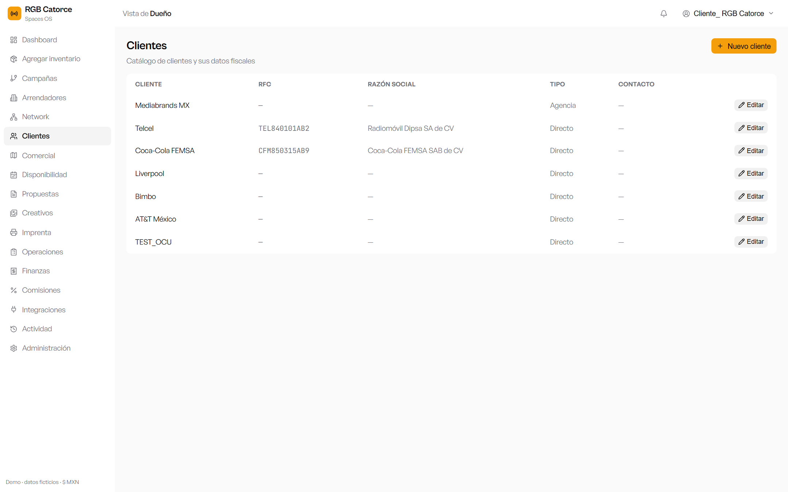

**Pasos:** *Nuevo cliente* → captura nombre, tipo (directo/agencia), datos fiscales y contacto → guarda. Estos datos se usan al facturar.

---

## 7. Propuestas — embudo comercial

Cotizaciones con el **método del divisor** (bruto → neto por comisión). Arriba, el **funnel**: valor en pipeline, ganado, perdido y **win rate**.

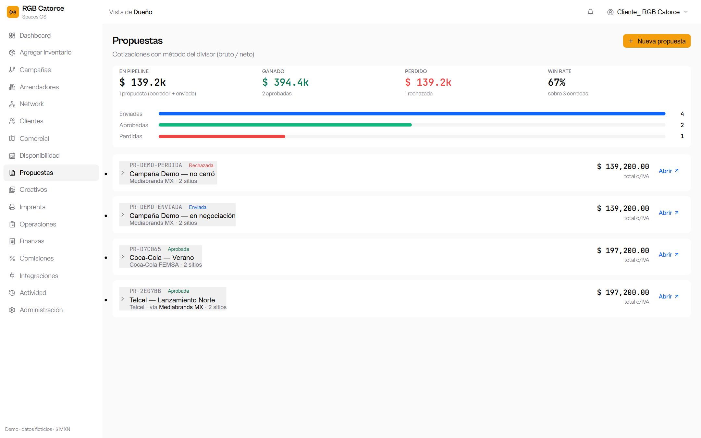

**Pasos:** *Nueva propuesta* → elige cliente/agencia, comisión, fechas y pantallas → se genera con folio **PR-**. Estados: **Borrador → Enviada → Aprobada / Rechazada**.

### 7.1 Detalle de propuesta — descuentos y versiones

En el detalle ves el **desglose económico** completo y el **editor de descuento comercial**. Cada vez que cambias el descuento de una propuesta ya **Enviada** (renegociación), sube la **versión** (v1 → v2 → v3…).

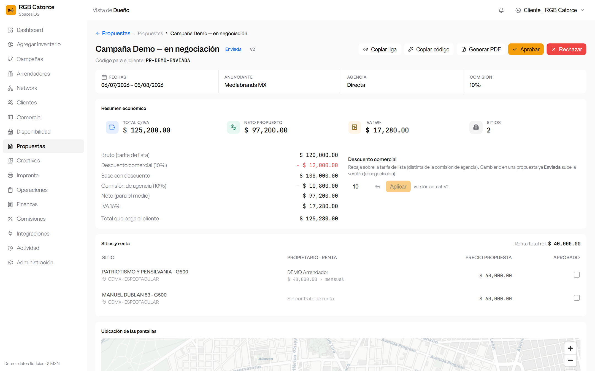

- **Bruto → − Descuento → Base → − Comisión de agencia → Neto → + IVA → Total que paga el cliente.**
- Botones: **Copiar liga** (liga pública para el cliente), **Copiar código** (folio PR), **Generar PDF**, **Aprobar**, **Rechazar**.
- La columna **Propietario · Renta** muestra el margen por sitio (o "Sin contrato de renta").

---

## 8. Liga pública compartida (vista del cliente)

Con **Copiar liga** (sección 7.1) obtienes una liga pública que el cliente abre sin contraseña: ve la propuesta, las pantallas en el mapa y el desglose. Desde ahí **puede aceptar la propuesta con un clic**, dejando registro de fecha y nombre (medio-contrato), y el equipo comercial recibe una notificación.

> **📌 Pega aquí tu captura de la liga pública** (ábrela con *Copiar liga* → pégala en el recuadro):

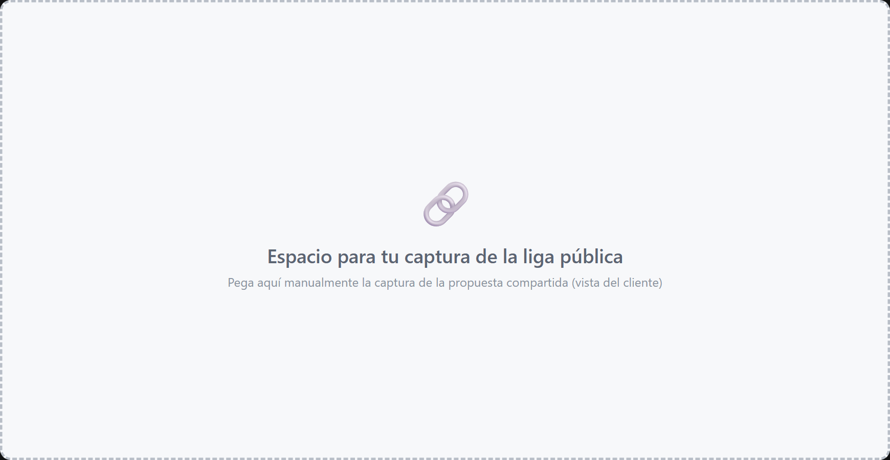

---

## 9. Campañas — pipeline de 9 etapas

Cada campaña avanza por un pipeline visual: **Reservada → Confirmada → OC recibida → Creativo recibido → Creativo validado → En producción → Instalada/al aire → Reporte generado → Lista para facturar**.

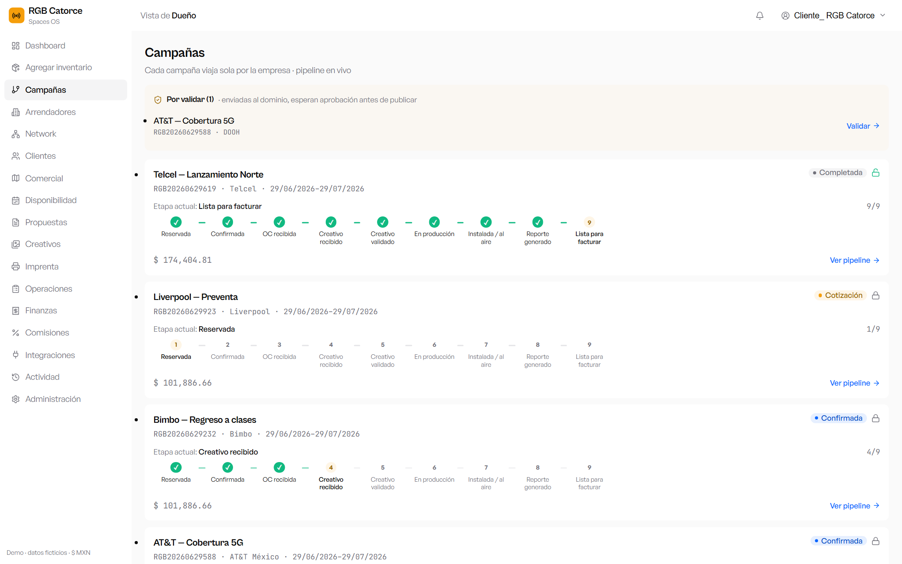

### 9.1 Detalle de campaña

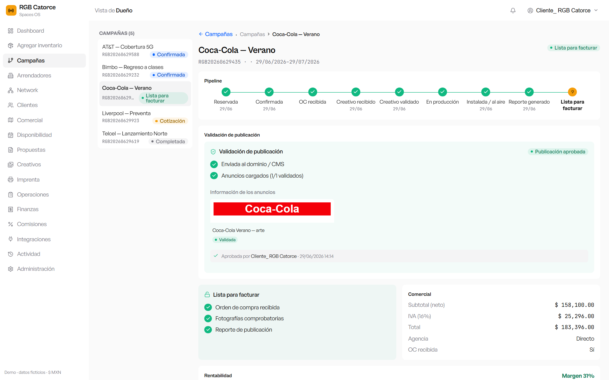

- **Pipeline** con la fecha de cada etapa cumplida.
- **Validación de publicación** (enviada al CMS + anuncios cargados/validados).
- **Candado de facturación**: exige **OC recibida + fotografías comprobatorias + reporte de publicación**.
- **Rentabilidad** de la campaña (margen) y resumen comercial.

---

## 10. Creativos

Gestiona los anuncios (arte) de cada campaña: **imagen** o **código** (HTML/UTF). Cada creativo pasa por validación (Pendiente → Validada / Rechazada).

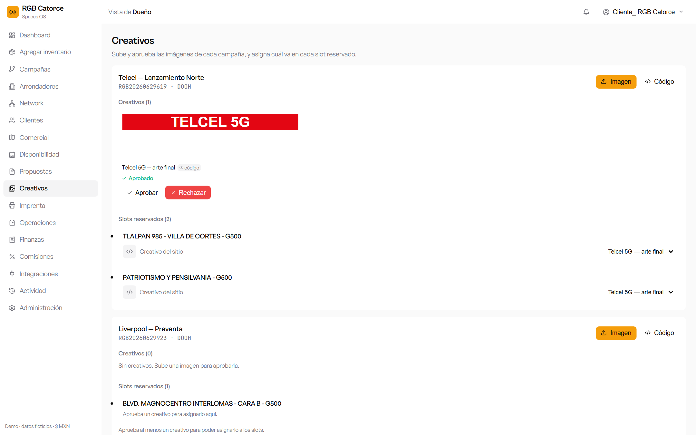

**Para crear/subir un creativo:** entra a Creativos (o al detalle de la campaña) → elige **Imagen** o **Código** → sube el arte → queda *Pendiente* hasta que se valide. Un creativo validado alimenta la etapa "Creativo validado" del pipeline.

---

## 11. Imprenta

Órdenes de impresión para medios estáticos (lonas, vinil): material, medidas, proveedor y **prueba de color** (probatorio).

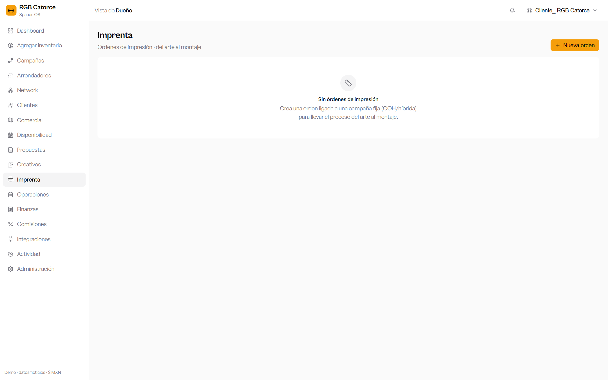

> Nota: solo aplica a campañas OOH/estáticas. Las DOOH (digitales) omiten imprenta.

---

## 12. Operaciones — órdenes de trabajo (OT)

Tareas de cuadrilla en campo (montaje, mantenimiento, inspección) con asignación, prioridad y **evidencia fotográfica**. Una OT abierta que pasó su fecha compromiso se marca **Vencida** y genera alerta.

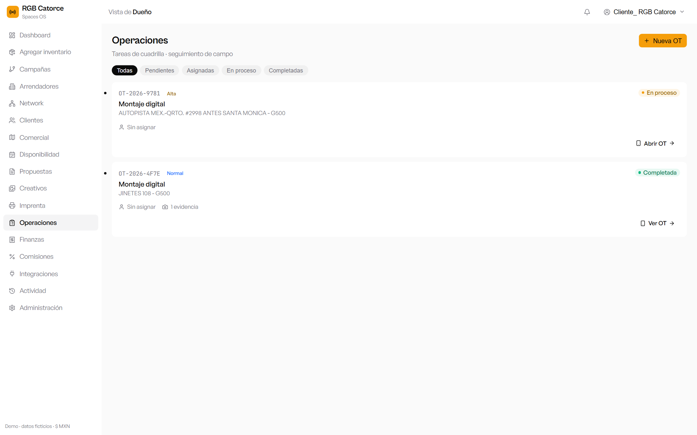

### 12.1 Detalle de OT

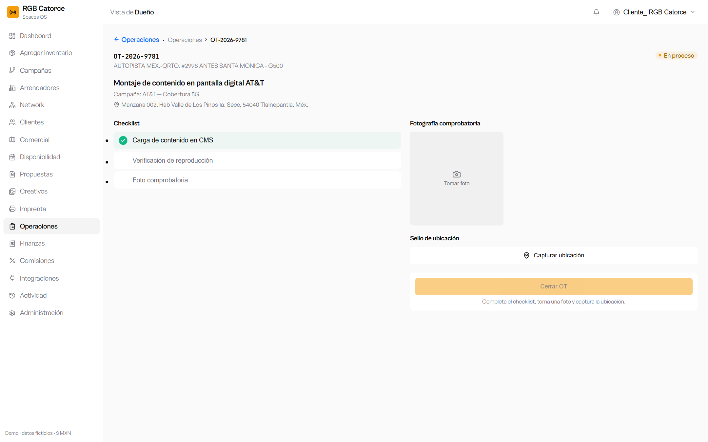

**Cerrar una OT:** el técnico sube la **foto comprobatoria** (testigo) → la OT pasa a *Completada* → si está ligada a una campaña, enciende las fotos comprobatorias del candado de facturación.

---

## 13. Finanzas — facturación y cobranza

Genera facturas desde campañas con el candado completo, y da seguimiento a la **cobranza** con semáforo (**Al corriente / Por vencer / Vencida / Pagada**), **pagos parciales (abonos)** y **recordatorios**.

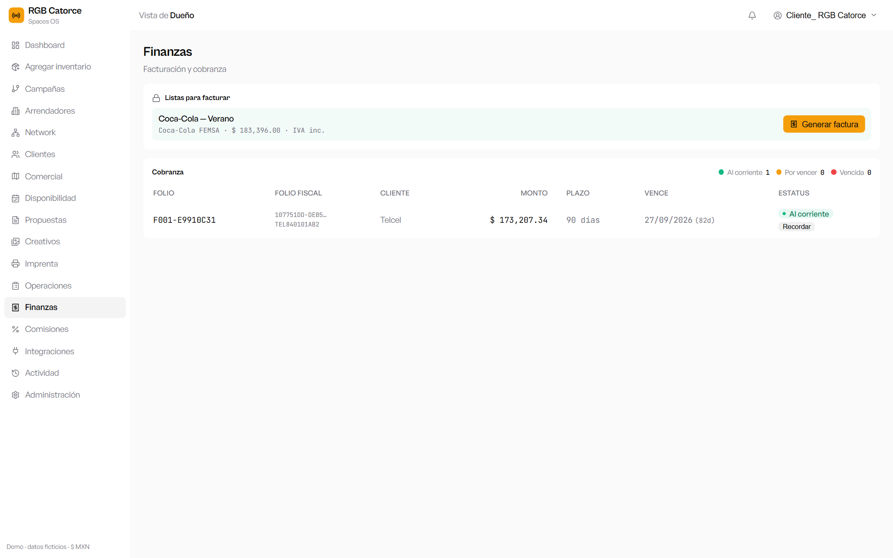

- **Ver los pagos / cobranza:** cada factura muestra folio, cliente, monto, plazo, vencimiento y estatus. El **saldo** refleja los abonos parciales registrados.
- **Registrar un pago/abono:** en la cobranza, registra el monto (parcial o total). Al liquidar, pasa a *Pagada*.
- **Recordar:** el botón **"Recordar"** envía un recordatorio de cobro; además el sistema los envía **automáticamente** (por vencer/vencidas, con cadencia para no saturar).

---

## 14. Arrendadores — contratos y rentabilidad por pantalla

El otro lado de la red: contratos de renta, pagos a arrendadores y vencimientos. Incluye **Rentabilidad por pantalla** = ingreso de reservas vigentes − renta.

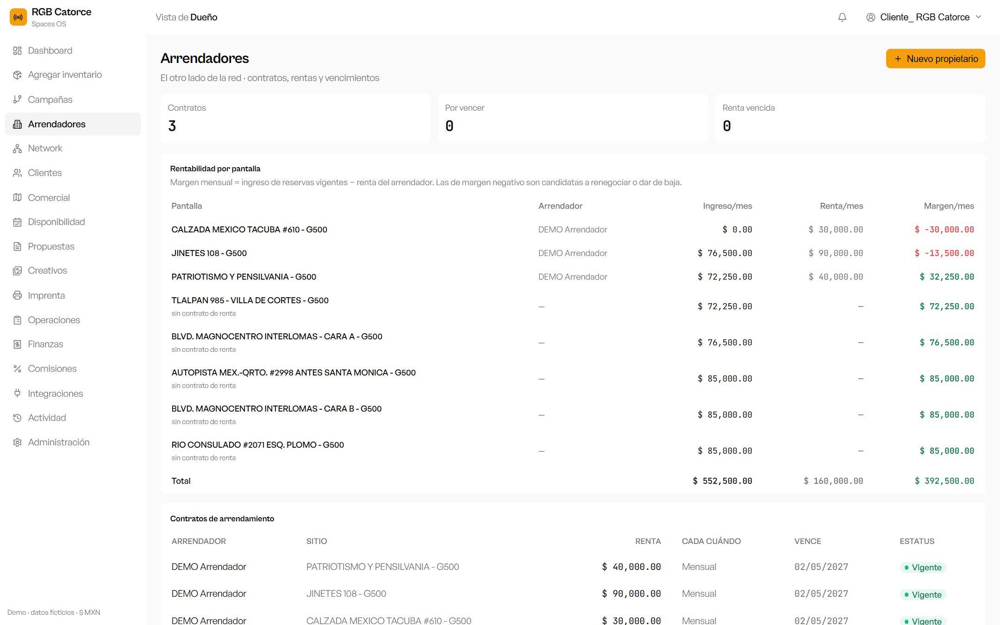

- **Rentabilidad por pantalla:** margen mensual por sitio; las de **margen negativo** (rojo) son candidatas a renegociar o dar de baja. Las que no tienen contrato se marcan "sin contrato de renta".

---

## 15. Comisiones

Cálculo de comisiones de agencia/vendedor por campaña, derivado del método del divisor.

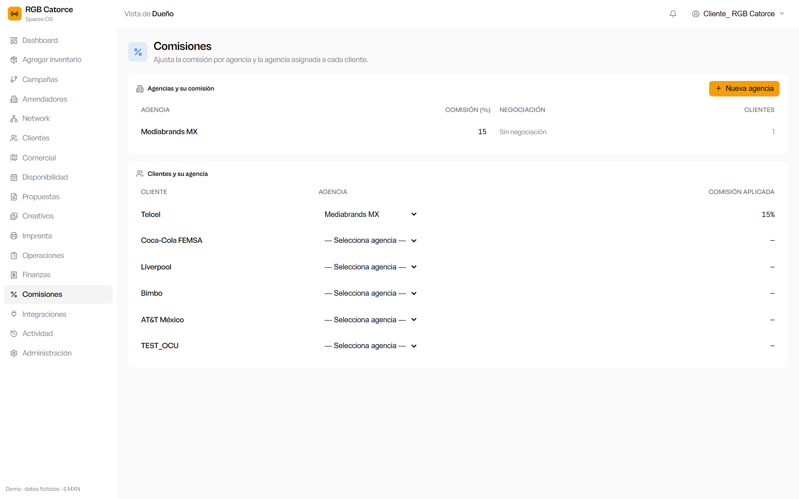

---

## 16. Network

Inventario compartido a la red (pantallas comercializables por terceros), con su modalidad de comercialización (tradicional / programático).

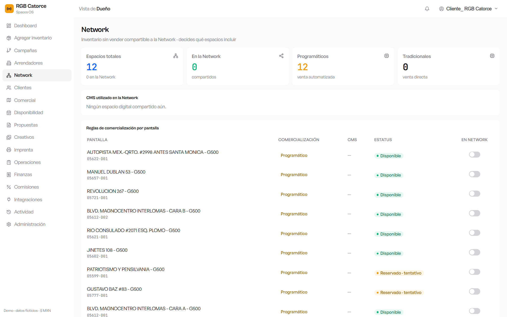

---

## 17. Integraciones

Conexiones con CMS/players DOOH (Broadsign, Invian, Doohmain) y otros servicios para publicación y proof-of-play.

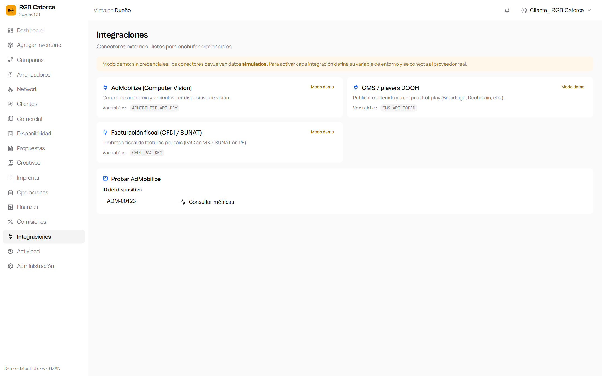

---

## 18. Actividad — bitácora

Registro de **quién hizo qué y cuándo** en la plataforma (altas, cambios de estatus, pagos, cierres de OT, etc.).

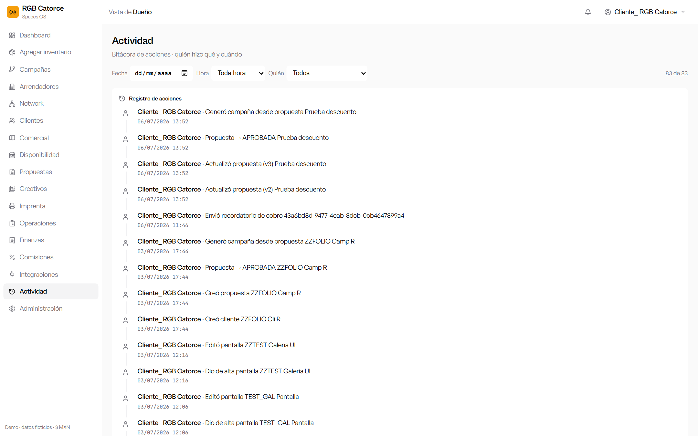

---

## 19. Administración — usuarios y roles

Gestiona el **equipo** (usuarios), los **roles y permisos** y la **configuración** del negocio. Cada organización (CRM) tiene sus usuarios aislados.

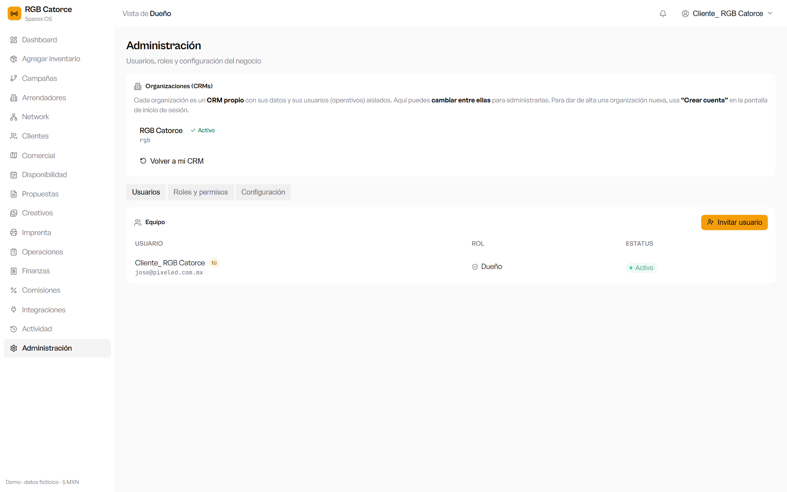

### 19.1 Cómo crear un usuario

Pulsa **"Invitar usuario"** y completa el formulario:

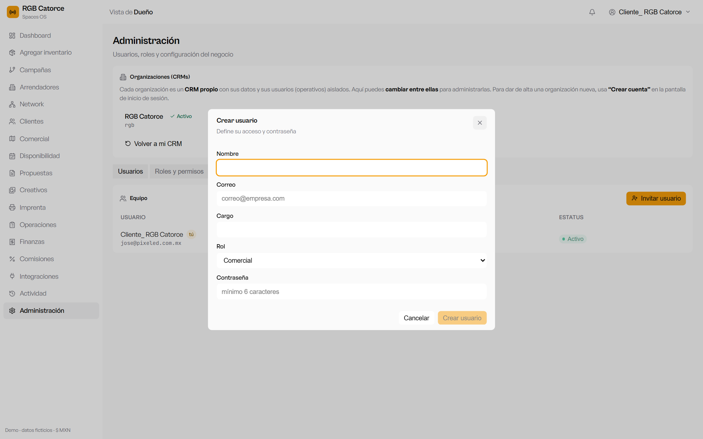

**Pasos:** *Invitar usuario* → captura **Nombre**, **Correo**, **Cargo**, elige el **Rol** (Comercial, Operaciones, Imprenta, Finanzas…) y una **Contraseña** (mín. 6 caracteres) → **Crear usuario**. El nuevo usuario podrá iniciar sesión con ese correo y contraseña, viendo solo lo que su rol permite.

---

## 20. Notificaciones

La **campana** (arriba a la derecha) abre el centro de notificaciones por evento: propuesta aprobada, campaña generada, OC recibida, pago/abono, **OT vencida**, **recordatorio de cobranza**, etc.

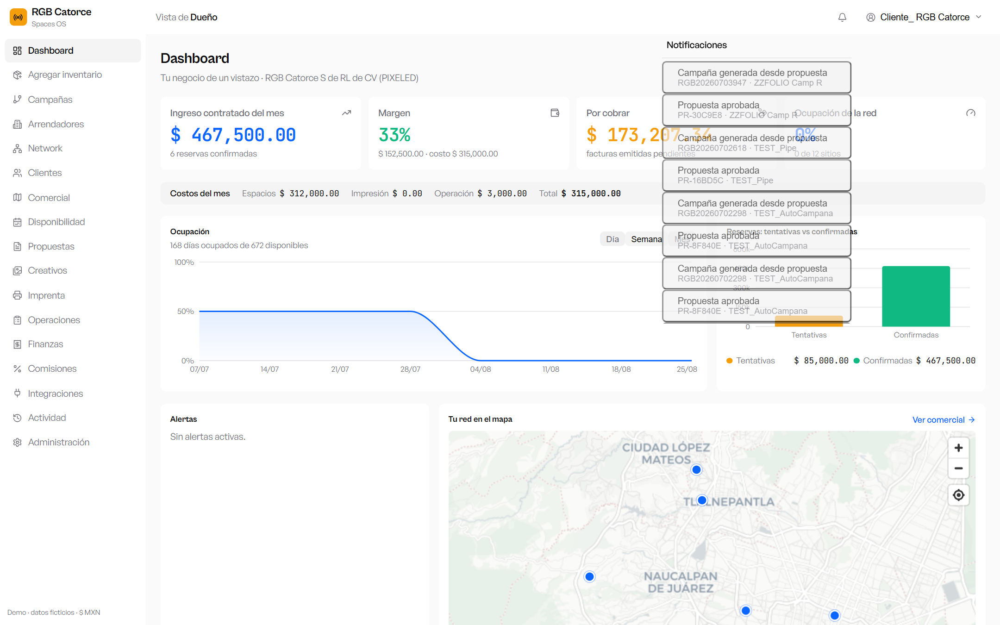

- Haz clic en la campana para ver la lista; cada notificación enlaza a la pantalla correspondiente.
- Puedes marcarlas como leídas (individual o todas).

---

*SPACES OS — Manual de usuario · datos de demostración · montos en $ MXN.*
