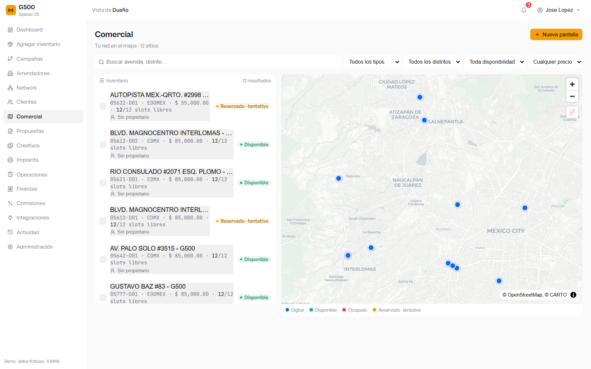
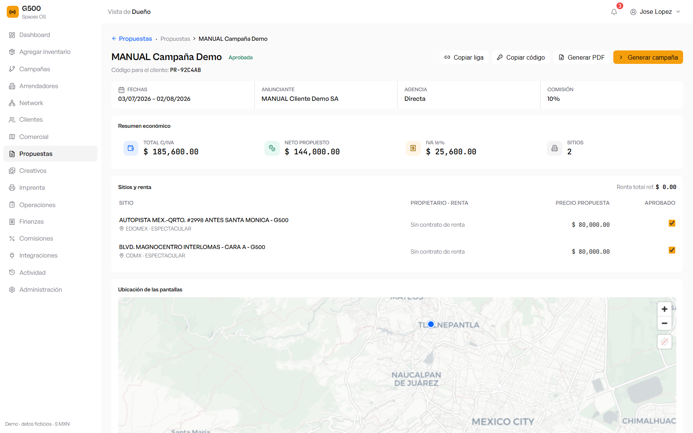
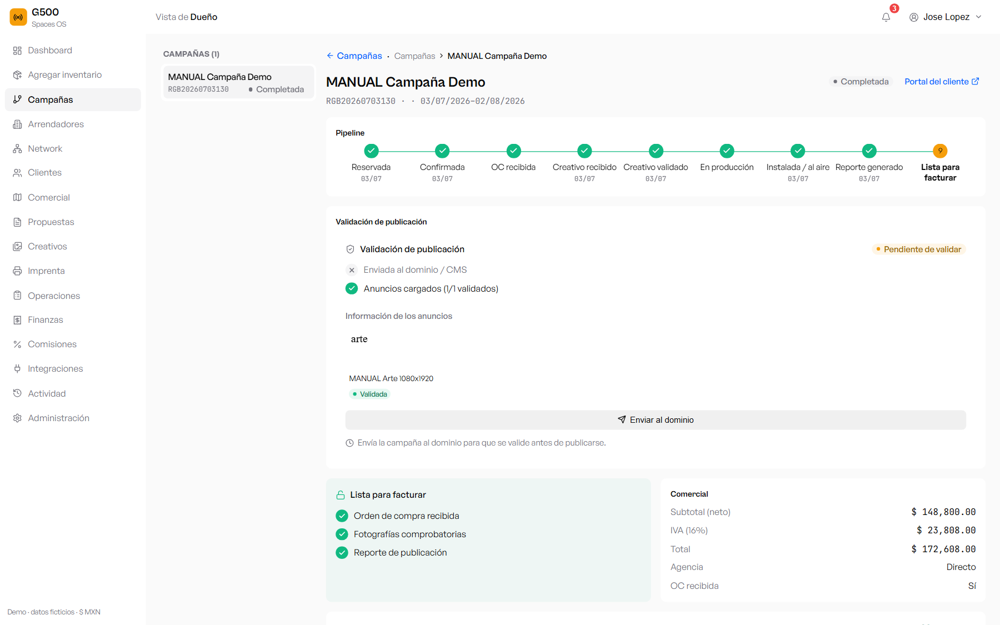
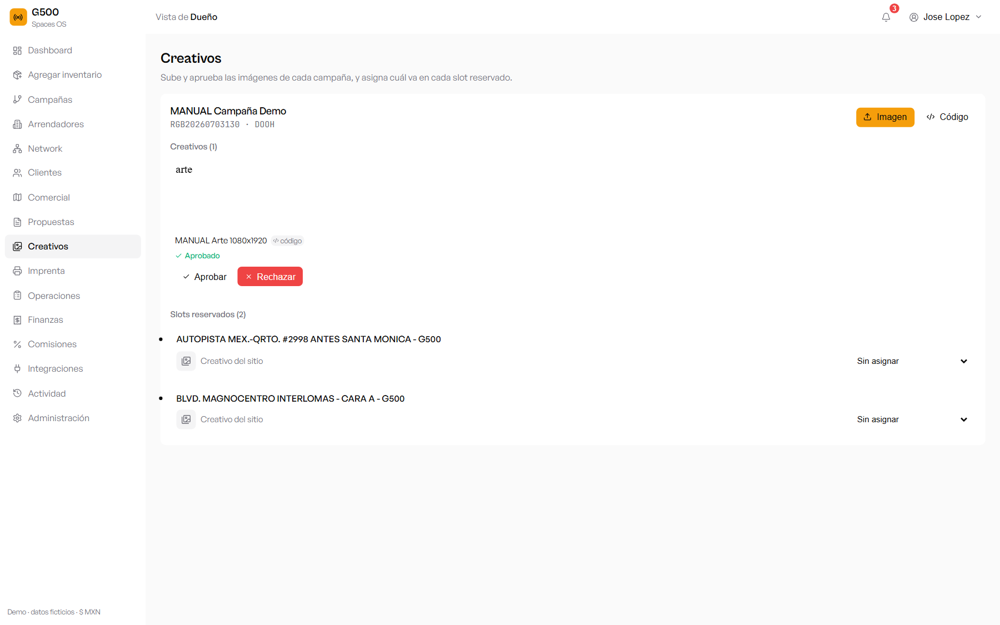
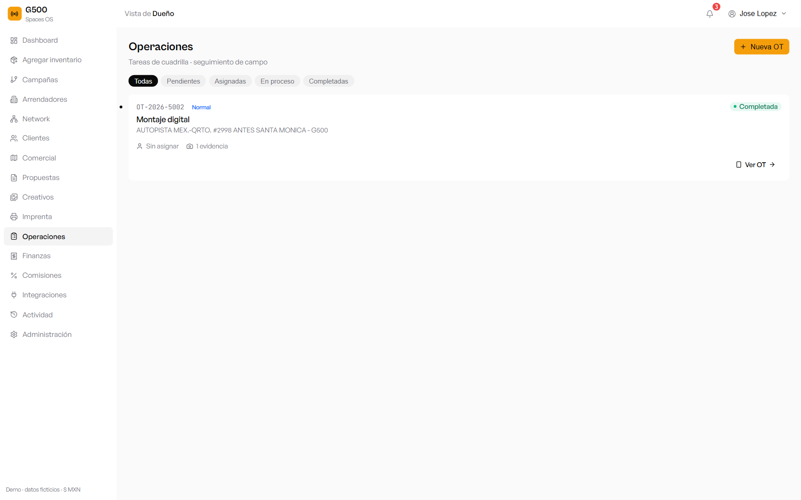
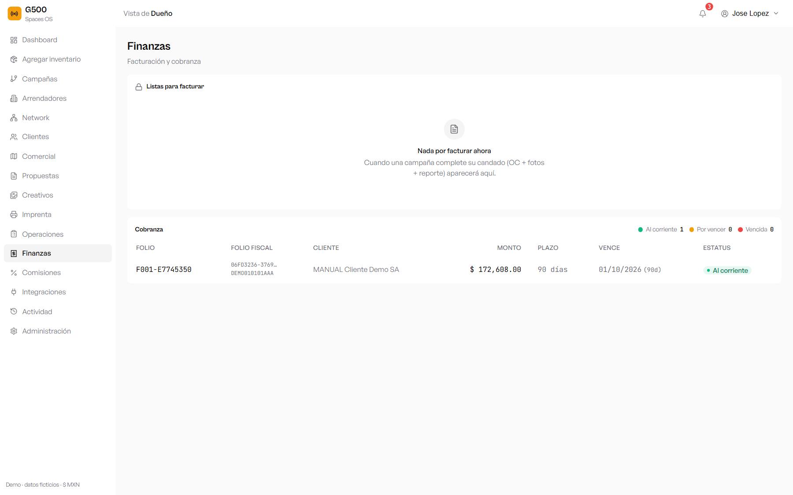
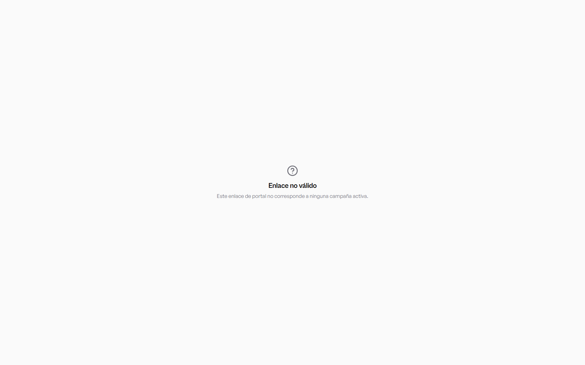

# Manual de usuario — Spaces OS (validación del flujo completo)

**Objetivo:** validar de punta a punta que el sistema funciona: crear una campaña, aprobar el creativo y llegar hasta **facturar**.
**Liga:** http://209.97.146.136/spaces-dooh/demo/comercial/
**Probado el:** 2026-07-03 · CRM **G500** · usuario Dueño.

> Todo lo de este manual se ejecutó **en producción** con datos de prueba (prefijo `MANUAL`) y **se borró al terminar** (ver §10). Los folios/montos mostrados son del recorrido real de validación.

---

## 1. Acceso
1. Entra a la liga y **Inicia sesión** con tu correo y contraseña.
2. Arriba a la izquierda verás el **nombre de tu empresa** (aquí, *G500*). Arriba a la derecha, tu nombre → **Configuración** (cambiar nombre de empresa, correo y contraseña).

---

## 2. Inventario (Comercial)
En **Comercial** ves tus pantallas en lista y mapa, con estatus, precio y slots disponibles.

**Clic en una pantalla** abre su ficha. En **Galería → Agregar foto** subes imágenes que se **guardan** y se ven después (también puedes cargarlas en bloque al importar, nombrando el archivo con el **código de proveedor**: `codigo.jpg`, `codigo-1.jpg`, `codigo-2.jpg`…).

---

## 3. Crear cliente
En **Clientes → Nuevo cliente**, captura nombre y **datos fiscales** (RFC, razón social, uso de CFDI). *El RFC y la razón social son obligatorios para poder facturar.*

---

## 4. Crear propuesta
1. En **Comercial**, selecciona las pantallas y arma la propuesta (o en **Propuestas → Nueva**).
2. Define cliente, comisión de agencia, fechas y precio por pantalla.
3. Se genera un **folio** (ej. `PR-92C4AB`) y una **liga pública** compartible con el cliente (botón *Copiar liga*).

---

## 5. Aprobar la propuesta → campaña automática
Al pulsar **Aprobar**, la propuesta pasa a `APROBADA` y **se crea la campaña automáticamente** con la info de la propuesta (sus pantallas, fechas, cliente y precios netos). Ya no hay que generarla a mano.

El **pipeline** muestra el avance: Reservada → Confirmada → OC recibida → Creativo recibido/validado → En producción → Instalada → Reporte generado → **Lista para facturar**.

---

## 6. Subir y aprobar el creativo
1. En **Creativos**, elige la campaña y **sube la imagen/HTML** del anuncio (las imágenes se convierten a HTML para el player).
2. **Aprobar** el creativo lo marca como **Validado** y el pipeline avanza a *Creativo validado*.

---

## 7. Operaciones (montaje + evidencia)
1. En **Operaciones**, crea la **Orden de Trabajo** de montaje de la campaña.
2. Al **cerrarla con la foto comprobatoria**, la campaña marca automáticamente **Fotografías comprobatorias** y **Reporte de publicación** en su candado.

---

## 8. Candado de facturación + Facturar
La campaña se puede facturar cuando su **candado** tiene las 3 condiciones (se ven en verde en la ficha de la campaña):
- ✅ **Orden de compra recibida** (regístrala en la campaña).
- ✅ **Fotografías comprobatorias** (de la OT cerrada).
- ✅ **Reporte de publicación**.

Con el candado completo, en **Finanzas → Listas para facturar** generas la **factura** (eliges plazo 60/90/120 días). Se crea la factura + su **cobranza**.

> Validación real: factura **`F001-E7745350`** por **$172,608.00** (subtotal $148,800 + IVA 16% $23,808), plazo 90 días, estatus *Al corriente*.

---

## 9. Portal del cliente (liga pública)
Cada campaña genera una **liga pública** (*Portal del cliente*) que **cualquiera puede ver sin iniciar sesión** — muestra el avance, ubicaciones y evidencias. El resto del sistema queda protegido: sin sesión, cualquier otra ruta redirige al login.

---

## 10. Resultado de la validación

| Paso | Resultado |
|---|---|
| Crear cliente (con datos fiscales) | ✅ |
| Crear propuesta (2 pantallas) | ✅ `PR-92C4AB` |
| Aprobar → **campaña automática** | ✅ `RGB20260703130` (DOOH) |
| Subir + **aprobar creativo** | ✅ Validado |
| OT de montaje + evidencia | ✅ candado (fotos + reporte) |
| OC del cliente | ✅ |
| **Facturar** | ✅ `F001-E7745350` · **$172,608** |
| Portal público de la campaña | ✅ |

**Todos los pasos funcionan.** Los datos de prueba (`MANUAL …`) se **eliminaron** al terminar la validación; el inventario de G500 quedó intacto.
</content>
