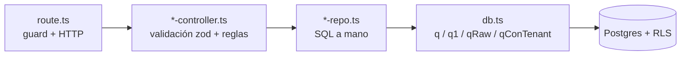

> [!danger] 2026-08-26 · CORRECCIÓN DOBLE — esta nota tenía DOS cosas falsas
> **① El acceso al droplet `209.97.146.136` NUNCA se perdió.** El aviso de abajo
> se escribió el 24/08 sobre esa premisa, y la premisa era falsa: el 25/08 se
> entró sin dificultad y se completó el censo entero
> (`docs/evidencias/f4-1-censo-resultado.md`). Sobre aquella conclusión se
> levantaron el ADR 0015, la 3.ª enmienda a P1 y **dos tareas declaradas
> imposibles**. Las cuatro se revisaron.
>
> **② DEMO ya NO va a servir `demo.space-os.io`.** El
> [ADR 0020](../../docs/adr/0020-no-hay-demo-publica.md) (26/08) retira ese
> nombre: no se le mueve el DNS, no se le emite certificado y ~~su registro A se
> borra~~ — tarjeta **TH-F4.5**. ⚠️ **REVERTIDO el 2026-08-26 por el
> [ADR 0021](../../docs/adr/0021-demo-space-os-io-se-queda.md): `demo.space-os.io`
> SE CONSERVA como demostración de las instancias hijas, y la tarjeta TH-F4.5
> queda cancelada.** El proceso del `3001` **conserva su nombre**: el nginx del
> PADRE lo sirve en `infra/nginx/space-os.io.conf:188`.
>
> Esa frase tachada estuvo escrita **con la fecha del 26/08 encima** y en tres
> notas a la vez. Si un agente la lee sin llegar al «REVERTIDO», propone borrar
> un registro DNS que hay que conservar. **Este punto cambió cuatro veces en
> cuatro días: pregúntalo, no lo infieras.**
>
> **Lo vigente:** el PADRE (`137.184.107.53`) es la **única máquina del modelo**
> y sirve `space-os.io` con certificado propio hasta el **2026-11-23**, con
> renovación automática —
> [ADR 0017](../../docs/adr/0017-todo-se-concentra-en-el-padre.md). Y la
> demostración de cara a cliente pasa a ser **el producto real con una o más
> instancias hijas**, que es lo que produce la Fase 5.
>
> **No se reescribe el cuerpo de abajo**: era correcto en su fecha. Reescribir
> historia para que cuadre con hoy es lo que hace que una nota deje de ser fiable.

> [!danger] 2026-08-24 · El droplet `209.97.146.136` SE PERDIO — esta nota lo daba por vivo
> **Se perdió el acceso a esa máquina.** Sigue encendida y sirviendo
> `demo.space-os.io`, pero **nadie la controla**: no se actualiza, no se parchea
> y no se apaga. Su certificado vence el **2026-10-26** y no se renovará.
>
> **La máquina viva es el PADRE, `137.184.107.53`** — Ubuntu 24.04, Postgres
> 16.15, `pm2 spaces-web` en el 3000 **como `root`**, rol de app **`spaces_app`**.
> Ahí van a convivir **el PADRE en `space-os.io`** y **DEMO en
> `demo.space-os.io`** (segundo proceso, puerto 3001, base `spaces_demo`) —
> decisión del día, con su precio escrito en
> [ADR 0015](../../docs/adr/0015-demo-dentro-del-padre.md).
>
> **Medido ese día:** el ápice `space-os.io` **no tiene registro A** (está libre),
> `demo.space-os.io` sigue apuntando a la máquina perdida, y el PADRE responde
> por IP `login 200 · raíz 302`.
>
> Todo lo que sigue en esta nota **describe el arreglo anterior**. Vale como
> historia; no como instrucción. Ver [[2026-08-24]] y `docs/Traspaso_20260824.md`.

---
# Visión general

> [!danger] 2026-08-27 · EL DROPLET VIEJO SE RETIRA — lo de abajo sobre él caduca
> **`209.97.146.136` ya no se usa** (decisión de Jochelo, 27/08) y **sus datos
> eran de prueba**: no hay organizaciones reales que rescatar. El plan v3 se
> escribió el 13/08, seis días antes de la corrección del 19/08 sobre
> `spaces_prod`, y por eso arrastraba tres censos y una migración contra datos
> que nunca fueron reales.
>
> **SEIS tareas quedan SIN OBJETO:** `F0.2`, `F1.1`, `F1.5`, `F7.1`, `F7.2`,
> `F7.3`. **La Fase 7 entera.** El plan pasa de **46 tareas a 40 con objeto**.
> (**`F0.1` no entra**: ya estaba CERRADA el 24/08 con medición — `signup 503`
> más `login 200`, que descarta que el 503 fuera una caída.)
>
> Todo lo que esta nota diga más abajo sobre **el destino de `rgb`, el censo de
> `spaces_prod`, migrar PIXELED o desenredar la Fase 7** describe un problema que
> **ya no existe**. Se conserva como historia; no es trabajo pendiente.
>
> **Y `demo.space-os.io` queda CERRADO por el [ADR 0024](../../docs/adr/0024-demo-space-os-io-es-la-demo-original-y-se-elimina.md),
> que sustituye al 0021:** ese nombre **es solo la demostración original y se
> eliminará**. No se mueve al PADRE, no se le emite certificado y no se le busca
> máquina. **`F4.3` queda SIN OBJETO** y el plan baja a **39 tareas con objeto**.
> Su certificado (26/10) pasa a ser **caducidad natural, no plazo**.
> **Ya no se pregunta.**
> Contexto: [[modelo-instancias-soberanas]] · `vault/07-Agentes/diario/2026-08-27`

## Una sola pista viva

El repo contiene restos de una arquitectura anterior de dos servicios. **Hoy
corre un único proceso.**

| Pista | Estado | Evidencia |
|---|---|---|
| `apps/web` — Next.js con BFF integrado | **VIVA**, es el producto | `ecosystem.config.js:4-27` |
| `_archive/api` — Fastify + Prisma + BullMQ | Archivada, nunca se desplegó | `ecosystem.config.js:1-3` |
| ~~`apps/web/lib/auth-context.tsx`~~ | **RETIRADO el 27/08** con la pista archivada | [[zonas-de-riesgo]] §A6 |

> [!success] El `AuthProvider` legado ya NO está en el árbol de render — corregido el 28/08
> Hasta esta revalidación, aquí había un callout `[!danger]` que decía que
> `apps/web/app/providers.tsx:34` envolvía toda la app con un `AuthProvider` que
> hacía fetch contra `NEXT_PUBLIC_API_URL`. **Dejó de ser cierto el 27/08** y la
> fila de arriba ya lo decía: `lib/auth-context.tsx` se retiró con la pista
> archivada, y `providers.tsx` hoy solo monta `QueryClientProvider`, los parches
> de `fetch` y el indicador de carga (37 líneas; la 34 es `<IndicadorCarga />`).
> Lo vigila `apps/web/lib/pista-archivada.test.ts:65-70`, que se pone roja si
> `AuthProvider` reaparece en `providers.tsx`.
>
> **Lo que sigue vigente es la lección**, no el hecho: el sistema de sesión real
> es [[autenticacion-y-sesion]]. Confundir un cliente del backend archivado con
> él es el error más caro posible en este repo — y este callout es la prueba de
> que también se puede cometer al revés, dejando escrito como vivo algo que ya
> se retiró.

## Componentes

## Capas del servidor

El BFF es estrictamente por capas — ver [[convenciones]].

| Capa | Responsabilidad | Ejemplo |
|---|---|---|
| `route.ts` | Guard, parseo HTTP, `respuestaError()` | `apps/web/app/api/contratos/route.ts` |
| `*-controller.ts` | Validación zod, reglas de negocio | `apps/web/lib/server/cuentas-controller.ts:33-54` |
| `*-repo.ts` | SQL, filtro explícito por `tenant_id` | `apps/web/lib/server/usuarios-repo.ts:11-23` |
| `db.ts` | Pool, transacción, GUC `app.tenant_id` | `apps/web/lib/server/db.ts:54-69` |

## Las tres cosas que definen este sistema

1. **La sesión es la llave de todo el aislamiento.** La cadena
   `spaces_sesion` → `auth_usuario_por_sesion()` → `usuarioActual()` →
   `tenantActual()` → `set_config('app.tenant_id')` → RLS es lo que impide que
   una organización vea a otra. Ver [[multi-tenancy-y-rls]].
2. **No hay ORM ni librería de auth.** Todo es SQL a mano y auth propia. Eso
   hace el sistema pequeño y auditable, pero también significa que cada
   consulta nueva debe acordarse del tenant por su cuenta.
3. **El despliegue es manual por SSH.** No hay CD. Ver [[entorno-y-despliegue]].

## Relacionadas
[[stack-y-dependencias]] · [[entorno-y-despliegue]] · [[decisiones]] ·
[[multi-tenancy-y-rls]] · [[zonas-de-riesgo]] · [[MOC-Proyecto]]
