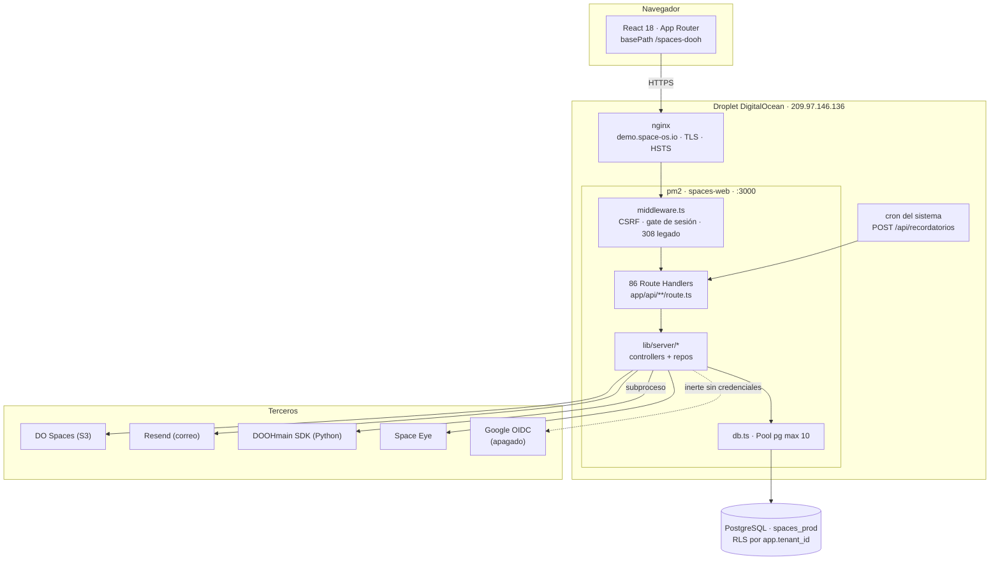
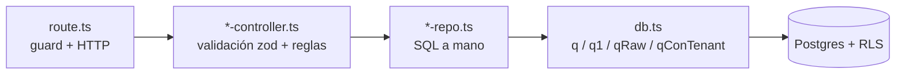

> [!danger] 2026-08-24 · El droplet `209.97.146.136` SE PERDIO — esta nota lo daba por vivo
> **Se perdió el acceso a esa máquina.** Sigue encendida y sirviendo
> `demo.space-os.io`, pero **nadie la controla**: no se actualiza, no se parchea
> y no se apaga. Su certificado vence el **2026-10-26** y no se renovará.
>
> **La máquina viva es el PADRE, `137.184.107.53`** — Ubuntu 24.04, Postgres
> 16.15, `pm2 spaces-web` en el 3000 **como `root`**, rol de app **`spaces_app`**.
> Ahí van a convivir **el PADRE en `space-os.io`** y **DEMO en
> `demo.space-os.io`** (segundo proceso, puerto 3001, base `spaces_demo`) —
> decisión del día, con su precio escrito en
> [ADR 0015](../../docs/adr/0015-demo-dentro-del-padre.md).
>
> **Medido ese día:** el ápice `space-os.io` **no tiene registro A** (está libre),
> `demo.space-os.io` sigue apuntando a la máquina perdida, y el PADRE responde
> por IP `login 200 · raíz 302`.
>
> Todo lo que sigue en esta nota **describe el arreglo anterior**. Vale como
> historia; no como instrucción. Ver [[2026-08-24]] y `docs/Traspaso_20260824.md`.

---
# Visión general

## Una sola pista viva

El repo contiene restos de una arquitectura anterior de dos servicios. **Hoy
corre un único proceso.**

| Pista | Estado | Evidencia |
|---|---|---|
| `apps/web` — Next.js con BFF integrado | **VIVA**, es el producto | `ecosystem.config.js:4-27` |
| `_archive/api` — Fastify + Prisma + BullMQ | Archivada, nunca se desplegó | `ecosystem.config.js:1-3` |
| `apps/web/lib/auth-context.tsx` — cliente JWT | **Código muerto montado** | ver abajo |

> [!danger] El `AuthProvider` legado sigue en el árbol de render
> `apps/web/app/providers.tsx:34` envuelve toda la app con un `AuthProvider` que
> hace fetch contra `NEXT_PUBLIC_API_URL` (el Fastify archivado, que no existe).
> Sus peticiones fallan en silencio y `user` queda siempre `null`.
> **No es el sistema de sesión.** El real es [[autenticacion-y-sesion]].
> Confundirlos es el error más caro posible en este repo.

## Componentes

## Capas del servidor

El BFF es estrictamente por capas — ver [[convenciones]].

| Capa | Responsabilidad | Ejemplo |
|---|---|---|
| `route.ts` | Guard, parseo HTTP, `respuestaError()` | `apps/web/app/api/contratos/route.ts` |
| `*-controller.ts` | Validación zod, reglas de negocio | `apps/web/lib/server/cuentas-controller.ts:33-54` |
| `*-repo.ts` | SQL, filtro explícito por `tenant_id` | `apps/web/lib/server/usuarios-repo.ts:11-23` |
| `db.ts` | Pool, transacción, GUC `app.tenant_id` | `apps/web/lib/server/db.ts:54-69` |

## Las tres cosas que definen este sistema

1. **La sesión es la llave de todo el aislamiento.** La cadena
   `spaces_sesion` → `auth_usuario_por_sesion()` → `usuarioActual()` →
   `tenantActual()` → `set_config('app.tenant_id')` → RLS es lo que impide que
   una organización vea a otra. Ver [[multi-tenancy-y-rls]].
2. **No hay ORM ni librería de auth.** Todo es SQL a mano y auth propia. Eso
   hace el sistema pequeño y auditable, pero también significa que cada
   consulta nueva debe acordarse del tenant por su cuenta.
3. **El despliegue es manual por SSH.** No hay CD. Ver [[entorno-y-despliegue]].

## Relacionadas
[[stack-y-dependencias]] · [[entorno-y-despliegue]] · [[decisiones]] ·
[[multi-tenancy-y-rls]] · [[zonas-de-riesgo]] · [[MOC-Proyecto]]
