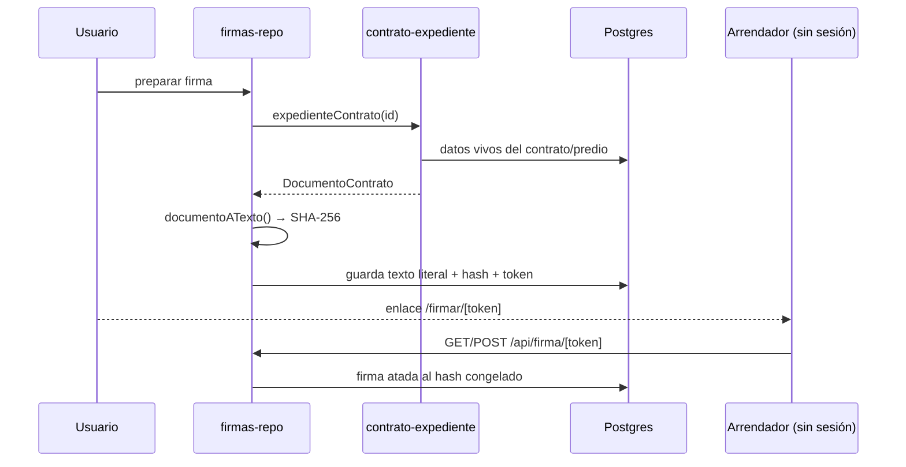

# Arrendadores y contratos

> [!danger] Módulo de dinero
> Casi todas sus mutaciones exigen **desbloqueo** (`SENSIBLE`). Los datos
> bancarios del arrendador fueron el primer caso de reconfirmación obligatoria
> del sistema. Ver [[zonas-de-riesgo]].

Es el módulo más grande del backend: `arrendadores-repo.ts` tiene **1317
líneas**.

## Archivos

| Archivo | Líneas | Responsabilidad |
|---|---|---|
| `arrendadores-repo.ts` | 1317 | Arrendadores, predios, contratos, pagos, licencias, razones sociales |
| `arrendadores-controller.ts` | 460 | Validación zod (RFC, email, periodicidad, adjuntos) |
| `firmas-repo.ts` | 336 | Firma electrónica del contrato |
| `contratos-sitio.ts` | 336 | Contrato en el alta de pantalla (compartido con [[inventario-y-sitios]]) |
| `contrato-expediente.ts` | 95 | Reúne datos vivos y llama al redactor puro |

## Reglas de negocio

| Regla | ADR | Nota |
|---|---|---|
| Renta DIARIA como periodicidad válida | 0004 | Además de semanal→anual |
| Vencimientos anclados al **inicio** del contrato | 0007 | No al mes natural |
| Recordatorios proporcionales a la cadencia | 0005 | Un contrato semanal no avisa como uno anual |
| Un solo costo por pantalla | 0006 | La renta al arrendador **es** el costo |

Documentadas en negocio en `docs/Reglas_Arrendadores.md`.

## Firma electrónica: lo que se firma se congela

`firmas-repo.ts:11-16` — el punto crítico es **qué** se firma. El documento se
redacta a partir de datos vivos, así que **antes de pedir firmas se congela**:
se renderiza el texto, se guarda literal y se sella con **SHA-256**. Cada firma
queda atada a ese hash.

El anclaje decide **qué espacio** se describe (`contrato-expediente.ts:9-14`):
con `predio_id` → el predio completo; sin él → la pantalla suelta.

## Predio vs pantalla suelta

Es el discriminador que atraviesa todo el módulo. Un contrato puede colgar de un
predio (lo normal) o de una pantalla individual (legado). Las columnas
`contratos_arrendamiento.predio_id` y `sitio_id` conviven.

## Automatismos hacia Operaciones

`lib/server/operaciones-eventos.ts` — Fase 2:

| Evento | Dispara |
|---|---|
| Cancelar un contrato | OT de **RETIRO** (desmontaje) |
| Alta de pantalla nueva (solo fijas) | OT de **MONTAJE** |

Todo a **mejor esfuerzo**: si la OT falla, la acción principal no se rompe
(`operaciones-eventos.ts:11-14`).

## Columnas deprecadas

`sitios.renta_arrendador` y `sitios.periodicidad_renta` están marcadas
DEPRECADAS (`db/schema.sql:179-181`): la renta vive en el contrato del predio
desde la Fase 1. Siguen en la tabla.

## Relacionadas
[[inventario-y-sitios]] · [[finanzas-y-cobranza]] · [[operaciones-y-ot]] ·
[[esquema]] · [[decisiones]] · [[zonas-de-riesgo]] · [[MOC-Proyecto]]
