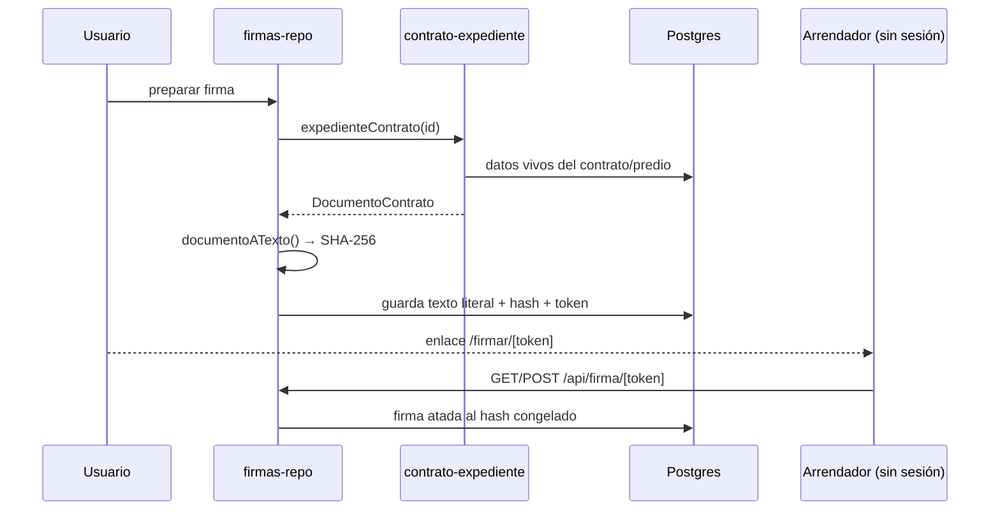

# Arrendadores y contratos

> [!danger] Módulo de dinero
> Casi todas sus mutaciones exigen **desbloqueo** (`SENSIBLE`). Los datos
> bancarios del arrendador fueron el primer caso de reconfirmación obligatoria
> del sistema. Ver [[zonas-de-riesgo]].

Es el módulo más grande del backend: `arrendadores-repo.ts` tiene **1498
líneas** (`wc -l`, medido el 2026-10-05; eran 1317 el 10/08).

## Archivos

| Archivo | Líneas | Responsabilidad |
|---|---|---|
| `arrendadores-repo.ts` | 1498 | Arrendadores, predios, contratos, pagos, licencias, razones sociales |
| `arrendadores-controller.ts` | 505 | Validación zod (RFC, email, periodicidad, adjuntos) |
| `firmas-repo.ts` | 353 | Firma electrónica del contrato |
| `contratos-sitio.ts` | 336 | Contrato en el alta de pantalla (compartido con [[inventario-y-sitios]]) |
| `contrato-expediente.ts` | 95 | Reúne datos vivos y llama al redactor puro |
| `lib/contrato-documento.ts` | 462 | Redactor puro del contrato (`documentoATexto`: lo que se firma) |

## Reglas de negocio

| Regla | ADR | Nota |
|---|---|---|
| Renta DIARIA como periodicidad válida | 0004 | Además de semanal→anual |
| Vencimientos anclados al **inicio** del contrato | 0007 | No al mes natural |
| Recordatorios proporcionales a la cadencia | 0005 | Un contrato semanal no avisa como uno anual |
| Un solo costo por pantalla | 0006 | La renta al arrendador **es** el costo |

Documentadas en negocio en `docs/Reglas_Arrendadores.md`.

## Firma electrónica: lo que se firma se congela

`firmas-repo.ts:11-16` — el punto crítico es **qué** se firma. El documento se
redacta a partir de datos vivos, así que **antes de pedir firmas se congela**:
se renderiza el texto, se guarda literal y se sella con **SHA-256**. Cada firma
queda atada a ese hash.

```mermaid
sequenceDiagram
    participant U as Usuario
    participant F as firmas-repo
    participant E as contrato-expediente
    participant PG as Postgres
    participant A as Arrendador (sin sesión)

    U->>F: preparar firma
    F->>E: expedienteContrato(id)
    E->>PG: datos vivos del contrato/predio
    E-->>F: DocumentoContrato
    F->>F: documentoATexto() → SHA-256
    F->>PG: guarda texto literal + hash + token
    U-->>A: enlace /firmar/[token]
    A->>F: GET/POST /api/firma/[token]
    F->>PG: firma atada al hash congelado
```

El anclaje decide **qué espacio** se describe (`contrato-expediente.ts:9-14`):
con `predio_id` → el predio completo; sin él → la pantalla suelta.

> [!note] 2026-10-05 · el aviso de «faltan datos» ya dice DÓNDE se capturan
> Desde `504b4fc8`, cada dato de `faltantes` lleva la pantalla donde se
> captura, y el domicilio del arrendador (`arrendadores.direccion`) por fin se
> guarda en el alta y se edita desde la lista de Arrendadores. **`documentoATexto`
> no cambió**: `faltantes` no entra en el texto que se firma, así que ninguna
> firma existente se invalidó.

## Cambios antes de firmar, con quién los propuso (07/10)

Pedido del dueño el 07/10. `editarContrato` (`arrendadores-repo.ts`) escribe, en la
MISMA transacción que la edición, un renglón en `contrato_cambios` con:

- **qué parte lo propuso** (`propuesto_por`: ARRENDADOR / ARRENDATARIO), que llega
  en el cuerpo del PATCH y valida el controller; NULL cuando no es negociación
  («Completar información», «La paga → Cambiar»);
- **quién lo capturó**, de la sesión (`app/api/contratos/[id]/route.ts` pasa
  `g.usuario`), nunca del cuerpo: el esquema es `.strict()`;
- **qué cambió**, ya legible: `lib/contrato-cambios.ts` compara normalizado
  (fechas por día, importes a dos decimales), anota los ids con el NOMBRE de ese
  momento y el PDF solo como «anterior / nuevo». Sin cambios no hay renglón.

**Si estaba enviado a firma** (hay `documento_hash`) y nadie firmó, el cambio
**anula el envío**: borra las firmas pendientes —con el token del arrendador— y
descongela el texto. Antes el enlace seguía vivo y el arrendador podía firmar la
versión vieja; la firma salía «invalidada» cuando ya no tenía arreglo. Lo
firmado sigue sin poder cambiarse (409). Subir el **PDF** adjunto se anota pero **no** anula el envío:
`documentoATexto` no lo recita, así que el texto que se firma no cambia.

La pantalla es `components/demo/arrendadores/CambiosContrato.tsx`, dentro de
`ContratoSheet`; el historial lo sirve `GET /api/contratos/[id]/cambios`
(`ver`). Pruebas: `lib/contrato-cambios.test.ts`, el controller, y
`lib/test/contrato-cambios.e2e.test.ts` (historial, envío anulado con el enlace
muerto, firmado intocable y aislamiento entre organizaciones), con dos
mutantes del repo que mueren. Tabla en [[04-Datos/esquema]].

## Predio vs pantalla suelta

Es el discriminador que atraviesa todo el módulo. Un contrato puede colgar de un
predio (lo normal) o de una pantalla individual (legado). Las columnas
`contratos_arrendamiento.predio_id` y `sitio_id` conviven.

## Automatismos hacia Operaciones

`lib/server/operaciones-eventos.ts` — Fase 2:

| Evento | Dispara |
|---|---|
| Cancelar un contrato | OT de **RETIRO** (desmontaje) |
| Alta de pantalla nueva (solo fijas) | OT de **MONTAJE** |

Todo a **mejor esfuerzo**: si la OT falla, la acción principal no se rompe
(`operaciones-eventos.ts:12-13`).

## El documento del contrato NO viaja en la hidratación (10/08)

`listarContratos()` usa **columnas explícitas**, no `select c.*`. Dos columnas
quedan fuera a propósito:

| Columna | Por qué fuera |
|---|---|
| `documento_url` | El PDF en data URL. Pesaba ~300 kB por contrato **y llegaba al navegador**: el mapper lo exponía |
| `documento_congelado` | El texto sellado para firma. El mapper ni lo mira — se traía de Postgres para tirarlo |

En su lugar la consulta pide `(documento_url is not null) as tiene_documento` y
`rowToContrato` emite la **ruta** `/api/contratos/{id}/documento/`, o `null` si
no hay documento. Ese `null` importa: el export a Excel hace
`c.documentoUrl ? 'si' : 'no'`, y emitir siempre una ruta pondría «si» en toda
la columna.

> [!warning] Al añadir una columna a `contratos_arrendamiento`
> Si el front la necesita, hay que **añadirla a la lista explícita** de
> `listarContratos()`. Es el coste de la lista, y se paga a gusto: la
> alternativa es que el próximo `text` grande se cuele solo. Ver
> [[estado-y-data-fetching]].

Las consultas de **detalle** siguen haciendo `select *`, así que no cambian:
`rowToContrato` resuelve con `??` y el valor real gana cuando está.

## Un RFC es de un solo arrendador (INC-07)

`arrendadores-repo.ts:233-249` — dos redes distintas contra el duplicado: el
**RFC**, con índice único en la base (`arrendadores_tenant_rfc_uq`), duro y que
cubre también la carrera entre dos pestañas; y el **nombre**, que solo avisa
(`ArrendadorDuplicado`) y deja continuar si quien da el alta confirma que es
otra persona. El caso que lo motivó fue una repetición humana a 71 segundos,
no un doble clic.

## La razón social del owner que paga la renta (18/09)

Desde `8c6002e7`, `PATCH /api/contratos/[id]` escribe
`contratos_arrendamiento.entidad_id`: la [[entidades-fiscales|entidad fiscal]]
**del owner** que paga la renta (no confundir con `razon_social_id`, que es la
del arrendador). Su par en el comprobante es `facturas.entidad_emisora_id`
— ver [[finanzas-y-cobranza]].

- Se valida contra el tenant **antes** de escribir
  (`arrendadores-repo.ts:1199-1219`): la FK compuesta de
  `20260918_entidad_tenant_compuesto.sql` la rechazaría igual, pero por el
  camino del 23503, que llega como un 500. La FK es la red; esto es la puerta.
- `undefined` es «no la toques» y `null` **desasigna** (`:1206-1208`). Sin esa
  distinción, editar el importe de la renta borraría la razón social en
  silencio; lo fija `lib/test/entidad-en-documentos.e2e.test.ts`.
- El default se **deriva** de los roles, no se guarda: una sola entidad con
  ARRENDAMIENTOS viene preseleccionada; con dos, ninguna.
- La ruta tiene el guard `exigirCambioSensible('arrendadores', 'crear')`
  (`app/api/contratos/[id]/route.ts:25`), así que asignar la razón social pide
  volver a teclear la contraseña aunque sea un dato fiscal y no un importe.
  Decisión conservadora y documentada en el commit: separarlo abriría otra ruta
  de escritura sobre un contrato, y eso es R4.

Ver [[multi-entidad-en-uso]].

## Columnas deprecadas

`sitios.renta_arrendador` y `sitios.periodicidad_renta` están marcadas
DEPRECADAS (`db/schema.sql:179-181`): la renta vive en el contrato del predio
desde la Fase 1. Siguen en la tabla.

## Relacionadas
[[inventario-y-sitios]] · [[finanzas-y-cobranza]] · [[operaciones-y-ot]] ·
[[entidades-fiscales]] · [[multi-entidad-en-uso]] · [[esquema]] · [[decisiones]] · [[zonas-de-riesgo]] · [[MOC-Proyecto]]
