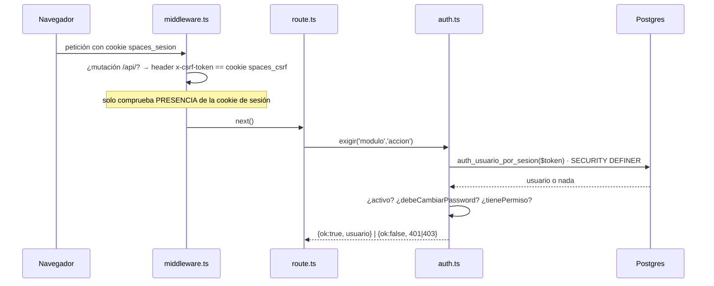

# Autenticación y sesión

> [!danger] ZONA ROJA
> Nada de este módulo se toca sin aprobación humana. Ver [[zonas-de-riesgo]].

## Mecanismo: propio, sin librería

Las únicas dependencias son `pg` y `bcryptjs` (`apps/web/package.json:37-38`).
No hay NextAuth, ni `jose`, ni iron-session.

| Pieza | Valor | Evidencia |
|---|---|---|
| Cookie de sesión | `spaces_sesion`, httpOnly, sameSite lax, 30 días | `lib/server/auth.ts:15,195-211` |
| Token | 256 bits aleatorios, **opaco y sin firma** | `lib/server/auth.ts:96-105` |
| Validez | Fila viva en `sesiones` con `expira_en > now()` | `auth_usuario_por_sesion()` |
| Hash de contraseña | bcrypt costo 10 | `lib/server/auth.ts:87-94` |
| Contraseña generada (alta con Google) | `passwordAleatoria()`, cumple la política por construcción | `lib/server/auth.ts:59` |
| Cookie CSRF | `spaces_csrf`, **httpOnly:false a propósito** | `lib/server/auth.ts:213-230` |
| `Secure` | ON en producción salvo `COOKIE_SECURE=0` | `lib/server/auth.ts:188-192` |

## El camino de una petición autenticada

## Las cuatro funciones `SECURITY DEFINER`

`usuarios` es RLS **fail-closed + FORCE** (`20260720_hard1_usuarios_rls.sql:136-141`),
y el login ocurre **antes** de conocer el tenant. Una lectura directa devolvería
cero filas. Por eso hay exactamente cuatro funciones acotadas (tres del
Hardening 1, más la del ADR 0012):

| Función | Para qué |
|---|---|
| `auth_usuario_por_email(text)` | Login con contraseña |
| `auth_usuario_por_sesion(text)` | Resolver la sesión en cada petición |
| `auth_email_existe(text)` | Unicidad global de correo |
| `auth_usuario_por_identidad(text,text)` | Login con Google (ADR 0012) |

Con `revoke execute … from public` y `grant` solo al rol de la app, más un
`ASSERT` que hace fallar la migración si ese rol tiene `SUPERUSER`/`BYPASSRLS`
(`20260720_hard1_usuarios_rls.sql:146-157`).

> [!note] La creación de `auth_usuario_por_sesion` va guardada desde T-04 (17/08)
> `20260720_hard1_usuarios_rls.sql:78-101` solo la crea si no existe ya
> (`to_regprocedure`), porque su forma vigente la fija
> `20260804_reautenticacion_individual.sql:70-71` —la que añade
> `debe_cambiar_password`— y reaplicar la cadena la degradaría a la versión de
> julio. Con eso, **quien manda sobre la firma de esta función es la migración de
> agosto**, no la de julio. Ver [[migraciones]].

## CSRF — double-submit

`middleware.ts:45-69`. En `POST/PUT/PATCH/DELETE` sobre `/api/`, si hay cookie de
sesión, exige `x-csrf-token == spaces_csrf`. El front parcha `window.fetch` para
reenviarlo (`lib/csrf-client.ts:36-66`).

**Exentos** (no dependen de la cookie): `/api/auth/login`, `/auth/forgot`,
`/auth/reset`, `/auth/logout`, `/api/signup`, `/api/portal/`, `/api/firma/`,
`/api/propuestas/publica/`.

> [!tip] Las rutas de Google no necesitan exención
> Son `GET`, y el filtro solo mira mutaciones.

## Permisos (RBAC)

`rol_permisos (rol, modulo, accion)` — `ver | crear | aprobar | facturar`.

> [!warning] La matriz de permisos es GLOBAL
> `rol_permisos` **no tiene `tenant_id` ni RLS** (`db/schema.sql:75-80`). El RBAC
> es de la instalación entera, no por organización. Ver [[preguntas-abiertas]].

## Reautenticación para cambios sensibles (ADR 0009)

Para tocar dinero o catálogo hay que reescribir **la propia contraseña de
login**; eso desbloquea esa sesión 15 minutos.

| Pieza | Dónde |
|---|---|
| Interruptor por organización | `tenants.exigir_reautenticacion` (**apagado por defecto**) |
| Estado del desbloqueo | `sesiones.desbloqueo_expira_en` — **en el servidor** |
| Duración | `DESBLOQUEO_MINUTOS = 15` (`cambios.ts:49`) |
| Sin exención por rol | Retirada a propósito (`cambios.ts:41-44`) |

`exigirReautenticacionSiempre()` (`cambios.ts:221-226`) ignora el interruptor:
tocar el **acceso** de otra persona no debe depender de una preferencia del
tenant. Es lo que protege `/api/usuarios/[id]/restablecer`.

> [!danger] INVARIANTE: todo usuario tiene `password_hash`
> `cambios.ts:168-170` responde *«Tu usuario no tiene contraseña»* y
> `perfil-controller.ts:37-43` exige `passwordActual`. Un usuario con
> `password_hash = null` **no puede** desbloquear, ni cambiar su correo, ni salir
> de `debe_cambiar_password`: queda encerrado sin salida desde la aplicación.
>
> El invariante se sostiene en dos sitios: `crearUsuario()` lanza si no recibe
> contraseña (`usuarios-repo.ts:41`), y el alta «entra con Google» **genera una
> que nadie ve** en vez de dejar el campo vacío (`4206ab2`). Es la solución por
> construcción a la restricción 4 del ADR 0012.
>
> **No introduzcas un camino de alta que deje el hash nulo.** Ver
> [[flujo-acceso-con-google]].

## Contraseñas

Política única (`auth.ts:35-57`): ≥8 caracteres, al menos una letra y un número,
sin espacios. La comparten signup, alta de usuarios y cambio de perfil — y
`passwordAleatoria()` (`auth.ts:59`) la **construye** en vez de confiar en el
azar, porque base64url puede salir sin letra o sin dígito y el alta fallaría una
vez de cada tantas.

Restablecimiento por correo: `password_resets`, token de 256 bits, un solo uso,
60 minutos, y **borra todas las sesiones del usuario**
(`password-reset-repo.ts`). Está apagado en producción
(`NEXT_PUBLIC_RECUPERAR_PASSWORD`) porque no hay correo saliente.

> [!note] `password_resets` pasó a fail-closed el 07/08
> `20260807_password_resets_rls.sql` (`f703c1c`). Ya **no** es una tabla exenta
> de RLS: cumple el mismo invariante que el resto. Queda una parte pendiente,
> anotada por la propia sesión que lo hizo para el 10/08 (`ba8cb12`).

## Rate limiting

En memoria, ventana fija (`lib/server/rate-limit.ts`). **Por instancia**: si
algún día se escala a varias, deja de valer.

| Ruta | Límite |
|---|---|
| login | 10 / 5 min por IP |
| forgot | 5 / 15 min por IP + 3 / h por correo |
| reset | 10 / 15 min |
| signup | 5 / h por IP |
| google/inicio | 10 / 5 min por IP |
| desbloquear | 5 / 5 min por usuario+IP |

## Deuda conocida

1. `app/api/tenant-activo/route.ts:23` usa `process.env.COOKIE_SECURE === '1'`
   en vez de `cookieSecure()`. **Hoy no es un bug**: `COOKIE_SECURE=1` está
   puesta en el droplet (comprobado el 07/08). Es deuda: el día que falte esa
   variable, esta cookie perderá `Secure` **y las otras dos no**, porque
   `cookieSecure()` cae a `NODE_ENV === 'production'`. Ver [[preguntas-abiertas]] P9.
2. No hay purga de `sesiones` ni `password_resets` vencidos.
3. No hay rotación de sesión ni sliding expiration.

## Relacionadas
[[multi-tenancy-y-rls]] · [[flujo-login]] · [[flujo-acceso-con-google]] ·
[[api-endpoints]] · [[decisiones]] · [[zonas-de-riesgo]] · [[MOC-Proyecto]]
