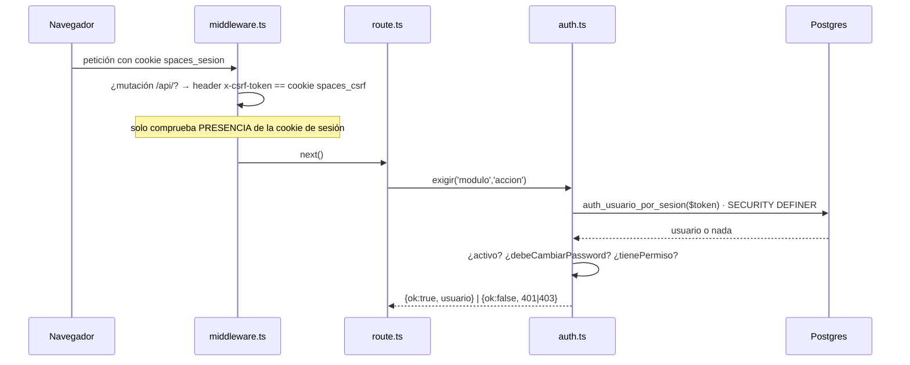

# Autenticación y sesión

> [!danger] ZONA ROJA
> Nada de este módulo se toca sin aprobación humana. Ver [[zonas-de-riesgo]].

## Mecanismo: propio, sin librería

Las únicas dependencias son `pg` y `bcryptjs` (`apps/web/package.json:37-38`).
No hay NextAuth, ni `jose`, ni iron-session.

| Pieza | Valor | Evidencia |
|---|---|---|
| Cookie de sesión | `spaces_sesion`, httpOnly, sameSite lax, 30 días | `lib/server/auth.ts:15-16,204-214` |
| Token | 256 bits aleatorios, **opaco y sin firma** | `lib/server/auth.ts:103-113` |
| **Método de la sesión** | `'password'` \| `'google'`, **obligatorio y sin default** (ADR 0018) | `lib/server/auth.ts:96,98-103` · `20260825_sesion_metodo.sql` |
| Validez | Fila viva en `sesiones` con `expira_en > now()` | `auth_usuario_por_sesion()` |
| Hash de contraseña | bcrypt costo 10 | `lib/server/auth.ts:87-89` |
| Contraseña generada (alta con Google) | `passwordAleatoria()`, cumple la política por construcción | `lib/server/auth.ts:59-62` |
| Cookie CSRF | `spaces_csrf`, **httpOnly:false a propósito** | `lib/server/auth.ts:222-239` |
| `Secure` | ON en producción salvo `COOKIE_SECURE=0` | `lib/server/auth.ts:197-201` |

> [!warning] Las seis citas de arriba habían derivado hasta 21 líneas — recalculadas el 27/08
> `auth.ts` pasó de 188 a **239** líneas entre el 10/08 y el 25/08 (`passwordAleatoria()`
> primero, el bloque del ADR 0018 después), y **ninguna** de esas citas daba error:
> mandaban al sitio equivocado en silencio. Ejemplo del daño: `:92-101` apuntaba a
> `crearSesion` y hoy `:92` es `return bcrypt.compare(...)` — o sea, quien buscara
> «cómo se genera el token» acababa leyendo la verificación de contraseña. Es
> exactamente el modo de fallo que describe [[convenciones]] §4.

> [!danger] El ADR 0018 abre una excepción a «para cambiar la contraseña hay que teclear la anterior»
> Desde el 25/08, quien entró con Google y **nunca** ha tenido contraseña puede
> fijar la primera **sin** teclear la anterior. La condición no es «entró con
> Google» a secas: es **esta sesión** se abrió con Google, y por eso hizo falta
> la columna `sesiones.metodo` — antes «no quedaba rastro de por dónde entró
> nadie» (`20260825_sesion_metodo.sql:5-8`).
>
> Tres decisiones que sostienen la excepción y **no se tocan a la ligera**:
> 1. `crearSesion(usuarioId, metodo)` **no tiene valor por omisión**, a propósito:
>    un default silencioso le regalaría la excepción a una tercera vía de entrada
>    que alguien añada sin pensarlo (`lib/server/auth.ts:98-103`).
> 2. Las sesiones que ya existían se marcaron **`'password'`**, no `'google'`: de
>    ellas no se puede afirmar el origen, y la opción segura es la que **cierra**
>    la excepción.
> 3. El alta con Google **sigue generando un `password_hash`**, así que
>    `cambios.ts` y `perfil-controller.ts` no cambian de invariante.
>
> Verificado en producción el 25/08. La ruta es `PATCH /api/perfil`, y la pantalla
> conocía la regla pero era inalcanzable hasta `113ffa4`.

## El camino de una petición autenticada

## Las cuatro funciones `SECURITY DEFINER`

`usuarios` es RLS **fail-closed + FORCE** (`20260720_hard1_usuarios_rls.sql:136-141`),
y el login ocurre **antes** de conocer el tenant. Una lectura directa devolvería
cero filas. Por eso hay exactamente cuatro funciones acotadas (tres del
Hardening 1, más la del ADR 0012):

| Función | Para qué |
|---|---|
| `auth_usuario_por_email(text)` | Login con contraseña |
| `auth_usuario_por_sesion(text)` | Resolver la sesión en cada petición |
| `auth_email_existe(text)` | Unicidad global de correo |
| `auth_usuario_por_identidad(text,text)` | Login con Google (ADR 0012) |

Con `revoke execute … from public` y `grant` solo al rol de la app, más un
`ASSERT` que hace fallar la migración si ese rol tiene `SUPERUSER`/`BYPASSRLS`
(`20260720_hard1_usuarios_rls.sql:146-157`).

> [!note] La creación de `auth_usuario_por_sesion` va guardada desde T-04 (17/08)
> `20260720_hard1_usuarios_rls.sql:78-101` solo la crea si no existe ya
> (`to_regprocedure`), porque su forma vigente la fija
> `20260804_reautenticacion_individual.sql:70-71` —la que añade
> `debe_cambiar_password`— y reaplicar la cadena la degradaría a la versión de
> julio. Con eso, **quien manda sobre la firma de esta función es la migración de
> agosto**, no la de julio. Ver [[migraciones]].

## CSRF — double-submit

`middleware.ts:45-72`. En `POST/PUT/PATCH/DELETE` sobre `/api/`, si hay cookie de
sesión, exige `x-csrf-token == spaces_csrf`. El front parcha `window.fetch` para
reenviarlo (`lib/csrf-client.ts:36-66`).

**Exentos** (no dependen de la cookie): `/api/auth/login`, `/auth/forgot`,
`/auth/reset`, `/auth/logout`, `/api/signup`, `/api/portal/`, `/api/firma/`,
`/api/propuestas/publica/` y, desde el 26/08, **`/api/bootstrap`**
(`middleware.ts:58-61`).

> [!important] La exención de `/api/bootstrap` no es su protección
> Se exime porque **no hay sesión que proteger**: la base está vacía, no existe
> cookie. Su cerrojo real es triple y **ninguno es el CSRF**: `BOOTSTRAP_TOKEN`
> presente y coincidente, `tenants` vacía, y 10/h por IP; si falla cualquiera
> contesta **404, nunca 401** — para no confirmar que la ruta existe. Hay una
> prueba dedicada a que esa exención **no se derrame** a rutas vecinas
> (`0b7e10a`).

> [!tip] Las rutas de Google no necesitan exención
> Son `GET`, y el filtro solo mira mutaciones.

## Permisos (RBAC)

`rol_permisos (rol, modulo, accion)` — `ver | crear | aprobar | facturar`.

> [!warning] La matriz de permisos es GLOBAL
> `rol_permisos` **no tiene `tenant_id` ni RLS** (`db/schema.sql:75-80`). El RBAC
> es de la instalación entera, no por organización. Ver [[preguntas-abiertas]].

> [!danger] No hay atajo para el Dueño: si la tabla está vacía, no ve nada
> `permisosDeRol` y `tienePermiso` (`auth.ts:139-157`) son consultas directas a
> `rol_permisos`, **sin excepción por rol**, y `exigir()` es fail-closed. Ningún
> rol —tampoco `DUENO`— tiene privilegio implícito.
>
> Eso convierte el contenido de la tabla en parte del producto, y hasta el
> 19/08 **no viajaba con él**: `db/schema.sql:75-80` la crea vacía y lo único
> que la sembraba era `20260804_modulo_inventario.sql:22`, cinco filas de un
> módulo. Una instancia recién aprovisionada nacía con el Dueño encerrado fuera
> de su propia aplicación. Lo siembra
> `db/migrations/20260819_semilla_rol_permisos.sql` — 25 filas · 8 módulos ·
> 3 roles — y **al día siguiente** lo completa
> `20260820_catalogo_permisos_completo.sql`: **41 filas · 9 módulos · 5 perfiles**
> (`:2`, `:126-127`). Esa es la cifra vigente. El detalle, en [[migraciones]].
>
> Las dos migraciones existen porque **había DOS catálogos y ganaba el que
> corriera último**, sin error y sin aviso: en el ensayo el Dueño pasó de 19 a 24
> permisos solo por el orden. Lo que impide que dos listas diverjan no es que hoy
> coincidan — es que **solo exista una**.

> [!warning] ~~Dos roles del enum siguen sin una sola fila~~ — RESUELTO el 20/08, y con dinero de por medio
> Esta nota afirmó hasta el **27/08** que `IMPRENTA` y `FINANZAS` entraban y
> recibían 403 en todo. **Dejó de ser cierto el 20/08**, siete días antes, con
> `20260820_catalogo_permisos_completo.sql`: `IMPRENTA` pasó de 0 a **3**
> permisos (`:117-119`) y `FINANZAS` de 0 a **4** (`:120-123`).
>
> Lo que hay que mirar dos veces es el cuarto de `FINANZAS`: **`facturar`**, que
> es acción de **dinero irreversible — zona R4** ([[zonas-de-riesgo]]). Fue una
> decisión expresa, no un efecto colateral, y la migración **es aditiva**: al
> actualizarse, una instancia que ya existía **gana** esas filas. Quien dé de
> alta un usuario `FINANZAS` le está dando la facturación.
>
> Los roles siguen ofreciéndose en `components/demo/shell/nav.ts:136-137`, y
> `CLIENTE` sigue retirado de esa lista por el ADR 0010 (`nav.ts:138-141`) — esas
> tres citas también habían derivado.

## Reautenticación para cambios sensibles (ADR 0009)

Para tocar dinero o catálogo hay que reescribir **la propia contraseña de
login**; eso desbloquea esa sesión 15 minutos.

| Pieza | Dónde |
|---|---|
| Interruptor por organización | `tenants.exigir_reautenticacion` (**apagado por defecto**) |
| Estado del desbloqueo | `sesiones.desbloqueo_expira_en` — **en el servidor** |
| Duración | `DESBLOQUEO_MINUTOS = 15` (`cambios.ts:49`) |
| Sin exención por rol | Retirada a propósito (`cambios.ts:41-44`) |

`exigirReautenticacionSiempre()` (`cambios.ts:221-226`) ignora el interruptor:
tocar el **acceso** de otra persona no debe depender de una preferencia del
tenant. Es lo que protege `/api/usuarios/[id]/restablecer`.

> [!danger] INVARIANTE: todo usuario tiene `password_hash`
> `cambios.ts:168-170` responde *«Tu usuario no tiene contraseña»* y
> `perfil-controller.ts:83-88` exige `passwordActual`. Un usuario con
> `password_hash = null` **no puede** desbloquear, ni cambiar su correo, ni salir
> de `debe_cambiar_password`: queda encerrado sin salida desde la aplicación.
>
> El invariante se sostiene en dos sitios: `crearUsuario()` lanza si no recibe
> contraseña (`usuarios-repo.ts:49-50`), y el alta «entra con Google» **genera una
> que nadie ve** en vez de dejar el campo vacío (`4206ab2`). Es la solución por
> construcción a la restricción 4 del ADR 0012.
>
> **No introduzcas un camino de alta que deje el hash nulo.** Ver
> [[flujo-acceso-con-google]].

> [!warning] «Encerrado sin salida» dejó de ser cierto el 25/08 — el ADR 0018 abre UNA puerta
> Este párrafo describía un punto muerto real: quien entra con Google recibe una
> contraseña que **nadie ve**, y `PATCH /api/perfil` le pedía justo esa para poder
> cambiarla. El ADR 0018 lo resolvió, y conviene leer la excepción entera antes de
> tocar nada de aquí: son **cuatro condiciones que van juntas**
> (`perfil-controller.ts:49-57`), y cada una tapa un abuso distinto.
>
> | Condición | Qué impide |
> |---|---|
> | `debeCambiarPassword` | La excepción es de **un solo uso por cuenta**: en cuanto pone la suya, deja de aplicar |
> | `metodoSesion === 'google'` | No basta con *poder* usar Google: hay que haber entrado por ahí **en esta sesión** (de ahí `sesiones.metodo`) |
> | Identidad vinculada | Defensa en profundidad: hoy la implica la anterior, pero una tercera vía de entrada no debe heredar la excepción por descuido |
> | `!cambiaEmail` | **La más importante.** Poner tu primera contraseña, no apropiarte de la cuenta: con el correo abierto, una sesión robada se quedaría con la cuenta entera |
>
> **El invariante de arriba no cambia**: el hash sigue sin ser nunca nulo. Lo que
> cambia es que ahora hay una forma legítima de sustituir el generado.

## Contraseñas

Política única (`apps/web/lib/password.ts:26-39`): ≥8 caracteres, al menos una
letra y un número, sin espacios. **Ya no vive en `auth.ts`** — salió a
`lib/password.ts` el 10/08 (`cde5f58`) y `auth.ts:36` solo la reexporta.
La comparten signup, alta de usuarios y cambio de perfil — y
`passwordAleatoria()` (`auth.ts:59-62`) la **construye** en vez de confiar en el
azar, porque base64url puede salir sin letra o sin dígito y el alta fallaría una
vez de cada tantas.

Restablecimiento por correo: `password_resets`, token de 256 bits, un solo uso,
60 minutos, y **borra todas las sesiones del usuario**
(`password-reset-repo.ts`). Está apagado en producción
(`NEXT_PUBLIC_RECUPERAR_PASSWORD`) porque no hay correo saliente.

> [!note] `password_resets` pasó a fail-closed el 07/08
> `20260807_password_resets_rls.sql` (`f703c1c`). Ya **no** es una tabla exenta
> de RLS: cumple el mismo invariante que el resto. Queda una parte pendiente,
> anotada por la propia sesión que lo hizo para el 10/08 (`ba8cb12`).

## Rate limiting

En memoria, ventana fija (`lib/server/rate-limit.ts`). **Por instancia**: si
algún día se escala a varias, deja de valer.

| Ruta | Límite |
|---|---|
| login | 10 / 5 min por IP |
| forgot | 5 / 15 min por IP + 3 / h por correo |
| reset | 10 / 15 min |
| signup | 5 / h por IP |
| google/inicio | 10 / 5 min por IP |
| desbloquear | 5 / 5 min por usuario+IP |
| bootstrap | 10 / h por IP (`app/api/bootstrap/route.ts:63`) — **pasarse contesta 404**, no 429 |

## Deuda conocida

1. `app/api/tenant-activo/route.ts:23` usa `process.env.COOKIE_SECURE === '1'`
   en vez de `cookieSecure()`. **Hoy no es un bug**: `COOKIE_SECURE=1` está
   puesta en el droplet (comprobado el 07/08). Es deuda: el día que falte esa
   variable, esta cookie perderá `Secure` **y las otras dos no**, porque
   `cookieSecure()` cae a `NODE_ENV === 'production'`. Ver [[preguntas-abiertas]] P9.
2. No hay purga de `sesiones` ni `password_resets` vencidos.
3. No hay rotación de sesión ni sliding expiration.

## Relacionadas
[[multi-tenancy-y-rls]] · [[flujo-login]] · [[flujo-acceso-con-google]] ·
[[api-endpoints]] · [[decisiones]] · [[zonas-de-riesgo]] · [[MOC-Proyecto]]
