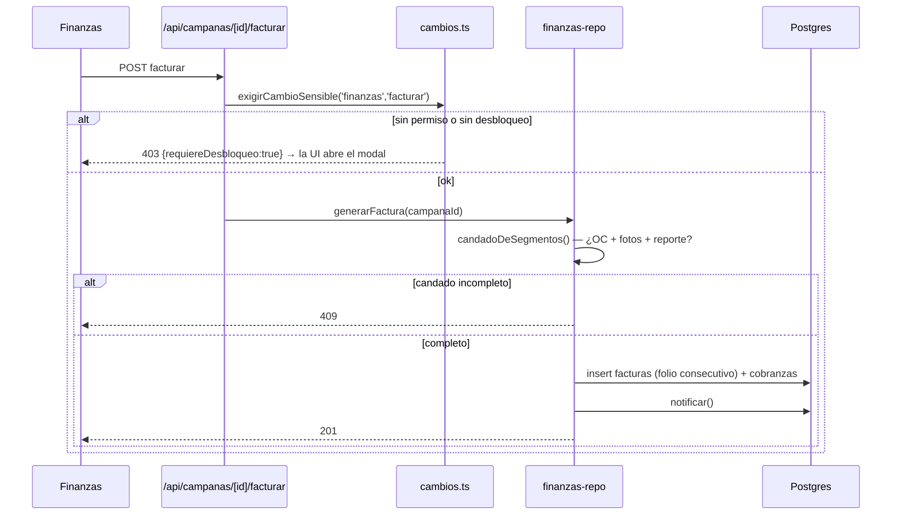

# Finanzas: facturación y cobranza

> [!danger] Dinero irreversible
> `POST /api/campanas/[id]/facturar` y `POST /api/cobranzas/[id]/pagar` son
> `SENSIBLE` (permiso + desbloqueo). Emitir una factura consume folio fiscal.
> Ver [[zonas-de-riesgo]].

> [!warning] Hasta el 2026-08-28 el «+ desbloqueo» no pedía nada en una instancia nueva
> `exigirCambioSensible()` tiene dos mitades, y la segunda —comprobar que quien
> está al teclado es esa persona— cuelga de `tenants.exigir_reautenticacion`
> (`cambios.ts:199-210`). Esa columna nació con `default false`
> (`20260804_reautenticacion_individual.sql:34`) y **nada en las semillas ni en
> el aprovisionamiento la tocaba**: cada instancia nueva arrancaba con el candado
> abierto, incluidas las **tres rutas de dinero** —`facturar`, `cobranzas/pagar`
> y `pagos-renta/pagar`— y otras cinco de contratos y arrendadores.
>
> **El permiso del rol sí aplicaba**: no es que pudiera facturar cualquiera. Lo
> que faltaba era la reautenticación.
>
> `20260828_reautenticacion_por_defecto.sql` cambió **el DEFAULT, no las filas**:
> toda organización que nazca de aquí en adelante pide la contraseña; las que ya
> existen se quedan como estén, porque encenderlo en una base que ya opera es una
> corrección de datos con su rollback, no una migración de esquema.
>
> Sigue siendo un interruptor (ADR 0009): lo que cambió es la **polaridad** — se
> apaga a propósito en vez de encenderse a propósito. La fricción es menor de lo
> que suena: el desbloqueo dura 15 minutos (`cambios.ts:49`), así que facturar
> diez campañas seguidas pide la contraseña una vez.

## El candado de facturación

No se puede facturar una campaña hasta que se cumplan tres condiciones
(`campanas`, `db/schema.sql:393-396`):

| Columna | Qué prueba | Quién la enciende |
|---|---|---|
| `oc_recibida` | El cliente mandó su orden de compra | Imprenta/Comercial (`ordenes_compra`) |
| `fotos_comprobatorias` | Hay evidencia de que se instaló | Cierre de OT ([[operaciones-y-ot]]) |
| `reporte_publicacion` | Se generó el reporte | Cierre de OT |

`candadoDeSegmentos()` (`lib/data/derive.ts`) evalúa el candado **por segmento**:
el hallazgo A-2 exigía OC + evidencia por segmento, y una segunda factura sobre
lo mismo responde **409**.

## Cobro en parcialidades

`20260728_cobro_parcialidades.sql` + `lib/finanzas-calculo.ts` (`repartirCuotas`,
`opcionesParcialidad`). Reglas verificadas por
`apps/web/lib/test/flujo-critico.e2e.test.ts`:

- las cuotas **suman exacto** al total (sin centavos perdidos);
- un plan que no cabe en la vigencia se rechaza;
- el abono está acotado al saldo;
- la liquidación cierra la cobranza.

## Fiscal

`facturas` guarda un **snapshot** de los datos fiscales al emitir (`rfc`,
`razon_social`, `uso_cfdi`, `serie`, `folio_fiscal`): si el cliente cambia sus
datos después, la factura emitida no cambia.

`lib/server/config-fiscal.ts` resuelve el IVA y la razón social comercial por
tenant. El IVA por cliente vive en `clientes.iva_pct` (default 16).

> [!warning] Herencia de un despliegue en Perú
> Los defaults del esquema dicen `PEN` e `IGV 18%` (`db/schema.sql:110,390,543`),
> pero la operación real es en México (`MXN`, IVA 16%) y hay migraciones que lo
> corrigen (`20260724_a3_moneda_default_mxn.sql`,
> `20260724_moneda_por_tenant.sql`). Los nombres de columna `igv` se quedaron.

## Cobranza y recordatorios

`cobranzas` lleva `plazo_dias` (default 90), `fecha_vencimiento`,
`recordatorio_en` y `recordatorios_enviados` — cadencia + idempotencia. Los
plazos válidos salen de `config_negocio.plazos_cobranza` (`{60,90,120}` por
omisión de la columna).

> [!warning] Hasta el 2026-08-26 esa frase describía una intención, no el código
> La columna existía, la pantalla la editaba y se guardaba bien — y después
> `finanzas-controller.ts` la tiraba con un `[60, 90, 120].includes(v)` a fuego.
> Una organización que configurara 45 días veía «Plazo inválido (60, 90 o 120
> días)». Lo encontró la auditoría externa del 26/08 (CFG-01).
>
> Ahora la lista se lee **del tenant** con `plazosCobranzaDelTenant()`
> (`config-repo.ts:96`), y con dos cautelas que conviene no deshacer:
>
> - **Lista vacía → respaldo `{60,90,120}`.** Es alcanzable: Administración
>   borra plazos uno a uno sin mínimo (`administracion/page.tsx:887`) y
>   `PATCH /api/config` acepta el arreglo vacío. Tomarla al pie de la letra
>   dejaría a esa organización **sin poder emitir ninguna factura** — peor que
>   el fallo que se corrigió, y sobre dinero.
> - **Solo valida lo que se ESCRIBE.** Una factura ya emitida a 45 días sigue
>   viva, se sigue leyendo y se sigue cobrando aunque se retire el 45 de la
>   configuración. Un plazo retirado no congela dinero en vuelo.
>
> Queda suelto: `plazoDias` sigue tipado `60 | 90 | 120` en `finanzas-repo.ts`,
> `lib/data/types.ts` y `estado-api.ts`. Es solo el tipo —la columna es
> `integer` y el valor llega validado—, con un cast comentado en los dos puntos
> de paso.

## Relacionadas
[[flujo-facturacion-y-cobranza]] · [[comercial-propuestas-campanas]] ·
[[operaciones-y-ot]] · [[esquema]] · [[zonas-de-riesgo]] · [[MOC-Proyecto]]
