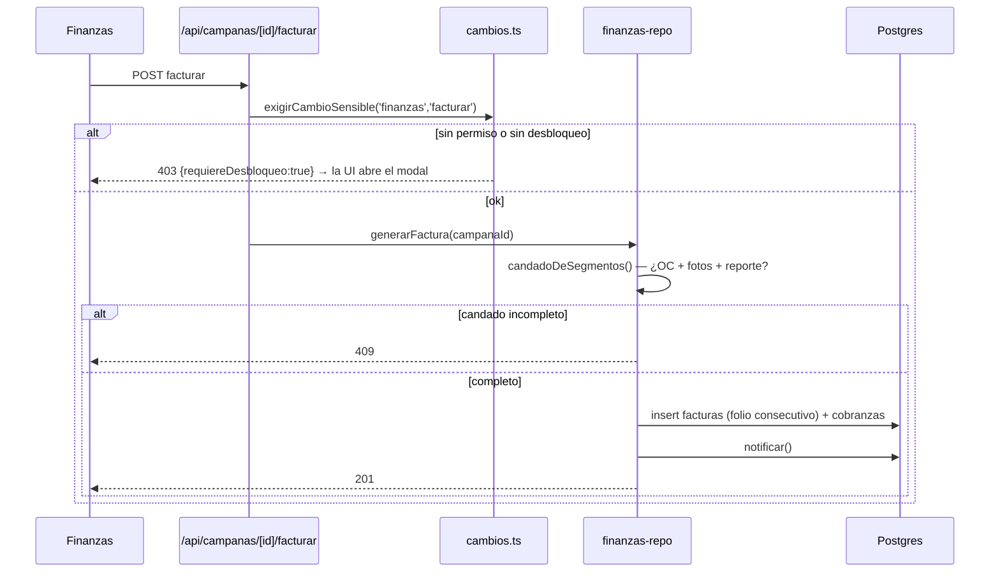

# Finanzas: facturación y cobranza

> [!danger] Dinero irreversible
> `POST /api/campanas/[id]/facturar` y `POST /api/cobranzas/[id]/pagar` son
> `SENSIBLE` (permiso + desbloqueo). Emitir una factura consume folio fiscal.
> Ver [[zonas-de-riesgo]].

## El candado de facturación

No se puede facturar una campaña hasta que se cumplan tres condiciones
(`campanas`, `db/schema.sql:393-396`):

| Columna | Qué prueba | Quién la enciende |
|---|---|---|
| `oc_recibida` | El cliente mandó su orden de compra | Imprenta/Comercial (`ordenes_compra`) |
| `fotos_comprobatorias` | Hay evidencia de que se instaló | Cierre de OT ([[operaciones-y-ot]]) |
| `reporte_publicacion` | Se generó el reporte | Cierre de OT |

`candadoDeSegmentos()` (`lib/data/derive.ts`) evalúa el candado **por segmento**:
el hallazgo A-2 exigía OC + evidencia por segmento, y una segunda factura sobre
lo mismo responde **409**.

## Cobro en parcialidades

`20260728_cobro_parcialidades.sql` + `lib/finanzas-calculo.ts` (`repartirCuotas`,
`opcionesParcialidad`). Reglas verificadas por
`apps/web/lib/test/flujo-critico.e2e.test.ts`:

- las cuotas **suman exacto** al total (sin centavos perdidos);
- un plan que no cabe en la vigencia se rechaza;
- el abono está acotado al saldo;
- la liquidación cierra la cobranza.

## Fiscal

`facturas` guarda un **snapshot** de los datos fiscales al emitir (`rfc`,
`razon_social`, `uso_cfdi`, `serie`, `folio_fiscal`): si el cliente cambia sus
datos después, la factura emitida no cambia.

`lib/server/config-fiscal.ts` resuelve el IVA y la razón social comercial por
tenant. El IVA por cliente vive en `clientes.iva_pct` (default 16).

> [!warning] Herencia de un despliegue en Perú
> Los defaults del esquema dicen `PEN` e `IGV 18%` (`db/schema.sql:110,390,543`),
> pero la operación real es en México (`MXN`, IVA 16%) y hay migraciones que lo
> corrigen (`20260724_a3_moneda_default_mxn.sql`,
> `20260724_moneda_por_tenant.sql`). Los nombres de columna `igv` se quedaron.

## Cobranza y recordatorios

`cobranzas` lleva `plazo_dias` (default 90), `fecha_vencimiento`,
`recordatorio_en` y `recordatorios_enviados` — cadencia + idempotencia. Los
plazos por defecto salen de `config_negocio.plazos_cobranza` (`{60,90,120}`).

## Relacionadas
[[flujo-facturacion-y-cobranza]] · [[comercial-propuestas-campanas]] ·
[[operaciones-y-ot]] · [[esquema]] · [[zonas-de-riesgo]] · [[MOC-Proyecto]]
