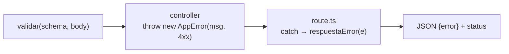

# Infraestructura del servidor

Piezas transversales que usa **todo** el backend. Cambiar cualquiera afecta a
todos los módulos a la vez: son de **claim exclusivo** en [[AGENTES]].

## `db.ts` — pool y contexto de tenant

Pool `pg` singleton, `max: 10`, reusado entre hot-reloads en dev. Las cuatro
puertas y sus reglas están en [[multi-tenancy-y-rls]].

## `errores.ts` — el contrato de errores

`AppError(message, status)` + `validar()` con zod + `respuestaError()`. Los
mensajes de zod se traducen a **lenguaje natural en español** y el nombre del
campo se humaniza (`items.0.spotsPorDia` → «Spots por día»)
(`errores.ts:8-14`).

> [!tip] Regla
> Los controllers **lanzan** `AppError`. Las rutas **solo** llaman
> `respuestaError()` en el catch. No construir respuestas de error a mano.

## `folios.ts` — consecutivos atómicos

Tabla `folios_consecutivos (ambito, periodo, ultimo)`, global y sin RLS.

Sustituye generadores aleatorios que chocaban contra sus propias restricciones
`UNIQUE` (`folios.ts:6-22`):

| Generador anterior | Espacio | 50% de choque a los… |
|---|---|---|
| campañas | 1.000/día | **~37 campañas en un día** |
| órdenes de trabajo | 65.536/año | ~300 OT |
| propuestas | 16,7 M | ~4.800 |

Cuando chocaba, el vendedor veía `duplicate key value violates unique
constraint` a media venta.

## `rate-limit.ts` — limitador en memoria

Ventana fija, `Map` en proceso, limpieza oportunista.

> [!warning] No sobrevive al escalado
> Es **por instancia**. Hoy pm2 corre 1 instancia en modo fork
> (`ecosystem.config.js:11-12`), así que funciona. Subir `instances` **rompe el
> limitador en silencio**. Migrar a un store compartido antes de escalar.

Los cubos van por IP, y nginx la reemplaza (ver [[entorno-y-despliegue]]).

## `uploads.ts` — validación de subidas

Valida contra los **magic bytes** reales del contenido decodificado, no contra
el MIME declarado en el data URL. Renombrar un `.exe` a `.jpg` se rechaza.
Tipos permitidos: `image/jpeg`, `image/png`, `image/webp`. Todo rechazo es
**422** con mensaje entendible (`uploads.ts:5-16`).

> [!danger] Punto único de validación
> El hallazgo original era que 6 de 7 puntos de subida aceptaban cualquier data
> URL de cualquier peso. Si añades un punto de subida nuevo, **tiene que pasar
> por aquí** (`uploadZod`, `uploadOUrlZod`, `LIMITES`).

## `notificaciones-repo.ts` — avisos in-app

`notificar()` inserta solo si no existe ya una idéntica hoy (dedupe por día). El
cron usa **la misma regla** escrita en su propia sentencia
(`app/api/recordatorios/route.ts`) precisamente para que no diverjan.

## `acciones-repo.ts` — bitácora

`acciones (accion, entidad, usuario_id, usuario_nombre, timestamp)`.
`20260629_bitacora_append_only.sql` la hace **append-only**.

Qué se registra y qué no (ADR 0009): se registra la **acción sensible**; **no**
se registra cada desbloqueo — «anotar 15 desbloqueos por persona y día ahogaría
la bitácora». En el acceso con Google se registra la **primera vinculación**,
no cada inicio de sesión.

## Otros

| Archivo | Para qué |
|---|---|
| `peticion.ts` | Helpers de `Request` |
| `pantalla-digital-sql.ts` | Definición **única** de «pantalla digital» en SQL |
| `config-fiscal.ts` | IVA y razón social comercial por tenant |
| `storage.ts` | S3 — ver [[integraciones-externas]] |

## Relacionadas
[[multi-tenancy-y-rls]] · [[autenticacion-y-sesion]] · [[convenciones]] ·
[[AGENTES]] · [[zonas-de-riesgo]] · [[MOC-Proyecto]]
