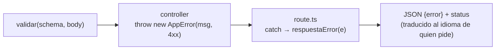

# Infraestructura del servidor

Piezas transversales que usa **todo** el backend. Cambiar cualquiera afecta a
todos los módulos a la vez: son de **claim exclusivo** en [[AGENTES]].

## `db.ts` — pool y contexto de tenant

Pool `pg` singleton, `max: 10` (`db.ts:27-28`), reusado entre hot-reloads en
dev. Las **siete** puertas y sus reglas están en [[multi-tenancy-y-rls]] (esta
nota decía «cuatro» hasta el 05/10; faltaban `fijarTenant`,
`fijarTenantExplicito` y `withTxBootstrap`).

## `errores.ts` — el contrato de errores


```mermaid
flowchart LR
    CTRL["controller<br/>throw new AppError(msg, 4xx)"] --> RT["route.ts<br/>catch → respuestaError(e)"]
    RT --> HTTP["JSON {error} + status<br/>(traducido al idioma de quien pide)"]
    ZOD["validar(schema, body)"] --> CTRL
```

`AppError(message, status)` + `validar()` con zod + `respuestaError()`. Los
mensajes de zod se traducen a **lenguaje natural en español** y el nombre del
campo se humaniza (`items.0.spotsPorDia` → «Spots por día»)
(`errores.ts:13-16`).

> [!tip] Regla
> Los controllers **lanzan** `AppError`. Las rutas **solo** llaman
> `respuestaError()` en el catch. No construir respuestas de error a mano.

**Lo que `respuestaError()` hace hoy** (`errores.ts:200-235`), en este orden:

| Caso | Respuesta |
|---|---|
| `AppError` | su `status`, con el mensaje |
| `ZodError` | 400 (o el `status` que pida el issue, p. ej. 422 en subidas) |
| `esBaseNoDisponible(e)` (`:160-168`) | **503** con `MENSAJE_BASE_NO_DISPONIBLE` (`:139-140`); el detalle solo al log |
| SQLSTATE de `ERRORES_PG` | el 4xx genérico del mapa |
| Lo demás | 500 «Error interno», sin filtrar internals |

> [!note] 2026-10-05 · dos cambios del 30/09 que esta nota no recogía
> - **503 con la base caída** (`35f7ad1d`): antes una excepción de `pg` fuera
>   de un `try` salía como un 500 **sin cuerpo**. Detalle y tabla por ruta en
>   [[autenticacion-y-sesion]].
> - **Mensajes por idioma** (I18N-05, `470c5261`): todo mensaje pasa por
>   `alIdiomaDelCliente()` (`errores.ts:192-194`) → `traducirError()` de
>   `lib/i18n/errores-servidor.ts`. El español es la fuente y lo no catalogado
>   sale en español. **Con `IDIOMA_INGLES` distinto de `1` —la omisión—
>   `idiomaDeLaPeticion()` devuelve siempre español** (`lib/i18n/servidor.ts:73-84`,
>   `lib/i18n/idiomas.ts:74-78`). Los `console.error` no se traducen: el log
>   va siempre en español. Ver [[idiomas-es-en]].

## `folios.ts` — consecutivos atómicos

Tabla `folios_consecutivos (ambito, periodo, ultimo)`, global y sin RLS.

Sustituye generadores aleatorios que chocaban contra sus propias restricciones
`UNIQUE` (`folios.ts:6-28`):

| Generador anterior | Espacio | 50% de choque a los… |
|---|---|---|
| campañas | 1.000/día | **~37 campañas en un día** |
| órdenes de trabajo | 65.536/año | ~300 OT |
| propuestas | 16,7 M | ~4.800 |

Cuando chocaba, el vendedor veía `duplicate key value violates unique
constraint` a media venta.

Ámbitos vigentes (`folios.ts:46`): `campana`, `propuesta`, `ot`, `oc`, `oi` y,
desde el 23/09 (ADR 0038), **`ticket`**. Todos menos `campana` salen por
`folioDocumento()` con la forma `<SIGLA>-<AAAA>-<NNNN>` (`folios.ts:101-113`);
el de ticket es `TK-2026-0001`. El ticket tenía al principio su propio cálculo
y se reconvirtió a `folioDocumento` (`f36d9a6d`) para que no hubiera dos formas
de folio.

## `actualizaciones-repo.ts` — el buzón de la instancia (ADR 0037)

`actualizaciones_instancia (id boolean primary key, ...)`, UNA fila (`id =
true`), global y **sin `tenant_id` ni RLS** — igual que `folios_consecutivos`
arriba, y por el mismo motivo: describe el droplet, no una organización de
dentro. Todo el archivo consulta con `qRaw`/`qRaw1`, nunca con `q`/`q1`: fijar
`app.tenant_id` aquí no protegería nada.

DOS escritores con papeles separados por `GRANT` de columna
(`db/migrations/20260921_actualizaciones_instancia.sql`), no por convención:
`update.sh` (rol privilegiado) escribe qué hay *disponible*; `PATCH
/api/actualizaciones` (rol `spaces_app`) escribe solo *preferencia y
aprobación* (`modo`, `aprobado_digest`, `aprobado_por`, `aprobado_en`). Un
intento de escribir una columna ajena lo rechaza Postgres con `42501` — la
capa de este archivo es la **segunda**, no la única.

La pieza que defiende el ADR: `aprobarDigest()` compara y escribe en el
**mismo** `UPDATE ... WHERE digest_disponible = $1` — atómico, para que entre
leer «cuál es el disponible» y escribir la aprobación no quepa una corrida de
`update.sh --comprobar` cambiándolo por debajo. Si el digest ya no cuadra, la
sentencia actualiza cero filas y el repo lanza `AppError(..., 409)`. Endpoint
en [[api-endpoints]].

## `rate-limit.ts` — limitador en memoria

Ventana fija, `Map` en proceso, limpieza oportunista.

> [!warning] No sobrevive al escalado
> Es **por proceso**. Hoy hay un solo proceso por servicio, así que funciona.
> Poner un segundo proceso delante del mismo dominio **rompe el limitador en
> silencio**: cada uno cuenta su propia mitad y el atacante dispone del doble.
> Migrar a un store compartido antes de escalar horizontalmente.

> [!danger] Quien lo arranca ya NO es pm2 — corregido el 2026-08-31
> Esta nota decía «pm2 corre 1 instancia en modo fork
> (`ecosystem.config.js:11-12`)». **Desde el 28/08 el PADRE lo sirve systemd**:
> `spaces-web.service:83` arranca `next start -p 3000` como el usuario `padre`,
> y `spaces-demo.service:77` el 3001 como `demo`.
>
> `ecosystem.config.js` **sigue en el repositorio** y por eso la frase seguía
> pareciendo cierta al leerla. No lo es, y la confusión tiene coste medido: si
> alguien dispara pm2 hoy, **pelea por el puerto 3000 contra systemd** — es la
> trampa nº 6 del traspaso del 28/08.
>
> `pm2 restart` ya no despliega nada. El procedimiento vigente está en
> [[entorno-y-despliegue]].

**Bajo el modelo de instancias esto deja de ser una deuda.** Cada owner corre su
propia copia, con su propio proceso, así que un limitador en memoria por proceso
**coincide** con el límite natural del despliegue. Ver
[[modelo-instancias-soberanas]].

Los cubos van por IP, y nginx la reemplaza (ver [[entorno-y-despliegue]]).

## `uploads.ts` — validación de subidas

Valida contra los **magic bytes** reales del contenido decodificado, no contra
el MIME declarado en el data URL. Renombrar un `.exe` a `.jpg` se rechaza.
Tipos posibles (`uploads.ts:19-24`): `image/jpeg`, `image/png`, `image/webp`,
`image/svg+xml` y `application/pdf`; cada punto de subida elige su `allowlist`
en `LIMITES` (`uploads.ts:209`). El SVG no tiene magic bytes (`:37`) y se
comprueba que el texto contenga una etiqueta `<svg` (`:147-148`). Todo rechazo
es **422** con mensaje entendible (`uploads.ts:5-17`).

> [!note] 2026-10-05 · la lista de tipos estaba corta desde julio
> Esta nota decía solo JPEG, PNG y WebP. SVG y PDF están en `TipoPermitido`
> desde `f40f752e` (21/07). Corregido abriendo el archivo.

> [!danger] Punto único de validación
> El hallazgo original era que 6 de 7 puntos de subida aceptaban cualquier data
> URL de cualquier peso. Si añades un punto de subida nuevo, **tiene que pasar
> por aquí** (`uploadZod` `:172`, `uploadOUrlZod` `:192`, `LIMITES` `:209`).

## `notificaciones-repo.ts` — avisos in-app

`notificar()` inserta solo si no existe ya una idéntica hoy (dedupe por día). El
cron usa **la misma regla** escrita en su propia sentencia
(`app/api/recordatorios/route.ts`) precisamente para que no diverjan.

## `acciones-repo.ts` — bitácora

`acciones (accion, entidad, usuario_id, usuario_nombre, timestamp)`.
`20260629_bitacora_append_only.sql` la hace **append-only**.

> [!danger] La bitácora NO es atómica con la operación que registra (INC-06)
> Verificado el 10/08. `registrarAccion` abre su **propio** `q()` —su propia
> transacción— **después** de que la operación ya hizo commit, y además:
>
> ```ts
> try { await q(`insert into acciones ...`) }
> catch { /* la bitácora nunca rompe la operación principal */ }
> ```
>
> Comprobado de nuevo el 05/10: sigue igual (`acciones-repo.ts:16-23`).
>
> Los **8 de 8** handlers `DELETE` registran, pero **0 de 8** de forma atómica.
> Un fallo al anotar deja el borrado hecho y sin rastro.
>
> No tumbar la operación principal es una decisión defendible. Lo que **no** lo
> es: el `catch` está **vacío**, ni un `console.error`. En un sistema cuya
> bitácora se usa como prueba —y donde el ADR 0009 rehízo la reautenticación
> entera para que «cada desbloqueo pruebe quién era»— una auditoría que falla en
> silencio es un punto ciego. Ver [[preguntas-abiertas]] P19.

Qué se registra y qué no (ADR 0009): se registra la **acción sensible**; **no**
se registra cada desbloqueo — «anotar 15 desbloqueos por persona y día ahogaría
la bitácora». En el acceso con Google se registra la **primera vinculación**,
no cada inicio de sesión.

## Otros

| Archivo | Para qué |
|---|---|
| `peticion.ts` | Helpers de `Request` |
| `pantalla-digital-sql.ts` | Definición **única** de «pantalla digital» en SQL |
| `config-fiscal.ts` | IVA y razón social comercial por tenant |
| `storage.ts` | S3 — ver [[integraciones-externas]] |

## Relacionadas
[[multi-tenancy-y-rls]] · [[autenticacion-y-sesion]] · [[convenciones]] ·
[[AGENTES]] · [[zonas-de-riesgo]] · [[MOC-Proyecto]]
