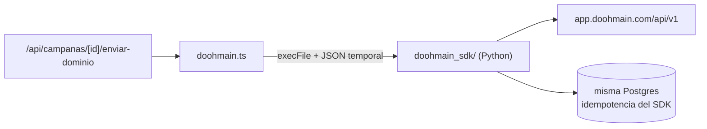

# Integraciones externas

**Patrón común: toda integración está gateada por sus variables de entorno.** Si
no están, la función `*Habilitado()` devuelve `false` y el sistema opera sin ella
sin romperse.

| Integración | Gate | Estado hoy |
|---|---|---|
| DigitalOcean Spaces (S3) | `storageHabilitado()` — las 4 `DO_SPACES_*` | Configurable |
| Resend (correo) | `emailHabilitado()` — `RESEND_API_KEY` + `EMAIL_FROM` | **Apagado en producción** |
| Google OIDC | `googleHabilitado()` — `GOOGLE_CLIENT_ID`/`SECRET` | **Apagado**, migración ya aplicada |
| DOOHmain | `DOOHMAIN_PUBLISH_ENABLED=1` | Detrás de flag |
| Space Eye | `spaceEyeHabilitado()` — URL + credenciales | Configurable |
| AdMobilize, CMS, PAC CFDI | `lib/server/integraciones.ts` | **Modo demo simulado** |

## DOOHmain — publicación en pantallas

`lib/server/doohmain.ts` (313 líneas). Al aprobar la publicación de una campaña,
publica cada creativo validado en cada pantalla **invocando un SDK de Python por
subproceso** (`execFile`), con el mismo contrato JSON del CLI.

> [!danger] Ejecución de subproceso
> `execFile` con rutas que vienen de variables de entorno (`DOOHMAIN_PY`,
> `DOOHMAIN_SDK_DIR`) y un mapa JSON (`DOOHMAIN_SCREEN_MAP`). No es entrada de
> usuario, pero cualquier cambio aquí es zona ROJA. La idempotencia la resuelve
> el SDK contra sus propias tablas.

`playlogs-repo.ts` guarda la respuesta **cruda** de la API a propósito: *«aún no
hemos visto una respuesta con datos, así que no se interpreta nada todavía»*.

## Space Eye — verificación por cámara

`lib/server/space-eye.ts`. Cada espectacular tiene un teléfono Android que
captura fotos y las verifica contra la creatividad con IA. El enlace
pantalla↔cámara es **por código**: `sitios.codigo_proveedor == device.billboard_code`.
Credenciales **solo por env, nunca al cliente**.

## Correo (Resend) — dos canales

`lib/server/email.ts:9-18`. `fetch` directo, sin dependencia npm.

| Canal | `from` | `replyTo` |
|---|---|---|
| **SISTEMA** (contraseñas, invitaciones) | `EMAIL_FROM` tal cual | — |
| **OPERACIÓN** (avisos de negocio) | Buzón verificado **a nombre de la organización** | `config_negocio.email_remitente` |

> [!danger] `from` nunca sale de datos del cliente sin sanear
> `remitenteConNombre()` (`lib/email-remitente.ts`) cita y sanea los nombres de
> organización, que los escribe una persona. Y `escaparHtml` tiene **una sola**
> implementación, reexportada, porque dos escapadores divergen y aquí el que se
> quede corto produce correo con HTML inyectado.

## Almacenamiento S3

`lib/server/storage.ts` — `PutObject` + URL firmada. Si no está configurado, el
llamador cae a data URL en base de datos sin romperse. `next.config.mjs:22-33`
autoriza `*.digitaloceanspaces.com` en `next/image`.

## Conectores en modo demo

`lib/server/integraciones.ts` devuelve datos simulados con `simulado: true`.

> [!note] Hallazgo B8 ya corregido
> La pantalla de Integraciones imprimía los **nombres de las variables de
> entorno** (`ADMOBILIZE_API_KEY`, `CMS_API_TOKEN`, `CFDI_PAC_KEY`) tal cual —
> inventario de infraestructura regalado a cualquiera que abriera la página.
> Ahora `EstadoIntegracion` solo lleva `clave`, `nombre`, `descripcion`,
> `configurado`. **No volver a añadir el nombre de la variable a ese tipo.**

## Cron — barrido diario de contratos

`POST /api/recordatorios`. Lo dispara el cron del droplet, no un usuario.

| Propiedad | Cómo |
|---|---|
| Autenticación | Header `x-recordatorios-token` == `RECORDATORIOS_TOKEN` |
| Sin variable | **503**, no corre abierta |
| Multi-tenant | Recorre todos los tenants fijando `app.tenant_id` uno por uno |
| Idempotencia | Por día: no inserta si ya existe una igual creada hoy |
| Correo | **Un** correo de resumen por tenant, solo si hubo avisos nuevos |

> [!bug] El modo de fallo silencioso que documenta esta ruta
> Destinatarios y `config_negocio` se leen **dentro** de la transacción con el
> tenant fijado. Leerlos fuera con `qRaw` devolvería cero filas en silencio y el
> correo no se mandaría nunca sin que nada lo dijera — el mismo fallo que dejó
> el desbloqueo inservible (`43f9284`).

## Relacionadas
[[operaciones-y-ot]] · [[multi-tenancy-y-rls]] · [[entorno-y-despliegue]] ·
[[flujo-acceso-con-google]] · [[zonas-de-riesgo]] · [[MOC-Proyecto]]
