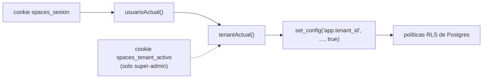

# Multi-tenancy y RLS

> [!danger] ZONA ROJA — el aislamiento entre organizaciones
> Un error aquí no da error: **devuelve datos de otra empresa, o cero filas en
> silencio**. Los dos modos de fallo son igual de graves.

## Cómo se resuelve el tenant

**No es por subdominio ni por cabecera.** Sale de la sesión.



`lib/server/tenant.ts:22-41`. El override por cookie solo lo admite el **Dueño
del tenant de plataforma** (el `tenants` más antiguo, `tenant.ts:26-29`), y
además se verifica que el tenant destino exista.

## Las cuatro puertas a la base

`lib/server/db.ts` — elegir mal es el error más común de este repo.

| Función | Fija `app.tenant_id` | Cuándo usarla |
|---|---|---|
| `q()` / `q1()` | Sí, del tenant de la sesión | **Por defecto.** Todo lo normal |
| `qRaw()` / `qRaw1()` | **No** | Solo bootstrap: `tenants`, `sesiones`, `password_resets`, funciones `auth_*` |
| `qConTenant(id, …)` | Sí, explícito | Hay tenant pero aún no hay sesión: signup, reset, desbloqueo |
| `withTenantTx(fn)` | Sí, del de la sesión | Varias sentencias atómicas |
| `fijarTenantExplicito(client,id)` | Sí, explícito | Rutas públicas por token y el cron |

Siempre **transaction-local** (`set_config(..., true)`). Nunca de sesión: el pool
reutiliza conexiones entre tenants y un GUC de sesión filtraría datos
(`db.ts:12-15`).

> [!bug] El modo de fallo que ya costó un despliegue entero
> Usar `qRaw` sobre una tabla fail-closed devuelve **cero filas**, no un error.
> Pasó en `desbloquear()` (commit `43f9284`): todo desbloqueo contestaba «tu
> usuario no tiene contraseña» y el restablecimiento quedó inservible. Volvió a
> pasar en `fijarExigirReautenticacion()`, donde un `update` quedó en no-op
> silencioso (`cambios.ts:115-123`). Las unitarias no lo ven porque simulan la
> base: **lo caza la integración**.

## Las dos generaciones de política RLS

`db/schema.sql:600-624` crea las políticas **permisivas** (la versión vieja):

```sql
using (tenant_id = nullif(current_setting('app.tenant_id', true),'')::uuid
       or nullif(current_setting('app.tenant_id', true),'') is null)
with check (true)
```

Las migraciones las **endurecen** a fail-closed:

```sql
using      (tenant_id = nullif(current_setting('app.tenant_id', true),'')::uuid)
with check (tenant_id = nullif(current_setting('app.tenant_id', true),'')::uuid)
```

> [!warning] `db/schema.sql` por sí solo NO es seguro
> Aplicar solo el esquema deja el aislamiento en modo permisivo. **Hay que
> aplicar también las migraciones** — en particular
> `20260715_arr_m5_rls_failclosed.sql`, `20260720_hard1_rls_todas_tablas.sql` y
> `20260720_hard1_usuarios_rls.sql`. Ver [[migraciones]].

## Tablas con RLS fail-closed + FORCE

`20260720_hard1_rls_todas_tablas.sql`: `acciones`, `campanas`, `clientes`,
`cobranzas`, `creatividades`, `evidencias_ot`, `facturas`, `incidencias`,
`notificaciones`, `ordenes_compra`, `ordenes_impresion`, `ordenes_trabajo`,
`propuesta_items`, `propuestas`, `reservas`, `sitio_modalidades`.

Más `usuarios` (`20260720_hard1_usuarios_rls.sql`), `config_negocio`
(`db/schema.sql:646-651`), `identidades_externas`
(`20260806_identidades_externas.sql`) y `password_resets`
(`20260807_password_resets_rls.sql`, del 07/08).

### Exentas a propósito (bootstrap)
`tenants`, `sesiones`, `rol_permisos`, `folios_consecutivos`. Se resuelven antes
de que exista tenant, o son globales por diseño.

> [!note] `password_resets` dejó de estar exenta el 07/08
> Commit `f703c1c`: *«el invariante vuelve a cumplirse»*. Queda una parte
> pendiente para el 10/08 (`ba8cb12`) — ver [[preguntas-abiertas]].

## Las dos capas

1. **RLS de Postgres** — la política del motor.
2. **Filtro explícito en la aplicación** — toda operación por `id` lleva además
   `and tenant_id = $n` (`usuarios-repo.ts:11-15`). Redundante a propósito: *«si
   algún día la app conectara con un rol BYPASSRLS, esto sigue aislando»*.

## El candado del rol de base de datos

`20260720_hard1_usuarios_rls.sql` termina con un `ASSERT` que **hace fallar la
migración** si el rol de la app tiene `rolsuper` o `rolbypassrls`. En producción
la app conecta con un rol `NOBYPASSRLS`; en las pruebas, `spaces_app`
(`apps/web/lib/test/db-e2e.ts`).

> [!bug] Comentario obsoleto que induce a error
> `lib/server/tenant.ts:12-15` dice *«la conexión sigue siendo superuser, así que
> RLS no aplica»*. **Eso ya no es cierto** desde Hardening 1. Si te guías por ese
> comentario, escribirás código inseguro.

## Rutas públicas: el tenant sale del token

Sin sesión no hay tenant que sacar de la cookie. Dos funciones lo resuelven en
Postgres a partir del token del enlace, para que el id nunca venga del cliente:
`portal_tenant_por_token()` y `propuesta_tenant_por_token()`
(`20260720_hard1_rls_todas_tablas.sql`).

## Qué es cada organización en producción

Sin esto, los datos de producción se leen mal — y ya pasó: el «pendiente» de
INC-02 se contabilizó como incidencia operativa cuando era de un tenant de
pruebas.

| Slug | Qué es | Evidencia |
|---|---|---|
| `rgb` | **Tenant de plataforma** (el más antiguo). Su Dueño es el único que puede cambiar de CRM. **Está vacío**: cero campañas, reservas y creativos | `tenant.ts:26-29`; `DESPLIEGUE_20260810_INC02.txt:11` |
| `g500` | La organización de la demo, nombre comercial `PIXELED`. Es la que tiene datos de negocio | `docs/datos/20260810_inc05_residuos_demo_g500.sql` |
| `eyro` | **Perfil de PRUEBAS del usuario** (confirmado el 10/08). Sus campañas, pantallas y usuarios existen para ensayar, no para operar | Indicación directa del usuario |

> [!important] Lo que hay en `eyro` NO es deuda operativa
> Las 2 pantallas sin creativo asignado que INC-02 dejó como pendiente son de
> `eyro`. Son **datos de prueba**, no un cliente esperando. Reclasificado el
> 10/08 — antes figuraba como pendiente real en el tablero y en la bitácora.

> [!danger] Pero `eyro` publica de verdad
> `DOOHMAIN_PUBLISH_ENABLED=1` en producción, y hay folios reales
> (`EYRO20260709622` en `docs/doohmain-integracion-diseno.md:69`). Que el tenant
> sea de pruebas **no** hace de juguete lo que sale por él: lo publicado llegó a
> DOOHmain. Borrar filas de la base **no retira nada de las pantallas** — eso lo
> decide el SDK, no el `delete`. Ver [[integraciones-externas]].

> [!note] El super-admin no ve los otros tenants, y eso confunde
> `jose.lopez@h3dm.com.mx` es Dueño de `rgb`. Con la RLS **no ve** las campañas
> de `eyro` ni las de `g500`, y como `rgb` está vacío, la aplicación le sale en
> blanco. No es un fallo: es el aislamiento funcionando. Para mirar otra
> organización hay que entrar con un usuario suyo, o usar el cambio de CRM.

## Borrar una organización entera: lo que hay que saber

Escrito al preparar el reinicio de `eyro`
(`docs/datos/20260810_reset_tenant_eyro.sql`). Sirve para cualquier tenant.

**El orden lo dictan 13 claves foráneas con `RESTRICT`** —`facturas→campanas`,
`reservas→sitios`, `sitios→predios`, `predios→arrendadores`,
`contratos→arrendadores|predios|sitios`, `propuesta_items→sitios`,
`campanas|facturas→clientes`—. Con el orden mal, el borrado revienta a mitad y
deja la organización **medio vacía**. Hijos primero, siempre.

`clientes.agencia_id` y `propuestas.agencia_id` se autorreferencian con
`NO ACTION`: se comprueban al final de la sentencia, así que un único `DELETE`
por tabla funciona aunque una agencia sea cliente de otra.

> [!danger] Tres cosas que un `DELETE` NO deshace
> **1 · Lo publicado en DOOHmain sigue en las pantallas.** Borrar filas no retira
> nada: eso lo decide el SDK. Y al borrar las campañas se pierde el rastro de
> *qué* se publicó, así que después ya no se sabe qué hay que retirar. Retira
> **antes**, por el flujo normal.
>
> **2 · La bitácora no se puede borrar.** El trigger `acciones_append_only`
> rechaza `DELETE` **incluso para el superusuario**
> (`20260629_bitacora_append_only.sql`). Las únicas salidas serían `TRUNCATE`
> —que se lleva la de **todas** las organizaciones— o tirar el trigger, que es
> justo la garantía que le da valor. Sus filas quedan huérfanas de tenant:
> invisibles por RLS e inertes. **Se aceptan.**
>
> **3 · Los folios no se devuelven.** `folios_consecutivos` es global y sin
> `tenant_id`. Correcto: reemitir folios ya usados sería peor que saltárselos.

> [!warning] El correo del nuevo Dueño es único GLOBAL
> `usuarios_email_lower_uidx` no lleva `tenant_id`. Si al recrear usas un correo
> que pertenece a otra organización, **la recreación falla después de haber
> borrado todo**. El script lo comprueba **antes** de tocar nada y nombra la
> organización culpable. Lo cazó el ensayo: `emistreg@gmail.com` resultó ser de
> `emis-pruebas`, no de `eyro`.

> [!tip] `psql` no interpola variables dentro de `$$ … $$`
> `:'var'` se sustituye en el lexer, que **se salta** el texto entre comillas de
> dólar. Dentro de un `do $$ … $$` llega el literal y el bloque muere con
> `syntax error at or near ":"`. Se pasan por una tabla temporal.

## Deriva conocida de datos

**23 tablas** (no 21: contadas una a una en `db/schema.sql:604-609`) nacen con un
`DEFAULT` de `tenant_id` apuntando al tenant `rgb` (`db/schema.sql:615`). Ese
default es lo que ha etiquetado como RGB filas de otras organizaciones cuando
alguien olvidó fijar el tenant. `config_negocio` se dejó **sin default a
propósito** para que un insert sin tenant falle (`db/schema.sql:630-633`).

> [!important] La migración que lo retira ya existe — pero NO está aplicada en producción
> `db/migrations/20260812_sin_default_tenant.sql` (F1.2) quita el default de las
> 23, recorriendo el **catálogo** y no una lista escrita a mano. A partir de ella
> un insert sin `tenant_id` falla con **23502** en vez de nacer atribuido a RGB
> en silencio — que es el modo de fallo de R2: no da error.
>
> `db/schema.sql` **no se toca**: sigue creando el default y la migración lo
> retira después, que es exactamente cómo se comporta una instalación nueva.
> Así que cualquier base levantada desde el repo ya sale sin default; **la de
> producción no**, hasta que se aplique (F1.5, la corre una persona).
>
> Lo cubre `apps/web/lib/test/tenant-sin-default.e2e.test.ts`, que además
> comprueba por catálogo que no reaparezca ninguno.

## Relacionadas
[[autenticacion-y-sesion]] · [[esquema]] · [[migraciones]] ·
[[infraestructura-servidor]] · [[zonas-de-riesgo]] · [[MOC-Proyecto]]
