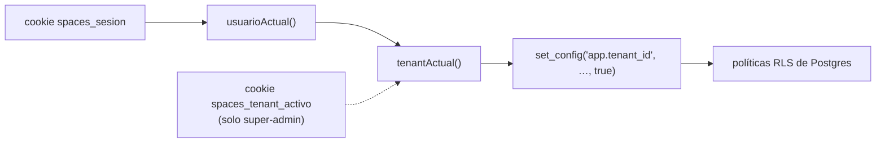

# Multi-tenancy y RLS

> [!danger] ZONA ROJA — el aislamiento entre organizaciones
> Un error aquí no da error: **devuelve datos de otra empresa, o cero filas en
> silencio**. Los dos modos de fallo son igual de graves.

> [!important] 2026-08-26 · El marco cambió: la RLS ya NO es el aislamiento entre owners
> **Cada owner corre su propia instancia**: su droplet, su base y su dominio
> ([ADR 0022](../../docs/adr/0022-instancia-dedicada-por-owner.md),
> [[modelo-instancias-soberanas]]).
> El aislamiento entre owners **es físico** — procesos, bases y máquinas
> distintas—, no una política de fila.
>
> **Lo que la RLS es hoy, y sigue siendo obligatorio:**
> 1. **Defensa en profundidad dentro de una instancia.** Es la segunda capa
>    detrás del `and tenant_id = $n` de cada consulta, y la que convierte un
>    olvido en cero filas en vez de en una fuga.
> 2. **La puerta a que un owner tenga varias unidades de negocio** dentro de su
>    propia instancia. Ese es el caso de uso que queda vivo para el multi-tenant.
>
> **Lo que NO cambia, y por eso el resto de esta nota sigue valiendo entero:**
> el tenant se sigue resolviendo desde la sesión, `qRaw` sigue siendo el error
> más caro del repo, las políticas siguen `fail-closed` con `FORCE`, y todo lo
> que toque tenant o sesión sigue necesitando
> `cd apps/web && npm run test:e2e` — las unitarias simulan la base y no ven
> estos fallos.
>
> **Lo que sí queda obsoleto:** cualquier lectura de esta nota como «así se
> separa a un cliente de otro **entre empresas**». Entre owners no hay nada que
> separar por software.

## Cómo se resuelve el tenant

**No es por subdominio ni por cabecera.** Sale de la sesión.


```mermaid
flowchart LR
    C["cookie spaces_sesion"] --> U["usuarioActual()"]
    U --> T["tenantActual()"]
    OV["cookie spaces_tenant_activo<br/>(solo super-admin)"] -.-> T
    T --> G["set_config('app.tenant_id', …, true)"]
    G --> RLS["políticas RLS de Postgres"]
```

`lib/server/tenant.ts:32-42` (`tenantActual`). El override por cookie solo lo
admite el **Dueño del tenant de plataforma** (el `tenants` más antiguo,
`tenant.ts:27-30`), y además se verifica que el tenant destino exista
(`tenant.ts:37-40`).

## Las siete puertas a la base

`lib/server/db.ts` — elegir mal es el error más común de este repo.

> Hasta el 05/10 este apartado se titulaba «Las cuatro puertas» y su tabla
> listaba cinco. Faltaban `fijarTenant` y `withTxBootstrap` (F5.1, 26/08), y la
> fila de `qRaw` citaba `password_resets` como uso legítimo cuando es
> fail-closed desde el 07/08: se lee por `auth_reset_por_token()`.

| Función | Fija `app.tenant_id` | Cuándo usarla |
|---|---|---|
| `q()` / `q1()` (`db.ts:74-93`) | Sí, del tenant de la sesión | **Por defecto.** Todo lo normal |
| `qRaw()` / `qRaw1()` (`db.ts:64-71`) | **No** | Solo lo que no tiene RLS (`tenants`, `sesiones`, `rol_permisos`, `schema_migrations`), las funciones SECURITY DEFINER (`auth_*`, `*_tenant_por_token`) y el panel de `tickets` (ver abajo) |
| `qConTenant(id, …)` (`db.ts:100-118`) | Sí, explícito | Hay tenant pero aún no hay sesión: signup, reset, desbloqueo |
| `withTenantTx(fn)` (`db.ts:165-180`) | Sí, del de la sesión | Varias sentencias atómicas |
| `fijarTenant(client)` (`db.ts:59-61`) | Sí, del de la sesión | Transacción explícita con `pool.connect()` + `begin` propios (`campanas-repo`, `arrendadores-repo`). Va **después** del `begin`: fuera de transacción el GUC local muere en la misma sentencia |
| `fijarTenantExplicito(client,id)` (`db.ts:124-126`) | Sí, explícito | Rutas públicas por token y el cron |
| `withTxBootstrap(fn)` (`db.ts:143-161`) | **No al empezar**; lo fija `ctx.fijarTenant(id)` a mitad | Altas: el `INSERT` de `tenants` (sin RLS) y el del Dueño (fail-closed) en UNA transacción, para que un fallo del segundo deshaga el primero (`cuentas-controller.ts:74`) |

Siempre **transaction-local** (`set_config(..., true)`). Nunca de sesión: el pool
reutiliza conexiones entre tenants y un GUC de sesión filtraría datos
(`db.ts:12-15`).

> [!bug] El modo de fallo que ya costó un despliegue entero
> Usar `qRaw` sobre una tabla fail-closed devuelve **cero filas**, no un error.
> Pasó en `desbloquear()` (commit `43f9284`): todo desbloqueo contestaba «tu
> usuario no tiene contraseña» y el restablecimiento quedó inservible. Volvió a
> pasar en `fijarExigirReautenticacion()`, donde un `update` quedó en no-op
> silencioso (`cambios.ts:149-163`). Las unitarias no lo ven porque simulan la
> base: **lo caza la integración**.

## Las dos generaciones de política RLS

`db/schema.sql:636-639` —dentro del bucle `do $$` de `:613-641`— crea las políticas
**permisivas** (la versión vieja):

```sql
using (tenant_id = nullif(current_setting('app.tenant_id', true),'')::uuid
       or nullif(current_setting('app.tenant_id', true),'') is null)
with check (true)
```

Las migraciones las **endurecen** a fail-closed:

```sql
using      (tenant_id = nullif(current_setting('app.tenant_id', true),'')::uuid)
with check (tenant_id = nullif(current_setting('app.tenant_id', true),'')::uuid)
```

> [!warning] `db/schema.sql` por sí solo NO es seguro
> Aplicar solo el esquema deja el aislamiento en modo permisivo. **Hay que
> aplicar también las migraciones** — en particular
> `20260715_arr_m5_rls_failclosed.sql`, `20260720_hard1_rls_todas_tablas.sql` y
> `20260720_hard1_usuarios_rls.sql`. Ver [[migraciones]].

## Tablas con RLS fail-closed + FORCE

`20260720_hard1_rls_todas_tablas.sql`: `acciones`, `campanas`, `clientes`,
`cobranzas`, `creatividades`, `evidencias_ot`, `facturas`, `incidencias`,
`notificaciones`, `ordenes_compra`, `ordenes_impresion`, `ordenes_trabajo`,
`propuesta_items`, `propuestas`, `reservas`, `sitio_modalidades`.

Más `usuarios` (`20260720_hard1_usuarios_rls.sql`), `config_negocio`
(`db/schema.sql:669-674`), `identidades_externas`
(`20260806_identidades_externas.sql`) y `password_resets`
(`20260807_password_resets_rls.sql`, del 07/08).

### Exentas a propósito (bootstrap)
`tenants`, `sesiones`, `rol_permisos`, `folios_consecutivos`. Se resuelven antes
de que exista tenant, o son globales por diseño. Comprobado el 05/10: ninguna
de las cuatro aparece en un `enable row level security` de `db/schema.sql` ni
de `db/migrations/`.

> [!warning] `usuarios` NO está exenta, aunque tres comentarios lo dijeran
> Hasta el 05/10, `tenant.ts:5-6`, `auth.ts:5-7` y `db.ts:17-19` la daban por
> exenta. Es **fail-closed + FORCE** desde `20260720_hard1_usuarios_rls.sql:136-141`.
> El código funciona porque las lecturas previas a la sesión van por funciones
> SECURITY DEFINER acotadas a una fila —`auth_usuario_por_email`,
> `auth_usuario_por_sesion`, `auth_email_existe`, `auth_usuario_por_identidad`—,
> no porque la tabla esté abierta. Un `qRaw` directo sobre `usuarios` devuelve
> **cero filas sin error**: es el fallo de `desbloquear()` y de
> `fijarExigirReautenticacion()`.

### La excepción fail-OPEN: `tickets` (ADR 0038)

`tickets` tiene RLS + FORCE, pero su política es la **permisiva**, no la
fail-closed (`db/migrations/20260923_tickets.sql:37-40`):

```sql
using (tenant_id = nullif(current_setting('app.tenant_id', true),'')::uuid
       or nullif(current_setting('app.tenant_id', true),'') is null)
with check (true)
```

**Es a propósito, y es la única tabla de negocio así.** El panel de flota del
PADRE pide los tickets de la instancia con `FLOTA_TOKEN`, sin sesión ni
tenant, y tiene que verlos **todos**: `listarTicketsDeLaInstancia()` y
`actualizarTicketDesdePanel()` van por `qRaw` (`tickets-repo.ts:120-145`). Con
el GUC vacío, la rama `or … is null` deja pasar todo; con política fail-closed
devolverían cero filas en silencio. El ADR lo dice así
(`docs/adr/0038-los-tickets-de-soporte-viven-en-la-instancia.md:165-170`):
*«El GET con token de flota atraviesa todos los tenants de la instancia, y eso
es `qRaw` deliberado. Es la zona roja R2 […] Por eso va con dos pruebas e2e
emparejadas y no una: que la ruta del cliente aísla, y que la del panel
atraviesa.»*

> [!danger] Lo que esto implica, y no lo dice el ADR
> - El aislamiento del lado del cliente lo da **solo** que `q()` fije el GUC:
>   cualquier `qRaw` sobre `tickets` desde una ruta de cliente ve los de todas
>   las organizaciones. Es exactamente el modo de fallo R2, con el signo «fuga»
>   en vez de «cero filas».
> - `with check (true)`: la base **no** impide insertar un ticket con el
>   `tenant_id` de otra organización. Lo impide `crearTicket()`, que toma el
>   tenant de la sesión.
> - No copies esta política a una tabla nueva: es la excepción documentada, no
>   la plantilla.

> [!note] `password_resets` dejó de estar exenta el 07/08
> Commit `f703c1c`: *«el invariante vuelve a cumplirse»*. Queda una parte
> pendiente para el 10/08 (`ba8cb12`) — ver [[preguntas-abiertas]].

## Las dos capas

1. **RLS de Postgres** — la política del motor.
2. **Filtro explícito en la aplicación** — toda operación por `id` lleva además
   `and tenant_id = $n` (`usuarios-repo.ts:13-17`). Redundante a propósito: *«si
   algún día la app conectara con un rol BYPASSRLS, esto sigue aislando»*.

## El candado del rol de base de datos

`20260720_hard1_usuarios_rls.sql` termina con un `ASSERT` que **hace fallar la
migración** si el rol de la app tiene `rolsuper` o `rolbypassrls`
(`:146-157`, el `raise` en `:155`). En producción la app conecta con un rol
`NOBYPASSRLS`; en las pruebas, `spaces_app` (`apps/web/lib/test/db-e2e.ts`).

> [!bug] Comentario obsoleto que inducía a error — CORREGIDO el 2026-10-05
> `lib/server/tenant.ts:13-15` decía *«la conexión sigue siendo superuser, así que
> RLS no aplica»*, y `tenant.ts:5-6`, `auth.ts:5-7` y `db.ts:17-19` daban
> `usuarios` por exenta. **Ninguna de las dos cosas era cierta** desde
> Hardening 1, y guiarse por ellas lleva a escribir un `qRaw` que devuelve cero
> filas. Rama `docs/rls-comentarios-y-tickets`: se reescribieron conservando el
> número de líneas de cada archivo, para no mover las citas de otras notas.

## Rutas públicas: el tenant sale del token

Sin sesión no hay tenant que sacar de la cookie. Dos funciones lo resuelven en
Postgres a partir del token del enlace, para que el id nunca venga del cliente:
`portal_tenant_por_token()` y `propuesta_tenant_por_token()`
(`20260720_hard1_rls_todas_tablas.sql`).

## Qué es cada organización en producción

Sin esto, los datos de producción se leen mal — y ya pasó: el «pendiente» de
INC-02 se contabilizó como incidencia operativa cuando era de un tenant de
pruebas.

| Slug | Qué es | Evidencia |
|---|---|---|
| `rgb` | **Tenant de plataforma** (el más antiguo). Su Dueño es el único que puede cambiar de CRM. **Está vacío**: cero campañas, reservas y creativos | `tenant.ts:27-30`; `DESPLIEGUE_20260810_INC02.txt:11` |
| `g500` | La organización de la demo, nombre comercial `PIXELED`. Es la que tiene datos de negocio | `docs/datos/20260810_inc05_residuos_demo_g500.sql` |
| `eyro` | **Perfil de PRUEBAS del usuario** (confirmado el 10/08). Sus campañas, pantallas y usuarios existen para ensayar, no para operar | Indicación directa del usuario |

> [!important] Lo que hay en `eyro` NO es deuda operativa
> Las 2 pantallas sin creativo asignado que INC-02 dejó como pendiente son de
> `eyro`. Son **datos de prueba**, no un cliente esperando. Reclasificado el
> 10/08 — antes figuraba como pendiente real en el tablero y en la bitácora.

> [!danger] Pero `eyro` publica de verdad
> `DOOHMAIN_PUBLISH_ENABLED=1` en producción, y hay folios reales
> (`EYRO20260709622` en `docs/doohmain-integracion-diseno.md:69`). Que el tenant
> sea de pruebas **no** hace de juguete lo que sale por él: lo publicado llegó a
> DOOHmain. Borrar filas de la base **no retira nada de las pantallas** — eso lo
> decide el SDK, no el `delete`. Ver [[integraciones-externas]].

> [!note] El super-admin no ve los otros tenants, y eso confunde
> `jose.lopez@h3dm.com.mx` es Dueño de `rgb`. Con la RLS **no ve** las campañas
> de `eyro` ni las de `g500`, y como `rgb` está vacío, la aplicación le sale en
> blanco. No es un fallo: es el aislamiento funcionando. Para mirar otra
> organización hay que entrar con un usuario suyo, o usar el cambio de CRM.

## Borrar una organización entera: lo que hay que saber

Escrito al preparar el reinicio de `eyro`
(`docs/datos/20260810_reset_tenant_eyro.sql`). Sirve para cualquier tenant.

**El orden lo dictan 13 claves foráneas con `RESTRICT`** —`facturas→campanas`,
`reservas→sitios`, `sitios→predios`, `predios→arrendadores`,
`contratos→arrendadores|predios|sitios`, `propuesta_items→sitios`,
`campanas|facturas→clientes`—. Con el orden mal, el borrado revienta a mitad y
deja la organización **medio vacía**. Hijos primero, siempre.

`clientes.agencia_id` y `propuestas.agencia_id` se autorreferencian con
`NO ACTION`: se comprueban al final de la sentencia, así que un único `DELETE`
por tabla funciona aunque una agencia sea cliente de otra.

> [!danger] Tres cosas que un `DELETE` NO deshace
> **1 · Lo publicado en DOOHmain sigue en las pantallas.** Borrar filas no retira
> nada: eso lo decide el SDK. Y al borrar las campañas se pierde el rastro de
> *qué* se publicó, así que después ya no se sabe qué hay que retirar. Retira
> **antes**, por el flujo normal.
>
> **2 · La bitácora no se puede borrar.** El trigger `acciones_append_only`
> rechaza `DELETE` **incluso para el superusuario**
> (`20260629_bitacora_append_only.sql`). Las únicas salidas serían `TRUNCATE`
> —que se lleva la de **todas** las organizaciones— o tirar el trigger, que es
> justo la garantía que le da valor. Sus filas quedan huérfanas de tenant:
> invisibles por RLS e inertes. **Se aceptan.**
>
> **3 · Los folios no se devuelven.** `folios_consecutivos` es global y sin
> `tenant_id`. Correcto: reemitir folios ya usados sería peor que saltárselos.

> [!warning] El correo del nuevo Dueño es único GLOBAL
> `usuarios_email_lower_uidx` no lleva `tenant_id`. Si al recrear usas un correo
> que pertenece a otra organización, **la recreación falla después de haber
> borrado todo**. El script lo comprueba **antes** de tocar nada y nombra la
> organización culpable. Lo cazó el ensayo: `emistreg@gmail.com` resultó ser de
> `emis-pruebas`, no de `eyro`.

> [!tip] `psql` no interpola variables dentro de `$$ … $$`
> `:'var'` se sustituye en el lexer, que **se salta** el texto entre comillas de
> dólar. Dentro de un `do $$ … $$` llega el literal y el bloque muere con
> `syntax error at or near ":"`. Se pasan por una tabla temporal.

## Deriva conocida de datos

**23 tablas** —no 21: son las del array de `db/schema.sql:617-621`— **nacieron
hasta el 2026-08-19** con un `DEFAULT` de `tenant_id` apuntando al tenant `rgb`.
Ese default es lo que ha etiquetado como RGB filas de otras organizaciones cuando
alguien olvidó fijar el tenant, y es la causa de la deriva conocida.
`config_negocio` se dejó **sin default a propósito** desde el principio, para que
un insert sin tenant falle (`db/schema.sql:647-650`).

> [!important] Ya NO nacen con él — `db/schema.sql` dejó de ponerlo el 2026-08-19
> **Esta nota afirmaba lo contrario hasta esa fecha**, y con estas palabras:
> «`db/schema.sql` **no se toca**: sigue creando el default y la migración lo
> retira después». Se tocó, en `9d609f0`, con la excepción a la convención
> declarada en el propio commit: el esquema dejó de sembrar el tenant `rgb`
> (`db/schema.sql:598-611`) y con el seed se fue el `select id into def … where
> slug='rgb'` que era lo único que alimentaba esos `DEFAULT`.
>
> El bucle de `db/schema.sql:631-640` sigue poniendo `not null`, RLS y política a
> las 23 tablas, pero **ningún `DEFAULT`**. Medido: sobre una base levantada desde
> el repo el catálogo devuelve **cero** columnas `tenant_id` con default — lo fija
> `apps/web/lib/test/tenant-sin-default.e2e.test.ts:66-78`, que lo pregunta a
> `pg_attrdef` y no a una lista escrita a mano.
>
> Consecuencia práctica: **en una instancia recién nacida, un insert sin
> `tenant_id` truena con 23502 desde el primer día**, sin esperar a ninguna
> migración.

> [!important] La migración que lo retira sigue haciendo falta — y NO está aplicada en producción
> `db/migrations/20260812_sin_default_tenant.sql` (F1.2) quita el default de las
> 23, recorriendo el **catálogo** y no una lista escrita a mano. Sirve para las
> bases que **ya** lo tienen: producción y cualquier base levantada desde el repo
> **antes** del 19/08. Aplicarla al droplet es **F1.5, y la corre una persona**;
> hasta entonces producción sigue etiquetando en silencio, que es el modo de fallo
> de R2: no da error.
>
> Sobre una base nueva no tiene ya nada que quitar, así que sus pruebas habrían
> pasado **sin ejercitarla**. Por eso `tenant-sin-default.e2e.test.ts:89` le
> devuelve el `DEFAULT` a una tabla a mano —el estado del droplet— y comprueba que
> la migración se lo quita de verdad.

## Relacionadas
[[autenticacion-y-sesion]] · [[esquema]] · [[migraciones]] ·
[[infraestructura-servidor]] · [[zonas-de-riesgo]] · [[MOC-Proyecto]]
