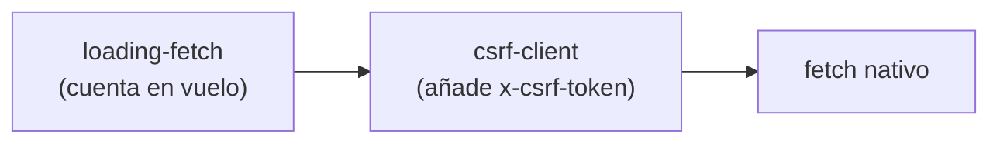

# Estado y data fetching

## Tres mecanismos conviviendo

| Mecanismo | Para qué | Dónde |
|---|---|---|
| **React Query** | Cache de servidor, `staleTime` 60 s, `retry` 1 | `app/providers.tsx:20-30` |
| **zustand** | Estado en memoria del shell (`DemoState`) | `lib/data/store.ts` |
| **Context** | Sesión (`SesionContext`) | `components/demo/shell/SesionContext.tsx` |

> [!note] El QueryClient se crea **por instancia de componente**
> `providers.tsx:18-20` lo explica: un singleton compartiría la caché entre
> renders de servidor de usuarios distintos y filtraría datos ajenos.

## El store de zustand es herencia de la demo

`lib/data/store.ts:1-12` — guarda el `DemoState` completo, es la única fuente en
memoria, y las pantallas **no lo tocan directo**: pasan por `client.ts` →
`adapters/mock.ts`. Sin persistencia: un refresh lo reinicia al seed.

`HidratarSitios` (en el shell) es lo que lo rellena con datos reales del BFF.

> [!warning] Es la costura entre la demo original y el producto real
> Coexisten el store en memoria y las llamadas al BFF. Si añades una pantalla,
> decide de cuál de los dos lees y no mezcles. Ver [[preguntas-abiertas]].

## Los dos parches de `window.fetch`

Se instalan una sola vez, en orden, en `providers.tsx:13-16`:

| Parche | Qué hace | Alcance |
|---|---|---|
| `csrf-client.ts` | Añade `x-csrf-token` desde la cookie `spaces_csrf` | Mutaciones **same-origin** |
| `loading-fetch.ts` | Cuenta peticiones en vuelo para `<IndicadorCarga>` | Mutaciones **same-origin** |

Ninguno toca `GET`/`HEAD` ni cross-origin. Son idempotentes.

> [!danger] Por qué se parchea `fetch` en vez de tocar cada llamada
> `csrf-client.ts:6-13`: las llamadas al BFF están repartidas en muchos
> `*-api.ts` **sin un chokepoint único**. El parche es la forma de garantizar que
> ninguna mutación se olvide del header. **Si quitas el parche, todas las
> mutaciones empiezan a dar 403.**

## Lo que el indicador de carga NO cubre

Solo cuenta **peticiones al servidor**. Subir un logo son tres esperas y solo la
última es una petición (leer el archivo, comprobar que se puede mostrar,
enviarlo). Por eso los puntos de subida tienen su propio aviso local
(`docs/Registro_Cambios.md`, entrada del 06/08).

## La hidratación viaja LIGERA — y hay una prueba que lo exige

`/api/estado` llegó a pesar **6.12 MB** y a tardar 6–12 s en frío, dejando la
pantalla en blanco en cada F5. No eran las consultas —la más pesada tarda
0.077 ms— sino `select *` arrastrando columnas con archivos dentro.

| Rebanada | Pesaba | Por qué |
|---|---|---|
| `contratos` | 3.95 MB / 13 filas | `documento_url`, el PDF en data URL |
| `sitios` | 1.0 MB / 12 filas | `fotos` (`text[]` de data URLs) |
| `sitiosRed` | 1.0 MB / 12 filas | **las mismas filas otra vez** |

> [!danger] REGLA: nada que se guarde como `data:` URL entra en `/api/estado`
> Se sirve por su propia ruta y se pide al abrir la pantalla que lo enseña:
> `/api/logo/[token]`, `/api/creativos/[id]/arte`,
> `/api/contratos/[id]/documento`, `/api/sitios/[id]/media`.
>
> Ha pasado **tres veces** (arte de creativos el 06/08; documento y fotos el
> 10/08), así que está fijado con una prueba:
> `lib/test/hidratacion-ligera.e2e.test.ts` rechaza cualquier `data:` de más de
> 200 bytes en **toda** la hidratación — también en rebanadas que aún no
> existen. Si añades una columna grande a un listado, ahí se cae.

Para vigilarlo: `MEDIR_ESTADO=1` imprime kB por rebanada. Va detrás de bandera
porque medir es serializar el cuerpo una segunda vez, en la ruta que se quería
abaratar.

**Los listados mienten un poco, a propósito**: `sitio.fotos` llega `[]` e
`imagenPromocional` `null` aunque la pantalla tenga galería. Por eso existe
`sitio.tieneFotos` — sin él, «no tiene fotos» y «aún no las he pedido» se verían
igual, y la ficha pediría la galería de todas.

## Clientes de API

| Archivo | Para qué |
|---|---|
| `lib/auth-real.ts` | `/api/auth/*` — `useSesion()`, login, logout. **El cliente real** |
| `lib/api-client.ts` | Helper genérico |
| `lib/portal-cliente-api.ts` | Portal público |
| `lib/data/estado-api.ts` | `refrescarEstado()` desde `/api/estado` |

Todas las rutas llevan **barra final** por `trailingSlash: true`
(`auth-real.ts:8-12`).

> [!danger] `lib/auth-context.tsx` NO es esto
> Es el cliente JWT muerto contra el backend archivado, y sigue montado en
> `providers.tsx:34`. Ver [[vision-general]].

## Formularios y validación

`react-hook-form` + `@hookform/resolvers` + `zod`. El mismo `zod` valida en el
servidor ([[infraestructura-servidor]]), pero **son esquemas distintos**: la
validación de cliente no sustituye a la de servidor.

## Relacionadas
[[shell-y-navegacion]] · [[03-Frontend/_indice|Índice de Frontend]] ·
[[autenticacion-y-sesion]] · [[infraestructura-servidor]] · [[MOC-Proyecto]]
