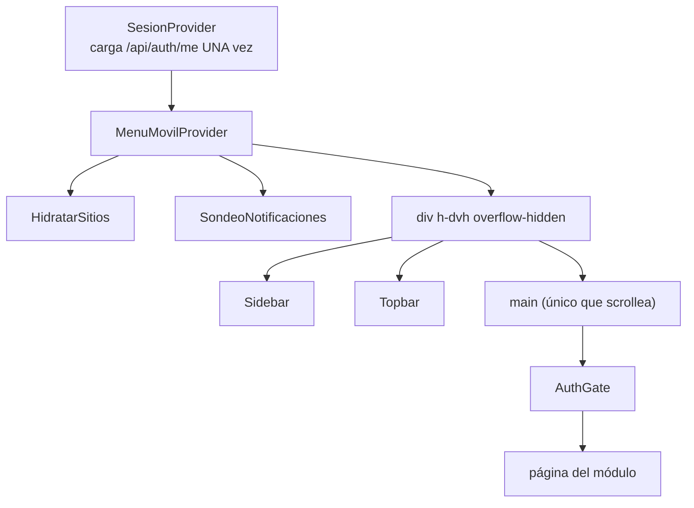

# Shell y navegación

## Composición

`app/(app)/(shell)/layout.tsx`:

`h-dvh` y no `h-screen` a propósito: para que la barra de direcciones móvil no
recorte el pie del menú.

## Las tres capas de control de acceso

| Capa | Qué comprueba | Dónde | Se puede saltar |
|---|---|---|---|
| Middleware | Que **exista** la cookie `spaces_sesion` | `middleware.ts:106` | Sí (cookie falsa) |
| `AuthGate` | Sesión real + rol vs módulo de la ruta | `AuthGate.tsx` | Sí (es cliente) |
| `exigir()` en cada route handler | Sesión válida + permiso | `lib/server/auth.ts` | **No** |

> [!danger] Solo la tercera es seguridad
> Las dos primeras son experiencia de usuario. La autorización real vive en el
> servidor. Ver [[autenticacion-y-sesion]].

## `AuthGate` y el `NAV` compartido

`AuthGate.tsx:14-18` — el control de acceso por ruta usa **el mismo `NAV`** que
pinta el menú (`components/demo/shell/nav.ts`), así ocultar el ítem y bloquear la
ruta nunca se desincronizan. Eso cierra las fugas por enlaces directos, no solo
el menú.

Comportamiento:
- Sin sesión → `/login`
- Rol sin acceso al módulo de la ruta → su *landing* (`landingDeRol`)

> [!warning] `nav.ts` es archivo de alto contacto
> Añadir un módulo toca el menú **y** el control de acceso a la vez. Requiere
> claim exclusivo — ver [[AGENTES]].

## La 404 es la excepción: fuera del shell, pero con el mismo `NAV`

`app/not-found.tsx` es **la única pantalla del producto fuera del grupo `(app)`**.
No la envuelve ningún layout del shell, así que no tiene sidebar, ni topbar, ni
`SesionProvider`. De ahí sus dos rarezas:

1. **Se pone la marca a mano**: importa `(app)/demo.css` y se cuelga la clase
   `.demo-root`. Sin eso sale en tema oscuro y sin logo — es el fallo M4 de la
   auditoría del 04/08.
2. **Necesita su propia navegación** (11/08). Con un solo enlace al inicio, quien
   caía en un enlace roto tenía que volver a la portada y buscar el módulo a
   mano. Ahora pinta una rejilla de nueve atajos.

Los nueve **salen de `NAV`**, igual que el menú y que `AuthGate`. La lista de
claves vive en `lib/atajos-404.ts`; las etiquetas, rutas e iconos no se
reescriben. Misma razón que arriba: una segunda lista con los mismos textos
diverge.

> [!note] Filtra en vez de lanzar, y la prueba paga la diferencia
> Si una clave dejara de existir en `NAV`, `ATAJOS_404` la descarta en silencio.
> Es deliberado: lanzar convertiría la pantalla de error en un 500, justo cuando
> algo ya salió mal. Quien avisa es `lib/atajos-404.test.ts`, que corre en CI —
> ahí el rojo no le cuesta nada a nadie.

**La rejilla no es un agujero de permisos.** Es igual para todos los roles
porque aquí no hay sesión que consultar, pero no abre ninguna puerta: quien pique
un módulo que no le toca lo rebota `AuthGate` a su *landing*, exactamente igual
que si tecleara la ruta.

> [!warning] Sin sesión NO se llega a la 404
> El gate del middleware manda al `/login` cualquier ruta no pública, así que una
> URL inventada sin cookie **nunca** llega aquí. Se comprueba con una ruta
> pública sin página detrás: `/login/lo-que-sea/` sí devuelve 404.

## Sesión compartida

`SesionContext.tsx` carga `/api/auth/me` **una sola vez** y la comparte con
Sidebar, Topbar, AuthGate y las pantallas. `sesion === undefined` significa
*cargando*; `null` significa *sin sesión*. Confundirlos produce un parpadeo al
login.

## Middleware

`apps/web/middleware.ts`, matcher casi total. Hace cuatro cosas en orden:

1. **308 legado**: `/demo` → `/inicio`, `/demo/*` → `/*`
2. **CSRF double-submit** en mutaciones `/api/` con sesión
3. **Ruteo por subdominio**: solo `portal` → `/portal`, y solo fuera de dev
4. **Gate de sesión**: sin cookie → `/login`

Rutas públicas del gate: `/api/*`, `/_next/*`, `/favicon*`, `/login`,
`/recuperar/*`, `/p/*`, `/firmar/*`, `/portal/*`.

> [!note] `BASE_PATH` está duplicado
> `middleware.ts:5` define `'/spaces-dooh'` con un comentario que dice *"Must
> match basePath in next.config.mjs"*. Son dos sitios que hay que cambiar a la
> vez.

## Notificaciones en vivo

`SondeoNotificaciones` sondea `/api/notificaciones/nuevas`. Vive **solo dentro
del shell**: sin sesión no hay a quién avisar y el sondeo pediría por nada.

## Relacionadas
[[03-Frontend/_indice|Índice de Frontend]] · [[estado-y-data-fetching]] ·
[[modulos-internos]] · [[autenticacion-y-sesion]] · [[MOC-Proyecto]]
