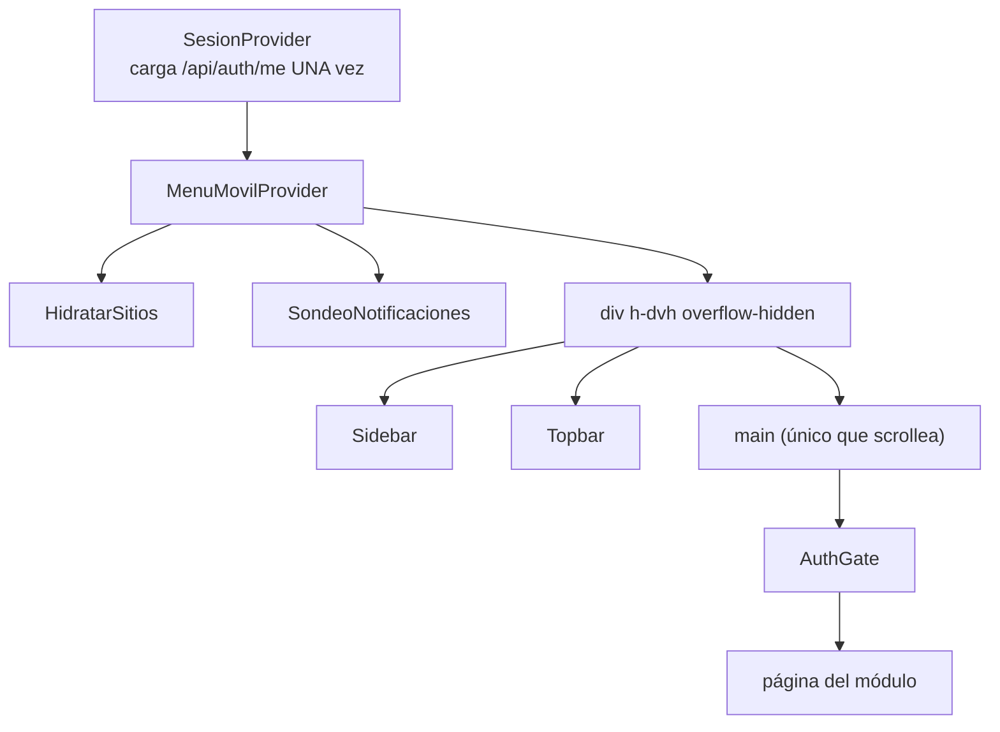

# Shell y navegación

## Composición

`app/(app)/(shell)/layout.tsx`:

`h-dvh` y no `h-screen` a propósito: para que la barra de direcciones móvil no
recorte el pie del menú.

## Las tres capas de control de acceso

| Capa | Qué comprueba | Dónde | Se puede saltar |
|---|---|---|---|
| Middleware | Que **exista** la cookie `spaces_sesion` | `middleware.ts:100` | Sí (cookie falsa) |
| `AuthGate` | Sesión real + rol vs módulo de la ruta | `AuthGate.tsx` | Sí (es cliente) |
| `exigir()` en cada route handler | Sesión válida + permiso | `lib/server/auth.ts` | **No** |

> [!danger] Solo la tercera es seguridad
> Las dos primeras son experiencia de usuario. La autorización real vive en el
> servidor. Ver [[autenticacion-y-sesion]].

## `AuthGate` y el `NAV` compartido

`AuthGate.tsx:14-18` — el control de acceso por ruta usa **el mismo `NAV`** que
pinta el menú (`components/demo/shell/nav.ts`), así ocultar el ítem y bloquear la
ruta nunca se desincronizan. Eso cierra las fugas por enlaces directos, no solo
el menú.

Comportamiento:
- Sin sesión → `/login`
- Rol sin acceso al módulo de la ruta → su *landing* (`landingDeRol`)

> [!warning] `nav.ts` es archivo de alto contacto
> Añadir un módulo toca el menú **y** el control de acceso a la vez. Requiere
> claim exclusivo — ver [[AGENTES]].

### Los grupos del menú, y la trampa de buscarlos por su rótulo

El menú va por **fases del proceso**, declaradas en `GRUPOS` (`nav.ts:79`), y el
orden de ese arreglo **es** el orden en pantalla. Al 2026-09-08:

| Clave (código) | Rótulo (pantalla) | Entradas |
|---|---|---|
| `inicio` | *sin título* | Dashboard |
| `patrimonio` | **Inventario** | Inventario · Arrendadores · Network |
| `vender` | **Comercial** | Clientes · Comercial · Disponibilidad · Propuestas |
| `entregar` | **Operaciones** | Campañas · Creativos · Imprenta · Operaciones · Almacén |
| `cobrar` | **Finanzas** | Finanzas · Comisiones |
| `sistema` | **Sistema** | Integraciones · Actividad · Administración |

> [!warning] La clave NO es el rótulo, y buscar por el rótulo no encuentra nada
> `vender` se pinta **Comercial** y `entregar` se pinta **Operaciones**. Las
> claves se dejan como están a propósito: renombrarlas obligaría a tocar las
> dieciocho entradas para no cambiar nada de lo que se ve. Si buscas el grupo
> «Comercial» en el código, `grep 'Comercial'` te da la ENTRADA, no el grupo.
>
> Los rótulos han cambiado tres veces —`Vender` → `Ventas` (26/08) →
> `Comercial` (08/09), y `Entregar` → `Operaciones` (08/09)—, y las claves
> ninguna. Eso es la señal de que la separación funciona.

**Cuatro grupos se llaman igual que una de sus entradas** (Inventario, Comercial,
Operaciones y Finanzas). Es deliberado: el encabezado nombra la fase, la entrada
es la pantalla principal de esa fase. Un grupo sin ítems visibles no pinta su
título, así que un rol de Operaciones ve dos entradas y no seis encabezados
vacíos.

`nav.test.ts` protege la **estructura**, no los rótulos: que las entradas de un
grupo vayan seguidas, que ningún grupo declarado quede vacío, que el orden en
pantalla sea el de `GRUPOS`, y que Propuestas vaya antes que Campañas y Campañas
antes que Finanzas. Cambiar un rótulo no pone roja ninguna prueba — es un dato
que solo se ve mirando.

## Sesión compartida

`SesionContext.tsx` carga `/api/auth/me` **una sola vez** y la comparte con
Sidebar, Topbar, AuthGate y las pantallas. `sesion === undefined` significa
*cargando*; `null` significa *sin sesión*. Confundirlos produce un parpadeo al
login.

## Middleware

`apps/web/middleware.ts`, matcher casi total. Hace cuatro cosas en orden:

1. **308 legado** (`:29-37`): `/demo` → `/inicio`, `/demo/*` → `/*`
2. **CSRF double-submit** (`:45-69`) en mutaciones `/api/` con sesión
3. **Ruteo por subdominio** (`:71-83`): solo `portal` → `/portal`, y solo fuera de dev
4. **Gate de sesión** (`:99-104`): sin cookie → `/login`

Rutas públicas del gate: `/api/*`, `/_next/*`, `/favicon*`, `/login`,
`/recuperar/*`, `/p/*`, `/firmar/*`, `/portal/*`.

### Quién mira el `Host`

`apps/web/lib/host.ts` — `etiquetaDeHost(host)`, función **pura** y con pruebas
(`host.test.ts`). Es la **única** del sistema que lee el encabezado `Host`, y lo
único que decide es si el rewrite del punto 3 se dispara. **No** resuelve marcas
ni organizaciones, y el host **no entra en la cadena de datos**: el modelo de
subdominios por tenant está descartado ([[modelo-instancias-soberanas]]).

> [!warning] Una IP no es un subdominio (corregido el 13/08)
> La versión anterior contaba puntos (`parts.length >= 3`), así que entrar por la
> IP desnuda del droplet —`209.97.146.136`— daba la etiqueta `'209'` y reescribía
> la ruta. No rompía nada solo porque `209` no está en el `moduleMap`. Ahora se
> descartan IPv4/IPv6 literales, los primeros segmentos numéricos y los hosts sin
> tres etiquetas; `demo.space-os.io` sigue devolviendo `'demo'`, igual que antes.

> [!note] `BASE_PATH` está duplicado
> `middleware.ts:6` define `'/spaces-dooh'` con un comentario que dice *"Must
> match basePath in next.config.mjs"*. Son dos sitios que hay que cambiar a la
> vez.

## Notificaciones en vivo

`SondeoNotificaciones` sondea `/api/notificaciones/nuevas`. Vive **solo dentro
del shell**: sin sesión no hay a quién avisar y el sondeo pediría por nada.

## Relacionadas
[[03-Frontend/_indice|Índice de Frontend]] · [[estado-y-data-fetching]] ·
[[modulos-internos]] · [[autenticacion-y-sesion]] · [[MOC-Proyecto]]
