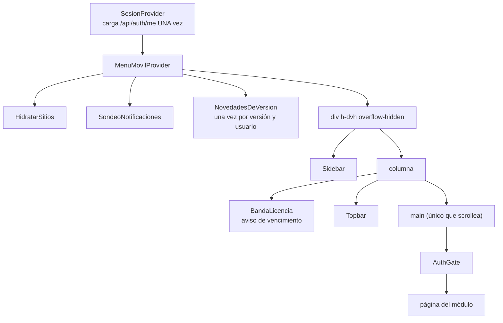

# Shell y navegación

## Composición

`app/(app)/(shell)/layout.tsx`:

```mermaid
flowchart TB
    SP["SesionProvider<br/>carga /api/auth/me UNA vez"] --> MM["MenuMovilProvider"]
    MM --> HS["HidratarSitios"]
    MM --> SN["SondeoNotificaciones"]
    MM --> NV["NovedadesDeVersion<br/>una vez por versión y usuario"]
    MM --> L["div h-dvh overflow-hidden"]
    L --> SB["Sidebar"]
    L --> COL["columna"]
    COL --> BL["BandaLicencia<br/>aviso de vencimiento"]
    COL --> TB["Topbar"]
    COL --> MAIN["main (único que scrollea)"]
    MAIN --> AG["AuthGate"] --> P["página del módulo"]
```

> [!note] 2026-10-05 · dos piezas que el diagrama no tenía
> `NovedadesDeVersion` (`layout.tsx:92`) enseña las notas de la versión
> instalada **una vez por versión y usuario** —va en el shell porque todo
> usuario con sesión pasa por él— y `BandaLicencia` (`layout.tsx:99`) pinta el
> aviso de vencimiento de la licencia, leída en el servidor por
> `leerAvisoDeLicencia()` (`layout.tsx:43-71`). Un `ENOENT` calla (hijo
> administrado, el caso normal); **cualquier otro error se registra**, porque
> hasta el 11/09 un archivo ilegible callaba igual y la banda no salía nunca.

`h-dvh` y no `h-screen` a propósito: para que la barra de direcciones móvil no
recorte el pie del menú.

## Las tres capas de control de acceso

| Capa | Qué comprueba | Dónde | Se puede saltar |
|---|---|---|---|
| Middleware | Que **exista** la cookie `spaces_sesion` | `middleware.ts:176` | Sí (cookie falsa) |
| `AuthGate` | Sesión real + rol vs módulo de la ruta | `AuthGate.tsx` | Sí (es cliente) |
| `exigir()` en cada route handler | Sesión válida + permiso | `lib/server/auth.ts` | **No** |

> [!danger] Solo la tercera es seguridad
> Las dos primeras son experiencia de usuario. La autorización real vive en el
> servidor. Ver [[autenticacion-y-sesion]].

## `AuthGate` y el `NAV` compartido

`AuthGate.tsx:16-18` — el control de acceso por ruta usa **el mismo `NAV`** que
pinta el menú (`components/demo/shell/nav.ts`), así ocultar el ítem y bloquear la
ruta nunca se desincronizan. Eso cierra las fugas por enlaces directos, no solo
el menú. El emparejamiento está en `moduloDe()` (`AuthGate.tsx:19-24`): gana el
`href` más largo. Las salidas obligatorias (códigos de recuperación, contraseña
temporal) se deciden aparte, sin React, en `compuerta.ts`.

Comportamiento:
- Sin sesión → `/login`
- Rol sin acceso al módulo de la ruta → su *landing* (`landingDeRol`)

> [!warning] `nav.ts` es archivo de alto contacto
> Añadir un módulo toca el menú **y** el control de acceso a la vez. Requiere
> claim exclusivo — ver [[AGENTES]].

### Los grupos del menú, y la trampa de buscarlos por su rótulo

El menú va por **fases del proceso**, declaradas en `GRUPOS` (`nav.ts:91-98`), y el
orden de ese arreglo **es** el orden en pantalla. Al 2026-10-05 (26 entradas):

| Clave (código) | Rótulo (pantalla) | Entradas |
|---|---|---|
| `inicio` | *sin título* | Dashboard |
| `patrimonio` | **Inventario** | Inventario · Arrendadores · Network · Almacén |
| `vender` | **Comercial** | Clientes · Comercial · Disponibilidad · Propuestas · Comercial OPEX · Franjas y temporadas · Descuentos por volumen · Códigos promocionales · Paquetes cerrados |
| `entregar` | **Operaciones** | Campañas · **Creativos** · Imprenta · Operaciones · Consumo de luz |
| `cobrar` | **Finanzas** | Finanzas · Reportes · Comisiones |
| `sistema` | **Sistema** | Integraciones · Razones sociales · Actividad · Administración |

> [!note] 2026-10-05 · el grupo Comercial tenía cinco entradas sin listar
> La tabla se había quedado en cuatro. Desde el 29-30/09 cuelgan de `vender`
> **Comercial OPEX** (`nav.ts:157`, la maqueta de prospección de arrendadores,
> ver [[comercial-opex]]) y las cuatro de la **cadena de precio del ADR 0039**,
> en el orden de la cadena: Franjas y temporadas (`:170`), Descuentos por
> volumen (`:189`), Códigos promocionales (`:195`) y Paquetes cerrados (`:202`).
> Esas cuatro las ven solo `MANDO` y `JEFES_VENTA` (`nav.ts:117-119`, ADR 0040):
> el VENDEDOR aplica códigos y paquetes pero no los crea. Su permiso sigue siendo
> el módulo `inventario`, el de sus endpoints — el permiso dice quién puede
> tocarlas, no de quién es el trabajo.
>
> **Captación** está **fuera del menú** desde el 30/09 (`nav.ts:148-153`, la
> línea queda comentada): se solapaba con Comercial OPEX. Solo se quitó la
> entrada; tablas, API y módulo `captacion` siguen.

> [!important] 2026-09-30 · Creativos VOLVIÓ a **Operaciones**
> Pedido literal del dueño: «el menu de creativo muevelo a operaciones». Cuelga
> de `entregar`, **justo después de Campañas**: sus pautas se arman sobre una
> campaña ya creada, y desde el mismo día la pantalla solo lista campañas de
> pantallas digitales (`lib/creativos-digitales.ts`).
>
> **Se movió el grupo, NO los roles**: sigue siendo `[...MANDO, ...VENTA]`,
> porque `lib/modulos.ts` la autoriza con el módulo `comercial`. Un rol
> OPERACIONES sigue sin verla — darle la entrada sin el permiso sería ofrecerle
> una pantalla que responde 403. Quien vende la encuentra bajo «Operaciones»,
> donde ya ve Campañas. Lo fija `nav.test.ts` §3 bis.
>
> El recuadro de abajo es la historia del primer movimiento (28/09) y se
> conserva por su porqué, no porque siga vigente.

> [!important] Creativos se movió a **Comercial** el 2026-09-28
> Estaba en `entregar` y ahora cuelga de `vender`, justo después de Propuestas.
> Lo pidió un dueño con una pregunta literal —«¿puedo programar las pautas desde
> el módulo de ventas?»— y la respuesta era **no**: la pantalla existía,
> funcionaba y la abrían DUEÑO y COMERCIAL, pero colgaba de un encabezado de
> otra área y **no la enlazaba ni Propuestas ni Comercial**. Solo se llegaba
> desde la ficha de una campaña (`campanas/[id]/page.tsx:395-401`, que sigue;
> al 2026-10-05 el enlace «Gestionar» está en `:422-427`).
>
> **Se movió en vez de duplicarse, y duplicar no era una opción cara: era
> imposible.** `nav.test.ts` exige claves **y rutas** únicas, y `AuthGate`
> empareja por `href` (`path === n.href || path.startsWith(n.href + '/')`), así
> que dos entradas con la misma ruta se encenderían las dos a la vez.
>
> Encaja además con quién la autoriza: `lib/modulos.ts:36` la pone bajo el módulo
> **`comercial`**, no `operaciones` — un rol OPERACIONES nunca la vio.
>
> **Lo que cuesta, dicho:** el tramo «Operaciones» pierde el paso donde se sube
> el arte, y el relato del menú —vender primero, entregar después— se estira,
> porque una pauta se arma sobre algo ya vendido. Se aceptó a propósito.
> Fijado por `nav.test.ts` §«3 bis».

> [!warning] La clave NO es el rótulo, y buscar por el rótulo no encuentra nada
> `vender` se pinta **Comercial** y `entregar` se pinta **Operaciones**. Las
> claves se dejan como están a propósito: renombrarlas obligaría a tocar las
> dieciocho entradas para no cambiar nada de lo que se ve. Si buscas el grupo
> «Comercial» en el código, `grep 'Comercial'` te da la ENTRADA, no el grupo.
>
> Los rótulos han cambiado tres veces —`Vender` → `Ventas` (26/08) →
> `Comercial` (08/09), y `Entregar` → `Operaciones` (08/09)—, y las claves
> ninguna. Eso es la señal de que la separación funciona.

**Cuatro grupos se llaman igual que una de sus entradas** (Inventario, Comercial,
Operaciones y Finanzas). Es deliberado: el encabezado nombra la fase, la entrada
es la pantalla principal de esa fase. Un grupo sin ítems visibles no pinta su
título, así que un rol de Operaciones ve dos entradas y no seis encabezados
vacíos.

`nav.test.ts` protege la **estructura**, no los rótulos: que las entradas de un
grupo vayan seguidas, que ningún grupo declarado quede vacío, que el orden en
pantalla sea el de `GRUPOS`, y que Propuestas vaya antes que Campañas y Campañas
antes que Finanzas. Cambiar un rótulo no pone roja ninguna prueba — es un dato
que solo se ve mirando.

## Sesión compartida

`SesionContext.tsx` carga `/api/auth/me` **una sola vez** y la comparte con
Sidebar, Topbar, AuthGate y las pantallas. `sesion === undefined` significa
*cargando*; `null` significa *sin sesión*. Confundirlos produce un parpadeo al
login.

## Middleware

`apps/web/middleware.ts`, matcher casi total. Hace cuatro cosas en orden:

1. **308 legado** (`:103-109`): `/demo` → `/inicio`, `/demo/*` → `/*`
2. **CSRF double-submit** (`:117-145`) en mutaciones `/api/` con sesión
3. **Ruteo por subdominio** (`:150-159`): solo `portal` → `/portal`, y solo fuera de dev
4. **Gate de sesión** (`:164-177`): sin cookie → `/login`

Las dos redirecciones (1 y 4) salen por `redirigir()` (`:78-87`), que arma una
`Location` **absoluta** con el origen tomado del `Host` vía `origenPublico()`
(ADR 0033): el 09/09 el redirect mandaba a `localhost`, y el 17/09 una
`Location` relativa daba 500 en Next 14.2.29. El porqué completo está en el
comentario de `middleware.ts:15-77`.

Rutas públicas del gate: `/api/*`, `/_next/*`, `/favicon*`, `/login`,
`/recuperar/*`, `/p/*`, `/firmar/*`, `/portal/*`.

### Quién mira el `Host`

`apps/web/lib/host.ts` — `etiquetaDeHost(host)`, función **pura** y con pruebas
(`host.test.ts`). Lo único que decide es si el rewrite del punto 3 se dispara. **No** resuelve marcas
ni organizaciones, y el host **no entra en la cadena de datos**: el modelo de
subdominios por tenant está descartado ([[modelo-instancias-soberanas]]).

> [!note] 2026-10-05 · ya no es la ÚNICA que lee el `Host`
> Esta nota decía que `etiquetaDeHost` era la única del sistema que leía el
> encabezado. Desde el 17/09 hay una segunda en el mismo archivo:
> `origenPublico()` (`lib/host.ts:84`), que da el **origen** de las
> redirecciones del middleware (`middleware.ts:81`). Decide de qué dominio sale
> la `Location`, **nunca a dónde va el usuario**: el destino es siempre una ruta
> interna fija.

> [!warning] Una IP no es un subdominio (corregido el 13/08)
> La versión anterior contaba puntos (`parts.length >= 3`), así que entrar por la
> IP desnuda del droplet —`209.97.146.136`— daba la etiqueta `'209'` y reescribía
> la ruta. No rompía nada solo porque `209` no está en el `moduleMap`. Ahora se
> descartan IPv4/IPv6 literales, los primeros segmentos numéricos y los hosts sin
> tres etiquetas; `demo.space-os.io` sigue devolviendo `'demo'`, igual que antes.

> [!note] `BASE_PATH` está duplicado
> `middleware.ts:6` define `'/spaces-dooh'` con un comentario que dice *"Must
> match basePath in next.config.mjs"*. Son dos sitios que hay que cambiar a la
> vez.

## Notificaciones en vivo

`SondeoNotificaciones` sondea `/api/notificaciones/nuevas`. Vive **solo dentro
del shell**: sin sesión no hay a quién avisar y el sondeo pediría por nada.

## Relacionadas
[[03-Frontend/_indice|Índice de Frontend]] · [[estado-y-data-fetching]] ·
[[modulos-internos]] · [[autenticacion-y-sesion]] · [[MOC-Proyecto]]
