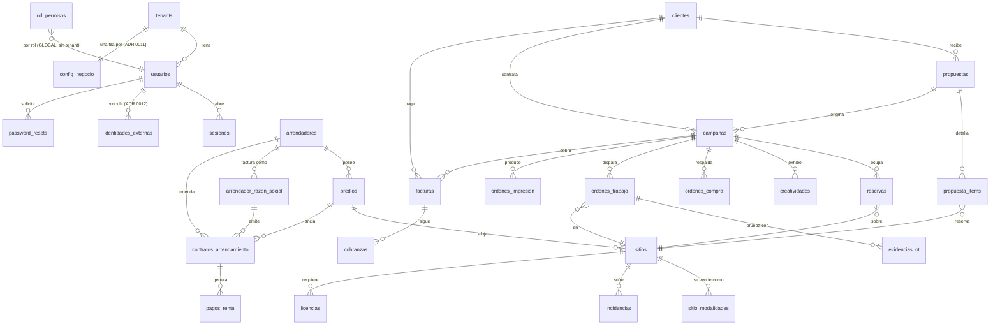

# Esquema de datos

**PostgreSQL, un solo schema (`public`), 38 tablas, sin ORM.** `db/schema.sql`
(657 líneas) + 66 migraciones aditivas.

> [!warning] `schema.sql` no es el estado final
> Varias columnas y **todas** las políticas RLS fail-closed llegan por
> migración. El estado real = `schema.sql` + las 66 en orden. Ver
> [[migraciones]].

## Diagrama ER (núcleo)

## Tablas por área

### Plataforma y acceso
| Tabla | RLS | Nota |
|---|---|---|
| `tenants` | **Exenta** | Una fila por organización |
| `usuarios` | fail-closed + FORCE | Correo UNIQUE **global** `lower(email)` |
| `sesiones` | **Exenta** | + `desbloqueo_expira_en` |
| `identidades_externas` | fail-closed + FORCE | ADR 0012 |
| `password_resets` | fail-closed (desde 07/08) | Token único, 60 min |
| `rol_permisos` | **Sin tenant_id** | RBAC global a la instalación |
| `config_negocio` | fail-closed + FORCE | Una fila **por tenant**, sin DEFAULT |
| `folios_consecutivos` | Sin tenant_id | Contador global |
| `acciones` | fail-closed | Bitácora append-only |
| `notificaciones` | fail-closed | Dedupe por día |

### Inventario
`sitios`, `sitio_modalidades`, `predios`, `incidencias`, `licencias`,
`almacen_activos`, `almacen_movimientos`.

### Arrendadores
`arrendadores`, `arrendador_razon_social`, `contratos_arrendamiento`,
`pagos_renta`, `contrato_firmas`.

### Comercial
`clientes`, `propuestas`, `propuesta_items`, `campanas`, `reservas`,
`creatividades`, `ordenes_compra`.

### Operaciones
`ordenes_trabajo`, `evidencias_ot`, `ordenes_impresion`.

### Finanzas
`facturas`, `cobranzas`.

### Integraciones
`doohmain_consultas_play`, `doohmain_remote_campaigns`, `doohmain_remote_lists`,
`media_uploads`.

## Enums

28 tipos enumerados (`db/schema.sql:31-57` + los declarados junto a su tabla).
Los que más importan:

| Enum | Valores |
|---|---|
| `rol_demo` | `DUENO`, `COMERCIAL`, `OPERACIONES`, `IMPRENTA`, `FINANZAS`, `CLIENTE`* |
| `est_contrato` | `VIGENTE`, `POR_VENCER`, `VENCIDO`, `RENOVADO`, `CANCELADO`, `INCOMPLETO`† |
| `est_comercial_campana` | `DRAFT`, `COTIZACION`, `CONFIRMADA`, `ACTIVA`, `COMPLETADA`, `CANCELADA`, `LISTA_FACTURAR` |
| `est_ot` | `PENDIENTE`, `ASIGNADA`, `EN_PROCESO`, `BLOQUEADA`, `EN_REVISION`, `COMPLETADA`, `RECHAZADA`, `CANCELADA` |
| `periodicidad_pago` | `SEMANAL`…`ANUAL` + `DIARIA`† (ADR 0004) |

\* `CLIENTE` retirado por ADR 0010 pero **sigue en el enum**.
† Añadido por migración.

> [!danger] Quitar un valor de un enum de Postgres no es trivial
> Requiere recrear el tipo y todas las columnas que lo usan. Por eso `CLIENTE`
> sigue ahí. Ver [[zonas-de-riesgo]].

## Índices relevantes

| Índice | Sobre | Por qué |
|---|---|---|
| `usuarios_email_lower_uidx` | `lower(email)` | Login sin pedir tenant |
| `config_negocio_tenant_uidx` | `tenant_id` | Una sola fila por organización |
| `idx_reservas_expira` | parcial `where estatus='TENTATIVA'` | Caducidad de tentativas |
| `idx_sitios_en_network` | parcial `where en_network` | Filtro de network |
| `idx_acciones_timestamp` | `timestamp desc` | Bitácora reciente |

Restricciones **UNIQUE globales** (sin tenant): `sitios.clave_interna`,
`sitios.codigo_proveedor`, `propuestas.folio`, `campanas.folio`,
`ordenes_compra.folio`, `facturas.folio`, `campanas.portal_token`,
`propuestas.token_publico`.

## Borrados en cascada

`ON DELETE CASCADE` — borrar el padre **borra los hijos sin aviso**:

| Padre | Arrastra |
|---|---|
| `usuarios` | `sesiones`, `identidades_externas`, `password_resets` |
| `sitios` | `sitio_modalidades`, `incidencias` |
| `campanas` | `reservas`, `creatividades`, `ordenes_compra`, `ordenes_impresion` |
| `contratos_arrendamiento` | `pagos_renta` |
| `propuestas` | `propuesta_items` |
| `facturas` | `cobranzas` |
| `ordenes_trabajo` | `evidencias_ot` |
| `arrendadores` | `arrendador_razon_social` |

`ON DELETE RESTRICT` protege lo que no debe desaparecer: `facturas.campana_id`,
`reservas.sitio_id`, `contratos_arrendamiento.arrendador_id`, `predios.arrendador_id`.

## Triggers

`set_actualizado_en()` mantiene `actualizado_en` en `config_negocio`, `sitios`,
`campanas`, `ordenes_trabajo`, `ordenes_impresion`.

## Relacionadas
[[migraciones]] · [[multi-tenancy-y-rls]] · [[glosario]] ·
[[zonas-de-riesgo]] · [[02-Backend/_indice|Índice de Backend]] · [[MOC-Proyecto]]
