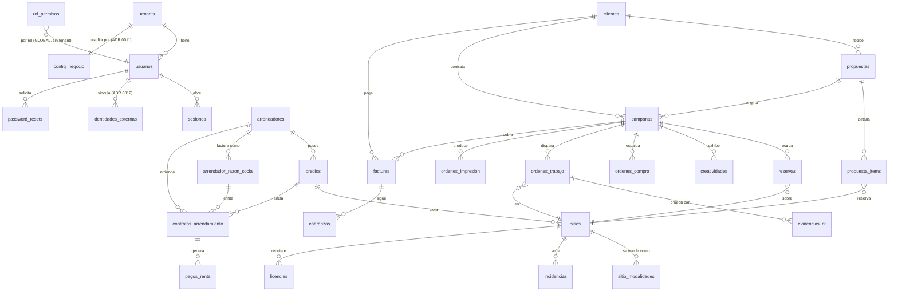

# Esquema de datos

> [!note] 2026-09-21 · tabla nueva, `actualizaciones_instancia` — ADR 0037
> `db/migrations/20260921_actualizaciones_instancia.sql` — la tabla de LA
> INSTANCIA (sin `tenant_id`, sin RLS, una sola fila con `check (id)` sobre una
> pk booleana) que hace de buzón entre la aplicación y el actualizador: cada
> droplet elige si toma la versión nueva cuando se publica una. Ver
> [ADR 0037](../../docs/adr/0037-cada-instancia-elige-si-toma-la-version-nueva.md) y
> [[migraciones]]. Mapa completo de las cuatro piezas en
> [[actualizaciones-instancia]].
>
> **Tablas: 44 → 45**, medido con `node scripts/recuentos.mjs` sobre este árbol.
>
> Dos escritores separados por `grant` de COLUMNA, no por convención: la app
> (`spaces_app`/`spaces_user`) solo puede escribir `modo`, `aprobado_digest`,
> `aprobado_por`, `aprobado_en` y `actualizado_en`; las columnas de lo
> *disponible* (`digest_disponible`, `version_disponible`, …) las escribe el
> actualizador con el rol privilegiado. `obligatoria` nace sin escritor a
> propósito — ver la cabecera de la migración.
>
> **Ojo con el candado que casi no restringe nada:**
> `20260820_grants_rol_app.sql` y `20260824_grants_tablas_futuras.sql` fijan
> privilegios POR OMISIÓN para el propietario que corre las migraciones, y esos
> alcanzan a CUALQUIER tabla nueva que ese propietario cree — con
> `select+insert+update+delete` de tabla COMPLETA. Un privilegio de tabla
> completo gana siempre a uno por columna, así que sin un `revoke all` explícito
> ANTES del `grant update (columnas)`, la app seguiría pudiendo escribir
> `digest_disponible` pese al grant por columna. Lo delató la propia prueba de
> este ADR — pasaba en verde por el motivo equivocado hasta que se añadió el
> `revoke`. Cualquier tabla nueva con escritores separados por columna necesita
> el mismo `revoke all` primero.

> [!warning] 2026-09-17 · remedido, y tres de las cifras de abajo caducaron
> Medido en este árbol al añadir `20260917_entidades_fiscales.sql`, con la
> receta completa sobre una base desechable y con el runner de verdad
> (`node scripts/migrar.mjs --instalacion-nueva`):
>
> | Dato | Decía abajo (27/08) | **Medido el 17/09** | Cómo |
> |---|---|---|---|
> | Tablas | 39 | **43** | `esquema-sin-owner.e2e.test.ts:145` |
> | Archivos de migración | 74 | **81** | `ls db/migrations/*.sql \| wc -l` |
> | De datos (`@tipo: datos` en la 1.ª línea) | 4 | **1** | `head -1` de cada archivo |
>
> Las tres subidas de tabla desde el 07/09 son las de este módulo:
> `entidades_fiscales`, `entidad_roles` y `catalogo_roles_entidad` — ver
> [[02-Backend/entidades-fiscales]]. **La cifra de «de datos» no subió: bajó**, y
> eso no lo causó este trabajo. Hoy el único archivo con la marca en su primera
> línea es `20260731_calendario_meses_cortos.sql`; el runner lo confirma por su
> cuenta al terminar («80 aplicadas, 1 de datos pendientes»). O sea que el aviso
> de más abajo sobre «las de datos son CUATRO» describe un estado que ya no es, y
> eso **importa en la dirección contraria a la que él advertía**: los otros tres
> archivos **sí** los aplica una actualización normal, sin `--con-datos`.
> Comprobar por qué perdieron la marca es una tarea propia, no se hizo aquí.

**PostgreSQL, un solo schema (`public`), ~~44~~ 45 tablas (ver la nota del
21/09 arriba), sin ORM.** `db/schema.sql`
(679 líneas) + **74** migraciones aditivas — **70 de esquema y 4 de datos**
(medido el 27/08, y ya caducado — ver los avisos de arriba).

> [!warning] Las de datos son CUATRO, no una — y el runner las salta por defecto
> Esta nota decía «una de datos» desde el 19/08 y ya entonces eran tres. Hoy
> llevan `@tipo: datos` en su **primera línea**: `20260731_calendario_meses_cortos`,
> `20260812_schema_migrations`, `20260819_semilla_rol_permisos` y
> `20260820_catalogo_permisos_completo`. Importa porque `scripts/migrar.mjs` no
> las aplica sin `--con-datos`: contarlas como si fueran de esquema hace creer
> que una instancia recién actualizada tiene su catálogo de permisos sembrado
> cuando puede no tenerlo — que es justo el fallo que cerró T-05.

> [!warning] `schema.sql` no es el estado final
> Varias columnas y **todas** las políticas RLS fail-closed llegan por
> migración. El estado real = `schema.sql` + las **74** en orden. Ver
> [[migraciones]].
>
> [!warning] 2026-09-18 · esta nota decía **39** en su cuerpo y **43** en su
> cabecera, sobre un árbol de **44**
> Las tres cifras estaban en el mismo archivo y ninguna era la de hoy. Se mide
> con `node scripts/recuentos.mjs`, no releyendo. Las cinco que faltaban:
> `entidades_fiscales`, `entidad_roles`, `catalogo_roles_entidad` (17/09) y
> `consumos_energia` (18/09), más `codigos_recuperacion` (07/09).

> **Las tablas no se movieron con las seis migraciones nuevas**, y conviene
> entender por qué: `schema.sql` crea **28** y las migraciones las **11**
> restantes; las de después del 19/08 añaden columnas, índices y GRANT, no
> tablas. Recuento de migraciones y recuento de tablas **no suben juntos**, y
> tratarlos como si lo hicieran es lo que dejó al MOC con dos cifras a la vez.
>
> Las 39 son las de una base levantada **desde el repo** (medido el 14/08 sobre
> `spaces_e2e`, y otra vez el 19/08 sobre una base desechable con la receta
> completa). Producción tenía 38: le faltaba `schema_migrations`.

> [!question] «Producción tiene 38» es del 19/08 y hay evidencia de lo contrario — SIN VERIFICAR
> `docs/evidencias/fase-3-y-4.md:50` marca **F3.1 «probada en servidor»** y la
> fila de F4.2 de [[ejecucion-plan-v3]] afirma **72 migraciones aplicadas en
> `spaces_prod`**, lo que implica que `schema_migrations` ya existe allí y que
> producción va por **39**. No se ha podido confirmar: comprobarlo exige
> consultar el servidor, y esta revalidación es de solo lectura sobre el repo.
> **Hasta que alguien lo mida, no des por buena ninguna de las dos cifras.**
>
> ```
> sudo -u postgres psql -d spaces_prod -Atc "select count(*) from information_schema.tables where table_schema='public'"
> sudo -u postgres psql -d spaces_prod -Atc "select count(*) from schema_migrations"
> ```

> [!important] El esquema nace SIN NINGUNA ORGANIZACIÓN — desde el 2026-08-19
> `db/schema.sql` sembraba el tenant `RGB Catorce` / `rgb` y, detrás, su fila de
> `config_negocio`. Una base recién nacida salía con **`tenants = 1` y
> `config_negocio = 1`**: cada instancia de cada owner heredaba la identidad de
> otro. Rompía dos criterios del plan v3 —F4.2 («ni una fila de ningún owner») y
> F4.5 (los slugs de DEMO y de `spaces_prod` no pueden compartir ninguno)— y era
> justo lo que el modelo de instancias soberanas existe para evitar.
>
> Hoy una base recién nacida sale con **`tenants = 0` y `config_negocio = 0`**, y
> la receta completa —`db/dev-rol-app.sql` → `db/schema.sql` → `node
> scripts/migrar.mjs --instalacion-nueva`— sigue dando **67 aplicadas, 39 tablas,
> salida 0**, y **0 aplicadas** en la segunda corrida (medido el 19/08).
>
> Con el mismo cambio se fueron dos líneas que solo existían por ese seed: el
> `select id into def from tenants where slug='rgb'` que alimentaba los `DEFAULT`
> de `tenant_id` —los que etiquetaron 15 modalidades de g500/eyro como RGB, y que
> `20260812_sin_default_tenant.sql` retira— y el `update config_negocio … where
> slug='rgb'`. **Una base nueva ya no trae ningún `DEFAULT` de `tenant_id`**: un
> insert descuidado truena con 23502 desde el primer día.
>
> **Quién crea la organización ahora:** el aprovisionamiento.
> `apps/web/scripts/bootstrap-auth.mjs` la crea y la pide por entorno —`ORG_SLUG`,
> `ORG_NOMBRE`, `ADMIN_EMAIL`, `ADMIN_NOMBRE`, ninguna con valor por omisión— y
> **sigue abortando con salida 1** si la organización no queda creada de verdad
> (el guard de T-01b: ese insert afecta 0 filas y termina con éxito). En F5.2 lo
> sustituye la ruta de bootstrap de un solo uso.
>
> **Para desarrollo local, `rgb` no desapareció:** vive en
> `db/semilla-desarrollo.sql`, que **no viaja en la imagen** (`Dockerfile:94-95`
> copia `schema.sql` y `db/migrations/`, nada más). El arnés de integración la
> aplica **entre el esquema y las migraciones** (`apps/web/lib/test/db-e2e.ts`),
> porque el estado que reproduce es el del droplet —una base que ya tenía
> organización cuando le llegaron las migraciones— y de eso depende que dispare
> el backfill de `20260812_schema_migrations.sql`.

## Diagrama ER (núcleo)



## Tablas por área

### Plataforma y acceso
| Tabla | RLS | Nota |
|---|---|---|
| `tenants` | **Exenta** | Una fila por organización. **El esquema no siembra ninguna** (ver el aviso de arriba). Desde el 21/09 lleva `cambios_password_hash` — la contraseña compartida del candado de cambios (ADR 0036), `null` = sin asignar — ver [[02-Backend/autenticacion-y-sesion]] |
| `usuarios` | fail-closed + FORCE | Correo UNIQUE **global** `lower(email)` |
| `sesiones` | **Exenta** | + `desbloqueo_expira_en` + `desbloqueo_es_propio` (ADR 0036: si el desbloqueo vigente fue con la contraseña propia o la compartida) |
| `identidades_externas` | fail-closed + FORCE | ADR 0012 |
| `password_resets` | fail-closed (desde 07/08) | Token único, 60 min |
| `rol_permisos` | **Sin tenant_id** | RBAC global a la instalación |
| `config_negocio` | fail-closed + FORCE | Una fila **por tenant**, sin DEFAULT. La crea quien da de alta la organización, o la app al primer acceso (`lib/server/config-repo.ts:59-61`). Desde el 17/09 lleva `costos_ot jsonb` —costo de mano de obra por tipo de OT, `{}` = sin configurar— con CHECK de forma; ver [[02-Backend/operaciones-y-ot]] |
| `folios_consecutivos` | Sin tenant_id | Contador global |
| `schema_migrations` | Sin tenant_id | Qué migraciones corrió **esta instancia**. Ver [[migraciones]] |
| `acciones` | fail-closed | Bitácora append-only |
| `notificaciones` | fail-closed | Dedupe por día |

### Inventario
`sitios`, `sitio_modalidades`, `predios`, `incidencias`, `licencias`,
`almacen_activos`, `almacen_movimientos`.

### Arrendadores
`arrendadores`, `arrendador_razon_social`, `contratos_arrendamiento`,
`pagos_renta`, `contrato_firmas`.

### Comercial
`clientes`, `propuestas`, `propuesta_items`, `campanas`, `reservas`,
`creatividades`, `ordenes_compra`.

### Operaciones
`ordenes_trabajo`, `evidencias_ot`, `ordenes_impresion`.

### Finanzas
`facturas`, `cobranzas`.

### Integraciones
`doohmain_consultas_play`, `doohmain_remote_campaigns`, `doohmain_remote_lists`,
`media_uploads`.

## Enums

**31 tipos enumerados**, medidos el 27/08: **27 en `db/schema.sql`** —25 en el
bloque `:31-57` y dos declarados junto a su tabla, `est_propuesta` (`:345`) y
`est_odc` (`:376`)— y **4 más que crean las migraciones**: `estado_predio`
(`20260715_arr_m2_tablas.sql:11`), `periodicidad_pago`
(`20260715_arr_m3_periodicidad.sql:14`), `est_activo` y `tipo_mov_almacen`
(`20260723_almacen.sql:15` y `:19`). Los que más importan:

| Enum | Valores |
|---|---|
| `rol_demo` | `DUENO`, `COMERCIAL`, `OPERACIONES`, `IMPRENTA`, `FINANZAS`, `CLIENTE`* |
| `est_contrato` | `VIGENTE`, `POR_VENCER`, `VENCIDO`, `RENOVADO`, `CANCELADO`, `INCOMPLETO`† |
| `est_comercial_campana` | `DRAFT`, `COTIZACION`, `CONFIRMADA`, `ACTIVA`, `COMPLETADA`, `CANCELADA`, `LISTA_FACTURAR` |
| `est_ot` | `PENDIENTE`, `ASIGNADA`, `EN_PROCESO`, `BLOQUEADA`, `EN_REVISION`, `COMPLETADA`, `RECHAZADA`, `CANCELADA` |
| `periodicidad_pago` | `SEMANAL`…`ANUAL` + `DIARIA`† (ADR 0004) |

\* `CLIENTE` retirado por ADR 0010 pero **sigue en el enum**.
† Añadido por migración.

> [!danger] Quitar un valor de un enum de Postgres no es trivial
> Requiere recrear el tipo y todas las columnas que lo usan. Por eso `CLIENTE`
> sigue ahí. Ver [[zonas-de-riesgo]].

## Índices relevantes

| Índice | Sobre | Por qué |
|---|---|---|
| `usuarios_email_lower_uidx` | `lower(email)` | Login sin pedir tenant |
| `config_negocio_tenant_uidx` | `tenant_id` | Una sola fila por organización |
| `idx_reservas_expira` | parcial `where estatus='TENTATIVA'` | Caducidad de tentativas |
| `idx_sitios_en_network` | parcial `where en_network` | Filtro de network |
| `idx_acciones_timestamp` | `timestamp desc` | Bitácora reciente |

Restricciones **UNIQUE globales** (sin tenant): `sitios.clave_interna`,
`sitios.codigo_proveedor`, `propuestas.folio`, `campanas.folio`,
`ordenes_compra.folio`, `facturas.folio`, `campanas.portal_token`,
`propuestas.token_publico`.

## Borrados en cascada

`ON DELETE CASCADE` — borrar el padre **borra los hijos sin aviso**:

| Padre | Arrastra |
|---|---|
| `usuarios` | `sesiones`, `identidades_externas`, `password_resets` |
| `sitios` | `sitio_modalidades`, `incidencias` |
| `campanas` | `reservas`, `creatividades`, `ordenes_compra`, `ordenes_impresion` |
| `contratos_arrendamiento` | `pagos_renta` |
| `propuestas` | `propuesta_items` |
| `facturas` | `cobranzas` |
| `ordenes_trabajo` | `evidencias_ot` |
| `arrendadores` | `arrendador_razon_social` |

`ON DELETE RESTRICT` protege lo que no debe desaparecer: `facturas.campana_id`,
`reservas.sitio_id`, `contratos_arrendamiento.arrendador_id`, `predios.arrendador_id`.

## Triggers

`set_actualizado_en()` mantiene `actualizado_en` en `config_negocio`, `sitios`,
`campanas`, `ordenes_trabajo`, `ordenes_impresion`.

## Relacionadas
[[migraciones]] · [[multi-tenancy-y-rls]] · [[glosario]] ·
[[zonas-de-riesgo]] · [[02-Backend/_indice|Índice de Backend]] · [[MOC-Proyecto]]
