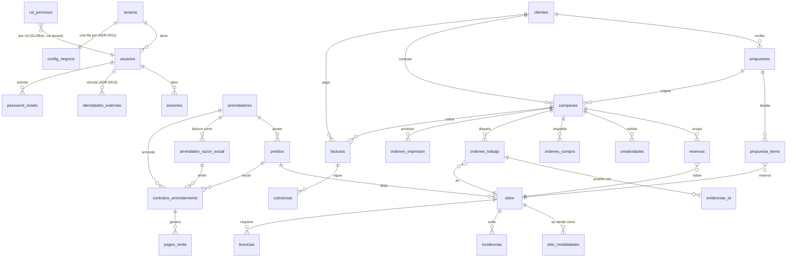

# Esquema de datos

> [!warning] 2026-10-01 · `actualizaciones_instancia.notas_disponibles` — `20261005_notas_de_version.sql`, **pendiente de aprobación**
> Una columna nueva, **ninguna tabla**: el recuento de tablas no cambia.
>
> | Columna | Tipo | Qué |
> |---|---|---|
> | `notas_disponibles` | `jsonb`, NULL | La entrada de `novedades.json` de la versión **disponible** (`{ version, fecha, items }`). La escribe el actualizador; la app **solo la lee** (sin `grant update` nuevo: el de la app es por columna) |
>
> Para qué: que el Dueño y el Administrador vean qué trae una versión **antes**
> de aprobarla. Ver [[02-Backend/notas-de-version]] y [[migraciones]].

> [!success] 2026-09-30 · el cupón con APROBACIÓN — COD-03, `20261003_codigo_aprobacion.sql`
> **Aprobada por el dueño el 2026-09-30, incluida la forma.** Tres columnas
> nuevas en `propuestas`, **ninguna tabla**: el recuento de tablas no cambia.
>
> | Columna | Tipo | Qué |
> |---|---|---|
> | `codigo_estado` | `text`, NULL | NULL = sin cupón · `'PENDIENTE'` = aplicado, el cliente **no** lo ve · `'APROBADO'` = lo aprobó alguien con `comercial.aprobar` |
> | `codigo_aprobado_por` | `uuid` → `usuarios(id) on delete set null` | De la **sesión**, nunca del cuerpo. FK de una columna |
> | `codigo_aprobado_en` | `timestamptz` | `now()` de Postgres |
>
> Tres CHECK: `propuestas_codigo_estado_ck` (el dominio, **text + CHECK y no
> enum**), `propuestas_codigo_revision_ck` (`codigo_texto is null` ⇔
> `codigo_estado is null`) y `propuestas_codigo_aprobado_ck` (APROBADO ⇒
> `codigo_aprobado_en` no nulo). `codigo_aprobado_por` **no** se exige con
> APROBADO: es `set null`, y dar de baja al aprobador rompería la fila. Índice
> parcial `idx_propuestas_codigo_pendiente (tenant_id) where codigo_estado =
> 'PENDIENTE'`.
>
> **Backfill en la misma migración**: los cupones ya aplicados pasan a
> `APROBADO` con `codigo_aprobado_en = codigo_canjeado_en` y sin aprobador —el
> cliente ya los había visto; no se le quita nada a nadie—. Sin `@pg-min`:
> probada en 14.24 y 16. Ver [[02-Backend/codigo-promocional]] §8.

> [!success] 2026-09-30 · `campanas.franja_programada_id` — PROG-01
> **Aprobada por el dueño el 2026-09-30.** Columna nueva, **no tabla**: el
> recuento de tablas no cambia. `uuid`, nullable, sin default, FK compuesta
> `(franja_programada_id, tenant_id) → franjas_horarias (id, tenant_id)` con
> `on delete restrict`, índice parcial `idx_campanas_franja_programada`.
>
> Es **en qué franja se transmite** la campaña (decisión del dueño del 30/09:
> «es para horario transmisión ya que el precio ya debe de estar en la campaña
> después de la propuesta»). **No** es la contratada: esa sigue siendo
> `reservas.franja_id`, heredada de la propuesta y congelada con su precio en
> el snapshot. Por campaña y no por reserva porque así lo pidió el dueño; si
> hiciera falta una pantalla distinta de su campaña, se añadiría una excepción
> por reserva sobre esta. Ver [[02-Backend/rejilla-franja-y-temporada]].

> [!danger] 2026-09-28 · `paquetes`, `paquete_sitios` y `paquete_aplicaciones` SIN FUSIONAR
> Mismo caso que `escalas_volumen` y `codigos_promocionales`, abajo: escritas y
> probadas contra bases desechables, y **detenidas en la fusión** a la espera de
> la aprobación del dueño. **Si las lees en `main`, es que ya se aprobó** — y
> entonces las tablas son **55**.

> [!note] 2026-09-28 · TRES TABLAS NUEVAS, el PAQUETE CERRADO — ADR 0039, Fase 4
> `db/migrations/20260928_paquete_cerrado.sql`. **Las tablas pasan de 52 a 55**,
> medido con `node scripts/recuentos.mjs` sobre este árbol
> (`feat/paquete-cerrado`).
>
> - **`paquetes`** — el catálogo de la organización: `nombre`, `precio_cerrado`,
>   `admite_codigo` y `activo`. El precio es **un entero de pesos**, y lo exige
>   la base (`precio_cerrado = trunc(precio_cerrado)`): se reparte entre las
>   pantallas y un centavo repartido entre cinco no se puede explicar.
> - **`paquete_sitios`** — de qué pantallas se compone. Sin ella un paquete sería
>   «un nombre y un precio», y aplicar «Periférico» a 180 000 sobre una sola
>   pantalla sería legal.
> - **`paquete_aplicaciones`** — el **enlace vivo** propuesta ↔ paquete. Vive
>   aparte del precio a propósito, exactamente como `canjes_codigo` de la Fase 3:
>   **borrar un paquete se lleva el enlace y no mueve un peso de ninguna venta**.
>
> **El `unique (tenant_id, lower(btrim(nombre)))` es un ÍNDICE DE EXPRESIÓN**, el
> mismo recurso que `usuarios_email_lower_uidx` y que el `upper(codigo)` de la
> Fase 3: «Periférico» y «PERIFERICO» serían dos precios para lo que quien vende
> lee como una sola cosa, y al elegirlo de una lista no se ve la diferencia. Nada
> de lo que usa es posterior a PostgreSQL 14, así que **no lleva `@pg-min`**.
>
> `paquete_aplicaciones` lleva `unique (propuesta_id)` —**un solo paquete por
> propuesta**, y es lo único que sirve contra un doble clic— y sus FK son
> **compuestas con el tenant**, como las de las fases 1 y 3. Para eso se añade
> además **`sitios_id_tenant_uq`**, que no existía.
>
> Más **cinco columnas en `propuestas`** —`paquete_nombre`, `paquete_precio`,
> `paquete_admite_codigo` (**NOT NULL DEFAULT false**), `paquete_aplicado_en` y
> `paquete_composicion` (`jsonb`)— y una en `reservas`: `paquete_parte`. Las
> cuatro primeras de `propuestas` viajan juntas o ninguna
> (`propuestas_paquete_pareja_ck`): un precio sin nombre es un importe que nadie
> puede auditar.
>
> **`paquete_composicion` guarda con QUÉ PANTALLAS se cotizó**, congelado el día
> de la aplicación. Es lo que permite avisar —sin mover el precio— cuando la
> propuesta deja de tener esas pantallas, y lo exige el invariante 4 del ADR 0039
> con todas las letras.
>
> Con **RLS `enable` + `force`** estricta en las tres y GRANT explícito. Ver
> [[02-Backend/paquete-cerrado]].

> [!note] 2026-09-29 · DOS TABLAS NUEVAS, `prospectos` y `prospecto_avances` — CAP-01
> `db/migrations/20260930_captacion.sql`. La bitácora de captación.
>
> - **`prospectos`** — lo que se intenta captar (`tipo` CLIENTE · ARRENDADOR ·
>   PREDIO · PANTALLA), su `etapa` (`text` + CHECK, **no enum**), contacto y
>   datos en `jsonb`, el vendedor en `usuario_id` y el registro creado al aprobar
>   en `registro_id` (**sin FK**: apunta a tres tablas). La app no tiene `delete`.
> - **`prospecto_avances`** — la bitácora, con FK compuesta `(prospecto_id,
>   tenant_id)`. **Solo se añade**: la app tiene `select, insert` y nada más.
>
> RLS `enable` + `force` en las dos. Ver [[02-Backend/captacion]].

> [!danger] 2026-09-28 · `codigos_promocionales` y `canjes_codigo` SIN FUSIONAR
> Mismo caso que `escalas_volumen`, abajo: escritas y probadas contra bases
> desechables, y **detenidas en la fusión** a la espera de la aprobación del
> dueño. **Si las lees en `main`, es que ya se aprobó** — y entonces las tablas
> son **52**.

> [!note] 2026-09-28 · DOS TABLAS NUEVAS, `codigos_promocionales` y `canjes_codigo` — ADR 0039, Fase 3
> `db/migrations/20260928_codigo_promocional.sql`. **Las tablas pasan de 50 a
> 52**, medido con `node scripts/recuentos.mjs` sobre este árbol
> (`feat/codigo-promocional`).
>
> - **`codigos_promocionales`** — el catálogo de cupones de la organización, con
>   `descuento_pct`, `vigente_desde`/`vigente_hasta` (**los dos inclusivos**) y
>   `usos_maximos` (**`NULL` = sin tope**; nunca 0).
> - **`canjes_codigo`** — quién canjeó qué, cuándo y en qué propuesta. **ES EL
>   CONTADOR DE USOS**: no existe ninguna columna `usos_consumidos`, y es a
>   propósito — un contador *además* del registro serían dos respuestas a la
>   misma pregunta, y un `on delete cascade` desde `propuestas` desincronizaría
>   la columna sin que nadie lo viera.
>
> **El `unique (tenant_id, upper(codigo))` es un ÍNDICE DE EXPRESIÓN**, el mismo
> recurso que `usuarios_email_lower_uidx`, y es lo que hace que un cupón sea *una
> palabra y no dos*: si `verano20` y `VERANO20` pudieran ser dos filas con dos
> porcentajes, el descuento dependería de cómo lo tecleó el cliente. Nada de lo
> que usa es posterior a PostgreSQL 14, así que **no lleva `@pg-min`**.
>
> `canjes_codigo` lleva `unique (propuesta_id)` —**un solo código por propuesta**,
> y es lo único que sirve contra un doble clic— y sus **dos FK son compuestas con
> el tenant**, como las de la Fase 1.
>
> Más cuatro columnas: `propuestas.codigo_texto`,
> `propuestas.codigo_descuento_pct` (**NOT NULL DEFAULT 0**),
> `propuestas.codigo_canjeado_en` y `reservas.codigo_descuento_pct`. Las tres de
> `propuestas` viajan juntas o ninguna (`propuestas_codigo_pareja_ck`): un
> porcentaje sin su código no se puede auditar, y un código al 0 % es una promesa
> aceptada y no cumplida.
>
> **`codigo_canjeado_en` vive en `propuestas` y no solo en `canjes_codigo`** a
> propósito: los canjes se borran en cascada con el cupón, y lo que el ADR exige
> es que borrar el cupón **no mueva nada** de la venta. Esa fecha es parte del
> precio congelado, no del presupuesto del cupón.
>
> Con **RLS `enable` + `force`** estricta en las dos y GRANT explícito. Ver
> [[02-Backend/codigo-promocional]].

> [!danger] 2026-09-28 · `escalas_volumen` SIN FUSIONAR — espera la aprobación del dueño
> Desde el 2026-09-28 ningún cambio de esquema aterriza sin que el dueño lo
> apruebe antes. La migración de abajo está escrita y probada contra bases
> desechables; lo detenido es la fusión. **Si la lees en `main`, es que ya se
> aprobó** — y entonces las tablas son 50.

> [!note] 2026-09-28 · UNA TABLA NUEVA, `escalas_volumen` — ADR 0039, Fase 2
> `db/migrations/20260928_descuento_por_volumen.sql`. **Las tablas pasan de 49 a
> 50**, medido con `node scripts/recuentos.mjs` sobre este árbol
> (`feat/descuento-por-volumen`): **92 migraciones, 50 tablas**.
>
> - **`escalas_volumen`** — los tramos de descuento por volumen de la
>   organización, **por unidad de venta**: «a partir de `desde_cantidad` unidades
>   de `unidad`, baja `descuento_pct` %». El umbral es **inclusivo** y la escala
>   es **PLANA**: al alcanzarlo, TODAS las unidades bajan.
>
> **El `unique (tenant_id, unidad, desde_cantidad)` ES la prohibición de solape**,
> y solo puede serlo porque la escala es plana: dos tramos «desde 50» de la misma
> unidad son dos precios para la misma compra. Escalonado serían rangos y haría
> falta lógica de aplicación, como con las franjas. Las tres columnas son `NOT
> NULL`, así que **la trampa de los NULL de PostgreSQL 14 que la Fase 1 esquivó
> con `COALESCE` aquí no aplica** — y por eso esta migración no lleva `@pg-min`.
>
> Dos CHECK que valen la pena: `desde_cantidad >= 2` (un tramo «desde 1» sería
> bajar el tarifario entero sin que se note) y `descuento_pct > 0` (un tramo al
> 0 % es una regla que no hace nada y hace creer que sí).
>
> **PRECIO-01 (2026-10-01)** · y dos más en `propuesta_items`, de
> `20261006_precio_ajustado_por_gerente.sql`: `tarifa_calculada` (numeric(14,2),
> nullable) — la tarifa por unidad que calculó el servidor— y
> `precio_ajustado_por` (uuid → `usuarios(id)` **on delete set null**, nullable)
> —quién se apartó de ella, de la sesión—. Internas: no viajan a la liga
> pública. Ver [[02-Backend/comercial-propuestas-campanas]].
>
> Más tres columnas: `propuesta_items.descuento_volumen_pct` (numeric(5,2), **NOT
> NULL DEFAULT 0**), `propuesta_items.volumen_desde` (integer, nullable) y
> `reservas.descuento_volumen_pct`. **Guardan números, no una FK**, al revés que
> `franja_id`: un tramo no se elige, se deduce — así que lo que importa de él son
> sus números, borrarlo nunca puede quedar bloqueado por una venta, y no hace
> falta baja lógica.
>
> Con **RLS `enable` + `force`** estricta y GRANT explícito, igual que las tres de
> la Fase 1. Ver [[02-Backend/descuento-por-volumen]].

> [!note] 2026-09-28 · TRES TABLAS NUEVAS, `franjas_horarias` · `temporadas` · `sitio_tarifas` — ADR 0039
> `db/migrations/20260928_rejilla_franja_temporada.sql`. **Las tablas pasan de 46
> a 49**, medido con `node scripts/recuentos.mjs` sobre este árbol
> (`feat/rejilla-franja-temporada`): **91 migraciones, 49 tablas**.
>
> El precio de venta deja de ser un número por `(pantalla, unidad)` y pasa a ser
> `f(pantalla, unidad, franja, fecha)`:
>
> - **`franjas_horarias`** — el catálogo de franjas de la organización.
>   `hora_inicio`/`hora_fin` son `text` con CHECK `HH:MM` y no `time`, a
>   propósito: el módulo que valida y resuelve trabaja con `'06:00'` exacto y el
>   driver devuelve un `time` como `'06:00:00'`. El **fin es EXCLUSIVO**.
> - **`temporadas`** — fechas concretas con año, ambos extremos **inclusivos**.
> - **`sitio_tarifas`** — la rejilla, **dispersa**: solo las combinaciones que el
>   dueño capture. NO lleva `costo_compra`: el costo de una pantalla es la renta
>   al arrendador y no cambia con la hora.
>
> Más `propuesta_items.franja_id` y `reservas.franja_id` (uuid, **nullable, sin
> DEFAULT**, FK compuesta con el tenant y `on delete restrict`).
>
> Las tres con **RLS `enable` + `force`** y política estricta —sin el
> `or ... is null` que llevan `tickets`—, igual que `sitio_modalidades`,
> `propuesta_items` y `reservas`: son precios de venta. Y con **GRANT explícito**
> al rol de la app, por el motivo que `20260923_tickets.sql` dejó medido en rojo.
>
> Ver [[02-Backend/rejilla-franja-y-temporada]] y el recuadro de
> [[04-Datos/migraciones]] para la trampa de PostgreSQL 14 del índice único.
>
> ⚠️ **Lo que se comprobó hoy contra el código es SOLO esto.** El resto del
> archivo conserva la fecha de su propio recuadro.

> [!note] 2026-09-28 · columna nueva, `config_negocio.tope_descuento_pct`
> `db/migrations/20260928_tope_descuento_propuestas.sql` — el descuento máximo
> que una organización autoriza en una propuesta.
> `numeric(5,2) not null default 100`, con `check (>= 0 and <= 100)`. **Las
> tablas NO se mueven**: sigue en 46, porque esto es una columna. Medido con
> `node scripts/recuentos.mjs` sobre este árbol (`feat/tope-descuento`): **89
> migraciones, 46 tablas**.
>
> `100` = sin tope, y es el DEFAULT a propósito: es exactamente lo que hacía el
> código antes, así que la migración **no invalida ninguna propuesta viva**. Ver
> [[02-Backend/comercial-propuestas-campanas]] para el porqué y para el modo de
> fallo de leer el tope sin contexto de tenant.
>
> ⚠️ **Lo que se comprobó hoy contra el código es SOLO esto.** El `actualizado:`
> de arriba dice 28/09 porque es cuando se tocó la nota, no porque se haya
> revalidado entera: los recuentos y las citas del resto del archivo siguen
> teniendo la fecha que traen en su propio recuadro.

> [!note] 2026-09-23 · tabla nueva, `tickets` — ADR 0038
> `db/migrations/20260923_tickets.sql` — tickets de soporte: el dueño de una
> instancia escribe una incidencia desde Administración y AS OOH la ve y la
> contesta desde `/flota/tickets` en el PADRE. Es una tabla de negocio normal:
> lleva `tenant_id`, RLS **y FORCE** (`:33-34`), y la segunda capa
> `and tenant_id = $n` en el lado del cliente (`apps/web/lib/server/tickets-repo.ts:87`).
>
> **Tablas: 45 → 46**, medido con `node scripts/recuentos.mjs` sobre este árbol.
>
> Reutiliza el enum `prioridad` que ya existía (`db/schema.sql:52`) y crea uno
> nuevo, `est_ticket` (`ABIERTO`, `EN_PROCESO`, `RESUELTO`, `CERRADO`) — ver
> [[#Enums]] abajo. El folio sale del ámbito `ticket` de
> `apps/web/lib/server/folios.ts:46` (sigla `TK`, `folioDocumento`).

> [!danger] El lado del PANEL lee y escribe con `qRaw`, sin `tenant_id`, a propósito
> `listarTicketsDeLaInstancia()` y `actualizarTicketDesdePanel()`
> (`apps/web/lib/server/tickets-repo.ts:125-185`) no fijan `app.tenant_id`: es
> AS OOH preguntando por su bandeja de soporte completa, de cualquier
> organización — zona roja R2, y documentado en el propio archivo porque su modo
> de fallo normal (usar `qRaw` donde tocaba `q`) es silencioso. Está probado EN
> PAREJA: que el lado del cliente aísla (`q`, con `tenant_id`) y que el lado del
> panel atraviesa (`qRaw`, sin él). Ver [[02-Backend/api-endpoints]] para las
> rutas.
>
> Limitación real de esta versión, no un olvido: **solo quien puede abrir
> Administración puede escribir un ticket** (`POST /api/tickets` exige
> `administracion:crear`). Un operario en campo no tiene forma de reportar un
> fallo desde ahí.

> [!note] 2026-09-21 · tabla nueva, `actualizaciones_instancia` — ADR 0037
> `db/migrations/20260921_actualizaciones_instancia.sql` — la tabla de LA
> INSTANCIA (sin `tenant_id`, sin RLS, una sola fila con `check (id)` sobre una
> pk booleana) que hace de buzón entre la aplicación y el actualizador: cada
> droplet elige si toma la versión nueva cuando se publica una. Ver
> [ADR 0037](../../docs/adr/0037-cada-instancia-elige-si-toma-la-version-nueva.md) y
> [[migraciones]]. Mapa completo de las cuatro piezas en
> [[actualizaciones-instancia]].
>
> **Tablas: 44 → 45**, medido con `node scripts/recuentos.mjs` sobre este árbol.
>
> Dos escritores separados por `grant` de COLUMNA, no por convención: la app
> (`spaces_app`/`spaces_user`) solo puede escribir `modo`, `aprobado_digest`,
> `aprobado_por`, `aprobado_en` y `actualizado_en`; las columnas de lo
> *disponible* (`digest_disponible`, `version_disponible`, …) las escribe el
> actualizador con el rol privilegiado. `obligatoria` nace sin escritor a
> propósito — ver la cabecera de la migración.
>
> **Ojo con el candado que casi no restringe nada:**
> `20260820_grants_rol_app.sql` y `20260824_grants_tablas_futuras.sql` fijan
> privilegios POR OMISIÓN para el propietario que corre las migraciones, y esos
> alcanzan a CUALQUIER tabla nueva que ese propietario cree — con
> `select+insert+update+delete` de tabla COMPLETA. Un privilegio de tabla
> completo gana siempre a uno por columna, así que sin un `revoke all` explícito
> ANTES del `grant update (columnas)`, la app seguiría pudiendo escribir
> `digest_disponible` pese al grant por columna. Lo delató la propia prueba de
> este ADR — pasaba en verde por el motivo equivocado hasta que se añadió el
> `revoke`. Cualquier tabla nueva con escritores separados por columna necesita
> el mismo `revoke all` primero.
>
> **Corregido el 2026-09-22, en la revisión final de la rama — dos cosas, y la
> migración se editó EN SU SITIO** porque no se había aplicado en ninguna parte
> (vive solo en esta rama, no es zona R3):
>
> 1. **`aprobado_por` ahora es `on delete set null`.** Estaba sin cláusula, o
>    sea `no action`, y era **la única de las trece FK a `usuarios` del esquema
>    sin cláusula** — las otras doce son `cascade` o `set null`. Como
>    `guion_instalado()` limpia `aprobado_digest` pero deja `aprobado_por`
>    puesto, en cuanto alguien aprobaba **una** versión ese usuario ya no se
>    podía borrar nunca: `borrarUsuario()` hace un `delete` a pelo y el 23503
>    habría salido como **500 opaco**. Medido contra el Postgres local: con la
>    cláusula vieja el borrado da `violates foreign key constraint`; con la
>    nueva el borrado pasa y `aprobado_por` queda en `NULL`.
> 2. **La cabecera de la migración avisa ahora del otro camino del mismo
>    defecto:** cualquier migración futura con
>    `grant … on all tables in schema public` a `spaces_app` **destruye en
>    silencio** la separación por columna, porque en Postgres un grant de tabla
>    gana al de columna. Es el mismo defecto del párrafo de arriba entrando por
>    la puerta de al lado.

> [!warning] 2026-09-17 · remedido, y tres de las cifras de abajo caducaron
> Medido en este árbol al añadir `20260917_entidades_fiscales.sql`, con la
> receta completa sobre una base desechable y con el runner de verdad
> (`node scripts/migrar.mjs --instalacion-nueva`):
>
> | Dato | Decía abajo (27/08) | **Medido el 17/09** | Cómo |
> |---|---|---|---|
> | Tablas | 39 | **43** | `esquema-sin-owner.e2e.test.ts:145` |
> | Archivos de migración | 74 | **81** | `ls db/migrations/*.sql \| wc -l` |
> | De datos (`@tipo: datos` en la 1.ª línea) | 4 | **1** | `head -1` de cada archivo |
>
> Las tres subidas de tabla desde el 07/09 son las de este módulo:
> `entidades_fiscales`, `entidad_roles` y `catalogo_roles_entidad` — ver
> [[02-Backend/entidades-fiscales]]. **La cifra de «de datos» no subió: bajó**, y
> eso no lo causó este trabajo. Hoy el único archivo con la marca en su primera
> línea es `20260731_calendario_meses_cortos.sql`; el runner lo confirma por su
> cuenta al terminar («80 aplicadas, 1 de datos pendientes»). O sea que el aviso
> de más abajo sobre «las de datos son CUATRO» describe un estado que ya no es, y
> eso **importa en la dirección contraria a la que él advertía**: los otros tres
> archivos **sí** los aplica una actualización normal, sin `--con-datos`.
> Comprobar por qué perdieron la marca es una tarea propia, no se hizo aquí.

**PostgreSQL, un solo schema (`public`), ~~45~~ 46 tablas (ver la nota del
23/09 arriba), sin ORM.** `db/schema.sql`
(679 líneas) + **74** migraciones aditivas — **70 de esquema y 4 de datos**
(medido el 27/08, y ya caducado — ver los avisos de arriba).

> [!warning] Las de datos son CUATRO, no una — y el runner las salta por defecto
> Esta nota decía «una de datos» desde el 19/08 y ya entonces eran tres. Hoy
> llevan `@tipo: datos` en su **primera línea**: `20260731_calendario_meses_cortos`,
> `20260812_schema_migrations`, `20260819_semilla_rol_permisos` y
> `20260820_catalogo_permisos_completo`. Importa porque `scripts/migrar.mjs` no
> las aplica sin `--con-datos`: contarlas como si fueran de esquema hace creer
> que una instancia recién actualizada tiene su catálogo de permisos sembrado
> cuando puede no tenerlo — que es justo el fallo que cerró T-05.

> [!warning] `schema.sql` no es el estado final
> Varias columnas y **todas** las políticas RLS fail-closed llegan por
> migración. El estado real = `schema.sql` + las **74** en orden. Ver
> [[migraciones]].
>
> [!warning] 2026-09-18 · esta nota decía **39** en su cuerpo y **43** en su
> cabecera, sobre un árbol de **44**
> Las tres cifras estaban en el mismo archivo y ninguna era la de hoy. Se mide
> con `node scripts/recuentos.mjs`, no releyendo. Las cinco que faltaban:
> `entidades_fiscales`, `entidad_roles`, `catalogo_roles_entidad` (17/09) y
> `consumos_energia` (18/09), más `codigos_recuperacion` (07/09).

> **Las tablas no se movieron con las seis migraciones nuevas**, y conviene
> entender por qué: `schema.sql` crea **28** y las migraciones las **11**
> restantes; las de después del 19/08 añaden columnas, índices y GRANT, no
> tablas. Recuento de migraciones y recuento de tablas **no suben juntos**, y
> tratarlos como si lo hicieran es lo que dejó al MOC con dos cifras a la vez.
>
> Las 39 son las de una base levantada **desde el repo** (medido el 14/08 sobre
> `spaces_e2e`, y otra vez el 19/08 sobre una base desechable con la receta
> completa). Producción tenía 38: le faltaba `schema_migrations`.

> [!question] «Producción tiene 38» es del 19/08 y hay evidencia de lo contrario — SIN VERIFICAR
> `docs/evidencias/fase-3-y-4.md:50` marca **F3.1 «probada en servidor»** y la
> fila de F4.2 de [[ejecucion-plan-v3]] afirma **72 migraciones aplicadas en
> `spaces_prod`**, lo que implica que `schema_migrations` ya existe allí y que
> producción va por **39**. No se ha podido confirmar: comprobarlo exige
> consultar el servidor, y esta revalidación es de solo lectura sobre el repo.
> **Hasta que alguien lo mida, no des por buena ninguna de las dos cifras.**
>
> ```
> sudo -u postgres psql -d spaces_prod -Atc "select count(*) from information_schema.tables where table_schema='public'"
> sudo -u postgres psql -d spaces_prod -Atc "select count(*) from schema_migrations"
> ```

> [!important] El esquema nace SIN NINGUNA ORGANIZACIÓN — desde el 2026-08-19
> `db/schema.sql` sembraba el tenant `RGB Catorce` / `rgb` y, detrás, su fila de
> `config_negocio`. Una base recién nacida salía con **`tenants = 1` y
> `config_negocio = 1`**: cada instancia de cada owner heredaba la identidad de
> otro. Rompía dos criterios del plan v3 —F4.2 («ni una fila de ningún owner») y
> F4.5 (los slugs de DEMO y de `spaces_prod` no pueden compartir ninguno)— y era
> justo lo que el modelo de instancias soberanas existe para evitar.
>
> Hoy una base recién nacida sale con **`tenants = 0` y `config_negocio = 0`**, y
> la receta completa —`db/dev-rol-app.sql` → `db/schema.sql` → `node
> scripts/migrar.mjs --instalacion-nueva`— sigue dando **67 aplicadas, 39 tablas,
> salida 0**, y **0 aplicadas** en la segunda corrida (medido el 19/08).
>
> Con el mismo cambio se fueron dos líneas que solo existían por ese seed: el
> `select id into def from tenants where slug='rgb'` que alimentaba los `DEFAULT`
> de `tenant_id` —los que etiquetaron 15 modalidades de g500/eyro como RGB, y que
> `20260812_sin_default_tenant.sql` retira— y el `update config_negocio … where
> slug='rgb'`. **Una base nueva ya no trae ningún `DEFAULT` de `tenant_id`**: un
> insert descuidado truena con 23502 desde el primer día.
>
> **Quién crea la organización ahora:** el aprovisionamiento.
> `apps/web/scripts/bootstrap-auth.mjs` la crea y la pide por entorno —`ORG_SLUG`,
> `ORG_NOMBRE`, `ADMIN_EMAIL`, `ADMIN_NOMBRE`, ninguna con valor por omisión— y
> **sigue abortando con salida 1** si la organización no queda creada de verdad
> (el guard de T-01b: ese insert afecta 0 filas y termina con éxito). En F5.2 lo
> sustituye la ruta de bootstrap de un solo uso.
>
> **Para desarrollo local, `rgb` no desapareció:** vive en
> `db/semilla-desarrollo.sql`, que **no viaja en la imagen** (`Dockerfile:94-95`
> copia `schema.sql` y `db/migrations/`, nada más). El arnés de integración la
> aplica **entre el esquema y las migraciones** (`apps/web/lib/test/db-e2e.ts`),
> porque el estado que reproduce es el del droplet —una base que ya tenía
> organización cuando le llegaron las migraciones— y de eso depende que dispare
> el backfill de `20260812_schema_migrations.sql`.

## Diagrama ER (núcleo)


```mermaid
erDiagram
    tenants ||--o{ usuarios : "tiene"
    tenants ||--|| config_negocio : "una fila por (ADR 0011)"
    usuarios ||--o{ sesiones : "abre"
    usuarios ||--o{ identidades_externas : "vincula (ADR 0012)"
    usuarios ||--o{ password_resets : "solicita"
    rol_permisos }o--|| usuarios : "por rol (GLOBAL, sin tenant)"

    arrendadores ||--o{ predios : "posee"
    arrendadores ||--o{ arrendador_razon_social : "factura como"
    arrendadores ||--o{ contratos_arrendamiento : "arrienda"
    predios ||--o{ sitios : "aloja"
    predios ||--o{ contratos_arrendamiento : "ancla"
    contratos_arrendamiento ||--o{ pagos_renta : "genera"
    arrendador_razon_social ||--o{ contratos_arrendamiento : "emite"
    sitios ||--o{ sitio_modalidades : "se vende como"
    sitios ||--o{ incidencias : "sufre"
    sitios ||--o{ licencias : "requiere"

    clientes ||--o{ propuestas : "recibe"
    clientes ||--o{ campanas : "contrata"
    clientes ||--o{ facturas : "paga"
    propuestas ||--o{ propuesta_items : "detalla"
    propuestas ||--o{ campanas : "origina"
    propuesta_items }o--|| sitios : "reserva"

    campanas ||--o{ reservas : "ocupa"
    campanas ||--o{ creatividades : "exhibe"
    campanas ||--o{ ordenes_compra : "respalda"
    campanas ||--o{ ordenes_trabajo : "dispara"
    campanas ||--o{ ordenes_impresion : "produce"
    campanas ||--o{ facturas : "cobra"
    reservas }o--|| sitios : "sobre"

    ordenes_trabajo ||--o{ evidencias_ot : "prueba con"
    ordenes_trabajo }o--|| sitios : "en"
    facturas ||--o{ cobranzas : "sigue"
```

## Tablas por área

### Plataforma y acceso
| Tabla | RLS | Nota |
|---|---|---|
| `tenants` | **Exenta** | Una fila por organización. **El esquema no siembra ninguna** (ver el aviso de arriba). Desde el 21/09 lleva `cambios_password_hash` — la contraseña compartida del candado de cambios (ADR 0036), `null` = sin asignar — ver [[02-Backend/autenticacion-y-sesion]] |
| `usuarios` | fail-closed + FORCE | Correo UNIQUE **global** `lower(email)` |
| `sesiones` | **Exenta** | + `desbloqueo_expira_en` + `desbloqueo_es_propio` (ADR 0036: si el desbloqueo vigente fue con la contraseña propia o la compartida) |
| `identidades_externas` | fail-closed + FORCE | ADR 0012 |
| `password_resets` | fail-closed (desde 07/08) | Token único, 60 min |
| `rol_permisos` | **Sin tenant_id** | RBAC global a la instalación. Desde el **29/09** (ADR 0040) son **86 filas · 10 módulos · 8 roles**: entran los cuatro roles de venta y el módulo `precios`, y `COMERCIAL` se queda **a cero** — el valor sigue en el enum porque no se puede quitar, pero sin filas no autoriza nada. Ver [[02-Backend/roles-de-venta]] |
| `config_negocio` | fail-closed + FORCE | Una fila **por tenant**, sin DEFAULT. La crea quien da de alta la organización, o la app al primer acceso (`lib/server/config-repo.ts:59-61`). Desde el 17/09 lleva `costos_ot jsonb` —costo de mano de obra por tipo de OT, `{}` = sin configurar— con CHECK de forma; ver [[02-Backend/operaciones-y-ot]]. Desde el **28/09** lleva `tope_descuento_pct numeric(5,2) not null default 100` —el descuento máximo que esa organización autoriza en una propuesta, `100` = sin tope, que es como nace— con `check (>= 0 and <= 100)`; ver [[02-Backend/comercial-propuestas-campanas]] |
| `folios_consecutivos` | Sin tenant_id | Contador global |
| `schema_migrations` | Sin tenant_id | Qué migraciones corrió **esta instancia**. Ver [[migraciones]] |
| `acciones` | fail-closed | Bitácora append-only |
| `notificaciones` | fail-closed | Dedupe por día |

### Inventario
`sitios`, `sitio_modalidades`, `predios`, `incidencias`, `licencias`,
`almacen_activos`, `almacen_movimientos`.

> [!success] `almacen_activos` por tipo (2026-09-30) — la migración está **APROBADA por el dueño el 2026-09-30** (antes: pendiente de aprobación)
> `tipo_activo` es `text` **sin CHECK** (`20260723_almacen.sql:26`); el
> catálogo (`VEHICULO`, `HERRAMIENTA`, `PANTALLA`, `EQUIPO`, `CAMARA`,
> `ESTRUCTURA`, `LONA`, `OTRO`) lo aplica el servidor desde
> `apps/web/lib/almacen-tipos.ts`. `20261001_almacen_datos_por_tipo.sql` añade
> `marca`, `modelo`, `numero_serie`, `placas` y `ubicacion` (`text`, NULL),
> con `almacen_activos_placas_solo_vehiculo` y `almacen_activos_datos_largo`.
> `ubicacion` **no es** `sitio_id`: una dice en qué bodega se guarda, la otra
> en qué pantalla está instalado. Ver [[operaciones-y-ot]].

### Arrendadores
`arrendadores`, `arrendador_razon_social`, `contratos_arrendamiento`,
`pagos_renta`, `contrato_firmas`.

### Comercial
`clientes`, `propuestas`, `propuesta_items`, `campanas`, `reservas`,
`creatividades`, `ordenes_compra`.

### Operaciones
`ordenes_trabajo`, `evidencias_ot`, `ordenes_impresion`.

> [!important] `ordenes_trabajo.costo_real` (2026-09-29) — nullable y SIN DEFAULT
> `numeric(14,2)`, con `check (costo_real is null or costo_real >= 0)`. Es lo que
> de verdad costó la visita, y **SUSTITUYE** a la tarifa por tipo de
> `config_negocio.costos_ot` en el reporte de rentabilidad.
>
> **`NULL` no es `0`.** `NULL` = nadie lo capturó, y entonces vale la estimación
> por tipo; `0` = costó cero, que es un dato real. Un `DEFAULT 0` habría
> convertido «no se sabe» en «no costó nada» sobre **todas** las órdenes
> existentes de golpe, desplomando el costo de operación del reporte sin un solo
> error. Ver [[02-Backend/costo-real-de-ot]].

### Finanzas
`facturas`, `cobranzas`.

### Integraciones
`doohmain_consultas_play`, `doohmain_remote_campaigns`, `doohmain_remote_lists`,
`media_uploads`.

## Enums

**30 tipos enumerados**, remedidos el 2026-09-23 con `grep -n "as enum"` sobre
`db/schema.sql` y `db/migrations/*.sql` (no hay recuento de enums en
`scripts/recuentos.mjs`): **27 en `db/schema.sql`** —25 en el bloque `:31-57` y
dos declarados junto a su tabla, `est_propuesta` (`:345`) y `est_odc`
(`:376`)— y **3 que solo crean las migraciones**: `est_activo` y
`tipo_mov_almacen` (`20260723_almacen.sql:15` y `:19`) y, nuevo hoy,
`est_ticket` (`20260923_tickets.sql:11`, ADR 0038).

> [!warning] Esta nota decía 31, con `estado_predio` y `periodicidad_pago` como
> "creados por migración" — y ya no lo son
> Hasta hoy contaba `estado_predio` (`20260715_arr_m2_tablas.sql`) y
> `periodicidad_pago` (`20260715_arr_m3_periodicidad.sql`) como los dos primeros
> de "los que crean las migraciones". **Los dos viven HOY dentro del bloque
> `:31-57` de `db/schema.sql`** (líneas `:41` y `:44`): en algún punto entre el
> 27/08 y hoy, `schema.sql` se puso al día con lo que esas migraciones ya
> habían aplicado. Las migraciones siguen en el repo y siguen creando el tipo,
> pero **idempotentes** —`if not exists (select 1 from pg_type where typname
> = …)`— así que en una instalación nueva no hacen nada: `schema.sql` ya se
> adelantó. Contarlos dos veces (en el bloque **y** en la lista de
> migraciones) es lo que infló 27+4 a 31 cuando la cuenta real de tipos
> **distintos** es 27+3=30. Nadie mintió a propósito: la nota simplemente no se
> remidió cuando `schema.sql` cambió por debajo.

Los que más importan:

| Enum | Valores |
|---|---|
| `rol_demo` | `DUENO`, `ADMINISTRADOR`‡, `DIRECTOR_COMERCIAL`‡, `GERENTE_VENTAS`‡, `VENDEDOR`‡, `COMERCIAL`*, `OPERACIONES`, `IMPRENTA`, `FINANZAS`, `CLIENTE`* |
| `est_contrato` | `VIGENTE`, `POR_VENCER`, `VENCIDO`, `RENOVADO`, `CANCELADO`, `INCOMPLETO`† |
| `est_comercial_campana` | `DRAFT`, `COTIZACION`, `CONFIRMADA`, `ACTIVA`, `COMPLETADA`, `CANCELADA`, `LISTA_FACTURAR` |
| `est_ot` | `PENDIENTE`, `ASIGNADA`, `EN_PROCESO`, `BLOQUEADA`, `EN_REVISION`, `COMPLETADA`, `RECHAZADA`, `CANCELADA` |
| `periodicidad_pago` | `SEMANAL`…`ANUAL` + `DIARIA`† (ADR 0004) |
| `est_ticket` | `ABIERTO`, `EN_PROCESO`, `RESUELTO`, `CERRADO` (ADR 0038, nuevo 23/09) |

\* `CLIENTE` retirado por ADR 0010 y `COMERCIAL` por ADR 0040, pero los dos **siguen en el enum**: quitar un valor exige recrear el tipo entero. Se retiran **de uso** — sin filas en `rol_permisos` no autorizan nada.

‡ Añadidos el 2026-09-29 por `20260929_roles_de_venta_enum.sql`, que **solo los añade**: usarlos en la misma transacción da «*unsafe use of new value*». Ver [[02-Backend/roles-de-venta]].
† Añadido por migración.

> [!danger] Quitar un valor de un enum de Postgres no es trivial
> Requiere recrear el tipo y todas las columnas que lo usan. Por eso `CLIENTE`
> sigue ahí. Ver [[zonas-de-riesgo]].

## Índices relevantes

| Índice | Sobre | Por qué |
|---|---|---|
| `usuarios_email_lower_uidx` | `lower(email)` | Login sin pedir tenant |
| `config_negocio_tenant_uidx` | `tenant_id` | Una sola fila por organización |
| `idx_reservas_expira` | parcial `where estatus='TENTATIVA'` | Caducidad de tentativas |
| `idx_sitios_en_network` | parcial `where en_network` | Filtro de network |
| `idx_acciones_timestamp` | `timestamp desc` | Bitácora reciente |

Restricciones **UNIQUE globales** (sin tenant): `sitios.clave_interna`,
`sitios.codigo_proveedor`, `propuestas.folio`, `campanas.folio`,
`ordenes_compra.folio`, `facturas.folio`, `campanas.portal_token`,
`propuestas.token_publico`, `tickets.folio` (nuevo, ADR 0038).

## Borrados en cascada

`ON DELETE CASCADE` — borrar el padre **borra los hijos sin aviso**:

| Padre | Arrastra |
|---|---|
| `usuarios` | `sesiones`, `identidades_externas`, `password_resets` |
| `sitios` | `sitio_modalidades`, `incidencias` |
| `campanas` | `reservas`, `creatividades`, `ordenes_compra`, `ordenes_impresion` |
| `contratos_arrendamiento` | `pagos_renta` |
| `propuestas` | `propuesta_items` |
| `facturas` | `cobranzas` |
| `ordenes_trabajo` | `evidencias_ot` |
| `arrendadores` | `arrendador_razon_social` |

`ON DELETE RESTRICT` protege lo que no debe desaparecer: `facturas.campana_id`,
`reservas.sitio_id`, `contratos_arrendamiento.arrendador_id`, `predios.arrendador_id`.

## Triggers

`set_actualizado_en()` mantiene `actualizado_en` en `config_negocio`, `sitios`,
`campanas`, `ordenes_trabajo`, `ordenes_impresion`.

## Relacionadas
[[migraciones]] · [[multi-tenancy-y-rls]] · [[glosario]] ·
[[zonas-de-riesgo]] · [[02-Backend/_indice|Índice de Backend]] · [[MOC-Proyecto]]
