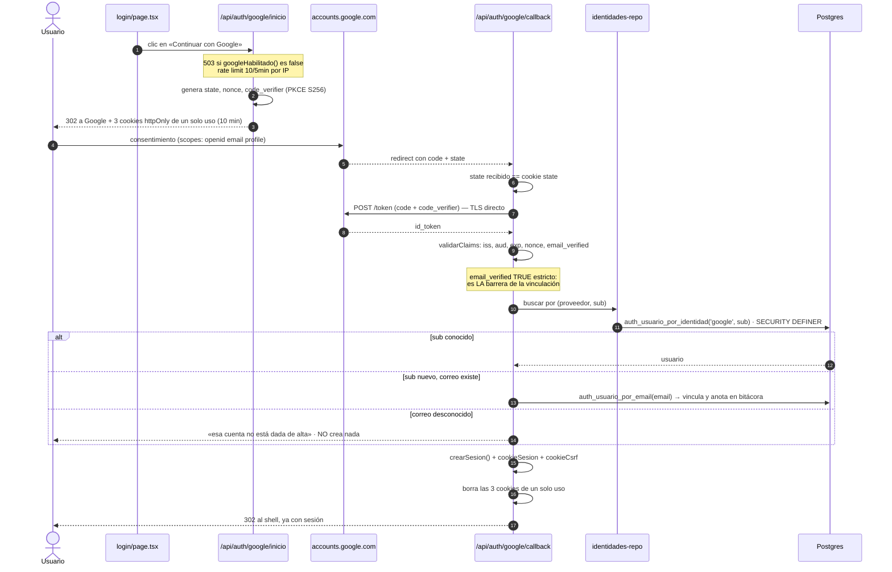

# Flujo: acceso con cuenta de Google (ADR 0012)

> [!warning] Nota revisada la tarde del 07/08
> Esta nota se escribió a las 12:15 con el ADR original. Entre las 12:51 y las
> 17:43 otra sesión **enmendó el ADR 0012** y encendió Google en producción. Lo
> de abajo ya está actualizado, pero es el área que más se mueve del repo:
> confirma contra `docs/adr/0012-acceso-con-cuenta-de-google.md` antes de tocarla.

## Estado hoy (07/08, tarde)

| Pieza | Estado |
|---|---|
| Código en producción | Sí |
| Migración `identidades_externas` | **Aplicada** el 07/08 11:13 |
| Credenciales de Google Cloud | **Configuradas** |
| Verificado en producción | Sí (`f6e4132`) |
| Alta de usuarios y empresas con Google | **Sí** — enmienda al ADR (`4206ab2`) |

## Principio de diseño

Termina exactamente donde termina el login normal: `crearSesion()` + las dos
cookies. Cero cambios en `exigir()`, en el middleware o en los 86 handlers.

**Google nunca decide a qué organización perteneces ni qué rol tienes.** Eso no
cambió con la enmienda.

## Secuencia

## Por qué `sub` y no correo

El correo de Google **no es estable**: se puede cambiar en un Workspace y una
dirección liberada puede reasignarse. El `sub` es inmutable. Solo la **primera**
vez se resuelve por correo, y a partir de ahí por `sub`.

## Sin dependencias nuevas

`lib/server/google-oauth.ts:5-17`: el `id_token` llega por canal directo
servidor-a-servidor, y OIDC Core §3.1.3.7 punto 6 permite no verificar la firma.

> [!danger] La exención vale SOLO para ese canal
> Si algún día se añade el botón One Tap (alternativa B del ADR), el `id_token`
> llega **por el navegador** y hay que verificar la firma contra el JWKS. **No
> reutilizar `validarClaims()` para eso** sin añadir la verificación.

## Lo que las 18 pruebas cubren

`apps/web/lib/test/google-oauth.e2e.test.ts` contra un doble local del endpoint
de token (`lib/test/doble-google.ts`). Casi todo son casos **negativos**:

| Grupo | Casos |
|---|---|
| Arranque | state/nonce/PKCE presentes; no pide más permisos que la identidad; cambian en cada intento |
| Primera entrada | entra, deja sesión **utilizable**, graba el vínculo, lo anota en bitácora; manda el `code_verifier`; borra las 3 cookies |
| No da de alta | correo desconocido no crea usuario; usuario desactivado no entra |
| Protecciones | state que no coincide; sin cookies; nonce distinto (replay); state reutilizado |
| Claims | `email_verified:false`; `aud` de otra app; token expirado |
| Fallos | canje rechazado; usuario que cancela ve «cancelado», no una avería |

Verificado por **mutación**: quitando la comparación de `state` cae exactamente
la prueba que lo cubre.

## La enmienda del 07/08: dar de alta con Google

Commit `4206ab2`. Dos formas nuevas de que una cuenta **nazca** ligada a Google.

### 1 · Alta de usuario «entra con Google»

En Administración → Usuarios, `entraConGoogle: true` y **no se manda
contraseña**: el servidor genera una que nadie ve. Quita la fricción de inventar
una y pasarla por chat, donde queda escrita en el historial de alguien.

> [!important] La fila CONSERVA `password_hash`, y eso es lo que hace que funcione
> Sin hash, esa persona no podría desbloquear operaciones de dinero ni cambiar su
> perfil, y un restablecimiento la dejaría **encerrada**. Con hash, `cambios.ts`
> y `perfil-controller.ts` no se tocan. **Es la restricción 4 del ADR resuelta
> por construcción, no por excepción — no la quites.**

La contraseña se **construye** cumpliendo la política, no se confía al azar:
base64url puede salir sin letra o sin dígito y el alta fallaría una vez de cada
tantas — «el peor tipo de fallo, porque no se reproduce cuando lo buscas». Hay
prueba con 500 generaciones. Y se rechaza el alta si Google no está habilitado en
ese servidor: crearía a alguien que no puede entrar de ninguna forma.

### 2 · Alta de organización con Google

**Revierte en parte el rechazo de la alternativa C** del ADR, y por eso va con
enmienda escrita.

El motivo del rechazo sigue siendo correcto (el mismo despliegue sirve la demo y
producción sobre la misma base), pero ese riesgo **ya lo gobierna
`NEXT_PUBLIC_AUTOREGISTRO`** para `/api/signup`. Se cuelga del **mismo
interruptor**, comprobado en el servidor.

El nombre de la organización se pide **antes** de ir a Google y viaja en **cookie
httpOnly**:

- **No** en el `state`, que va y vuelve por la URL, donde cualquiera lo vería y
  podría cambiarlo;
- y su **presencia** es lo que distingue «entrar» de «darse de alta», así que
  decidirlo desde la URL de vuelta sería dejar que el visitante eligiera qué
  operación ejecuta el servidor.

## Lo que sigue fuera

1. **Reautenticación por Google** para dinero. Sigue siendo la contraseña propia
   (ADR 0009). Ya no es un bloqueo, porque todos los usuarios tienen hash.
2. **`GOOGLE_HD`** (restringir a un dominio): es global y solo admite uno, y aquí
   conviven cinco organizaciones.

## Para encenderlo

1. Crear el cliente OAuth en Google Cloud desde una **cuenta de empresa**.
2. Redirect URI **con barra final**:
   `https://demo.space-os.io/spaces-dooh/api/auth/google/callback/`
3. `GOOGLE_CLIENT_ID`, `GOOGLE_CLIENT_SECRET`, `GOOGLE_REDIRECT_URI` en
   `.env.production` + `pm2 reload spaces-web --update-env`. **No hace falta
   recompilar.**
4. Apagar es inmediato: `GOOGLE_OAUTH=0` + reload.

## Relacionadas
[[autenticacion-y-sesion]] · [[flujo-login]] · [[acceso-y-sesion-ui]] ·
[[decisiones]] · [[migraciones]] · [[preguntas-abiertas]] · [[MOC-Proyecto]]
