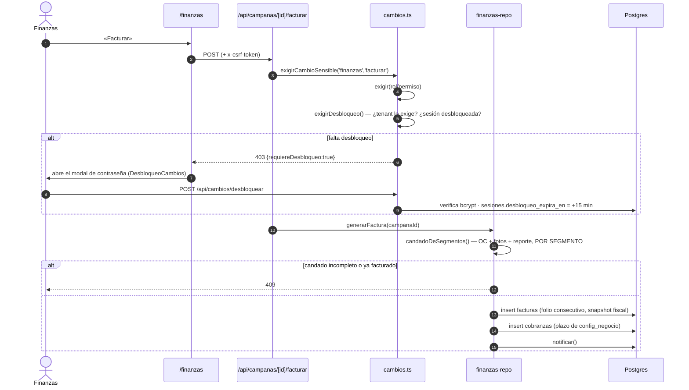
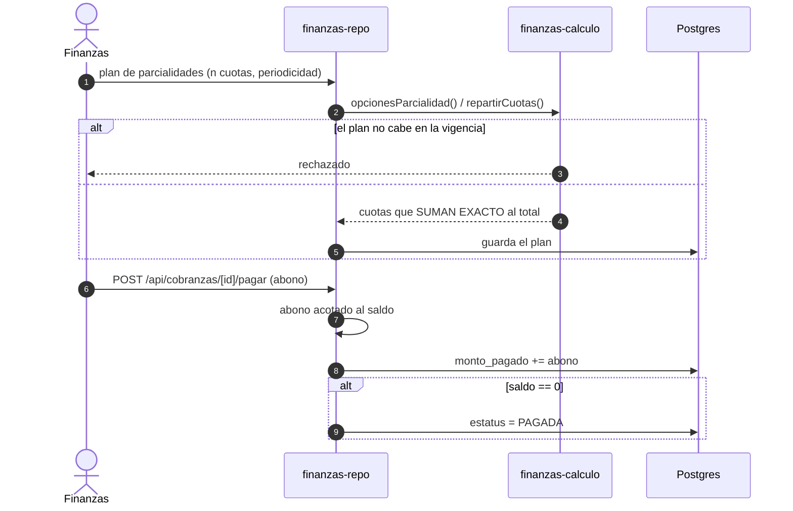

# Flujo: facturación y cobranza

> [!danger] Escritura irreversible
> Emitir una factura consume folio fiscal y crea una cobranza. Ambos endpoints
> son `SENSIBLE`. Ver [[zonas-de-riesgo]].

## De candado a factura

## Las tres llaves del candado

| Llave | Se enciende en |
|---|---|
| `oc_recibida` | Registro de la OC ([[operaciones-y-ot]] / imprenta) |
| `fotos_comprobatorias` | Cierre de OT con evidencia |
| `reporte_publicacion` | Cierre de OT |

**Doble factura sobre lo mismo → 409** (hallazgo A-2, verificado en e2e).

## Cobranza en parcialidades

Reglas verificadas por `flujo-critico.e2e.test.ts`: suma exacta, plan que no
cabe, abono acotado, liquidación.

## Recordatorios de cobro

`cobranzas.recordatorio_en` + `recordatorios_enviados` dan cadencia e
idempotencia. `POST /api/cobranzas/[id]/recordar` es manual; el barrido
automático de **contratos** (no de cobranzas) es el cron —
[[integraciones-externas]].

## Snapshot fiscal

`facturas` copia `rfc`, `razon_social`, `uso_cfdi` al emitir. Cambiar los datos
del cliente **no** altera facturas ya emitidas. Es intencional.

## Relacionadas
[[finanzas-y-cobranza]] · [[flujo-propuesta-a-campana]] ·
[[flujo-orden-de-trabajo]] · [[autenticacion-y-sesion]] · [[MOC-Proyecto]]
