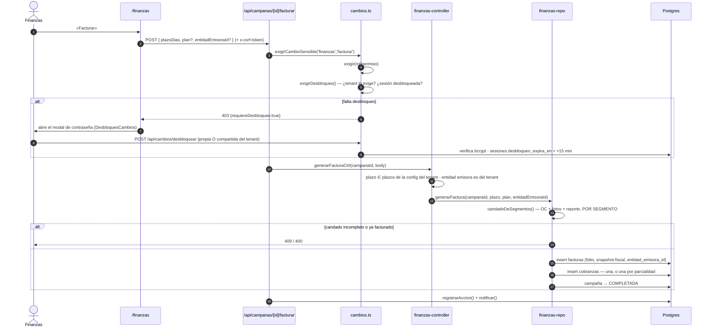
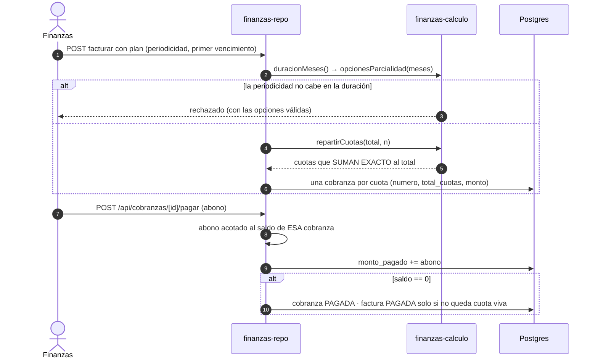

# Flujo: facturación y cobranza

> [!danger] Escritura irreversible
> Emitir una factura consume folio fiscal y crea una cobranza. Ambos endpoints
> son `SENSIBLE`. Ver [[zonas-de-riesgo]].

## De candado a factura

```mermaid
sequenceDiagram
    autonumber
    actor F as Finanzas
    participant UI as /finanzas
    participant RT as /api/campanas/[id]/facturar
    participant CB as cambios.ts
    participant FC as finanzas-controller
    participant FR as finanzas-repo
    participant PG as Postgres

    F->>UI: «Facturar»
    UI->>RT: POST { plazoDias, plan?, entidadEmisoraId? } (+ x-csrf-token)
    RT->>CB: exigirCambioSensible('finanzas','facturar')
    CB->>CB: exigir(rol/permiso)
    CB->>CB: exigirDesbloqueo() — ¿tenant lo exige? ¿sesión desbloqueada?
    alt falta desbloqueo
        CB-->>UI: 403 {requiereDesbloqueo:true}
        UI->>F: abre el modal de contraseña (DesbloqueoCambios)
        F->>CB: POST /api/cambios/desbloquear (propia O compartida del tenant)
        CB->>PG: verifica bcrypt · sesiones.desbloqueo_expira_en = +15 min
    end
    RT->>FC: generarFacturaCtrl(campanaId, body)
    FC->>FC: plazo ∈ plazos de la config del tenant · entidad emisora es del tenant
    FC->>FR: generarFactura(campanaId, plazo, plan, entidadEmisoraId)
    FR->>FR: candadoDeSegmentos() — OC + fotos + reporte, POR SEGMENTO
    alt candado incompleto o ya facturado
        FR-->>F: 409 / 400
    else
        FR->>PG: insert facturas (folio, snapshot fiscal, entidad_emisora_id)
        FR->>PG: insert cobranzas — una, o una por parcialidad
        FR->>PG: campaña → COMPLETADA
    end
    RT->>PG: registrarAccion() + notificar()
```

> [!note] 2026-10-05 · lo que cambió desde el 07/08
> - **`notificar()` lo llama el route, no el repo**, y fuera de la transacción
>   (`app/api/campanas/[id]/facturar/route.ts:20-21`).
> - **El plazo ya no es 60/90/120 a fuego**: sale de la configuración de la
>   organización (`plazosCobranzaDelTenant()`, `config-repo.ts:110`), que se lee
>   antes de validar (`finanzas-controller.ts:87`). 60/90/120 queda solo como
>   respaldo si la lista está vacía (`config-repo.ts:88`). Commit `b7ed5cb4`.
> - **La factura lleva la razón social que la emite**: `entidadEmisoraId`,
>   opcional y validada contra el tenant antes de emitir
>   (`finanzas-controller.ts:69-72` y `:102-106`), que viaja al `insert`
>   (`finanzas-repo.ts:209`). No toca ningún importe. Commit `8c6002e7`.
> - **El cuerpo es `.strict()`**: un `monto` o `subtotal` colado se rechaza con
>   400 en vez de ignorarse en silencio. Los importes se derivan siempre en el
>   servidor.
> - **El folio de la factura NO es consecutivo**: es `F001-` + 8 hexadecimales
>   al azar (`finanzas-repo.ts:138`). La unicidad la dan el índice único
>   `facturas_campana_uq` y la comprobación dentro de la transacción
>   (`:202`), no el folio.

## Las tres llaves del candado

| Llave | Se enciende en |
|---|---|
| `oc_recibida` | Registro de la OC (`ordenes-compra-repo.ts:65`) o de imprenta (`impresion-repo.ts:109`) |
| `fotos_comprobatorias` | Cierre de una OT **`MONTAJE_LONA`** con foto (`ot-repo.ts:306-309`) — [[flujo-orden-de-trabajo]] |
| `reporte_publicacion` | Aprobar la publicación (`campanas-repo.ts:1247`) o el proof-of-play (`playlogs-repo.ts:92`) — **nunca** el cierre de una OT |

> [!note] 2026-10-05 · la tabla decía que las dos últimas llaves salían del cierre de la OT
> No es así: el cierre solo enciende `fotos_comprobatorias`, y solo en OT de
> montaje de lona. La evidencia digital va aparte (hallazgo N-5), para que una
> campaña sin segmento digital no quede con evidencia digital.

La regla es **por segmento** (`candadoDeSegmentos()`, `finanzas-repo.ts:171`):
una HÍBRIDA exige evidencia física **y** digital; una 100 % física o digital,
solo la suya. Además, el cliente necesita RFC y razón social (`:182`).

**Doble factura sobre lo mismo → 409** (hallazgo A-2, verificado en e2e).

## Cobranza en parcialidades

El plan **viaja en el mismo `POST` de facturar** (`plan: { periodicidad,
primerVencimiento }`, `finanzas-controller.ts:50-60`); no es un paso aparte.
Ni el número de cuotas ni los importes vienen del cliente: se derivan de la
duración de la campaña (`finanzas-repo.ts:219-252`).

```mermaid
sequenceDiagram
    autonumber
    actor F as Finanzas
    participant FR as finanzas-repo
    participant FC as finanzas-calculo
    participant PG as Postgres

    F->>FR: POST facturar con plan (periodicidad, primer vencimiento)
    FR->>FC: duracionMeses() → opcionesParcialidad(meses)
    alt la periodicidad no cabe en la duración
        FC-->>F: rechazado (con las opciones válidas)
    else
        FR->>FC: repartirCuotas(total, n)
        FC-->>FR: cuotas que SUMAN EXACTO al total
        FR->>PG: una cobranza por cuota (numero, total_cuotas, monto)
    end
    F->>FR: POST /api/cobranzas/[id]/pagar (abono)
    FR->>FR: abono acotado al saldo de ESA cobranza
    FR->>PG: monto_pagado += abono
    alt saldo == 0
        FR->>PG: cobranza PAGADA · factura PAGADA solo si no queda cuota viva
    end
```

Funciones puras en `lib/finanzas-calculo.ts`: `repartirCuotas()` (`:33`),
`duracionMeses()` (`:51`), `opcionesParcialidad()` (`:73`). Si la suma de
cuotas no cuadra con la factura, se aborta antes de facturar
(`finanzas-repo.ts:236-243`). El pago lo registra `registrarPagoCobranza()`
(`finanzas-repo.ts:275`, acotado en `:284`).

Reglas verificadas por `flujo-critico.e2e.test.ts`: suma exacta, plan que no
cabe, abono acotado, liquidación.

## El desbloqueo admite dos contraseñas (ADR 0036)

`desbloquear()` (`cambios.ts:192`) acepta **la propia de login** o una
**compartida del tenant** que asigna el Dueño (`tenants.cambios_password_hash`,
`cambios.ts:228-234`). Las dos abren el candado de dinero por 15 minutos
(`DESBLOQUEO_MINUTOS`, `:58`). La diferencia está en `desbloqueo_es_propio`: la
compartida **no** sirve para tocar el acceso de otra persona
(`exigirReautenticacionSiempre()`, `:301`), porque no prueba identidad. Ver
[[autenticacion-y-sesion]].

## Recordatorios de cobro

`cobranzas.recordatorio_en` + `recordatorios_enviados` dan cadencia e
idempotencia. `POST /api/cobranzas/[id]/recordar` es manual; el barrido
automático de **contratos** (no de cobranzas) es el cron —
[[integraciones-externas]].

## Snapshot fiscal

`facturas` copia `rfc`, `razon_social`, `uso_cfdi` al emitir. Cambiar los datos
del cliente **no** altera facturas ya emitidas. Es intencional.

## Relacionadas
[[finanzas-y-cobranza]] · [[flujo-propuesta-a-campana]] ·
[[flujo-orden-de-trabajo]] · [[autenticacion-y-sesion]] · [[MOC-Proyecto]]
