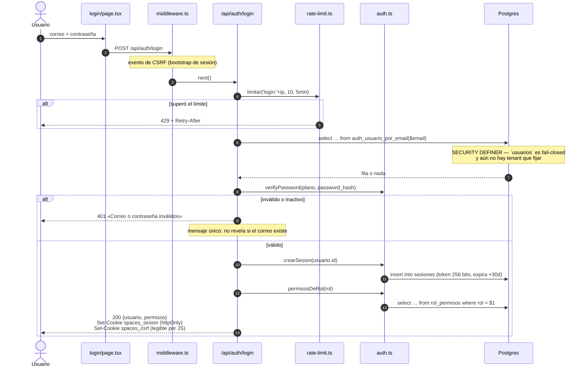

# Flujo: login con contraseña

Del clic a la cookie, y de la cookie al primer dato.



## Y en la siguiente petición

```mermaid
sequenceDiagram
    autonumber
    participant N as Navegador
    participant MW as middleware.ts
    participant RT as route handler
    participant AU as auth.ts
    participant TN as tenant.ts
    participant DB as db.ts
    participant PG as Postgres

    N->>MW: GET /inicio (cookie spaces_sesion)
    MW->>MW: ¿existe la cookie? (NO la valida)
    MW->>N: renderiza el shell
    N->>RT: GET /api/estado + x-csrf-token
    RT->>AU: exigir()
    AU->>PG: auth_usuario_por_sesion($token)
    PG-->>AU: usuario (o nada si expiró / inactivo)
    AU->>AU: ¿debeCambiarPassword? → 403 y corta TODO
    RT->>DB: q('select … ')
    DB->>TN: tenantActual()
    TN-->>DB: tenant_id de la sesión
    DB->>PG: begin; set_config('app.tenant_id', …, true); SELECT; commit
    PG-->>RT: filas ya filtradas por RLS
```

## Puntos donde esto se rompe

| Síntoma | Causa probable |
|---|---|
| Todas las mutaciones dan **403 CSRF** | El parche de `fetch` no se instaló ([[estado-y-data-fetching]]) |
| Login correcto pero cero datos | Consulta con `qRaw` en vez de `q` → RLS devuelve vacío ([[multi-tenancy-y-rls]]) |
| Bucle de redirección al login | Cookie sin `Secure` sobre HTTPS, o `COOKIE_SECURE` mal puesto |
| 401 en todo tras restablecer | `debe_cambiar_password` activo — es lo esperado |

## Relacionadas
[[autenticacion-y-sesion]] · [[flujo-acceso-con-google]] ·
[[multi-tenancy-y-rls]] · [[acceso-y-sesion-ui]] · [[MOC-Proyecto]]
