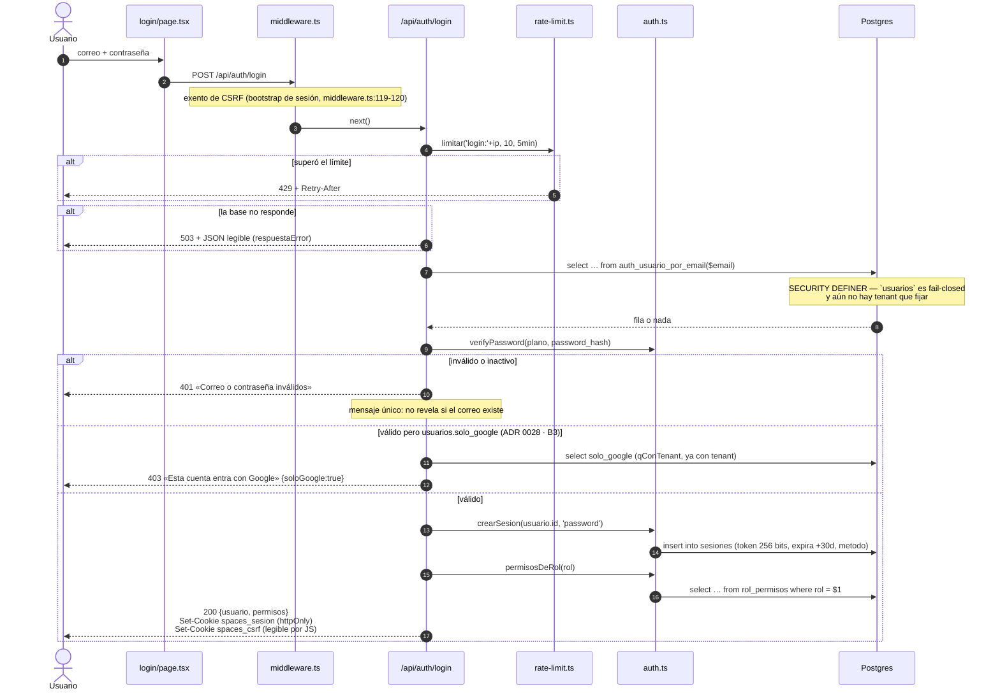

# Flujo: login con contraseña

Del clic a la cookie, y de la cookie al primer dato.

```mermaid
sequenceDiagram
    autonumber
    actor U as Usuario
    participant P as login/page.tsx
    participant MW as middleware.ts
    participant RT as /api/auth/login
    participant RL as rate-limit.ts
    participant AU as auth.ts
    participant PG as Postgres

    U->>P: correo + contraseña
    P->>MW: POST /api/auth/login
    Note over MW: exento de CSRF (bootstrap de sesión, middleware.ts:119-120)
    MW->>RT: next()
    RT->>RL: limitar('login:'+ip, 10, 5min)
    alt superó el límite
        RL-->>U: 429 + Retry-After
    end
    alt la base no responde
        RT-->>U: 503 + JSON legible (respuestaError)
    end
    RT->>PG: select … from auth_usuario_por_email($email)
    Note over PG: SECURITY DEFINER — `usuarios` es fail-closed<br/>y aún no hay tenant que fijar
    PG-->>RT: fila o nada
    RT->>AU: verifyPassword(plano, password_hash)
    alt inválido o inactivo
        RT-->>U: 401 «Correo o contraseña inválidos»
        Note over RT: mensaje único: no revela si el correo existe
    else válido pero usuarios.solo_google (ADR 0028 · B3)
        RT->>PG: select solo_google (qConTenant, ya con tenant)
        RT-->>U: 403 «Esta cuenta entra con Google» {soloGoogle:true}
    else válido
        RT->>AU: crearSesion(usuario.id, 'password')
        AU->>PG: insert into sesiones (token 256 bits, expira +30d, metodo)
        RT->>AU: permisosDeRol(rol)
        AU->>PG: select … from rol_permisos where rol = $1
        RT-->>U: 200 {usuario, permisos}<br/>Set-Cookie spaces_sesion (httpOnly)<br/>Set-Cookie spaces_csrf (legible por JS)
    end
```

## Y en la siguiente petición

```mermaid
sequenceDiagram
    autonumber
    participant N as Navegador
    participant MW as middleware.ts
    participant RT as route handler
    participant AU as auth.ts
    participant TN as tenant.ts
    participant DB as db.ts
    participant PG as Postgres

    N->>MW: GET /inicio (cookie spaces_sesion)
    MW->>MW: ¿existe la cookie? (NO la valida)
    MW->>N: renderiza el shell
    N->>RT: GET /api/estado + x-csrf-token
    RT->>AU: exigir()
    AU->>PG: auth_usuario_por_sesion($token)
    PG-->>AU: usuario (o nada si expiró / inactivo)
    AU->>AU: ¿debeCambiarPassword? → 403 y corta TODO
    RT->>DB: q('select … ')
    DB->>TN: tenantActual()
    TN-->>DB: tenant_id de la sesión
    DB->>PG: begin; set_config('app.tenant_id', …, true); SELECT; commit
    PG-->>RT: filas ya filtradas por RLS
```

> [!note] `crearSesion` lleva un segundo argumento desde el 25/08
> `auth.ts:107` pide `metodo: MetodoSesion`, y el login por contraseña pasa
> `'password'` (`login/route.ts:107`). La columna la añadió
> `20260825_sesion_metodo.sql` y existe porque **quien entró con Google no tiene
> contraseña que reautenticar**: sin saber cómo se abrió la sesión, el desbloqueo
> de un cambio sensible le pediría algo que no tiene. Ver
> [[flujo-acceso-con-google]] y el ADR 0018.

> [!note] 2026-10-05 · dos salidas nuevas antes de crear la sesión
> - **`solo_google` → 403** (`login/route.ts:89-105`, commit `d6d2eec2`). Va
>   **después** de verificar la contraseña a propósito: decir «esta cuenta
>   entra con Google» a quien no la sabe sería confirmarle que la cuenta
>   existe. La bandera se lee aparte con `qConTenant` y no sale de
>   `auth_usuario_por_email()`, porque añadirle una columna obligaría a editar
>   una migración ya aplicada (R3). Ver [[flujo-acceso-con-google]].
> - **Base caída → 503 con JSON** (commit `35f7ad1d`, 30/09). Antes la
>   consulta lanzaba fuera de todo `try` y Next contestaba un 500 con el cuerpo
>   vacío, que la pantalla convertía en «Unexpected end of JSON input». Ahora
>   todo lo que toca la base va dentro del `try` (`login/route.ts:40-44`) y
>   `respuestaError` lo traduce a 503 (`errores.ts:126-144` y `:221`). No
>   cambia nada de lo que se decide: 401 y 403 siguen igual.

## Puntos donde esto se rompe

| Síntoma | Causa probable |
|---|---|
| Todas las mutaciones dan **403 CSRF** | El parche de `fetch` no se instaló ([[estado-y-data-fetching]]) |
| Login correcto pero cero datos | Consulta con `qRaw` en vez de `q` → RLS devuelve vacío ([[multi-tenancy-y-rls]]) |
| Bucle de redirección al login | Cookie sin `Secure` sobre HTTPS, o `COOKIE_SECURE` mal puesto |
| 401 en todo tras restablecer | `debe_cambiar_password` activo — es lo esperado |
| 403 con contraseña correcta | La cuenta es `solo_google`: entra con el botón de Google |
| 503 «servicio no disponible» al entrar | Postgres apagado o inalcanzable — no es un fallo de credenciales |

## Relacionadas
[[autenticacion-y-sesion]] · [[flujo-acceso-con-google]] ·
[[multi-tenancy-y-rls]] · [[acceso-y-sesion-ui]] · [[MOC-Proyecto]]
