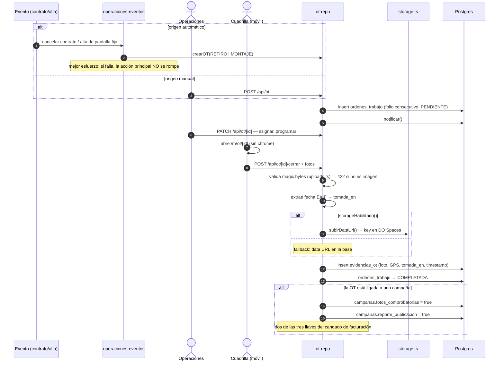
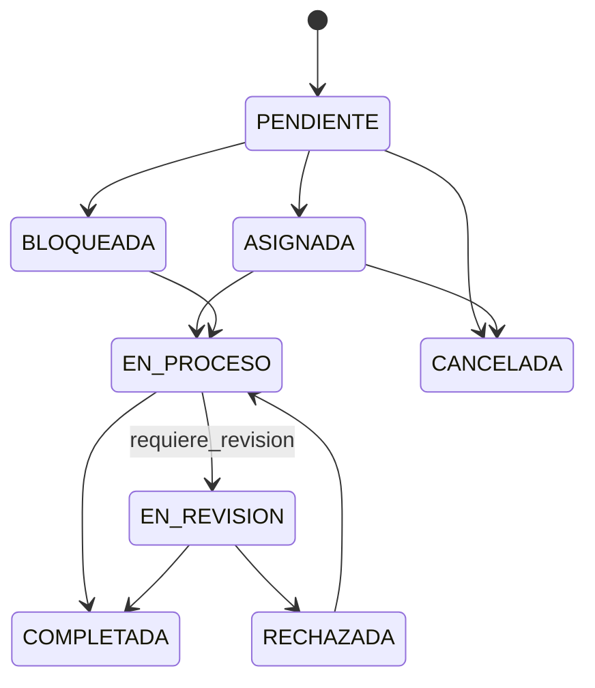

# Flujo: orden de trabajo en campo

Es el flujo de escritura que **destraba el dinero**: sin evidencia no hay
facturación.

## Estados

## Las dos fechas de la evidencia

| Columna | Qué prueba |
|---|---|
| `tomada_en` | Cuándo se hizo la foto (EXIF) |
| `timestamp` | Cuándo se subió |

Para demostrar que la lona estaba puesta el día que se cobró, la que vale es
`tomada_en`. Si el EXIF falta, queda `null` — **no** se rellena con la fecha de
subida.

## Subida de fotos: lo que la UI aprendió

Cada foto se lee entera (hasta 8 MB) y se le extrae la fecha, y se pueden subir
varias de golpe. Antes **no había ningún aviso** y la pantalla parecía colgada.
Hoy dice **cuántas** está cargando, y el aviso se apaga aunque el archivo resulte
ilegible (`docs/Registro_Cambios.md`, 06/08).

## Relacionadas
[[operaciones-y-ot]] · [[flujo-facturacion-y-cobranza]] ·
[[arrendadores-y-contratos]] · [[paginas-publicas]] ·
[[integraciones-externas]] · [[MOC-Proyecto]]
