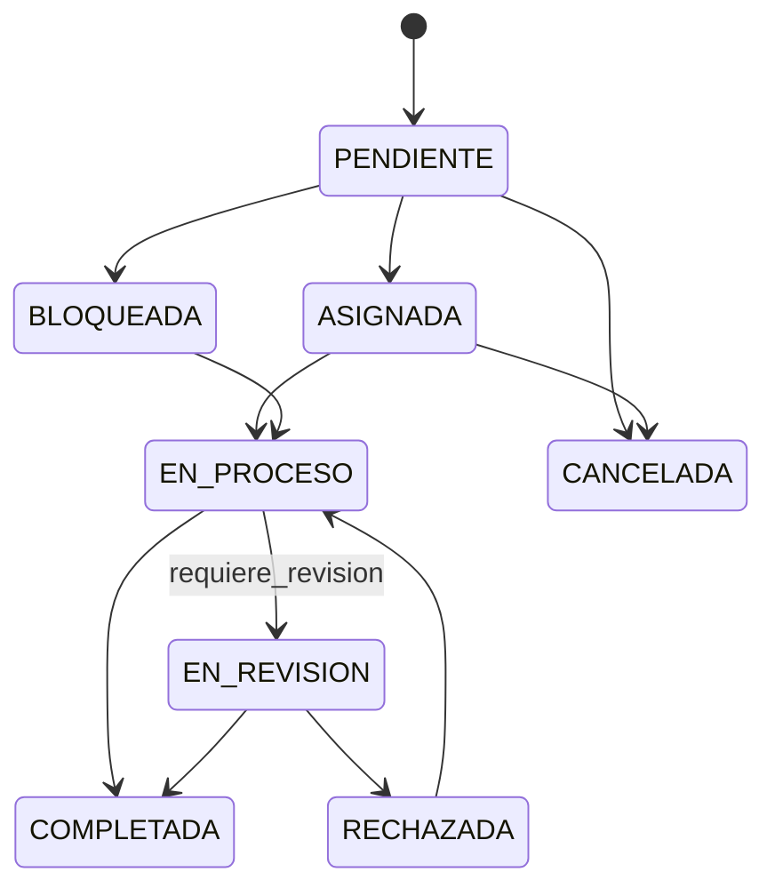

# Flujo: orden de trabajo en campo

Es el flujo de escritura que **destraba el dinero**: sin evidencia no hay
facturación.

```mermaid
sequenceDiagram
    autonumber
    participant EV as Evento (contrato/alta)
    participant OE as operaciones-eventos
    actor OP as Operaciones
    actor CU as Cuadrilla (móvil)
    participant OT as ot-repo
    participant ST as storage.ts
    participant PG as Postgres

    alt origen automático
        EV->>OE: cancelar contrato / alta de pantalla fija
        OE->>OT: crearOT(RETIRO | MONTAJE)
        Note over OE: mejor esfuerzo: si falla, la acción principal NO se rompe
    else origen manual
        OP->>OT: POST /api/ot
    end
    OT->>PG: insert ordenes_trabajo (folio consecutivo, PENDIENTE, requiere_revision)
    OT->>PG: registrarAccion() — bitácora (el route; no hay notificar() al crear)

    Note over OP,OT: no hay ruta para reasignar ni reprogramar una OT ya creada (ver operaciones-y-ot)
    CU->>CU: abre /m/ot/[id] (sin chrome)
    loop cada punto tachado o destachado (desde el 2026-09-30)
        CU->>OT: PATCH /api/ot/[id]/checklist {indice, label, hecho}
        OT->>PG: update … jsonb_set(checklist[i].hecho) — sin tocar estatus
        Note over CU: la cola manda UNA a la vez · «Guardando… / Guardado / Reintentar»
    end
    CU->>OT: POST /api/ot/[id]/cerrar + fotos
    OT->>OT: valida magic bytes (uploads.ts) — 422 si no es imagen
    OT->>OT: extrae fecha EXIF → tomada_en
    alt storageHabilitado()
        OT->>ST: subirDataUrl() → key en DO Spaces
    else
        Note over OT: fallback: data URL en la base
    end
    OT->>PG: insert evidencias_ot (foto, GPS, tomada_en, timestamp)
    OT->>PG: ordenes_trabajo → COMPLETADA
    alt la OT es MONTAJE_LONA y está ligada a una campaña
        OT->>PG: campanas.fotos_comprobatorias = true
        OT->>PG: → LISTA_FACTURAR si ya hay OC (y, en HÍBRIDA, reporte_publicacion)
        Note over OT: UNA de las tres llaves del candado — nunca reporte_publicacion
    end
    Note over OP,OT: el costo se captura ANTES de cerrar (desde el 08/10)
    OP->>OT: PATCH /api/ot/[id]/costo {costoReal} — con la OT ya COMPLETADA: 409
    OT->>PG: ordenes_trabajo.costo_real — candado de cambios (dinero)
```

> [!warning] 2026-10-05 · el cierre enciende UNA llave, no dos
> Este diagrama decía que cerrar una OT ligada a una campaña ponía
> `fotos_comprobatorias` **y** `reporte_publicacion`. **No es así, y no lo era
> desde el hallazgo N-5.** `cerrarOT()` (`ot-repo.ts:254`) solo toca la campaña
> si la OT es de tipo `MONTAJE_LONA` (`:306`), y entonces enciende
> **únicamente** `fotos_comprobatorias` (`:309`). Las OT de inspección,
> mantenimiento o desmontaje no completan evidencia de facturación.
> `reporte_publicacion` (la evidencia DIGITAL) sale de aprobar la publicación
> (`campanas-repo.ts:1247`) o del proof-of-play (`playlogs-repo.ts:92`). Ver
> [[flujo-facturacion-y-cobranza]].
>
> Tampoco había `notificar()` al crear: el route de alta solo anota en la
> bitácora (`app/api/ot/route.ts:24`). El aviso que existe es el de OT
> **vencidas** (`notificarOTsVencidas()`, `ot-repo.ts:68`).
>
> Y el cierre deja la OT en `COMPLETADA` directamente (`ot-repo.ts:275-279`),
> aunque `crearOT` la dé de alta con `requiere_revision = true` (`:243-245`).

## El costo REAL de la OT (OT-COSTO-01, 2026-09-29)

`PATCH /api/ot/[id]/costo` fija o borra `ordenes_trabajo.costo_real`
(`fijarCostoOT()`, `ot-repo.ts:117`), que sustituye la estimación por tipo en
el reporte de rentabilidad (commit `525b7c8b`). **Es una ruta propia y no un
campo de `cerrar`, a propósito** (`app/api/ot/[id]/costo/route.ts:15-30`): el
cierre lo hace un técnico en la calle y no debe pedir la contraseña del candado
de cambios, el costo se conoce días después, y las OT ya cerradas no tendrían
otra forma de capturarlo. **Desde el 08/10 eso último ya no vale:** por
decisión del dueño, una OT cerrada ya no admite costo (409) y la pantalla lo
avisa antes de cerrar; ver [[costo-real-de-ot]]. La ruta va por `exigirCambioSensible('operaciones', 'costear')` (`:56`), como todo lo
que es dinero. Detalle en [[operaciones-y-ot]].

## Estados

```mermaid
stateDiagram-v2
    [*] --> PENDIENTE
    PENDIENTE --> ASIGNADA
    ASIGNADA --> EN_PROCESO
    EN_PROCESO --> EN_REVISION: requiere_revision
    EN_PROCESO --> COMPLETADA
    EN_REVISION --> COMPLETADA
    EN_REVISION --> RECHAZADA
    RECHAZADA --> EN_PROCESO
    PENDIENTE --> BLOQUEADA
    BLOQUEADA --> EN_PROCESO
    PENDIENTE --> CANCELADA
    ASIGNADA --> CANCELADA
```

## El avance del checklist no se pierde (2026-09-30)

Hasta el 30/09, lo tachado vivía solo en la pantalla y se perdía al recargar:
lo único que escribía el checklist era el cierre, que lo pone todo en hecho.
Hoy cada clic se guarda al momento, **sin cambiar el estado de la OT**: marcar
el último punto no la cierra, y cerrar sigue pidiendo foto y ubicación. Quien
solo tiene `operaciones.ver` (Finanzas, Imprenta) lo ve de solo lectura.
Detalle de las decisiones y sus pruebas en [[operaciones-y-ot]].

## Las dos fechas de la evidencia

| Columna | Qué prueba |
|---|---|
| `tomada_en` | Cuándo se hizo la foto (EXIF) |
| `timestamp` | Cuándo se subió |

Para demostrar que la lona estaba puesta el día que se cobró, la que vale es
`tomada_en`. Si el EXIF falta, queda `null` — **no** se rellena con la fecha de
subida.

## Subida de fotos: lo que la UI aprendió

Cada foto se lee entera (hasta 8 MB) y se le extrae la fecha, y se pueden subir
varias de golpe. Antes **no había ningún aviso** y la pantalla parecía colgada.
Hoy dice **cuántas** está cargando, y el aviso se apaga aunque el archivo resulte
ilegible (`docs/Registro_Cambios.md`, 06/08).

## Relacionadas
[[operaciones-y-ot]] · [[flujo-facturacion-y-cobranza]] ·
[[arrendadores-y-contratos]] · [[paginas-publicas]] ·
[[integraciones-externas]] · [[MOC-Proyecto]]
