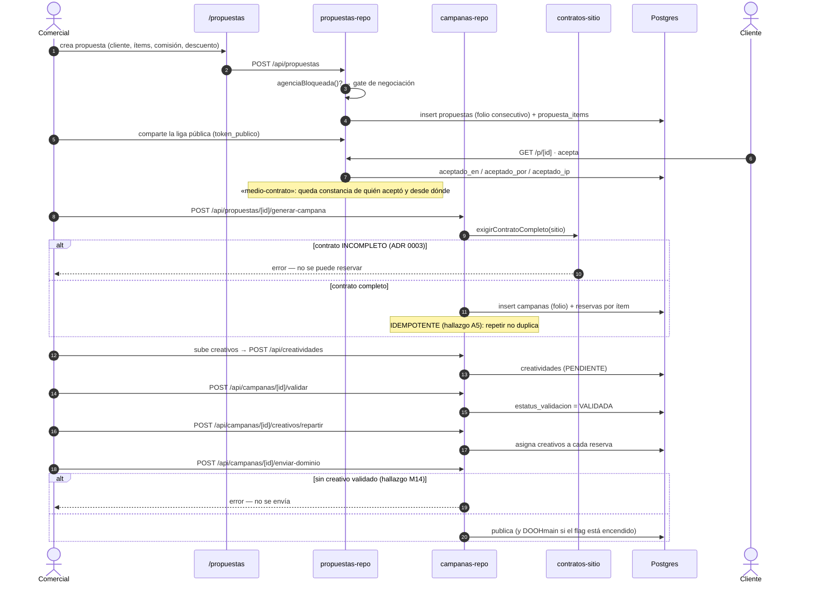
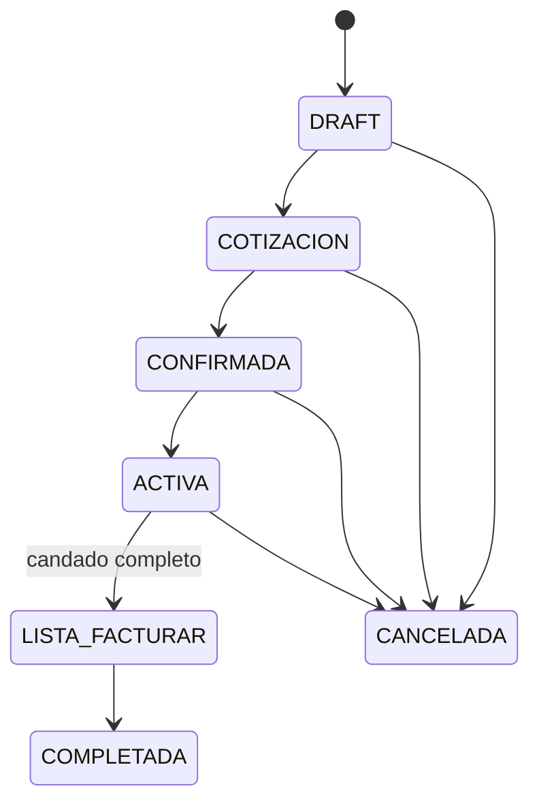

# Flujo principal: de propuesta a campaña publicada

Es el recorrido que define el producto. Está cubierto de punta a punta por
`apps/web/lib/test/flujo-critico.e2e.test.ts` (casos 1–7).

## Los tres candados de este flujo

| # | Regla | Qué pasa si falta | ADR / hallazgo |
|---|---|---|---|
| 1 | No reservar con contrato incompleto | Error al generar campaña | ADR 0003 |
| 2 | Generar campaña es idempotente | Repetir duplicaría campañas y reservas | A5 |
| 3 | No enviar a dominio sin creativo validado | Se publicaría una pantalla en blanco | M14 |

## Estados de la campaña

## Reservas y su caducidad

Una reserva nace `TENTATIVA` con `expira_en`. Si no se confirma, **caduca sola**.
La liberación de tentativas vencidas es una de las cuatro tareas de
mantenimiento que corren al abrir el shell (`docs/Registro_Cambios.md`, 06/08).

## Validaciones de dominio comprobadas

De `flujo-critico.e2e.test.ts`: fechas coherentes, comisión no mayor que 100%,
neto no negativo.

## Relacionadas
[[comercial-propuestas-campanas]] · [[flujo-facturacion-y-cobranza]] ·
[[flujo-orden-de-trabajo]] · [[inventario-y-sitios]] · [[glosario]] ·
[[MOC-Proyecto]]
