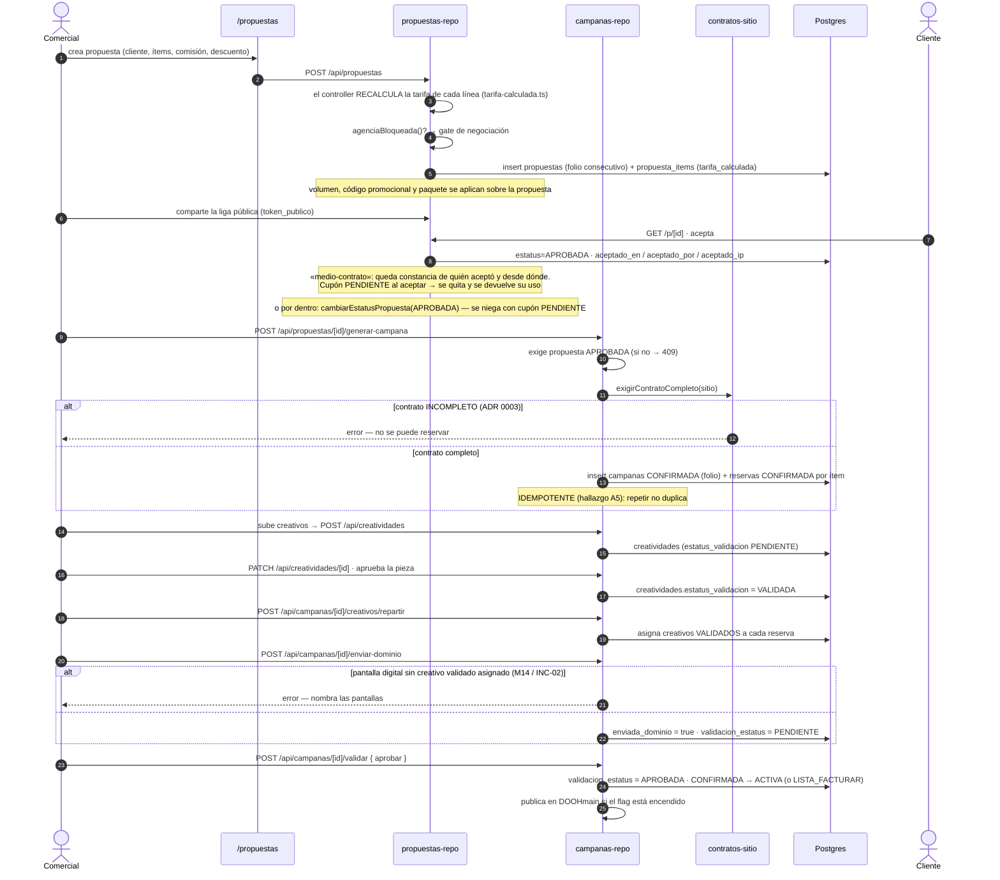
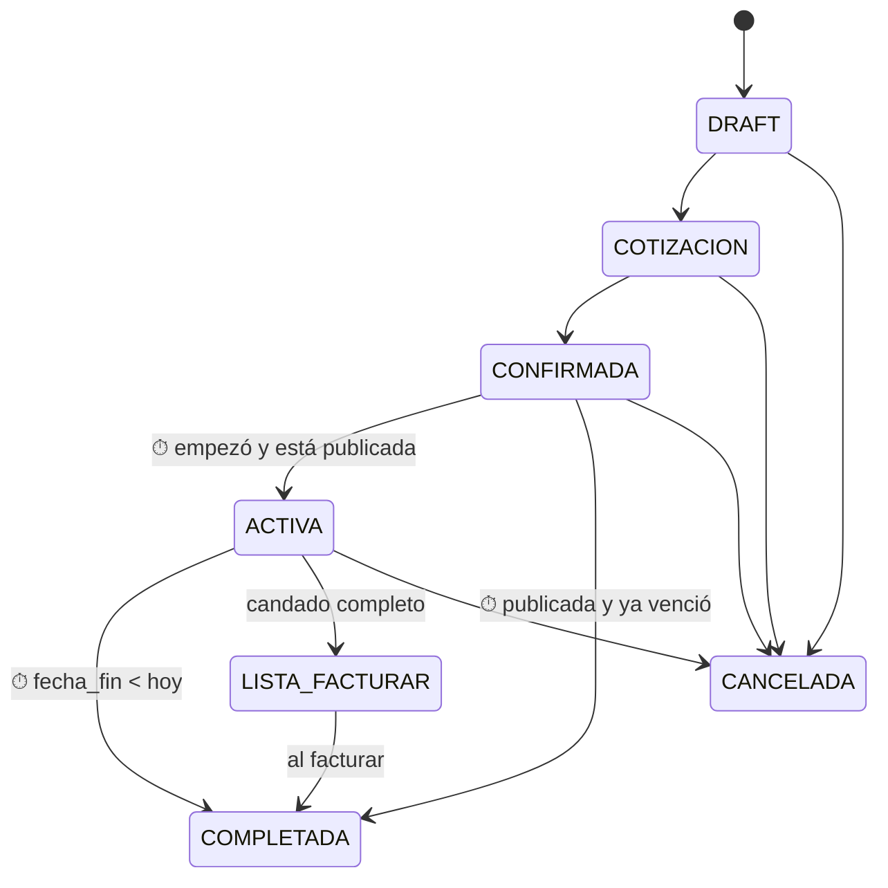

# Flujo principal: de propuesta a campaña publicada

Es el recorrido que define el producto. Está cubierto de punta a punta por
`apps/web/lib/test/flujo-critico.e2e.test.ts` (casos 1–7).

```mermaid
sequenceDiagram
    autonumber
    actor C as Comercial
    participant UI as /propuestas
    participant PR as propuestas-repo
    participant CR as campanas-repo
    participant CS as contratos-sitio
    participant PG as Postgres
    actor CL as Cliente

    C->>UI: crea propuesta (cliente, ítems, comisión, descuento)
    UI->>PR: POST /api/propuestas
    PR->>PR: el controller RECALCULA la tarifa de cada línea (tarifa-calculada.ts)
    PR->>PR: agenciaBloqueada()? → gate de negociación
    PR->>PG: insert propuestas (folio consecutivo) + propuesta_items (tarifa_calculada)
    Note over PR: volumen, código promocional y paquete se aplican sobre la propuesta
    C->>PR: comparte la liga pública (token_publico)
    CL->>PR: GET /p/[id] · acepta
    PR->>PG: estatus=APROBADA · aceptado_en / aceptado_por / aceptado_ip
    Note over PR: «medio-contrato»: queda constancia de quién aceptó y desde dónde.<br/>Cupón PENDIENTE al aceptar → se quita y se devuelve su uso
    Note over PR: o por dentro: cambiarEstatusPropuesta(APROBADA) — se niega con cupón PENDIENTE

    C->>CR: POST /api/propuestas/[id]/generar-campana
    CR->>CR: exige propuesta APROBADA (si no → 409)
    CR->>CS: exigirContratoCompleto(sitio)
    alt contrato INCOMPLETO (ADR 0003)
        CS-->>C: error — no se puede reservar
    else contrato completo
        CR->>PG: insert campanas CONFIRMADA (folio) + reservas CONFIRMADA por ítem
        Note over CR: IDEMPOTENTE (hallazgo A5): repetir no duplica
    end

    C->>CR: sube creativos → POST /api/creatividades
    CR->>PG: creatividades (estatus_validacion PENDIENTE)
    C->>CR: PATCH /api/creatividades/[id] · aprueba la pieza
    CR->>PG: creatividades.estatus_validacion = VALIDADA
    C->>CR: POST /api/campanas/[id]/creativos/repartir
    CR->>PG: asigna creativos VALIDADOS a cada reserva
    C->>CR: POST /api/campanas/[id]/enviar-dominio
    alt pantalla digital sin creativo validado asignado (M14 / INC-02)
        CR-->>C: error — nombra las pantallas
    else
        CR->>PG: enviada_dominio = true · validacion_estatus = PENDIENTE
    end
    C->>CR: POST /api/campanas/[id]/validar { aprobar }
    CR->>PG: validacion_estatus = APROBADA · CONFIRMADA → ACTIVA (o LISTA_FACTURAR)
    CR->>CR: publica en DOOHmain si el flag está encendido
```

> [!note] 2026-10-05 · el diagrama de arriba se corrigió contra el código
> La versión del 07/08 tenía tres cosas mal, y conviene decirlas porque son
> fáciles de volver a escribir:
>
> - **`VALIDADA` es de las creatividades, no de la campaña.** La pieza se
>   aprueba con `validarCreatividad()` (`creativos-repo.ts:69-70`). La campaña
>   usa otra columna, `validacion_estatus`, con `PENDIENTE` / `APROBADA` /
>   `RECHAZADA`.
> - **El orden es enviar-dominio y DESPUÉS validar.** `enviarADominio()`
>   (`campanas-repo.ts:1165`) deja la validación en `PENDIENTE` (el `update` en
>   `:1195-1205`), y `validarPublicacion()` exige que ya se haya enviado
>   (`:1221-1225`) y pone `APROBADA` (`:1243`). Validar antes de enviar devuelve
>   «no hay nada que validar».
> - **La publicación en DOOHmain la dispara aprobar, no enviar**
>   (`app/api/campanas/[id]/validar/route.ts:38`). Un fallo ahí no revierte la
>   aprobación.

## Los tres candados de este flujo

| # | Regla | Qué pasa si falta | ADR / hallazgo |
|---|---|---|---|
| 1 | No reservar con contrato incompleto | Error al generar campaña | ADR 0003 |
| 2 | Generar campaña es idempotente | Repetir duplicaría campañas y reservas | A5 |
| 3 | No enviar a dominio sin creativo validado | Se publicaría una pantalla en blanco | M14 |
| 4 | No generar campaña de una propuesta que no está `APROBADA` | Campaña de algo que nadie aceptó | `campanas-repo.ts:649` |
| 5 | No aprobar por dentro con el cupón `PENDIENTE` | El snapshot congelaría un descuento que nadie aprobó | COD-03 |
| 6 | La tarifa de cada línea la calcula el servidor | El navegador fijaría el precio | B40, `17fbd252` |

### Los candados 1–3, dónde viven hoy

- **1** · `exigirContratoCompleto()` corre por ítem dentro de la transacción de
  `generarCampanaDesdePropuesta()` (`campanas-repo.ts:915`), **después** del
  bloque que puede crear el contrato con la renta capturada en la propuesta: si
  la propuesta trae arrendador e importe, ese insert deja el contrato VIGENTE y
  la venta pasa.
- **2** · idempotencia dentro de la transacción, respaldada por el índice único
  `campanas_propuesta_uq` (`campanas-repo.ts:703-710`). El route contesta 200 si
  ya existía y 201 si la creó (`generar-campana/route.ts:29`).
- **3** · `exigirTodaPantallaConCreativo()` (`campanas-repo.ts:1135`) se exige
  **dos veces**: al enviar al dominio y otra vez al aprobar (`:1193` y `:1233`),
  porque entre las dos hay una revisión humana en la que alguien puede rechazar
  una pieza. Solo a pantallas **digitales**; en una HÍBRIDA las fijas van por la
  OT de montaje.

### Los candados 4–6 (añadidos el 2026-10-05)

- **4** · `generarCampanaDesdePropuesta()` rechaza cualquier estatus distinto de
  `APROBADA` (`campanas-repo.ts:649-651`), y también una propuesta sin cliente
  (`:652-654`). El route lo traduce a 409 (`generar-campana/route.ts:31`).
- **5** · `cambiarEstatusPropuesta()` (`propuestas-repo.ts:1432`) comprueba el
  cupón **primero** (`:1440-1461`) y lo vuelve a exigir en el `where` del
  `update` (`:1551-1556`), que es lo que cierra la carrera con un canje
  simultáneo. **La aceptación por la liga pública se comporta distinto, a
  propósito**: no se niega, sino que quita el cupón pendiente y devuelve su uso
  dentro de la misma transacción (`propuestas-repo.ts:918-988`) — el cliente
  acepta el precio que vio.
- **5 bis** · TOPE-03 (05/10, tarde): **aprobar y aceptar por la liga revisan el
  tope VIGENTE.** Si Administración bajó el tope después de guardar el
  descuento, `cambiarEstatusPropuesta` se niega con `TopeVigenteError` (409,
  `descuentoSobreTope: true`, `propuestas-repo.ts:1469-1498`) y la aceptación
  por la liga también (409, sin nombrar el tope al cliente, `:946-985`, dentro
  de su transacción y tras bloquear la fila). Misma cuenta que la edición:
  `descuentoDePropuestaDentroDelTope` (`lib/descuento.ts:424`). Con 0 %
  comercial no se revisa, y desde TOPE-04 (05/10) la edición tampoco: guardar
  0 % se acepta aunque el volumen solo pase el tope. Detalle en [[02-Backend/descuento-por-volumen]] §3.
- **6** · desde el 01/10 (`17fbd252`), `crearPropuestaCtrl` recalcula la tarifa
  de cada línea con `lib/tarifa-calculada.ts` (`tarifaCalculada()` en `:95`,
  `decidirPrecioItem()` en `:150`) sobre los datos de la organización
  (`propuestas-controller.ts:359`). Si el precio enviado no coincide y la sesión
  no tiene `comercial.aprobar` → **403** y no se guarda nada
  (`propuestas-controller.ts:391`). Con el permiso se guarda como ajuste:
  `propuesta_items.tarifa_calculada` y `precio_ajustado_por`
  (`propuestas-repo.ts:1156`).

> [!note] 2026-10-05 · quitar el paquete también respeta el tope
> `quitarPaquete()` (`paquetes-repo.ts:376`) se niega si, al volver el
> descuento por volumen de las líneas, el comercial deja de caber en el tope de
> la organización (`:404-439`, la misma `descuentoDentroDelTope` que la
> edición). Lanza `PaqueteImposible` y el controller la mapea a **409**
> (`paquetes-controller.ts:129`). Con 0 % comercial no se valida: no hay
> discreción del vendedor que acotar. Se llega por
> `DELETE /api/propuestas/[id]/paquete`.

## Estados de la campaña

```mermaid
stateDiagram-v2
    [*] --> DRAFT
    DRAFT --> COTIZACION
    COTIZACION --> CONFIRMADA
    CONFIRMADA --> ACTIVA: ⏱ empezó y está publicada
    CONFIRMADA --> COMPLETADA: ⏱ publicada y ya venció
    ACTIVA --> COMPLETADA: ⏱ fecha_fin < hoy
    ACTIVA --> LISTA_FACTURAR: candado completo
    LISTA_FACTURAR --> COMPLETADA: al facturar
    DRAFT --> CANCELADA
    COTIZACION --> CANCELADA
    CONFIRMADA --> CANCELADA
    ACTIVA --> CANCELADA
```

Las marcadas con ⏱ **las hace el sistema solo** (INC-03, 10/08): el barrido
`recomputarEstadoCampanas()` corre en `/api/estado` detrás de `comercial.ver`.
Ver [[2026-08-10]] para las reglas exactas y qué NO mueve.

> [!note] «Publicada» depende del medio
> DOOH/HÍBRIDA: `enviada_dominio` **y** `validacion_estatus = 'APROBADA'`.
> OOH: una OT `MONTAJE_LONA` en `COMPLETADA`. Es el mismo criterio que usa
> `pipelineStage()` para la etapa `instalada` — si cambias uno, cambia el otro.

**Generar campaña desde una propuesta la crea ya en `CONFIRMADA`**
(`campanas-repo.ts:737`) — el cliente ya comprometió — así que ese camino no
pasa por `DRAFT` ni `COTIZACION`. Aprobar la publicación la mueve a `ACTIVA`, o
directo a `LISTA_FACTURAR` si ya hay OC (y fotos, en HÍBRIDA)
(`campanas-repo.ts:1248-1252`).

No existe ninguna transición que fije `estado_comercial` **a mano**: no hay
`PATCH /api/campanas/[id]`. La única que provoca una persona es `LISTA_FACTURAR
→ COMPLETADA` al emitir la factura (`finanzas-repo.ts`).

## Reservas y su caducidad

Una reserva nacida de una propuesta nace **`CONFIRMADA`**, sin TTL
(`campanas-repo.ts:774-777`). Hereda del ítem la contratación por tiempo
(unidad, cantidad, tarifa, `spots_por_dia`), la franja, el descuento por
volumen, el del código y la parte del paquete (`:797-827`). Los slots que
retiene salen de `espacios_comprados` si la línea es de la calculadora (ADR
0042) y, si no, de `spots_por_dia`, siempre acotados a lo libre (`:792-796`).
Reservar desde comercial tampoco crea tentativas (`campanas-repo.ts:573-578`).

> [!note] 2026-10-05 · «Una reserva nace TENTATIVA» ya no es cierto
> Esta sección decía que una reserva nacía `TENTATIVA` con `expira_en` y
> caducaba sola. **Hoy ningún camino del código inserta una `TENTATIVA`.** El
> barrido `barrerReservasVencidas()` (`campanas-repo.ts:243`, TTL de 7 días en
> `:31-34`) sigue corriendo en `/api/estado` (`app/api/estado/route.ts:84`) y
> `confirmarReserva()` (`:1010`) sigue existiendo, pero solo tienen efecto
> sobre filas antiguas.

## Validaciones de dominio comprobadas

De `flujo-critico.e2e.test.ts`: fechas coherentes, comisión no mayor que 100%,
neto no negativo.

## Relacionadas
[[comercial-propuestas-campanas]] · [[flujo-facturacion-y-cobranza]] ·
[[flujo-orden-de-trabajo]] · [[inventario-y-sitios]] · [[glosario]] ·
[[MOC-Proyecto]]
