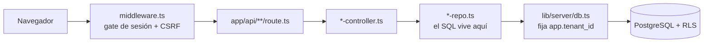
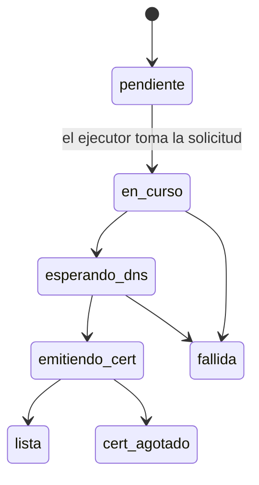
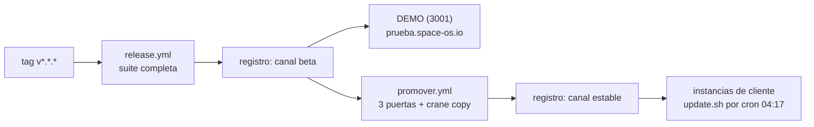

# Manual técnico — SPACE OS — 2026-09-15

> [!info] Qué es este documento y de dónde sale
> Se escribe sobre el inventario [[00-Inventario/inventario-2026-09-15]], levantado y
> medido hoy sobre el repositorio. **Sustituye al manual tecnico del 2026-08-11**, retirado el 24/09,
> que es anterior al modelo de instancias soberanas, al alta en droplet propio del
> cliente, a las licencias y al panel de flota.
>
> Todo recuento que leas aquí lleva fecha **2026-09-15**. Los números de este repositorio
> se miden, no se copian: si necesitas el número de hoy, córrelo tú. Lo que el inventario
> no pudo verificar está al final, en `## PENDIENTES`, redactado como pregunta.

---

## Propósito del sistema

SPACE OS es un CRM/ERP multi-organización para publicidad exterior (OOH/DOOH).

Cubre el ciclo completo de una empresa de medios exteriores: inventario de pantallas y
espectaculares, arrendadores y contratos de renta del predio, propuestas comerciales,
campañas, órdenes de trabajo en campo, imprenta, facturación y cobranza
(`vault/00-Inventario/inventario-2026-09-15.md` §1).

Cada cliente —un «owner»— es una empresa de medios OOH. Desde el ADR 0022 **cada owner
corre su propia instancia completa** en su propio servidor, con su base y su dominio. AS
OOH opera el PADRE, que construye la imagen, firma las licencias y vigila la flota.

Ese cambio de modelo importa para leer el resto del manual: el aislamiento multi-tenant
por RLS sigue existiendo dentro de cada instancia, pero ya no es el modelo de negocio,
sino defensa en profundidad.

---

## Stack y versiones

Un solo producto vivo: **una aplicación Next.js con BFF integrado**, en `apps/web`.

| Pieza | Versión | Referencia |
|---|---|---|
| Next.js, App Router | **14.2.29** | `apps/web/package.json:17` |
| React | 18.3.1 | `apps/web/package.json:17` |
| TypeScript | 5.9.2 | `package.json:14-24` |
| Node | ≥18 (la imagen corre Node 20 Alpine) | `package.json:14-24`, `Dockerfile` |
| PostgreSQL | driver `pg` **directo, sin ORM** | `apps/web/package.json:38` |

El plano de control del PADRE (`apps/flota`) son **18 módulos `.mjs` sin dependencias**
y **no viaja en la imagen**: el `Dockerfile` construye con `--filter=web`
(`apps/flota/package.json:5`, `Dockerfile:60`).

> [!warning] El `README.md` de la raíz está desactualizado, y engaña
> Verificado el 15/09: sigue describiendo «API — Fastify + Prisma + Redis + BullMQ»,
> `apps/api/.env`, `prisma migrate deploy` y `./infra/scripts/new-tenant.sh`
> (`README.md:5-28`). Nada de eso existe. La pista Fastify+Prisma+BullMQ está archivada
> en `_archive/api`, fuera de los workspaces npm, y hay un segundo frontend muerto en
> `_archive/web-frontend-2`.

---

## Arquitectura y módulos

### El mapa del repositorio

| Carpeta | Qué vive ahí |
|---|---|
| `apps/web/` | La única pista viva. Páginas en `app/`, endpoints en `app/api/`, lógica de servidor en `lib/server/` (16 867 líneas en 40+ archivos) |
| `apps/flota/` | El plano de control del PADRE: 18 módulos `.mjs` + 15 archivos de prueba |
| `packages/` | `types`, `ui`, `utils`, `eslint-config`, `typescript-config` |
| `db/` | `schema.sql`, `migrations/` (80), `semilla-desarrollo.sql`, `dev-rol-app.sql`, `docker-compose.yml` (Postgres de desarrollo en el **5433**) |
| `scripts/` | `migrar.mjs` (runner de migraciones y su `ANTES_DE`), `migrar.test.ts` (20 casos), generadores de plantillas |
| `infra/scripts/` | `provision-instancia.sh`, `instalar-hijo.sh`, `update.sh`, `base-instancia.sh`, `entorno-instancia.sh`, `respaldo.sh`, `setup-droplet.sh` y 4 arneses `pruebas-*.sh` |
| `infra/systemd/` | 5 units y 1 timer |
| `infra/nginx/` | `space-os.io.conf`, `instancia.conf.tpl`, `instancia-sin-licencia.conf.tpl`, `demo.space-os.io.conf`, `padre-ip.conf`, `snippets/`, `cloudflare-realip.sh` |
| `infra/env/` | `app.env.example`, `instancia.env.example`, `ejecutor.env.example` — nombres, nunca valores |
| `infra/licencias/` | `space-os.pub` (113 bytes, llave pública Ed25519) y `estados.casos.tsv` |
| `.github/workflows/` | `ci.yml`, `release.yml`, `promover.yml`, `lockfile-check.yml` |
| `docs/` | 32 ADR, planes, runbooks, `Registro_Cambios.md`, `evidencias/` (71 archivos), `datos/`, `noche/`, 10 `Traspaso_*.md` |
| `vault/` | La bóveda: 69 notas. Punto de entrada `vault/00-Indice/MOC-Proyecto.md` |
| `Dockerfile` | En la **raíz**: el contexto de build es la raíz del monorepo, no `apps/web` (`Dockerfile:3-7`) |

### Las capas fijas, y por qué el SQL vive en el repo

```
route.ts  →  *-controller.ts  →  *-repo.ts  →  db.ts
```

El SQL vive en el repositorio (`*-repo.ts`), **nunca en el `route.ts`**, y siempre
parametrizado. La razón es que el aislamiento entre organizaciones se resuelve en la capa
de datos: si una consulta nace en el route handler, se escapa del único sitio donde se
puede auditar que lleva contexto de tenant. Toda operación por `id` lleva además
`and tenant_id = $n` como segunda capa sobre la RLS.

No hay ORM. El acceso es `pg` directo desde `apps/web/lib/server/db.ts`, que es también
donde se fija `app.tenant_id` para la RLS (`apps/web/lib/server/db.ts:74-89`).



### Pantallas

`basePath` = **`/spaces-dooh`** y `trailingSlash: true` (`apps/web/next.config.mjs:126-127`).
Toda URL de este manual va bajo ese prefijo. Hay **31** páginas (`page.tsx`) medidas hoy:
22 con chrome en `app/(app)/(shell)/` y 9 sin chrome en `app/(app)/`.

El menú **y** el control de acceso salen del mismo archivo,
`apps/web/components/demo/shell/nav.ts`. Lo que un rol no debe ver **no se monta en el
DOM** (`nav.ts:24-25`).

| Ruta | Propósito | Roles (campo `roles`) |
|---|---|---|
| `/inicio` | Dashboard | DUENO (`nav.ts:93`) |
| `/inventario` | Pantallas y espectaculares | DUENO (`nav.ts:99`) |
| `/arrendadores` | Arrendadores, predios, contratos, rentas | DUENO (`nav.ts:103`) |
| `/network` | Red de sitios | DUENO, COMERCIAL (`nav.ts:104`) |
| `/clientes` | Clientes | DUENO, COMERCIAL (`nav.ts:109`) |
| `/comercial` | Mapa comercial | DUENO, COMERCIAL (`nav.ts:110`) |
| `/disponibilidad` | Calendario de disponibilidad | DUENO, COMERCIAL (`nav.ts:111`) |
| `/propuestas`, `/propuestas/[id]` | Propuestas comerciales | DUENO, COMERCIAL (`nav.ts:112`) |
| `/campanas`, `/campanas/[id]` | Campañas | DUENO, COMERCIAL (`nav.ts:118`) |
| `/creativos` | Creatividades | DUENO, COMERCIAL (`nav.ts:119`) |
| `/imprenta` | Órdenes de impresión | DUENO, IMPRENTA (`nav.ts:120`) |
| `/operaciones`, `/operaciones/ot/[id]` | Órdenes de trabajo | DUENO, OPERACIONES (`nav.ts:121`) |
| `/almacen` | Almacén de activos | DUENO, OPERACIONES (`nav.ts:122`) |
| `/finanzas` | Facturas y cobranza | DUENO, FINANZAS (`nav.ts:125`) |
| `/comisiones` | Comisiones | DUENO, COMERCIAL (`nav.ts:126`) |
| `/integraciones` | Integraciones externas | DUENO (`nav.ts:131`) |
| `/actividad` | Bitácora de acciones | DUENO (`nav.ts:132`) |
| `/administracion` | Usuarios, roles, matriz de permisos | DUENO (`nav.ts:133`) |
| `/configuracion` | Configuración de la organización | No listada en `nav.ts`; ver PENDIENTES |
| `/codigos-recuperacion` | Códigos de recuperación | Cualquier sesión: es salida obligatoria del gate |

Las nueve sin chrome: `/login`, `/recuperar/[token]`, `/p/[id]`, `/portal/[token]`,
`/firmar/[token]` (las cinco públicas, las cuatro últimas con token), más
`/contrato/[id]`, `/propuesta` y `/m/ot/[id]` (orden de trabajo en móvil), que piden
sesión. `/p/[id]` y `/portal/[token]` se sirven también por el subdominio `portal.`
(`middleware.ts:11-13`).

El layout del shell monta `BandaLicencia`, que avisa del vencimiento de la licencia y
**no bloquea nada** (`app/(app)/(shell)/layout.tsx:10`,
`components/demo/shell/BandaLicencia.tsx:33-37`).

---

## El modelo de instancias soberanas

Un solo artefacto para toda la flota: **una imagen Docker idéntica**, con la versión
sellada dentro (`Dockerfile:78-79`). Lo que distingue a una instancia de otra es su
entorno, su base y su licencia, nunca su código.

| Pieza | Qué es |
|---|---|
| **PADRE** | `137.184.107.53`, sirve `space-os.io`. Aquí se trabaja, se construye y se firma. Arranca con **systemd**, no pm2 (`infra/systemd/spaces-web.service`, puerto 3000) |
| **DEMO** | Dentro del PADRE, puerto **3001**. Desde el 02/09 corre **como contenedor desde la imagen del registro**, no `next start`. Sigue el canal `beta`. Su nombre es **`prueba.space-os.io`** |
| **Instancias de cliente** | Un droplet, una base y un dominio por owner. Siguen el canal `estable`. Se actualizan solas por cron a las **04:17** |
| `demo.space-os.io` | La demostración **original**, en la máquina vieja. **Se eliminará** (ADR 0024) |

> [!danger] `demo.space-os.io` no es DEMO
> DEMO es `prueba.space-os.io`. `demo.space-os.io` corre código del 11/08 en otra
> máquina. El mensaje de ayuda de `promover.yml:125` sugiere `demo.space-os.io` como
> valor de `DEMO_URL`, y el PASO 2 de la tarjeta 07 manda comprobar contra esa misma
> dirección: copiar cualquiera de los dos **valida la máquina equivocada antes de
> promover**.

### Los dos caminos de alta de una instancia

**a) Administrado — nosotros ponemos el servidor.** `infra/scripts/provision-instancia.sh`
(786 líneas). Se corre **desde la máquina del operador**; todo lo que toca el servidor
pasa por la función `remoto()`, que es también lo que hace posible `--dry-run`. **Nada se
ejecuta sin `--confirmar`** (`provision-instancia.sh:17-19`). Puede emitir certificado
(`--emitir-certificado`) y disparar el bootstrap (`--bootstrap`).

**b) Droplet propio del cliente (ADR 0032, 10-11/09).** `infra/scripts/instalar-hijo.sh`
(957 líneas). Lo corre **el cliente, como root, dentro de su propia máquina**: la
dirección se invierte y no hay `ssh` desde fuera. Recibe `--instancia`, `--dominio`,
`--licencia <dir>` y `--contacto`. **Verifica la firma de la licencia antes de instalar**
(`instalar-hijo.sh:375`), deja la pública en `/opt/space-os/space-os.pub`
(`instalar-hijo.sh:647`) y la licencia en `/etc/space-os/licencia/`
(`instalar-hijo.sh:679`).

La diferencia de fondo entre los dos: en el camino administrado el PADRE empuja; en el
del cliente, el cliente tira, y la única credencial que cruza es una licencia firmada.

Los dos comparten dos archivos que se **sourcean**, escritos una sola vez a propósito:

- **`base-instancia.sh`** (225 líneas) — los dos roles de Postgres, la base, el esquema y
  las migraciones. Existe porque el bloque estaba duplicado y **derivó en el mismo
  commit** (`base-instancia.sh:15-21`).
- **`entorno-instancia.sh`** (186 líneas) — cómo se escriben `app.env` e `instancia.env`
  y qué valores se niega a escribir. Es la zona **R7**, cerrada el 14/09.

**c) Alta desatendida desde el panel (ADR 0027 / 0029).** El panel escribe una solicitud;
el ejecutor (`apps/flota/ejecutor.mjs`, usuario `altas`, sin puerto) la lee y aprovisiona.



Estados en `ejecutor.mjs:25-44`. **No hay reintento automático**, y la solicitud se marca
`en-curso` **antes** de lanzar, para no crear un segundo droplet que ya se está cobrando
(`ejecutor.mjs:11-19`).

---

## El plano de control: `apps/flota`

Vive solo en el PADRE. Son 18 módulos `.mjs` sin dependencias externas.

| Archivo | Líneas | Qué es |
|---|---|---|
| `estado.mjs` | 631 | Panel CLI: consulta `/api/version` de cada instancia, fusiona con los reportes y decide `al-dia`/`rezagada`/`sin-respuesta` |
| `servidor.mjs` | 512 | Servidor HTTP del panel web. Rutas `/flota/` y `/flota/altas/` |
| `altas.mjs` | 296 | El bucle del ejecutor de altas |
| `reporte.mjs` | 263 | Receptor de reportes. Escucha en `127.0.0.1:8787`; nginx termina TLS |
| `cola.mjs` | 254 | Cola de solicitudes de alta |
| `avanzar.mjs` | 199 | Avanza una solicitud un paso de la máquina de estados |
| `vigilante.mjs` | 173 | Vigilancia |
| `diagnostico.mjs` | 164 | Traduce fallos de red a frases; `EAI_AGAIN` y `ENOTFOUND` caen en la misma (`diagnostico.mjs:24-25`) |
| `dns.mjs` | 152 | Cloudflare |
| `solicitudes.mjs` | 146 | Validación de la solicitud de alta |
| `inscribir.mjs` | 136 | Inscribe una instancia nueva en el inventario |
| `firmar-licencia.mjs` | 129 | Emite o renueva la licencia de un hijo. Lo corre una persona |
| `ejecutor.mjs` | 121 | Máquina de estados del alta |
| `acceso.mjs` | 106 | Control de acceso del panel web |
| `comprobaciones.mjs` | 105 | Comprobaciones previas |
| `licencia.mjs` | 98 | Construir, firmar y verificar una licencia Ed25519 |
| `vigilar.mjs` | 29 | Entrada del vigilante |
| `panel.mjs` | 17 | Entrada del panel web |

`flota.json` —el inventario real de la flota— **no está en git a propósito**: sería una
lista de clientes con sus dominios dentro del repositorio. En git solo hay
`flota.example.json`, con dominios `.invalid` (RFC 2606).

### Servicios systemd del PADRE

| Unit | Qué corre |
|---|---|
| `spaces-web.service` | La aplicación del PADRE (3000) |
| `spaces-demo.service` | DEMO (3001) |
| `flota-panel.service` | `node panel.mjs` — panel de flota (ADR 0026) |
| `flota-reporte.service` | `node reporte.mjs` — receptor de reportes (F6.4) |
| `flota-altas.service` + `.timer` | `node altas.mjs` — ejecutor de altas (ADR 0027) |

> [!danger] `systemctl disable` **borra** la unidad, no la apaga
> Medido el 02/09: las units son symlinks al repositorio, así que `disable` las elimina.
> La vuelta atrás escrita en varias tarjetas no funciona. Aplica igual a `spaces-web` y a
> `spaces-demo`.

Los tokens por instancia (`FLOTA_TOKEN_<NOMBRE>`) se buscan en orden **entorno →
`/etc/space-os/flota-tokens.env` (640, `altas:flota`) → `FLOTA_TOKEN` compartido**. Solo
se leen claves que empiecen por `FLOTA_TOKEN_`: esa lista blanca impide que un
`DIGITALOCEAN_ACCESS_TOKEN` pegado en ese archivo acabe leído por el proceso que da la
cara a internet (`apps/flota/README.md`).

---

## Modelo de datos

**40 tablas**, medidas hoy: `db/schema.sql` crea **28** y las migraciones añaden **12**.

> [!important] El estado real de una base es `schema.sql` **más** las 80 migraciones en su orden
> Nunca `schema.sql` solo. Y no es solo cuestión de tablas que faltan: ver el aviso sobre
> la RLS permisiva, más abajo.

### Las 28 de `db/schema.sql`

`acciones`, `arrendador_razon_social`, `arrendadores`, `campanas`, `clientes`,
`cobranzas`, `config_negocio`, `contratos_arrendamiento`, `creatividades`,
`evidencias_ot`, `facturas`, `folios_consecutivos`, `incidencias`, `notificaciones`,
`ordenes_compra`, `ordenes_impresion`, `ordenes_trabajo`, `pagos_renta`, `predios`,
`propuesta_items`, `propuestas`, `reservas`, `rol_permisos`, `sesiones`,
`sitio_modalidades`, `sitios`, `tenants`, `usuarios`.

### Las 12 que crean las migraciones

| Tabla | Migración | Propósito |
|---|---|---|
| `almacen_activos`, `almacen_movimientos` | `20260723_almacen.sql` | Almacén de activos y su kardex |
| `password_resets` | `20260723_password_resets.sql` | Tokens de recuperación |
| `licencias` | `20260729_licencias_permisos.sql` | Licencias/permisos de anuncio de un sitio |
| `contrato_firmas` | `20260729_firma_contrato.sql` | Firmas del arrendador |
| `identidades_externas` | `20260806_identidades_externas.sql` | Vínculo con Google |
| `schema_migrations` | `20260812_schema_migrations.sql` | Registro de migraciones aplicadas |
| `doohmain_consultas_play` | `20260716_doohmain_playlogs.sql` | Playlogs consultados a DOOHmain |
| `doohmain_remote_campaigns`, `doohmain_remote_lists`, `media_uploads` | `20260805_objetos_solo_en_prod.sql` | Objetos que existían solo en producción |
| `codigos_recuperacion` | `20260907_codigos_recuperacion.sql` | Códigos de un solo uso |

> [!warning] La tabla `licencias` no es la licencia del producto
> `licencias` es del módulo de arrendadores —permisos de anuncio de un sitio— y se
> gestiona con `POST /api/licencias`. La licencia del producto, la que decide si una
> instancia sigue sirviendo, **no vive en la base**: es un `licencia.json` firmado en
> `/etc/space-os/licencia/`.

### Agrupadas por área funcional

- **Organización y acceso:** `tenants`, `usuarios`, `sesiones`, `rol_permisos`,
  `config_negocio`, `identidades_externas`, `password_resets`, `codigos_recuperacion`,
  `acciones`, `notificaciones`.
- **Inventario y sitios:** `sitios`, `sitio_modalidades`, `predios`, `media_uploads`.
- **Arrendadores y contratos:** `arrendadores`, `arrendador_razon_social`,
  `contratos_arrendamiento`, `contrato_firmas`, `pagos_renta`, `licencias`,
  `incidencias`.
- **Comercial:** `clientes`, `propuestas`, `propuesta_items`, `reservas`, `campanas`,
  `ordenes_compra`, `creatividades`.
- **Operaciones e imprenta:** `ordenes_trabajo`, `evidencias_ot`, `ordenes_impresion`,
  `almacen_activos`, `almacen_movimientos`.
- **Finanzas:** `facturas`, `cobranzas`, `folios_consecutivos`.
- **Integración DOOHmain:** `doohmain_consultas_play`, `doohmain_remote_campaigns`,
  `doohmain_remote_lists`.
- **Infraestructura:** `schema_migrations`.

### Multi-tenant: 32 tablas con `tenant_id`, 8 sin él

`db/schema.sql:612-643` aplica en bucle a **23 tablas** (`add column tenant_id`,
`set not null`, `enable row level security` y la política `tenant_isolation`):
`usuarios`, `sitios`, `clientes`, `propuestas`, `propuesta_items`, `ordenes_compra`,
`campanas`, `creatividades`, `reservas`, `ordenes_trabajo`, `evidencias_ot`,
`ordenes_impresion`, `facturas`, `cobranzas`, `arrendadores`,
`contratos_arrendamiento`, `pagos_renta`, `incidencias`, `notificaciones`, `acciones`,
`sitio_modalidades`, `predios`, `arrendador_razon_social`.

`config_negocio` va aparte, con índice único por tenant y **`force row level security`**
(`db/schema.sql:662-674`, ADR 0011: una fila por organización).

Ocho más reciben `tenant_id` por migración: `almacen_activos`, `almacen_movimientos`,
`codigos_recuperacion`, `contrato_firmas`, `doohmain_consultas_play`,
`identidades_externas`, `licencias`, `password_resets`.

Las **8 exentas**, con su motivo:

| Tabla | Por qué no lleva `tenant_id` |
|---|---|
| `tenants` | Es el catálogo de organizaciones (`20260715_arr_m5_rls_failclosed.sql:11`) |
| `sesiones` | El login se resuelve pre-sesión: todavía no hay tenant |
| `rol_permisos` | Catálogo global de permisos. Es la pregunta abierta P4 de la bóveda |
| `folios_consecutivos` | Infraestructura de numeración |
| `schema_migrations` | Infraestructura del runner |
| `doohmain_remote_campaigns`, `doohmain_remote_lists`, `media_uploads` | Objetos de integración creados por `20260805_objetos_solo_en_prod.sql` |

> [!danger] `db/schema.sql` crea la política PERMISIVA; el fail-closed llega por migración
> La política del bucle lleva
> `or nullif(current_setting('app.tenant_id', true),'') is null`
> (`db/schema.sql:637-638`): **sin tenant fijado se ve todo**. El endurecimiento a
> fail-closed y `FORCE` lo aplican **8 migraciones**:
> `20260715_arr_m5_rls_failclosed.sql`, `20260720_hard1_usuarios_rls.sql`,
> `20260720_hard1_rls_todas_tablas.sql`, `20260723_almacen.sql`,
> `20260805_config_negocio_por_tenant.sql`, `20260806_identidades_externas.sql`,
> `20260807_password_resets_rls.sql`, `20260907_codigos_recuperacion.sql`.
> **Aplicar `schema.sql` solo deja una base insegura.**

### Migraciones: 80, y la trampa del orden

Convención de nombre: `YYYYMMDD_descripcion.sql`, transaccionales e idempotentes. **No se
edita una migración ya aplicada** y **no se toca `db/schema.sql` directo**.

De las 80: **76 de esquema y 4 con `-- @tipo: datos`**
(`20260731_calendario_meses_cortos.sql`, `20260812_schema_migrations.sql`,
`20260819_semilla_rol_permisos.sql`, `20260820_catalogo_permisos_completo.sql`). El
runner **no las aplica sin `--con-datos`** (`scripts/migrar.mjs:98-108`), y `update.sh`
no pasa esa bandera a propósito.

El tipo se decide por la **primera línea** del archivo, no por el contenido
(`scripts/migrar.mjs:107`). El porqué es concreto: `20260812_schema_migrations.sql`
menciona la cadena `@tipo: datos` en su prosa, y un filtro por contenido se saltaría justo
la migración que crea la tabla de registro.

> [!danger] El orden NO es lexicográfico puro
> El mapa `ANTES_DE` vive **una sola vez**, en `scripts/migrar.mjs:63-70`, y lo importa
> también `apps/web/lib/test/db-e2e.ts`. Dos excepciones reales:
>
> - `20260720_hard1_usuarios_rls.sql` antes de `20260720_hard1_rls_todas_tablas.sql`
>   (la segunda comprueba lo que hace la primera, y `r < u`).
> - `20260727_contrato_incompleto_enum.sql` antes de `20260727_contrato_incompleto.sql`
>   (usa un valor del enum que añade la otra, y `'.' < '_'`).
>
> **Cualquier cosa que aplique migraciones tiene que reproducir ese orden, o una base
> nueva no levanta.** Por eso la declaración es única y se importa: la copia duplicada
> que hubo antes es exactamente el fallo que esto evita.

Dos detalles más del runner que se pagan caros si se ignoran:

- **`--instalacion-nueva`** se verifica con **testigos derivados del repositorio**, no con
  una lista escrita a mano: son las tablas que crean las migraciones y no `schema.sql`
  (`scripts/migrar.mjs:165-177`). Hoy son 12; eran 11 antes de `codigos_recuperacion`.
- **13 migraciones** conceden GRANT a una lista blanca de **dos** nombres de rol
  (`spaces_user`, `spaces_app`). Con cualquier otro nombre de rol **no conceden nada y no
  dan error** (`vault/04-Datos/migraciones.md:242`).

---

## Endpoints e interfaces

**92 archivos `route.ts` y 115 métodos HTTP exportados** (31 GET, 55 POST, 18 PATCH,
9 DELETE, 2 PUT), medidos el 15/09 con
`find apps/web/app/api -name route.ts | wc -l`. Todos son Route Handlers de Next bajo
`/spaces-dooh/api/`.

### Los 16 públicos, y por qué lo son

| Ruta | Métodos | Por qué es pública |
|---|---|---|
| `/api/auth/login` | POST | Bootstrap de la sesión. Exento de CSRF (`middleware.ts:85`) |
| `/api/auth/logout` | POST | Ídem (`middleware.ts:89`) |
| `/api/auth/metodos` | GET | Dice qué métodos ofrece la instancia; solo lee entorno |
| `/api/auth/forgot` | POST | Pide el correo de recuperación (`middleware.ts:86`) |
| `/api/auth/reset` | GET, POST | Fija la contraseña con el token del correo (`middleware.ts:87`) |
| `/api/auth/codigo` | POST | Entrada con código de recuperación |
| `/api/auth/google/inicio` | GET | Arranca el OAuth |
| `/api/auth/google/callback` | GET | Vuelve de Google; crea sesión y puede crear organización |
| `/api/signup` | POST | Autoregistro. Solo si `AUTOREGISTRO=1` (`middleware.ts:88`) |
| `/api/bootstrap` | POST | Arranque de instancia. Credencial `BOOTSTRAP_TOKEN`; cerrojo real: `tenants` vacía (`middleware.ts:97`) |
| `/api/portal/[token]` | GET | Portal de campaña del cliente; el token es la credencial (`middleware.ts:90`) |
| `/api/propuestas/publica/[id]` | GET, POST | Propuesta compartible (`middleware.ts:92`) |
| `/api/firma/[token]` | GET, POST | Firma del contrato: el arrendador no tiene sesión (`middleware.ts:91`) |
| `/api/logo/[token]` | GET | Logo de la organización para las vistas públicas |
| `/api/recordatorios` | POST | Lo dispara el cron del droplet, no un usuario. Credencial `RECORDATORIOS_TOKEN`; 401 sin ella (`app/api/recordatorios/route.ts:39-57`) |
| `/api/version` | GET | Sin token devuelve solo `{ok}`; con `x-flota-token`, versión, última migración, canal y uptime (`app/api/version/route.ts`) |

> [!important] `/api/version` toca la base a propósito, y eso nació de un fallo
> `app/api/version/route.ts:36-46`. El PADRE estuvo **cuatro días** sirviendo un login
> perfecto sin poder autenticar a nadie —faltaba `DATABASE_URL`— mientras las cinco
> comprobaciones de salud salían verdes. Hoy `ok:true` significa «la base me contesta»; si
> no, responde **503**. Y lo que la ruta no dice es igual de deliberado: ni una cifra del
> negocio del owner.

### Los de sesión, por área

El guard es `exigir(modulo, accion)` (`lib/server/auth.ts:183`) salvo donde se indique.

| Área | Rutas | Guard |
|---|---|---|
| Sesión / perfil | `auth/me`, `perfil`, `perfil/codigos-recuperacion`, `tenant-activo` | `usuarioActual()` / `exigir()` sin permiso |
| Inventario y sitios | `sitios` (GET,POST), `sitios/[id]` (PATCH,DELETE), `sitios/import`, `sitios/[id]/media`, `sitios/[id]/space-eye`, `sitios/[id]/reubicar`, `sitios/[id]/pausa-legal` | `inventario`/`network`/`arrendadores`/`comercial` según la ruta |
| Arrendadores y contratos | `arrendadores`, `arrendadores/[id]`, `predios`, `predios/[id]`, `predios/[id]/pantallas`, `razones-sociales`, `razones-sociales/[id]`, `licencias`, `licencias/[id]`, `incidencias`, `contratos`, `contratos/[id]`, `contratos/[id]/renovar`, `contratos/[id]/cancelar`, `contratos/[id]/firma`, `contratos/[id]/documento`, `pagos-renta/[id]`, `pagos-renta/[id]/pagar`, `pagos-renta/[id]/adjunto/[tipo]` | `arrendadores/*`; 5 con `exigirCambioSensible` |
| Comercial | `clientes`, `clientes/[id]`, `propuestas`, `propuestas/[id]`, `propuestas/items/[id]`, `propuestas/[id]/generar-campana`, `reservar`, `reservas/[id]/creativo`, `creatividades`, `creatividades/[id]`, `creativos/[id]/arte`, `ordenes-compra`, `campanas/[id]/{validar,confirmar,oc,contrato,extender,enviar-dominio,playlogs,creativos/repartir}` | `comercial/*` |
| Operaciones | `ot`, `ot/[id]`, `ot/[id]/cerrar`, `almacen`, `almacen/[id]/movimiento` | `operaciones/*` |
| Imprenta | `impresion`, `impresion/[id]`, `impresion/[id]/prueba-color` | `imprenta/*` |
| Finanzas | `campanas/[id]/facturar`, `cobranzas/[id]/pagar`, `cobranzas/[id]/recordar` | `finanzas/*`; 2 con `exigirCambioSensible` |
| Administración | `usuarios`, `usuarios/[id]`, `usuarios/[id]/restablecer`, `permisos`, `admin/permisos-matriz`, `config`, `organizacion`, `tenants`, `integraciones`, `cambios`, `cambios/desbloquear` | `administracion/*` |
| Transversal | `estado` (GET) | `exigir()` y **filtra cada slice por permiso de módulo** (`app/api/estado/route.ts:37-45`) |
| Notificaciones | `notificaciones/nuevas`, `notificaciones/[id]/leer`, `notificaciones/archivar-todas` | `exigir()` sin permiso de módulo |

### Los flujos, de punta a punta

**Propuesta a campaña.** `/clientes` → `POST /api/clientes`; `/comercial` o
`/disponibilidad` → `POST /api/reservar`; `/propuestas` → `POST /api/propuestas` y
`PATCH /api/propuestas/items/[id]`; la liga compartible `/p/[id]` sirve
`GET/POST /api/propuestas/publica/[id]`; y `POST /api/propuestas/[id]/generar-campana`
crea la campaña. De ahí, `POST /api/campanas/[id]/{validar,confirmar,oc,contrato,extender}`
y `.../creativos/repartir`. Tablas tocadas: `clientes`, `reservas`, `propuestas`,
`propuesta_items`, `campanas`, `ordenes_compra`, `creatividades`.

**Orden de trabajo.** `/operaciones` → `GET/POST /api/ot` → `/operaciones/ot/[id]` o
`/m/ot/[id]` en móvil → `POST /api/ot/[id]/cerrar` con evidencias. Tablas:
`ordenes_trabajo`, `evidencias_ot`, `incidencias`.

**Facturación y cobranza.** `POST /api/campanas/[id]/facturar` y
`POST /api/cobranzas/[id]/pagar`, los dos con re-autenticación;
`POST /api/cobranzas/[id]/recordar` avisa al cliente. Tablas: `facturas`, `cobranzas`,
`folios_consecutivos`.

**Arrendadores y firma.** `/arrendadores` da de alta arrendadores, predios, razones
sociales, licencias de sitio y contratos. `GET/POST /api/contratos/[id]/firma` genera la
liga; el arrendador entra sin sesión a `/firmar/[token]` y firma con
`GET/POST /api/firma/[token]`, exento de CSRF (`middleware.ts:90-91`).

---

## Autenticación, sesión y permisos

### El gate del middleware

`apps/web/middleware.ts:129-143`. Son públicas `/api/*` (se autoprotegen), `/_next/*`,
`/favicon*`, `/login`, `/recuperar/*`, `/p/*`, `/firmar/*` y `/portal/*`. **Cualquier otra
ruta sin la cookie `spaces_sesion` redirige a `/login`.**

> [!important] La redirección lleva `Location` relativa, y eso es un arreglo con historia
> `middleware.ts:46-52`. Hasta el 10/09, `NextResponse.redirect(request.nextUrl)` mandaba
> al cliente a `https://localhost:3000/...`, porque `nextUrl` toma su origen de donde
> escucha el proceso (`Dockerfile:72-73`) y **no de la cabecera `Host`**. El comentario de
> `middleware.ts:16-44` documenta por qué se descartaron las dos alternativas obvias: leer
> `Host` sería un open redirect, y `APP_URL` quedaría horneada en el build, lo que rompe
> el artefacto único de la flota.
>
> **Ese arreglo está en `main` pero no en la imagen que sirve hoy el canal `estable`.**
> Ver «Errores conocidos».

### Login con contraseña

`/spaces-dooh/login/` → `GET /api/auth/metodos` (qué métodos ofrece esta instancia) →
`POST /api/auth/login` → `GET /api/auth/me` → `GET /api/estado`. Se crea una fila en
`sesiones` con `metodo='password'` (`lib/server/auth.ts:107`, migración
`20260825_sesion_metodo.sql`) y se emiten dos cookies: `spaces_sesion` (`auth.ts:15`,
`auth.ts:256`) y `spaces_csrf` (`auth.ts:274`, `auth.ts:281`).

`POST /api/auth/login` está exento de CSRF a propósito: es el bootstrap de la sesión y
todavía no hay cookie que proteger (`middleware.ts:85`).

### Acceso con Google

`GET /api/auth/google/inicio` → Google → `GET /api/auth/google/callback`. El vínculo vive
en `identidades_externas` (`20260806_identidades_externas.sql`, con RLS fail-closed) y la
sesión queda con `metodo='google'`.

Desde el **ADR 0028**, Google puede ser obligatorio en una instancia
(`20260907_solo_google.sql`), y el callback puede crear la organización y su Dueño
(`app/api/auth/google/callback/route.ts:5` → `crearOrgConDueno`). El callback tiene rate
limit por IP (`lib/server/rate-limit.ts`).

### Recuperación de la cuenta

Dos caminos. Con correo: `POST /api/auth/forgot` → Resend → `GET/POST /api/auth/reset`
sobre `/recuperar/[token]`, con la tabla `password_resets`
(`20260723_password_resets.sql`, RLS por `20260807_password_resets_rls.sql`). Se enciende
con `NEXT_PUBLIC_RECUPERAR_PASSWORD`.

Sin correo: **códigos de recuperación** de un solo uso (`codigos_recuperacion`,
`20260907_codigos_recuperacion.sql`), con `POST /api/auth/codigo` y
`POST /api/perfil/codigos-recuperacion`.

### Re-autenticación de operaciones sensibles

`exigirCambioSensible` es `exigir(modulo, accion)` **más** `exigirDesbloqueo()`
(`lib/server/cambios.ts:236-245`). El desbloqueo se pide en
`POST /api/cambios/desbloquear` con la **contraseña de cambios** del ADR 0028.

Lo llevan **8 endpoints**, todo lo que mueve dinero o compromisos irreversibles:
`contratos`, `contratos/[id]`, `contratos/[id]/renovar`, `contratos/[id]/cancelar`,
`pagos-renta/[id]/pagar`, `campanas/[id]/facturar`, `cobranzas/[id]/pagar`. Es la
mitigación de la zona R4 desde el 28/08.

### CSRF

Double-submit. Toda mutación (`POST|PUT|PATCH|DELETE`) sobre `/api/` **con cookie de
sesión** debe traer `x-csrf-token` igual a la cookie `spaces_csrf`, o se responde **403**
(`middleware.ts:82-108`).

Si **no** hay cookie de sesión, se deja pasar: no hay credencial ambiental que proteger, y
ese es el razonamiento completo. Exentas por ruta: `auth/login`, `auth/forgot`,
`auth/reset`, `auth/logout`, `signup`, `portal/*`, `firma/*`, `propuestas/publica/*` y
`bootstrap`.

### El arranque de una instancia nueva: tres caminos de alta de organización

| Camino | Endpoint | Credencial | Cuándo |
|---|---|---|---|
| Autoregistro | `POST /api/signup` | ninguna | Solo si `AUTOREGISTRO=1` en el `.env` de esa instancia. **Ausente = apagado** (`app/api/signup/route.ts:13-19`) |
| Bootstrap de instancia | `POST /api/bootstrap` | `BOOTSTRAP_TOKEN` **y** que `tenants` esté vacía (`app/api/bootstrap/route.ts:26-28`) | Arranque de una instancia recién aprovisionada. Devuelve 201 |
| Desde dentro | `POST /api/tenants` | sesión + `exigir('administracion','crear')` | Alta de otra organización desde una instancia con varias |

`db/schema.sql` **nace sin ninguna organización** desde el 19/08
(`db/schema.sql:598-611`): una base recién creada tiene `tenants = 0` y
`config_negocio = 0`. El cerrojo real del bootstrap no es el token, es esa tabla vacía.

---

## Multi-tenancy y RLS

El aislamiento es RLS de Postgres por `app.tenant_id`, fijado en
`apps/web/lib/server/db.ts:74-89`.

En la práctica, eso se traduce en dos funciones de acceso: **`q`**, que fija el contexto
de tenant, y **`qRaw`**, que no lo fija. Elegir mal no rompe nada visible.

> [!danger] R2 — el modo de fallo de la RLS es silencioso
> Usar `qRaw` donde tocaba `q` devuelve **cero filas en silencio, o datos de otra
> empresa**. No hay excepción, no hay log, no hay 500. **Ya pasó dos veces**, y una dejó
> el desbloqueo de usuarios inservible un despliegue entero.
>
> **Ampliación del 11/09:** con qué privilegios nace la base es R2 también. Un
> `DATABASE_URL` con el rol de migración (`bypassrls`) **atraviesa la RLS entera y la
> instancia sirve sin dar un error**.

Hoy usan `qRaw` **18 archivos**, todos en caminos pre-sesión o por token: `auth.ts`,
`tenant.ts`, `usuarios-repo.ts`, `portal-repo.ts`, `firmas-repo.ts`,
`identidades-repo.ts`, `password-reset-repo.ts`, `codigos-recuperacion-repo.ts`,
`config-repo.ts`, `cambios.ts`, `propuestas-repo.ts`, y 7 route handlers. **Cualquier
`qRaw` nuevo fuera de esa lista es sospechoso** y hay que justificarlo en el diff.

> [!danger] Las pruebas unitarias no ven los fallos de RLS
> Simulan la base. **Los dos peores fallos de aislamiento del proyecto pasaron las
> unitarias sin despeinarse.** Todo lo que toque tenant o sesión necesita
> `cd apps/web && npm run test:e2e`, que corre contra un Postgres real.

---

## Configuración y variables de entorno

La regla de la casa: en los archivos versionados hay **nombres, nunca valores**. Ni
dominios, ni IPs, ni tokens, ni el nombre del registro de imágenes.

### Lo que lee `apps/web` desde `process.env` (medido el 15/09)

`ADMIN_EMAIL`, `ADMIN_NOMBRE`, `ADMOBILIZE_API_KEY`, `APP_URL`, `AUTOREGISTRO`,
`BOOTSTRAP_TOKEN`, `CANAL`, `CFDI_PAC_KEY`, `CMS_API_TOKEN`, `COOKIE_DOMAIN`,
`COOKIE_SECURE`, `DATABASE_URL`, `DATABASE_URL_TEST`, `DATABASE_URL_TEST_APP`,
`DOOHMAIN_DEFAULT_SCREEN`, `DOOHMAIN_PUBLISH_ENABLED`, `DOOHMAIN_PY`,
`DOOHMAIN_SCREEN_MAP`, `DOOHMAIN_SDK_DIR`, `DO_SPACES_BUCKET`, `DO_SPACES_CDN_URL`,
`DO_SPACES_ENDPOINT`, `DO_SPACES_KEY`, `DO_SPACES_SECRET`, `EMAIL_FROM`, `FLOTA_TOKEN`,
`GOOGLE_AUTH_ENDPOINT`, `GOOGLE_CLIENT_ID`, `GOOGLE_CLIENT_SECRET`, `GOOGLE_DOBLE_EMAIL`,
`GOOGLE_DOBLE_SUB`, `GOOGLE_OAUTH`, `GOOGLE_REDIRECT_URI`, `GOOGLE_TOKEN_ENDPOINT`,
`HSTS`, `LICENCIA_JSON`, `MEDIR_ESTADO`, `NEXT_PUBLIC_MAPTILER_KEY`,
`NEXT_PUBLIC_RECUPERAR_PASSWORD`, `NODE_ENV`, `ORG_NOMBRE`, `ORG_SLUG`,
`PUERTO_DOBLE_GOOGLE`, `PUERTO_E2E`, `RECORDATORIOS_TOKEN`, `RESEND_API_KEY`,
`SEED_PASSWORD`, `SMOKE_BASE`, `SPACE_EYE_BASE_URL`, `SPACE_EYE_PASS`, `SPACE_EYE_USER`,
`SPACE_OS_VERSION`, `TZ`.

De ellas, `DATABASE_URL_TEST*`, `GOOGLE_DOBLE_*`, `PUERTO_*`, `MEDIR_ESTADO`,
`SMOKE_BASE` y `SEED_PASSWORD` son **solo de pruebas**.

> [!warning] Cuatro variables que el código lee y ningún ejemplo declara
> `DO_SPACES_BUCKET`, `DO_SPACES_CDN_URL`, `DO_SPACES_ENDPOINT`, `DO_SPACES_KEY`,
> `DO_SPACES_SECRET`, `ADMOBILIZE_API_KEY`, `CFDI_PAC_KEY` y `CMS_API_TOKEN` aparecen en
> `process.env` pero **no están en `infra/env/app.env.example`** ni en ningún otro
> ejemplo.
>
> La consecuencia práctica: **una instancia aprovisionada hoy arranca con esas funciones
> apagadas y nadie se entera.** `lib/server/storage.ts:12-16` expone un `habilitado()` que
> devuelve false sin las `DO_SPACES_*`, así que la subida de media simplemente no existe
> en esa instancia; no falla, no avisa.
>
> **No está verificado si es deliberado**, ni quién lee de verdad las otras tres. Van a
> PENDIENTES.

### `infra/env/app.env.example` — lo que lee docker, **sin comillas**

`APP_URL`, `DATABASE_URL`, `HOSTNAME`, `COOKIE_SECURE`, `AUTOREGISTRO`,
`NEXT_PUBLIC_RECUPERAR_PASSWORD`, `EMAIL_FROM`, `RESEND_API_KEY`, `GOOGLE_OAUTH`,
`GOOGLE_CLIENT_ID`, `GOOGLE_CLIENT_SECRET`, `GOOGLE_REDIRECT_URI`, `BOOTSTRAP_TOKEN`,
`RECORDATORIOS_TOKEN`, `FLOTA_TOKEN`, `CANAL`, `TZ`, `DOOHMAIN_PUBLISH_ENABLED`,
`DOOHMAIN_API_KEY`, `DOOHMAIN_DEFAULT_SCREEN`, `DOOHMAIN_SCREEN_MAP`, `DB_HOST`,
`DB_PORT`, `DB_USER`, `DB_PASSWORD`, `DB_NAME`, `DB_SSL`.

### `infra/env/instancia.env.example` — lo que **sourcea bash**, exige comillas

`CANAL`, `REGISTRY`, `IMAGEN_NOMBRE`, `CONTENEDOR`, `DATABASE_URL`, `ENV_APP`,
`DOCKER_OPCIONES_APP`, `RED_MIGRACION`, `SALUD_URL`, `SALUD_INTENTOS`, `SALUD_ESPERA`,
`PULL_ESPERAS`, `FLOTA_REPORTE_URL`, `FLOTA_PENDIENTES_MAX`, `RUNNER_MIGRACIONES`,
`PG_DUMP`, `PG_RESTORE`, `INSTANCIA`, `SPACES_KEY`, `SPACES_SECRET`, `SPACES_BUCKET`,
`LOGS_BUCKET`, `REGISTRY_TOKEN`.

`update.sh` lee además `LICENCIA_REQUERIDA`, `LICENCIA_DIR`, `LICENCIA_PUB`,
`OPENSSL_BIN`, `DOMINIO`, `NGINX_SITIO_ACTIVO`, `NGINX_SITIO_NORMAL` y
`NGINX_SITIO_SIN_LICENCIA` (`update.sh:845-875`).

> [!danger] R7 — `instancia.env` se **sourcea** (`update.sh:700`)
> Un valor con espacios y sin comillas hace que bash **ejecute la segunda palabra**. Por
> eso `app.env` no admite comillas —docker lo lee literalmente— e `instancia.env` las
> exige. Los dos los escribe `entorno-instancia.sh`, que valida y entrecomilla. Antes del
> 14/09 los escribía `provision-instancia.sh` con `sed` crudo; la zona quedó cerrada ese
> día.

### `infra/env/ejecutor.env.example` — solo en el PADRE, usuario `altas`

`DIR_SOLICITUDES`, `DO_REGION`, `DO_TAMANO`, `DO_SSH_KEYS`,
`DIGITALOCEAN_ACCESS_TOKEN`, `REGISTRY`, `REGISTRY_TOKEN`, `CLOUDFLARE_TOKEN`,
`CLOUDFLARE_ZONAS`, `CERTBOT_EMAIL`.

### `apps/flota`

`FLOTA_PUERTO`, `FLOTA_INTERFAZ`, `FLOTA_DIR_ESTADO`, `FLOTA_DIR_PUBLICO`,
`FLOTA_VERSION_ESTABLE`, `PANEL_PUERTO`, `PANEL_INTERFAZ`, `ORIGEN_PANEL`, `URL_PADRE`,
`DIR_ESTADO`, `DIR_SOLICITUDES`, `CLOUDFLARE_TOKEN`, `CLOUDFLARE_ZONAS`, y los tokens por
instancia `FLOTA_TOKEN_<NOMBRE>`.

---

## Licencias

La licencia del producto es un archivo firmado, no una fila en la base. Vive en
`/etc/space-os/licencia/` dentro de cada instancia.

**Algoritmo: Ed25519.** No se eligió por criptografía sino por una restricción operativa:
la otra punta es **bash**, y `openssl pkeyutl -verify -rawin` sabe comprobarlo en el
droplet sin instalar nada (`licencia.mjs:4-6`).

Cómo se firma (`apps/flota/firmar-licencia.mjs`, 129 líneas, lo corre una persona):

- **Se firman los bytes exactos del archivo**, no un objeto reserializado
  (`licencia.mjs:14-18`). Un reordenamiento de claves rompería la firma en silencio.
- **La privada nunca sale del PADRE.** `firmar-licencia.mjs` no viaja en la imagen porque
  el `Dockerfile` construye con `--filter=web` (`licencia.mjs:7-13`).
- La frase de paso **se pide por terminal y nunca por argumento**: un argumento acaba en
  el historial del shell y en `ps` (`firmar-licencia.mjs:14-15`).
- La pública está en el repositorio: `infra/licencias/space-os.pub`, **113 bytes**, creada
  el 15/09. Viaja con cada instalador y acaba en `/opt/space-os/space-os.pub`
  (`instalar-hijo.sh:647`). Tiene su propio `.gitattributes` mínimo para que no le cambien
  los finales de línea al viajar (commit `56e2376`).

Cómo verifica una instancia, **sin llamar a nadie** (`update.sh:890-925`):

1. Existen `licencia.json`, `licencia.firma` y la pública. Si no, inválida.
2. `openssl pkeyutl -verify -pubin -rawin`. Si no valida, inválida.
3. **Solo entonces** se lee el JSON. Decidir con un JSON sin firmar sería confiar en un
   archivo que cualquiera puede escribir.
4. **Anclaje**: la licencia tiene que decir **esta instancia** y **este dominio**. Una
   licencia firmada pero sin `instancia` se rechaza explícitamente, porque dos cadenas
   vacías coincidirían y una licencia sin dueño quedaría válida
   (`update.sh:906-911`).

Los estados (`update.sh:928-960` y `apps/web/lib/licencia.ts:16`, con el banco de casos
compartido `infra/licencias/estados.casos.tsv`, que usan las dos implementaciones):

| Estado | Cuándo | Qué pasa |
|---|---|---|
| `sana` | antes de `vence - aviso_dias` | nada |
| `aviso` | entre el aviso y el vencimiento | banda en la interfaz; **no bloquea** |
| `gracia` | entre vencer y `vence + gracia_dias` | banda; **no bloquea** |
| `vencida` | pasada la gracia | nginx sirve el sitio `-sin-licencia` y el contenedor se apaga |
| `invalida` | firma mala, ausente o ilegible | igual que vencida |
| `no-comprobable` | falta `openssl` o es menor que 3.0 | **NO apaga.** El problema es nuestro, no del cliente (`update.sh:965-985`) |

El apagado se hace **cambiando un symlink de nginx**, no con un `if` dentro de un
`location` ni con `error_page 502`. El porqué: eso confundiría «la licencia venció» con
«la aplicación se cayó», que son justo las dos cosas que el panel existe para no mezclar
(`update.sh:1005-1010`).

> [!tip] Una firma Ed25519 se puede reproducir
> No aleatoriza. Dos corridas con la misma llave dieron la firma byte a byte idéntica
> (`vault/07-Agentes/diario/2026-09-15.md`). El día que alguien discuta una licencia, se
> vuelve a firmar y se compara.

---

## Despliegue

### La imagen

`Dockerfile` en la raíz, tres etapas (`deps` → `build` → `runtime`), Node 20 Alpine,
salida `standalone`.

- Contexto de build = **raíz del monorepo** (`outputFileTracingRoot` en `../../`).
- `npm ci`, nunca `npm install` (`Dockerfile:33-38`).
- **La versión se sella dentro**: `ARG VERSION` → `ENV SPACE_OS_VERSION`
  (`Dockerfile:78-79`). Es lo que devuelve `/api/version`.
- `db/schema.sql` y `db/migrations` **viajan en la imagen** (`Dockerfile:94-95`); por eso
  `migrar.mjs` resuelve rutas desde su propio archivo y no desde `cwd`.
- `CMD ["node", "apps/web/server.js"]`.

### Los workflows

| Workflow | Disparo | Qué hace |
|---|---|---|
| `ci.yml` (221 líneas) | `push` | `typecheck --filter=web`, `test --filter=web --filter=flota`, los arneses `pruebas-provision.sh` y `pruebas-instalar-hijo.sh` (con `--mutantes`), `build --filter=web`, y un job aparte que corre `npm run test:e2e` tras el build |
| `release.yml` (307 líneas) | tag `v*.*.*` | Suite completa, construye la imagen y la publica en **`beta`**. **El gate es el orden**: el push es el último paso del último job, que cuelga de `needs: pruebas` (`release.yml:11-16`) |
| `promover.yml` | `workflow_dispatch` | Mueve **`estable`** a una versión que hoy lleva `beta`. **No reconstruye** |
| `lockfile-check.yml` | PR | `package.json` y `package-lock.json` en sync |

`promover.yml` tiene tres puertas: que la versión sea la beta de hoy, que DEMO responda
(`DEMO_URL`) y que **el digest no cambie después de reetiquetar**.

El registro de imágenes es **un parámetro, nunca un literal**: `vars.REGISTRY` y
`vars.REGISTRY_TIPO` (`release.yml:22-25`). Cuando faltan, los workflows **paran en seco a
propósito**.

> [!danger] `imagetools create` NO reetiqueta — medido el 02/09
> Envuelve el manifiesto en un índice nuevo y **cambia el digest**, que es justo lo que el
> criterio de aceptación prohíbe. Se sustituyó por **`crane copy`**, que reescribe los
> mismos bytes (`promover.yml:302-313`).



### La actualización de una instancia

`infra/scripts/update.sh` (2341 líneas), instalado en `/opt/space-os/update.sh` y lanzado
por cron: **`17 4 * * * root`** (`instalar-hijo.sh:867`).

El PADRE **no aparece** en ese camino: la instancia habla con el registro de imágenes y
con su propia base (`update.sh:5-8`). La secuencia es respaldo, migraciones, salud, y
reporte:

1. `pg_dump -Fc` antes de migrar.
2. Aplica migraciones (sin `--con-datos`).
3. Comprueba salud contra `SALUD_URL`, que es `/api/version`.
4. Al terminar, hace `POST` al receptor de reportes del PADRE.

### Respaldos y logs

`infra/scripts/respaldo.sh` (345 líneas) lo **sourcea** `update.sh`; no es un programa
aparte. `update.sh` deja el `pg_dump` en el disco local —lo que sirve para la vuelta
atrás— y `respaldo.sh` lo **sube a un bucket y poda el disco**, porque un respaldo que
vive solo en la máquina que puede morir no es un respaldo (`respaldo.sh:16-22`).
Subcomandos: `subir`, `podar`, `destino`.

Los logs también salen del droplet, **filtrados**:
`/var/log/space-os/update-publicable.log` es lo que viaja al bucket; el crudo se queda en
`/var/log/space-os/update.log`.

### Ramas y remotos

- **`emiliano`** (`emiliano-cyber/spaces_dooh_new`) es el remoto vivo. `origin`
  (`CarlosMend87/spaces-dooh`) está **muerto**: no se empuja ahí.
- Todo vive en **`main`** desde el 28/08. **251 commits desde el 01/09.**

---

## Trabajos programados e integraciones

### Programados

| Cuándo | Dónde | Qué |
|---|---|---|
| `17 4 * * * root` | cada instancia de cliente | `/opt/space-os/update.sh`: respaldo, migraciones, salud, reporte (`instalar-hijo.sh:867`) |
| Por timer systemd | PADRE | `flota-altas.service` + `.timer`: el ejecutor de altas |
| Por cron del droplet | instancia | `POST /api/recordatorios` con `RECORDATORIOS_TOKEN`; 401 sin ella (`app/api/recordatorios/route.ts:39-57`) |

### Integraciones externas

| Integración | Módulo | Cómo se enciende |
|---|---|---|
| **Resend** (correo) | `lib/server/email.ts:23-27` | `RESEND_API_KEY` + `EMAIL_FROM`; ausentes = apagado |
| **Google OAuth** | `lib/server/google-oauth.ts` (293 líneas) | `GOOGLE_OAUTH` + client id / secret / redirect |
| **DigitalOcean Spaces (S3)** | `lib/server/storage.ts:12-16` | `DO_SPACES_*`; `habilitado()` es false sin ellas |
| **DOOHmain** (publicación de spots) | `lib/server/doohmain.ts` (403 líneas) | `DOOHMAIN_PUBLISH_ENABLED=1`. Llama a un **SDK de Python por subproceso** (`DOOHMAIN_PY`, `DOOHMAIN_SDK_DIR`) |
| **Space Eye** | `lib/server/space-eye.ts:31-55` | `SPACE_EYE_BASE_URL/USER/PASS`; login por HTTP y bearer |
| **MapTiler** (basemap) | `NEXT_PUBLIC_MAPTILER_KEY` | ADR 0030: el basemap de la flota no lleva clave |
| **DigitalOcean API / Cloudflare** | `apps/flota/ejecutor.mjs`, `dns.mjs` | Solo en el PADRE, usuario `altas` |

Todas siguen el mismo patrón: **sin sus variables, la integración queda apagada y la
aplicación arranca igual**. Eso es cómodo y es también la trampa del apartado anterior.

---

## Cómo se trabaja aquí

### Convenciones

- **Todo en español**: archivos, funciones, variables, columnas, comentarios y mensajes de
  error. Los únicos anglicismos son los del framework (`page.tsx`, `route.ts`) y los del
  dominio (DOOH, spot).
- **Capas fijas** `route.ts` → `*-controller.ts` → `*-repo.ts` → `db.ts`. El SQL vive en el
  repo, siempre parametrizado, y toda operación por `id` lleva `and tenant_id = $n`.
- **Los comentarios explican el porqué**, y documentan el fallo que motivó la decisión.
  Media docena de comentarios de este repositorio son lo único que impide que el mismo
  error vuelva: `middleware.ts:16-44` y `base-instancia.sh:15-21` son dos ejemplos.
  **No se borran al refactorizar.**
- **Commits convencionales en español y sin acentos.** El cuerpo se usa: explica el
  porqué, lo que apareció al hacerlo y qué se verificó.
- **La nota de la bóveda se actualiza en el MISMO commit que cambia el código**, y si el
  cambio se nota desde la aplicación, lleva entrada en `docs/Registro_Cambios.md`.
- **Migraciones** `YYYYMMDD_descripcion.sql`, transaccionales e idempotentes. No se edita
  una ya aplicada; no se toca `db/schema.sql` directo.

### Zonas y archivos de alto contacto

El código está particionado en **12 zonas** (`Z1 · Auth` … `Z12 · Docs`), con **dueño
único a la vez**; se reclaman en `vault/07-Agentes/tablero.md` antes de escribir. Aparte
hay archivos de alto contacto que se reclaman por separado aunque estés en otra zona,
porque tocarlos bloquea a los demás: `middleware.ts`, `next.config.mjs`,
`lib/server/db.ts`, `lib/server/auth.ts`, `lib/server/errores.ts`, `lib/modulos.ts`,
`components/demo/shell/nav.ts`, `db/schema.sql`, `package.json` y
`docs/Registro_Cambios.md`.

### Las suites, y cómo se corren de verdad

| Suite | Archivos | Casos (grep estático, 15/09) | Comando |
|---|---|---|---|
| Unitarias `apps/web` | 103 | 1092 | `cd apps/web && npm test` |
| e2e `apps/web` | 34 | 345 | `cd apps/web && npm run test:e2e` |
| `apps/flota` | 15 | 286 | `cd apps/flota && npx vitest run` |
| `scripts/migrar.test.ts` | 1 | 20 | con las unitarias |

> [!warning] Esas cifras son grep estático, no una corrida
> Se contaron con `grep` sobre `it(` y `test(`. Un `it.each` cuenta **uno** aquí y varios
> en el runner, así que el número real es **igual o mayor**. Si necesitas el número, mídelo
> tú, y en el mismo árbol donde vas a trabajar: cada worktree está en una rama distinta y
> da un recuento distinto.

> [!warning] Los scripts de pruebas NO existen en la raíz del repositorio
> `test`, `test:e2e` y `typecheck` viven en `apps/web/package.json`. Desde la raíz
> devuelven `npm error Missing script`, que es fácil de confundir con «el entorno está
> roto». **Antepón siempre `cd apps/web`.**

> [!danger] Las e2e exigen un `npm run build` HECHO ANTES, o fallan todas en falso
> `apps/web/lib/test/servidor-e2e.ts` arranca con `npx next start`, que **reutiliza el
> build y no construye nada**. En un worktree recién clonado no hay `.next/BUILD_ID` y
> **todos** los archivos mueren con «el servidor no respondió tras 60 s», tardando
> **636 s** en hacerlo. El rojo no dice nada del código: dice que falta el build.
>
> ```
> cd apps/web && npm run build && npm run test:e2e
> ```

Las e2e corren contra un Postgres real en el **5433**, en serie, contra un Next real en el
**3311**. El Postgres de desarrollo lo levanta `db/docker-compose.yml`.

### Los arneses de shell

No son vitest. Viven en `infra/scripts/`:

| Arnés | Líneas | Escenarios | Mutantes |
|---|---|---|---|
| `pruebas-update.sh` | 3390 | 136 | 61 |
| `pruebas-provision.sh` | 1012 | 23 | 11 (+1 centinela) |
| `pruebas-instalar-hijo.sh` | 507 | 6 | 3 |
| `pruebas-vuelta-atras-real.sh` | 248 | — | — |

Los mutantes **se validan antes de correrse**: cambian una sola línea, conservan el número
de líneas y `bash -n` los acepta. El porqué es un fallo real: un ciclo anterior tuvo un
falso verde porque un `sed` mal escrito dejó el archivo vacío y «pasó»
(`pruebas-update.sh:3071-3076`). `pruebas-provision.sh` corre además un **centinela** —un
mutante que no cambia nada— que tiene que salir vivo, o el arnés está roto.

**`pruebas-update.sh` no está en `ci.yml`**: solo `pruebas-provision.sh` y
`pruebas-instalar-hijo.sh`.

### Antes de pedir un merge

- Zona liberada en el tablero.
- `cd apps/web && npm run typecheck` limpio.
- `cd apps/web && npm test` en verde.
- `cd apps/web && npm run test:e2e` si tocaste auth, tenant, dinero o migraciones.
- Nota de la bóveda actualizada en el mismo commit.
- Entrada en la bitácora si se nota desde la aplicación.
- Ningún secreto en el diff.

---

## Zonas de riesgo

**La regla de oro:** si el cambio toca **sesión, tenant, migración o dinero**, es ROJO
aunque parezca de una línea. Fuente: `vault/06-Operacion/zonas-de-riesgo.md`.

| | Zona | Modo de fallo concreto |
|---|---|---|
| **R1** | Autenticación y sesión | Un cambio en `exigir()` o en el gate deja entrar a quien no debe, o encierra a todos. Ya pasó: el 08/09 `exigir()` cortaba con 403 por los códigos de recuperación y `AuthGate` pintaba el error **encima** de la pantalla que había que ver |
| **R2** | Aislamiento por RLS | **No da error.** `qRaw` donde tocaba `q` devuelve cero filas o datos de otra empresa. Ya pasó dos veces. Ampliado el 11/09: un `DATABASE_URL` con el rol de migración (`bypassrls`) atraviesa la RLS entera y la instancia sirve sin dar un error |
| **R3** | Migraciones ya aplicadas en producción | Editar una cambia su `sha256` y toda base que la tenga registrada aborta con **salida 3**. Excepción registrada única: T-04 (17/08) |
| **R4** | Dinero irreversible | Facturar o pagar dos veces. Mitigado desde el 28/08: las 8 rutas de dinero y compromisos piden la contraseña de cambios |
| **R5** | Borrados en cascada | `on delete cascade` sobre `tenants` y sobre contratos |
| **R6** | nginx y el proceso | Un `nginx -t` que no se corre deja el sitio caído. Incluye el resolutor del PADRE; **cerrado el 15/09** |
| **R7** | Escritura de `instancia.env` / `app.env` | **CERRADA el 14/09.** `update.sh` sourcea `instancia.env`: un valor sin comillas hace que bash ejecute la segunda palabra. Lo cierra `entorno-instancia.sh` |

Amarillas vigentes: **A1** módulos de dinero sin unitaria; **A2** los archivos gigantes
(`arrendadores-repo.ts` 1466 líneas, `campanas-repo.ts` 1265, `sitios-repo.ts` 660);
**A3** contratos públicos de API; **A4** tipos compartidos; **A5** enums de Postgres;
**A7** integraciones con subproceso (DOOHmain). **A6** —el `AuthProvider` muerto— se
retiró el 27/08 y se verificó el 15/09: `apps/web/lib/auth-context.tsx` y
`apps/web/app/_legacy/` ya no existen.

---

## Errores conocidos

Estado al **2026-09-15**. Fuentes: `docs/Traspaso_20260915.md` y
`vault/07-Agentes/diario/2026-09-15.md`.

### El canal `estable` sirve una imagen anterior al arreglo del middleware

Es el defecto más grave abierto hoy. **Dos imágenes distintas llevan sellado el mismo
número de versión.**

| | config digest | subida | dice ser |
|---|---|---|---|
| `estable` | `ecadfa57aa43` | **09/09 07:29 UTC** | v0.5.0 |
| `v0.5.0` / `beta` | `3991335cd3bb` | 10/09 17:40 UTC | v0.5.0 |

El arreglo del middleware entró en `main` el **10/09 00:06 UTC** (PR #78), **dieciséis
horas después** de la imagen que sirve `estable`. La etiqueta `v0.5.0` **se movió** al
reconstruir, y el canal se quedó con la primera.

La imagen del 09/09 ya tiene nombre propio: **`v0.5.0-09sep`**, digest
`sha256:d46c3aed5861…`. Es el sitio al que volver si la promoción sale mal.

Lo arregla el PASO 3 de la tarjeta 07: `Actions → "Promover a estable" → version: v0.5.0`.
**No hay que volver a etiquetar `v0.5.0`**: moverlo es lo que causó todo esto.

### `g500` lleva seis días redirigiendo a `localhost:3000`

```
curl -sS -o /dev/null -D - https://g500.space-os.io/spaces-dooh/inicio/
location: https://localhost:3000/spaces-dooh/login/
```

Quien abre su dominio sin sesión no llega a ninguna parte; solo entra quien teclee la URL
del login a mano. Es la consecuencia directa del defecto anterior.

El cron de g500 **funciona**, y eso es lo que lo hace difícil de ver: baja religiosamente
cada noche la imagen equivocada y reporta `v0.5.0`, que es verdad y no sirve de nada.

### `flota.json` compara contra una versión congelada del 27/08

En el PADRE, `flota.json` declara `"canales": { "estable": "v0.1.0-padre", "beta":
"v0.1.0-padre" }`. Consecuencias medidas:

- `estado.mjs:132` marca `al-dia` **solo** si la versión es exactamente la del canal, así
  que **todas** las instancias salen `rezagada`. Cuando todo está en ámbar, el ámbar no
  avisa de nada.
- **El único verde del panel es el más falso:** `padre` sale `al-dia` porque una fila
  congelada del 27/08 coincide con una referencia congelada del 27/08. Si el PADRE llevara
  semanas mudo, saldría igual de verde.
- `inventario` y `vallas` son las **filas de ejemplo**, con dominios `.invalid`. Su
  `ENOTFOUND` es correcto, no una avería.
- **DEMO no aparece** en el inventario.

Se arregla después de la tarjeta 01, para no perder la foto que es su evidencia.

### `firmar-licencia.mjs` no puede leer la frase de paso sin TTY

`apps/flota/firmar-licencia.mjs:40` lee de **`process.stdin`**. Bajo `script -q -c` o en la
consola web del droplet eso llega a EOF, el `await` de nivel superior nunca se resuelve y
node sale con **código 13 sin imprimir una sola línea**. `openssl` sí funciona en los dos
sitios porque abre `/dev/tty`.

**Tal como está hoy, no se podría firmar la licencia de un cliente desde la consola del
droplet.** Un solo cambio —leer de `/dev/tty` y, si no hay tty, decirlo en castellano—
arregla eso y también el bloque A0 de la tarjeta de llaves, cuyo verde era vacío.

### Un gate que mira lo que no falla

El gate A4 de la tarjeta de llaves comprueba **permisos** y no **tamaño**. Un
`openssl pkey -pubout` que falla deja el `.pub` en **cero bytes con los permisos
correctos**: el `ls -l` sale exactamente como la tarjeta lo describe. Pasó el 15/09. Se
añadió el `wc -c`, **pero el patrón merece buscarse en las demás tarjetas**.

### `release.yml` no se niega a construir una versión que ya existe

Es el defecto de raíz de todo lo anterior. **Sigue abierto.**

### Lo cerrado el 15/09

- **El resolutor del PADRE** (R6): `grep -c degraded` = **0** en un día entero, contra
  ~10 diarias el 12, 13 y 14, **sin reinicio de por medio** (`uptime -s` = 2026-08-21).
  Quedó demostrado que mandan los archivos y no la memoria: `systemctl restart
  systemd-resolved` descarta lo que puso `resolvectl dns`, y los tres ámbitos siguen con
  los tres servidores.
- **Las llaves de licencia**: par Ed25519 en el PADRE, pública de 113 bytes en
  `infra/licencias/space-os.pub`, firma en verde y `Signature Verified Successfully`.

### Documentación que ya no coincide con el código

Al leer la bóveda y `CLAUDE.md`, desconfía de los recuentos: el 15/09 se midieron **seis
cifras falsas** en la tabla del MOC y **tres** en `CLAUDE.md`. El patrón es constante: los
dos documentos que se leen **primero** son los que más deriva arrastran, porque nadie los
revisa al cerrar una tarea concreta.

| Documento | Dice | Medido el 15/09 |
|---|---|---|
| `vault/00-Indice/MOC-Proyecto.md:32-35` | 90 endpoints · 42 tablas · 76 migraciones · 24 ADR | **92 · 40 · 80 · 32** |
| `vault/02-Backend/api-endpoints.md:13` | «los 90 endpoints» | **92**; y su tabla no incluye `bootstrap` ni las rutas de códigos de recuperación |
| `vault/04-Datos/esquema.md:14` | 39 tablas, 74 migraciones, 11 creadas por migración | **40 · 80 · 12** (la 12.ª es `codigos_recuperacion`) |
| `vault/04-Datos/migraciones.md:738` | 76 migraciones y 42 tablas | **80 y 40**; además se contradice con `esquema.md` |
| `vault/04-Datos/migraciones.md:305` | «la diferencia son 11 tablas» | **12**. El código ya está bien: `migrar.mjs:165-177` los deriva; es la prosa la que quedó vieja |
| `vault/01-Arquitectura/entorno-y-despliegue.md:203` | «las 67 de `db/migrations/`» | **80** |
| `CLAUDE.md` §2 | 57 notas | **69** |
| `CLAUDE.md` §4 | 1005 unitarias en 94 archivos, 29 e2e | **1092 en 103**, y **34** archivos e2e |
| `infra/systemd/spaces-demo.service` | `next start -p 3001` desde el repo clonado | Desde el 02/09 DEMO corre **como contenedor** desde la imagen. El archivo del repo describe el estado anterior |
| `promover.yml:125` y tarjeta 07 PASO 2 | `DEMO_URL` = `demo.space-os.io` | La buena es **`prueba.space-os.io`**; copiar el ejemplo valida la máquina equivocada |
| `preguntas-abiertas.md` P8 y P16 | El `AuthProvider` muerto sigue; `vault/.obsidian/` no está en `.gitignore` | Las dos **ya resueltas**: el archivo no existe, y `.gitignore:11` sí lo ignora |

---

## Relacionadas

[[00-Inventario/inventario-2026-09-15]] · (el manual tecnico del 11/08, retirado el 24/09) ·
[[00-Indice/MOC-Proyecto]] · [[01-Arquitectura/modelo-instancias-soberanas]] ·
[[01-Arquitectura/entorno-y-despliegue]] · [[02-Backend/api-endpoints]] ·
[[02-Backend/multi-tenancy-y-rls]] · [[04-Datos/esquema]] · [[04-Datos/migraciones]] ·
[[06-Operacion/zonas-de-riesgo]] · [[06-Operacion/convenciones]] ·
[[07-Agentes/diario/2026-09-15]]

---

## PENDIENTES

Lo que el inventario del 15/09 no pudo responder, y que un desarrollador nuevo va a
necesitar. No se rellenan a mano: se corrigen en el inventario y se regenera el manual.

**Sobre el entorno local**

1. ¿Cuál es la secuencia exacta para levantar el proyecto en una máquina nueva (instalar
   dependencias, copiar `.env`, levantar el Postgres del 5433, sembrar datos, arrancar el
   servidor de desarrollo)? El inventario nombra las piezas (`db/docker-compose.yml`,
   `db/semilla-desarrollo.sql`, `db/dev-rol-app.sql`) pero no la secuencia ni el comando
   de arranque.
2. ¿Qué valores mínimos necesita un `.env` de desarrollo para que arranquen las unitarias
   y las e2e? El inventario lista nombres de variables, no cuáles son obligatorias.

**Sobre configuración e integraciones**

3. ¿Es deliberado que `DO_SPACES_BUCKET`, `DO_SPACES_CDN_URL`, `DO_SPACES_ENDPOINT`,
   `DO_SPACES_KEY` y `DO_SPACES_SECRET` no estén en `infra/env/app.env.example`, dejando
   la subida de media apagada en toda instancia nueva, o es un hueco del aprovisionamiento?
   No hay nada en el código ni en la bóveda que lo diga.
4. ¿Quién lee de verdad `ADMOBILIZE_API_KEY`, `CFDI_PAC_KEY` y `CMS_API_TOKEN`? Aparecen
   en `process.env` pero no en ningún `.env.example` ni en `integraciones-externas.md`.
   Podrían ser restos de una integración planeada. Hay que mirar a los **importadores**:
   en este repositorio, importar no significa estar montado.
5. Las migraciones `20260819_semilla_rol_permisos.sql` y
   `20260820_catalogo_permisos_completo.sql` llevan `-- @tipo: datos`, y el runner no las
   aplica sin `--con-datos`, que `update.sh` no pasa. ¿Cómo llega entonces el catálogo de
   permisos a una instancia recién instalada?

**Sobre la aplicación**

6. ¿Por dónde se llega a `/configuracion` y quién puede entrar? La página existe
   (`app/(app)/(shell)/configuracion/page.tsx`) pero no está en la lista de módulos de
   `nav.ts`, que es de donde sale el control de acceso del menú.

**Sobre el plano de control y las licencias**

7. ¿Cómo se lanzan `vigilante.mjs` y `vigilar.mjs`? No tienen unidad systemd en
   `infra/systemd/`. ¿A mano, por cron, o todavía no se han desplegado?
8. ¿Dónde vive la frase de paso de la llave privada de licencias? Hoy solo la conoce quien
   la tecleó: si a esa persona le pasa algo, nadie puede firmar una renovación aunque la
   privada esté intacta. Es una decisión abierta, no un dato que falte.
9. ¿Qué se hace con la fila del `padre` en el panel de flota? No corre la imagen, así que
   compararlo contra un canal no significa nada, y es lo que produce el verde falso.

**Sobre pruebas y CI**

10. ¿Cuál es el recuento real de pruebas y está la suite en verde? Las cifras del 15/09
    son grep estático y nadie corrió `npm test` ni `npm run test:e2e`. El último dato de
    una corrida en verde es del 31/08 (1009 unitarias y 295 e2e). Se mide con
    `cd apps/web && npm run build && npm test && npm run test:e2e`.
11. ¿Se ha corrido alguna vez completo `pruebas-update.sh`, el arnés más grande (3390
    líneas, 136 escenarios)? No está en `ci.yml` y no hay evidencia de su última corrida
    en `docs/evidencias/`. ¿Debe entrar en CI? Decisión abierta.
12. ¿Hace falta un `.gitattributes` para el repositorio entero? El 15/09 se añadió uno
    **mínimo**, solo para la llave pública.

**Sobre el estado real de los servidores (lo tiene que medir una persona)**

13. ¿Cuántas tablas y cuántas migraciones tiene de verdad cada base en producción
    (`spaces_prod`, la de `g500`, la de DEMO)? Las 40 tablas de este manual son las de una
    base levantada **desde el repositorio**. Se mide así:
    ```
    sudo -u postgres psql -d <base> -Atc "select count(*) from information_schema.tables where table_schema='public'"
    sudo -u postgres psql -d <base> -Atc "select count(*) from schema_migrations"
    ```
14. ¿Qué versión corre hoy cada instancia? El diario del 15/09 dice `g500` y `ensayo4` en
    `v0.5.0` (la del 09/09) y DEMO en `v0.5.0`/`beta` (la del 10/09). No reverificado.
15. ¿Sigue `estable` apuntando a la imagen del 09/09? Depende de si alguien corrió ya el
    PASO 3. Se comprueba con
    `curl -sS -o /dev/null -D - https://g500.space-os.io/spaces-dooh/inicio/`: si la
    cabecera `location` es **relativa**, ya se promovió.
16. ¿Cuáles son los permisos reales de `/etc/space-os/flota-tokens.env`? Tienen que ser
    **640 `altas:flota`**. Si quedó `644`, cualquier cuenta de la máquina se lleva los
    tokens de toda la flota.
17. ¿El `space-os.pub` que viajó a cada instancia es el bueno? El del repositorio mide 113
    bytes (correcto); lo que hay en `/opt/space-os/space-os.pub` de cada droplet no se ha
    comprobado.
18. ¿Cuál es el contenido real de `flota.json` en el PADRE? No está en git a propósito. Lo
    descrito aquí viene de la lectura del 15/09 recogida en el diario, no de una medición
    propia.

**Sobre el plan de trabajo**

19. ¿Cuántas tareas del plan v3 quedan realmente? `CLAUDE.md` dice dos (`F5.6`, `F5.7`),
    pero el plan es del 13/08 y el ADR 0032 (10/09) cambió el modelo de alta. Nadie ha
    reconciliado el plan con lo construido en septiembre, y esa reconciliación es trabajo
    de una persona, no de un recuento.
