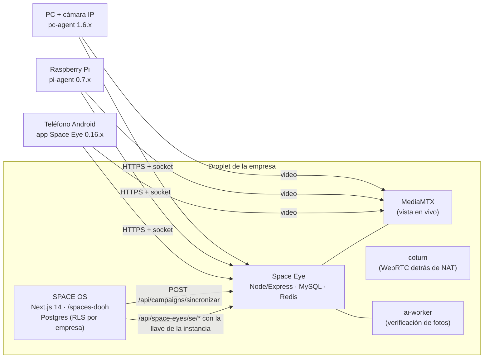
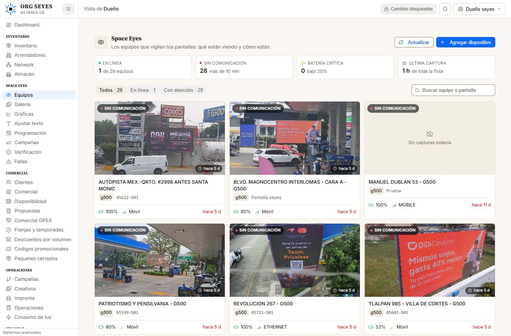
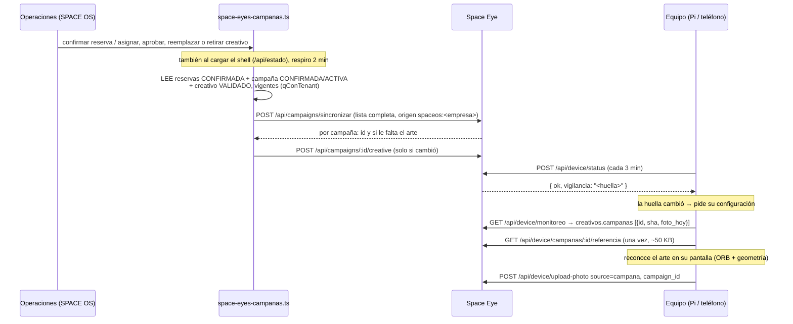

# Manual técnico — Space Eyes

Para quien va a mantener o extender Space Eyes. El manual de usuario está en
[[manual-space-eyes]]; aquí está **cómo funciona por dentro**, dónde vive cada
cosa, cómo se prueba y las trampas que ya costaron horas.

> [!important] Dos sistemas, una rama
> - **SPACE OS** (este repo, `apps/web`): la interfaz. El módulo
>   `/space-eyes` y la sincronización de campañas.
> - **Space Eye** (carpeta `space-eye/` de esta misma rama, con todo su
>   historial): el servidor de cámaras, los agentes de Raspberry y PC, y la app
>   Android. Cada empresa (instancia) tiene **su propio** Space Eye
>   ([[0045-space-eye-vive-dentro-de-cada-instancia|ADR 0045]]).

## 1. El panorama

- **El navegador nunca habla con Space Eye.** Todo pasa por la puerta de SPACE
  OS (`app/api/space-eyes/se/[...ruta]/route.ts`), que exige permisos
  (`inventario.ver` para leer, `inventario.crear` para escribir), valida la ruta
  contra una lista (`PERMITIDAS`) y agrega la llave de la instancia
  (`SPACE_EYE_KEY`) más el usuario (`X-SpaceOS-Usuario`).
- **La pantalla y el equipo se ligan por código:**
  `sitios.codigo_proveedor` (SPACE OS) = `devices.billboard_code` (Space Eye),
  sin mayúsculas ni espacios.
- **Si la empresa no tiene el módulo** (licencia con `modulos` y sin
  `space-eyes`, o sin `SPACE_EYE_BASE_URL`; una licencia de antes, **sin el
  campo** `modulos`, no decide y manda la configuración), `/space-eyes` muestra la demostración
  (`DemoSpaceEyes.tsx`); si lo tiene pero no responde, `SinRespuesta.tsx`.
  Lo decide `estadoDelModulo()` en `lib/server/space-eye.ts` (salud cada 30 s).

## 2. Las pantallas del módulo (SPACE OS)

| Ruta | Componente | Qué hace |
|---|---|---|
| `/space-eyes` | `ListaEquipos.tsx` | Tarjetas de equipos, filtros, búsqueda. Cuadrícula de 1 a 6 columnas según el ancho. |
| `/space-eyes/[id]` | `FichaEquipo.tsx` | Pestañas **Fotos** (En vivo primero, captura, foto del cliente, comparar), **Pantalla y fallas**, **Creativos**, **Equipo**. |
| ↳ Pantalla y fallas | `PantallaConfig.tsx`, `PantallaYCreativos.tsx` | Marcar la pantalla (4 esquinas, gabinetes, zonas tapadas, horario), vigilancia de fallas, aviso al instante de apagón. |
| ↳ Creativos | `CreativosConfig.tsx` | Vigilar en continuo o por intervalos, **mandar al momento o juntas cada 2/4/8/12 h**, medidor de datos del mes contra 4 GB, catálogo. |
| ↳ Equipo | `EquipoAdmin.tsx` | Actualizar app, reiniciar app, reiniciar equipo (Raspberry), datos técnicos. |
| `/space-eyes/nuevo` | `AltaDispositivo.tsx` | Códigos de vinculación (uno o hasta 200 equipos), QR para teléfono, kit de microSD para Raspberry. |
| `/space-eyes/galeria` | `Galeria.tsx` | Todas las fotos, filtros por origen, descarga de álbum. |
| `/space-eyes/graficas` | `Graficas.tsx` | Telemetría y consumo de datos. |
| `/space-eyes/texto` | `AjustarTexto.tsx` | Marca de texto (nombre/fecha/hora) sobre las fotos. |
| `/space-eyes/programacion` | `Programacion.tsx` | Fotos programadas. |
| `/space-eyes/campanas` | `CampanasEyes.tsx` | Campañas de verificación. Las que llegan de Operaciones salen marcadas «De Operaciones» y no se editan aquí. |
| `/space-eyes/verificacion` | `Verificacion.tsx` | Resultados de la verificación con IA. |
| `/space-eyes/fallas` | `FallasFlota.tsx` | Historial de fallas de toda la flota. |

Piezas compartidas en `piezas.tsx` (`FotoGirada` con unidades de contenedor,
`VisorFoto`, `PildoraConexion`, formatos de fecha y bytes).

**Responsivo (oct-2026):** tablas anchas (Fallas, Programación, Verificación)
se convierten en tarjetas debajo de `xl`/`lg`; los encabezados bajan los
botones a otra fila en celular (`min-w-[12rem]` en el bloque del título); la
foto principal y el vivo no pasan de `70vh`; la ficha tiene tope de
`1800px`. Se verifica con capturas sin ventana a 390, 768, 1024, 1366, 1920 y
2560 px (ver §9).

## 3. Campañas de Operaciones → foto de prueba (oct-2026)

Lo que se vende en Operaciones se reconoce en la pantalla y se fotografía
**solo**, una vez al día por campaña, aparte de lo programático (cualquier
imagen nueva).

- **SPACE OS** (`lib/server/space-eyes-campanas.ts`): solo lee, nunca lanza,
  no espera a nadie (corre aparte de la respuesta). Fuera del módulo solo hay
  **una línea** en `app/api/estado/route.ts`,
  `app/api/creatividades/[id]/route.ts`,
  `app/api/campanas/[id]/confirmar/route.ts` y
  `lib/server/creativos-controller.ts`. No toca `campanas-repo` ni
  `creativos-repo`.
- **Space Eye** (`space-eye/backend/src/controllers/campanasSpaceos.controller.ts`):
  cada par campaña-creativo es una fila de `campaigns` con
  `origen`/`origen_id`; lo que ya no viene se apaga (`active = FALSE`), nada se
  borra. Migración `024_campanas_de_spaceos.sql`.
- **El equipo** (`space-eye/pi-agent/vision/campanas.py`,
  `space-eye/android/.../pantalla/Campanas.kt` y `BuscadorCampanas.kt`): la
  campaña se busca ANTES que el catálogo de creativos; si coincide, sube su
  prueba (aun aprendiendo, sin gastar el tope de creativos) y la deja en el
  catálogo para que al terminar la campaña no vuelva como «nueva».
- **Creativos en HTML** no tienen imagen que reconocer: los cubre la
  vigilancia de lo nuevo.

## 4. La vigilancia de la pantalla (en el equipo)

Todo el análisis corre **en el equipo**; al servidor solo viajan resultados y
las fotos que importan. Mirar no gasta datos.

| Pieza | Teléfono (Kotlin) | Raspberry (Python, `pi-agent/vision/`) |
|---|---|---|
| Ciclo y decisiones | `pantalla/Monitor.kt` | `monitor.py` |
| Fallas (gabinetes apagados, congelados) | `SaludAnalisis.kt`, `Seguimiento.kt` | `salud_analisis.py`, `seguimiento.py` |
| Creativos nuevos (ORB + homografía) | `creativos/Reconocedor.kt`, `Vision.kt` | `reconocedor.py`, `vision.py` |
| Envío agrupado | `LoteCreativos.kt` | `lote.py` |
| Apagón completo (aviso rápido) | `ApagadaRapida.kt` | `apagada_rapida.py` |
| Campañas | `Campanas.kt`, `BuscadorCampanas.kt` | `campanas.py` |

- **Modo continuo** (`creativos.cada_min = 0`): mira todo el día dentro del
  horario de la pantalla. Un creativo se confirma con **dos miradas seguidas**
  (cada 5 s).
- **Envío** (`creativos.envio_min`): 0 = al momento; 120/240/480/720 = juntas,
  una por creativo (la más nítida, varianza del laplaciano), guardadas en disco.
- **Apagón**: pantalla oscura y pareja, con luz alrededor, 3 miradas seguidas
  → una alerta con foto, se cierra sola con la revisión de siempre. De noche o
  con la lente tapada NO (eso lo decide la revisión con confirmación).
- **Huella de configuración** (`space-eye/backend/src/utils/versionVigilancia.ts`):
  viaja en la respuesta del reporte de estado; el equipo solo vuelve a pedir
  su configuración si cambió (antes, en continuo, cada 15 min).
- **Raspberry**: Node (`pi-agent/src/`) es dueño de la cámara y la red; la
  visión en Python habla con él por un puente local con secreto
  (`pi-agent/vision/PUENTE.md`).

## 5. Datos

**Space Eye (MySQL)**, migraciones en `space-eye/backend/migrations/`:

| Migración | Qué agrega |
|---|---|
| 011, 018 | catálogo de creativos (`device_creatives`), fallas (`pantalla_fallas`), `photos.source` |
| 020 | orden `REBOOT_DEVICE` |
| 021, 022 | `vinculaciones` (códigos de un uso o de lote, `usos_max ≤ 200`) |
| **023** | `devices.creative_envio_min`, `devices.salud_aviso_rapido` |
| **024** | `campaigns.origen/origen_id/origen_sha/creative_sha`, `photos.source = 'campana'` |
| **025** | `devices.app_actualiza_sola/app_actualiza_motivo/app_instalador/android_sdk` |

Todas son aditivas e idempotentes (procedimiento + `IF NOT EXISTS`); los
cambios de `ENUM` van con `ALGORITHM=INSTANT` para no bloquear la tabla de
fotos. Ojo: `photos` no tiene `created_at` (es `uploaded_at` / `taken_at`).

**SPACE OS (Postgres)** — lo que lee Space Eyes, siempre con la empresa:
`reservas` (estatus, fechas, `creativos` jsonb `[{creatividadId, veces}]`),
`campanas` (`estado_comercial`), `creatividades` (`estatus_validacion`,
`retirado_en`, `archivo_url` en data URL), `sitios.codigo_proveedor`.

## 6. API que usa SPACE OS (Space Eye)

Con la llave de la instancia (`Authorization: Bearer <SPACE_EYE_KEY>`):

| Ruta | Para qué |
|---|---|
| `GET /api/devices`, `/api/devices/:id` | lista y ficha |
| `GET/PUT /api/devices/:id/pantalla`, `PUT .../salud` | pantalla marcada y fallas (`aviso_rapido`) |
| `GET/PUT /api/devices/:id/creativos` | creativos (`cada_min`, `envio_min`, `max_dia`…) |
| `POST /api/devices/:id/command` | `TAKE_PHOTO`, `START_STREAM`/`STOP_STREAM`, `UPDATE_APP`, `REBOOT_APP`, `REBOOT_DEVICE`, `UPDATE_CONFIG` |
| `POST /api/campaigns/sincronizar` | la lista completa de campañas de Operaciones |
| `POST /api/campaigns/:id/creative` | el arte (multipart `creative`, opcional `origen_sha`) |
| `GET/POST /api/vinculaciones` | códigos de vinculación |

Del equipo (`/api/device/*`, con su token): `register`, `status` (responde la
huella `vigilancia`), `pending-commands`, `upload-photo`
(`source=campana` + `campaign_id`), `monitoreo`, `fallas`,
`campanas/:id/referencia`.

## 7. Equipos: alta, actualización y mudanza

- **Alta**: código de vinculación de SPACE OS (QR en el teléfono; archivo de la
  microSD con cloud-init en la Raspberry; código en el instalador de PC). Un
  código puede servir para hasta 200 equipos.
- **Raspberry desde cero**: `space-eye/pi-agent/instalar.sh` (o el kit de la
  microSD de `apps/web/lib/space-eyes-kit-pi.ts`). Deja la hora de México si la
  Pi venía en UTC: el horario de la pantalla se compara con la hora local.
- **Actualizar a distancia**: `UPDATE_APP`. Cada Space Eye publica el agente
  de Raspberry que trae su imagen (`utils/agentesDeFabrica.ts`, también el
  instalador si solo cambió él). El equipo prueba la versión nueva y **regresa
  sola** a la anterior si no arranca.
- **Mudanza** entre Space Eye: `UPDATE_CONFIG {mudanza:{servidor, codigo?}}`,
  con regreso solo a los 30 min (`space-eye/docs/MUDANZA_DE_EQUIPOS.md`).
- **App del teléfono**: firmada con la llave de la flota (NO está en el repo;
  NO perderla). La versión de prueba nunca se instala en equipos de producción.
- **Actualización sin toque (APK 0.16.4)**: la app declara
  `UPDATE_PACKAGES_WITHOUT_USER_ACTION` y pide `USER_ACTION_NOT_REQUIRED`; en
  Android 12+ se actualiza a sí misma sin confirmación. Sin el permiso (las
  versiones anteriores) Android pide un toque en CADA actualización. Cada
  estado reporta si la próxima entra sola y por qué (`AppUpdater.decidir`:
  `kiosco`, `sola`, `android_viejo`, `sin_permiso`, `sin_instalar_apps`,
  `otro_dueno`), migración `025`, y el panel lo traduce
  (`lib/space-eyes-actualizacion.ts`): ficha › Equipo y el filtro «Se
  actualizan a mano» de la lista.

Versiones al 07/10/2026: Raspberry **0.7.5**, teléfono **0.16.4** (código 36),
PC **1.6.0**, imagen de Space Eye construida con `space-eye/Dockerfile.instancia`.

## 8. Despliegue

- Cada instancia levanta su Space Eye con su pila (`infra/eyes/`) y lo
  actualiza `infra/scripts/update-eyes.sh`; se activa por empresa con la licencia firmada
  (`apps/flota/modulo.mjs`, `LICENCIA_DEL_PADRE=1`) y las altas nuevas con
  `--con-eyes` ([[0045-space-eye-vive-dentro-de-cada-instancia|ADR 0045]],
  etapa 4: **zona ROJA, la aprueba Emiliano**).
- La imagen: `docker build -f space-eye/Dockerfile.instancia space-eye`.
  Las migraciones de Space Eye corren solas al arrancar.
- Producción actual de cámaras (`159.203.188.58:4000`) **no se toca** desde
  esta rama; el paso de la flota de g500 a su Space Eye está planeado en
  `space-eye/docs/ETAPA5_MIGRACION_G500.md` y cada paso pide autorización.

## 9. Cómo se prueba

| Qué | Comando |
|---|---|
| SPACE OS, todo | `cd apps/web && npx vitest run` (249 archivos, 3443 pruebas) · `npx tsc --noEmit` · `npx eslint components/demo/space-eyes` |
| Sincronización de campañas | `npx vitest run lib/server/space-eyes-campanas.test.ts` |
| Visión de la Raspberry | `cd space-eye/pi-agent && python3 -m pytest vision/pruebas` (necesita OpenCV; hay imagen de Docker en el ensayo) |
| Node de la Raspberry | `cd space-eye/pi-agent && npm run probar` |
| App del teléfono | `cd space-eye/android && ./gradlew testDebugUnitTest` (JDK 17) |
| Servidor | `cd space-eye/backend && npx tsc --noEmit`, `npm run prueba:vinculaciones`, `npm run prueba:agentes` |

**Ensayos de punta a punta sin hardware** (`space-eye/infra/ensayo-pi/`): una
Raspberry simulada en Docker con una «cámara» que es una carpeta de fotos,
contra un Space Eye local.

| Ensayo | Qué demuestra |
|---|---|
| `ensayar-instalacion.sh` | Pi desde cero: agente, OpenCV, permisos mínimos, hora local, alta |
| `ensayar-actualizacion.sh` | actualización por red y regreso solo |
| `ensayar-vigilancia.sh` | gabinetes apagados: una alerta agrupada con evidencia, se cierra sola |
| `ensayar-envio-y-apagon.sh` | lo que sale una vez llega; juntas en un envío; apagón en < 1 min |
| `ensayar-campanas.sh` | campaña → referencia sola → prueba al verla → una al día → se apaga |
| `ensayar-mudanza.sh`, `ensayar-microsd.sh` | mudanza entre servidores; kit cloud-init real |

## 10. Trampas conocidas (cada una costó horas)

1. **No correr prettier** en este repo: no hay configuración y reformatea
   archivos enteros.
2. **Nunca editar un `.sh` mientras bash lo ejecuta** (lo lee por partes):
   correr los ensayos desde una copia.
3. **Hora de la Raspberry**: en UTC el horario de la pantalla queda corrido 6 h
   y cerca de medianoche UTC «no vigila» (margen de 10 min en los bordes).
4. **`loading="lazy"` no carga** dentro de un contenedor con
   `container-type: size` (`FotoGirada`).
5. **Un error leyendo campañas no puede dejar al equipo sin vigilar**: en
   `monitoreo.controller.ts` las campañas van con `catch` (pasó en el ensayo).
6. **Ensayo local**: tras cambiar la imagen de Space Eye hay que reaplicar
   `ensayo-local.yml` (ya lo hace `cambiar-version.sh`); si no, los equipos
   simulados no bajan sus actualizaciones.
7. **Datos de ensayo**: los anuncios 8 y 9 son el MISMO creativo en dos
   sitios; el equipo los ve, con razón, como uno solo.

## Relacionadas
[[manual-space-eyes]] · [[0045-space-eye-vive-dentro-de-cada-instancia]] ·
`space-eye/docs/ARQUITECTURA_SPACE_EYES.md` ·
`space-eye/docs/MANUAL_TECNICO.md` · `REVISION-SPACE-EYES.md`
