# Manual de usuario — lo que entró en septiembre

## Qué cubre este manual y qué no

Este manual cubre **seis cosas nuevas** que aparecieron en SPACE OS a lo largo de
septiembre de 2026:

- los **códigos de recuperación**, la llave que te queda si entras con Google y pierdes esa
  cuenta;
- las **razones sociales** de tu empresa, y con cuál se paga cada renta y se emite cada
  comprobante;
- la captura del **recibo de luz** de cada predio;
- los **reportes de rentabilidad**, con sus cinco formas de mirar el negocio;
- las **actualizaciones**, donde el dueño de la instalación decide cuándo entra la versión
  nueva;
- el **soporte**, para escribirle una incidencia a AS OOH desde la propia aplicación y leer
  la respuesta.

Todo lo demás —entrar con tu correo, el inventario, los arrendadores, las propuestas, las
campañas, las órdenes de trabajo, la facturación y la cobranza— funciona como siempre y no
se repite aquí.

> [!info] Éste es el único manual de usuario vigente
> Los manuales anteriores se retiraron el 24 de septiembre de 2026 para que no hubiera
> varias versiones compitiendo. Si algo de lo que no cubre este documento te hace falta por
> escrito, pídelo: es un hueco conocido, no un descuido de tu instalación.

Los nombres de botones, pantallas y avisos van **entre comillas**, tal como aparecen en
pantalla.

> [!success] 2026-09-21 · recorrido delante de la aplicación, con capturas
> Este manual se volvió a caminar completo con la base de demostración
> (`demo-rentabilidad`, sembrada con `scripts/semilla-demo.mjs`) y la app en
> `next build && next start` — **no** en `next dev`: la CSP bloqueante del
> 28/08 usa `unsafe-eval` implícitamente en modo desarrollo (Fast Refresh) y
> ese modo deja el formulario de acceso sin reaccionar, con el botón
> «Entrar» permanentemente deshabilitado. No es un defecto de este manual;
> es un defecto del entorno de desarrollo local y se reporta aparte.
>
> Las capturas están en `capturas-2026-09-18/`, junto a este archivo, y el
> guion que las toma —re-ejecutable— es
> `manuales/capturas-2026-09-18.spec.ts`. Los cinco textos entre comillas que
> quedaban por confirmar ya están confirmados **mirando la pantalla**, y
> quedan escritos donde corresponden y también en `## PENDIENTES`, al final,
> con la cita literal. Lo que no cambia: si un botón se llama distinto en tu
> instalación, manda lo que ves en tu instalación — esto se verificó contra
> UNA base de demostración, no contra la tuya.

> [!success] 2026-09-24 · los diez apartados, recorridos con la aplicación delante
> Los apartados **1**, **6** y **7** se añadieron el 24 de septiembre leyendo el código, y
> esa misma tarde se recorrió el manual entero delante de la aplicación, con una foto por
> paso. Solo el 1.1 se queda sin imagen: exige entrar con Google.
>
> **Dos estados se prepararon a mano en la instalación local**, y sus pies de foto lo
> dicen: la versión nueva disponible del apartado 6 (en una instalación real la escribe el
> actualizador del servidor) y las dos campañas listas para facturar del 4.2. El detalle
> está en `## PENDIENTES`.

---

## 1 · Guardar los códigos de recuperación de tu cuenta

**Cualquier usuario que entre con Google.** En la práctica, el Dueño: es la cuenta que en
muchas instalaciones entra solo por ahí.

Si entras con Google no tienes contraseña con la que volver. Los códigos de recuperación
son la única llave que te queda el día que pierdas el acceso a esa cuenta.

### 1.1 · Guardarlos la primera vez

**Empiezas en:** la pantalla que el sistema te pone delante la primera vez que entras con
Google. No se puede esquivar: hasta que confirmes que los guardaste, no puedes trabajar.

**Vas a conseguir:** una lista de códigos que te deja entrar sin Google.

1. Lee el aviso y pulsa **«Mostrar mis códigos»**.
2. Pulsa **«Copiar»**, o imprime la lista.
3. Guárdalos donde no se pierdan y donde nadie más los vea.
4. Marca **«Ya los guardé en un lugar seguro»**.
5. Pulsa **«Continuar»**.

**Salió bien si:** entras a tu pantalla de siempre y el sistema deja de pedírtelo.

> [!danger] Se muestran UNA vez, y no hay segunda oportunidad
> En cuanto sales de esa pantalla no vuelven a mostrarse: de cada código solo queda
> guardada una huella con la que comprobarlo. Si cierras la ventana antes de copiarlos, la
> única salida es generar otros — y generar otros anula los que tuvieras.

Cada código sirve **una sola vez**. Al usar uno, el sistema te dice cuántos te quedan; es a
propósito, para que no gastes el último sin enterarte.

> [!note] Captura: la pantalla de códigos de recuperación con la lista, el botón «Copiar» y
> la casilla «Ya los guardé en un lugar seguro»

### 1.2 · Generar otros códigos

**Empiezas en:** la misma pantalla de códigos de recuperación, a la que vuelves cuando
quieras.

1. Pulsa **«Generar códigos nuevos»**.

   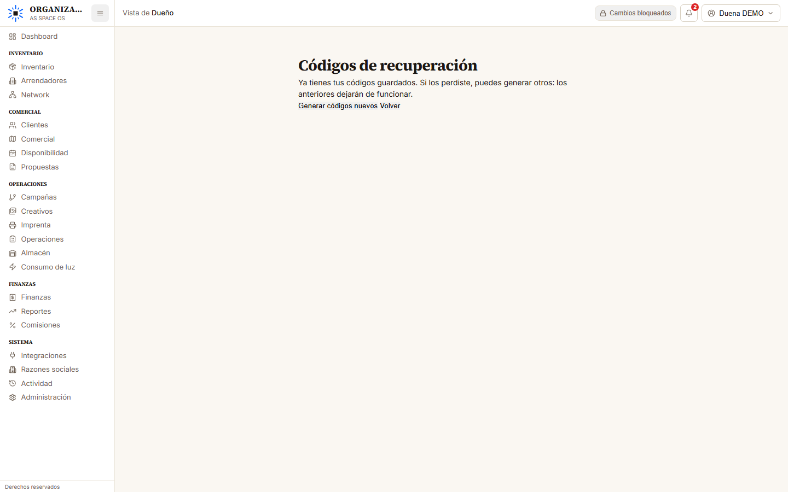
   *Captura — apartado 1.2, paso 1.*

2. Teclea tu contraseña cuando el sistema te la pida.

   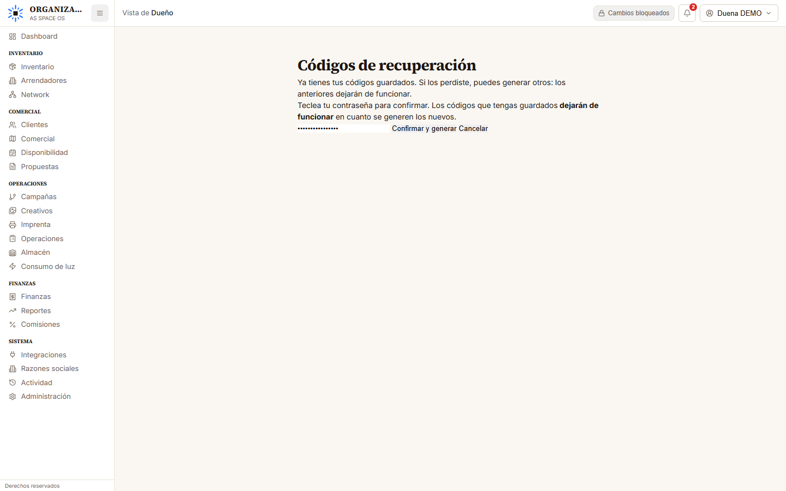
   *Captura — apartado 1.2, pasos 2-3.*

3. Pulsa **«Confirmar y generar»**.
4. Copia y guarda los nuevos, igual que la primera vez.

   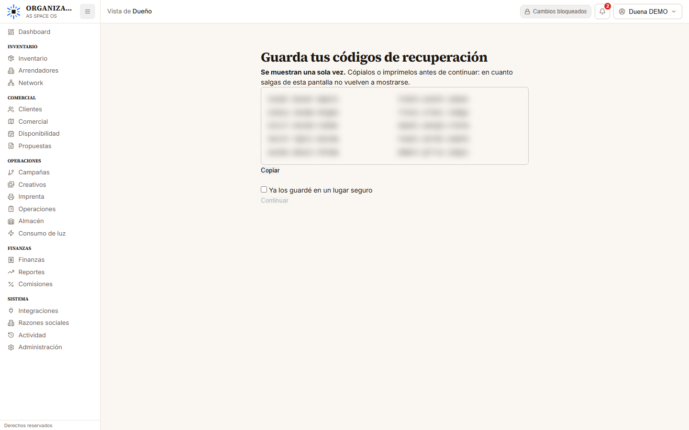
   *Captura — apartado 1.2, paso 4. Es la misma pantalla de lista que describe el 1.1,
   pasos 2-5. Los códigos se difuminaron antes de tomarla: son un secreto aunque sean de
   una cuenta de pruebas.*

**Salió bien si:** aparece una lista nueva de códigos.

> [!danger] Los códigos viejos dejan de funcionar en ese mismo momento
> Si los tenías impresos, tira ese papel: ya no abren nada. Por eso pedir el primer lote no
> lleva contraseña y pedir otro sí — el segundo invalida en silencio lo que alguien tiene
> guardado.

### 1.3 · Si tu cuenta ya no entra con contraseña

Al intentar entrar con tu contraseña verás: *«Esta cuenta entra con Google. Usa el botón de
Google, o un código de recuperación si perdiste el acceso a esa cuenta.»*

No es una contraseña mal tecleada: a esa cuenta se le cerró la entrada por contraseña a
propósito, porque es la de más privilegio. Entra con **«Continuar con Google»**.

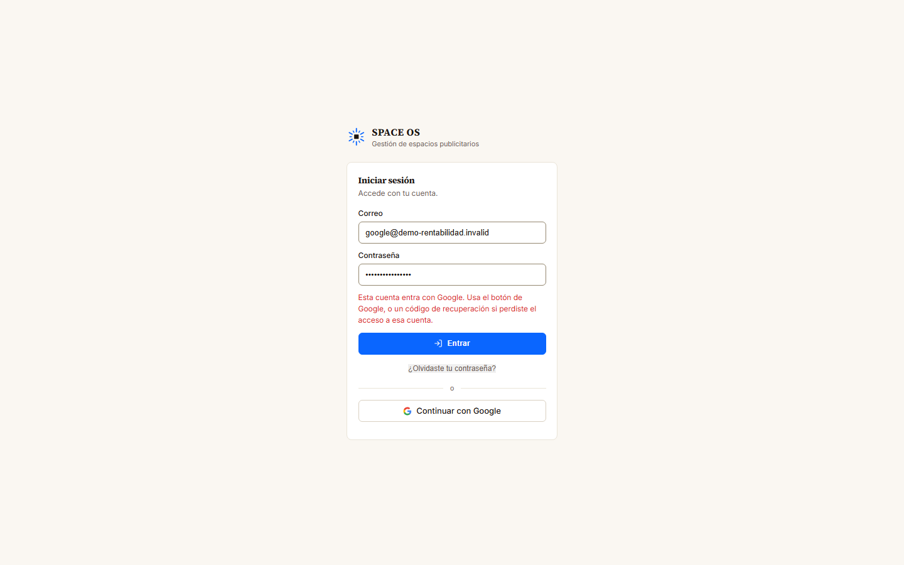
*Captura — apartado 1.3.*

> [!info] Tu contraseña sigue sirviendo, pero para otra cosa
> Aunque no te deje entrar con ella, la contraseña se sigue pidiendo para los cambios
> sensibles —facturar, registrar un pago, tocar un contrato—. Ver el apartado 4.1. Si nunca
> te pusieron una, pídesela a quien administra tu cuenta **antes** de necesitarla.

> [!warning] Hoy no hay dónde teclear un código para entrar
> El sistema acepta los códigos, pero **la pantalla de acceso no tiene todavía ningún campo
> ni enlace donde escribirlos**. Guárdalos igual —son lo que permitirá recuperar la cuenta
> en cuanto exista esa puerta—, pero si pierdes hoy tu cuenta de Google, tendrás que pedirle
> ayuda a quien administra tu instalación. Queda anotado en `## PENDIENTES`.

---

## 2 · Decirle al sistema con qué razones sociales trabaja tu empresa

Una empresa de publicidad exterior casi nunca es una sola sociedad. Una paga las rentas a
los arrendadores, otra compra el equipo, otra hace los trámites con gobierno, y la
operación y las ventas a veces van juntas y a veces no.

Hasta el 17 de septiembre el sistema solo guardaba **una**. Ahora guarda las que hagas
falta, y sabe qué papel juega cada una.

Los papeles son **cinco y fijos**: arrendamientos, activos, licencias, operación y ventas.
No se pueden crear, renombrar ni borrar desde la aplicación.

### 2.1 · Contestar el cuestionario de bienvenida

**Solo si tu cuenta tiene permiso de Administración.** En la práctica, el Dueño.

**Empiezas en:** la pantalla de bienvenida, que aparece la primera vez que entras a una
instalación recién estrenada.

**Vas a conseguir:** que queden creadas tus razones sociales, cada una con su papel.

1. Contesta la primera pregunta: **«¿Tu empresa tiene varias razones sociales?»**. Responde
   sí o no.
2. Si contestaste que sí, contesta la segunda: **«¿La operación está en la misma razón
   social que comercializa o factura las ventas?»**. Responde sí o no.
3. Escribe el nombre de la razón social que corresponde a cada papel. El sistema te enseña
   solo los campos que hacen falta según lo que contestaste antes.

   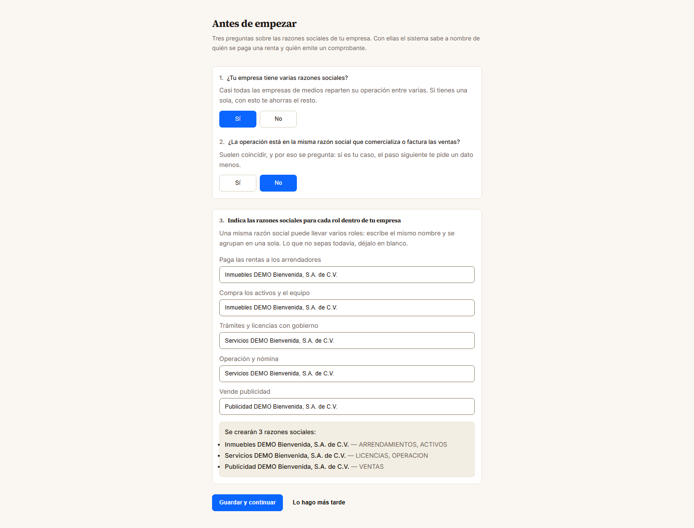
   *Captura — apartado 2.1, pasos 1-3.*

4. Pulsa **«Guardar y continuar»**.

Las dos primeras preguntas existen para **ahorrarte la tercera**. Esto es lo que cambia:

| Si contestas... | y luego... | tecleas |
|---|---|---|
| Una sola razón social | no se te pregunta | **un solo nombre**, que se queda con los cinco papeles |
| Varias | operación y ventas coinciden | **cuatro nombres** |
| Varias | operación y ventas separadas | **cinco nombres** |

**Salió bien si:** la pantalla deja de ofrecerte el cuestionario y te lleva al
**Dashboard**. Las razones sociales que acabas de crear están en la entrada **«Razones
sociales»** del menú lateral.

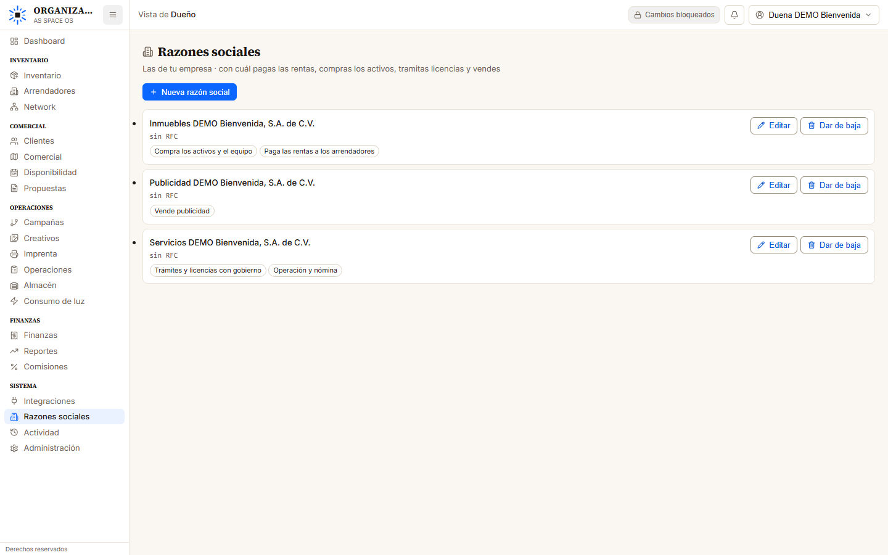
*Captura — apartado 2.1, «Salió bien si»: lo que ves al abrir «Razones sociales» después
de contestar.*

> [!info] Puedes escribir la misma empresa en varios campos
> Es el caso normal, no la excepción. Si la misma sociedad paga rentas y compra activos,
> escribe su nombre en los dos campos: el sistema entiende que es **una sola** razón social
> con dos papeles, no dos.
>
> Y no le molestan las diferencias de escritura. «ACME, S.A. de C.V.» y «Acme SA de CV» son
> la misma empresa para el sistema. Lo que se guarda es **como tú lo escribiste la primera
> vez**, no una versión normalizada.

> [!warning] El cuestionario se contesta UNA vez
> En cuanto existe una razón social, el cuestionario deja de ofrecerse y ya no se puede
> volver a enviar. Lo que se cambia después se cambia en **«Razones sociales»** (apartado
> 2.2), no aquí.
>
> Y se guarda todo junto o no se guarda nada: si algo falla a la mitad, no queda ninguna
> razón social creada y puedes volver a intentarlo.

> [!note] Captura: el cuestionario de bienvenida con las tres preguntas, en el caso de
> «varias razones sociales» con operación y ventas separadas (cinco campos)

*La captura de esta nota está en el paso 3, arriba. Se tomó el 2026-09-24 con una
organización recién creada y sin ninguna razón social (`demo-bienvenida`, que prepara
`manuales/preparar-base-2026-09-18.mjs`).*

### 2.2 · Saltarte el cuestionario y contestarlo después

**Empiezas en:** la pantalla de bienvenida.

1. Pulsa **«Lo hago más tarde»**.

   
   *Captura — apartado 2.2, paso 1.*

**Salió bien si:** entras a trabajar con normalidad. La aplicación funciona igual sin
razones sociales capturadas.

Nadie queda encerrado en esta pantalla. Si el dato lo tienes que preguntar a tu contador,
sáltatela y vuelve cuando lo tengas.

> [!info] Mientras no las captures, verás «Sin asignar»
> Los contratos y los comprobantes seguirán funcionando, pero saldrán sin razón social. No
> es un error: ver el apartado 5.

---

## 3 · Gestionar tus razones sociales después

**Solo si tu cuenta tiene permiso de Administración.**

**Empiezas en:** el menú lateral, entrada **«Razones sociales»**.

En esta pantalla das de alta una razón social nueva, editas las que ya tienes, les cambias
el papel, las das de baja y las vuelves a activar.

> [!note] Captura: la pantalla «Razones sociales» con el listado, los papeles de cada una y
> los avisos de papel sin dueño y papel compartido

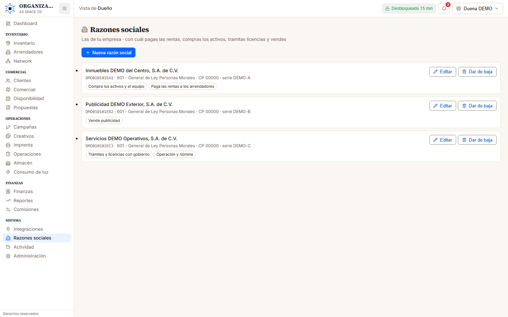
*Captura — apartado 3, estado sano. En la base de demostración, cada papel tiene
exactamente una dueña, así que los dos avisos de 3.2 no aparecen aquí; se muestran
provocados más abajo.*

### 3.1 · Dar de baja una razón social

1. Abre **«Razones sociales»**.
2. Localiza la razón social en el listado.
3. Dala de baja.

   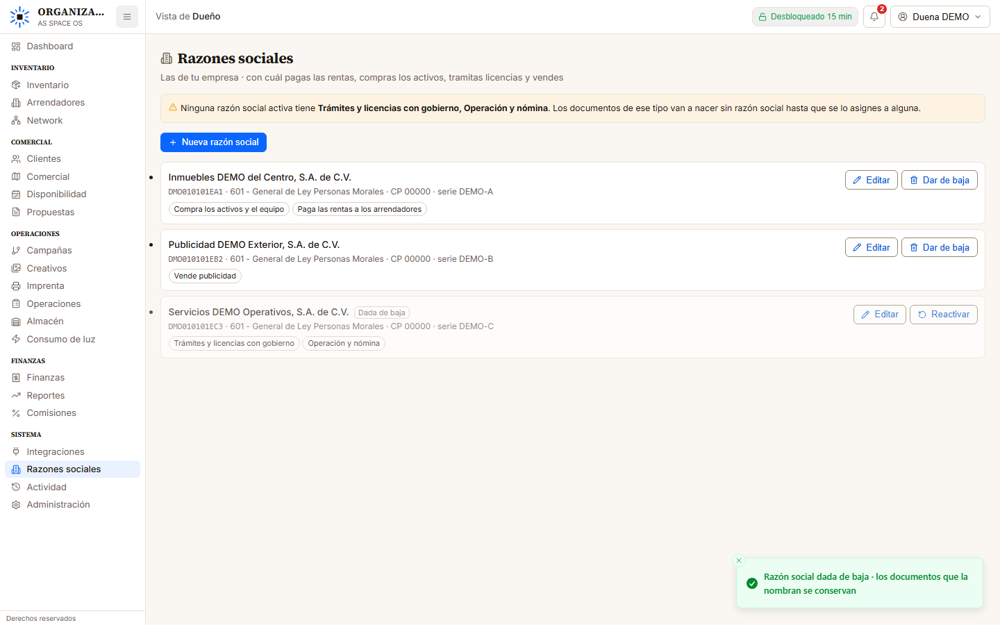
   *Captura — apartado 3.1, paso 3. La baja es directa, sin cuadro de confirmación.*

**Salió bien si:** desaparece del listado normal y deja de ofrecerse al asignar contratos y
comprobantes nuevos.

> [!warning] Dar de baja la única que tenía un papel deja ese papel sin dueño
> Si la sociedad que das de baja era la única que vendía, a partir de ese momento **el
> sistema deja de proponerte nada** al emitir un comprobante, y hay que elegir a mano cada
> vez. La pantalla te lo avisa, pero el efecto se nota semanas después y en otra pantalla.

La baja **no borra nada**. Los contratos y los comprobantes que ya la tenían asignada la
conservan, y la puedes volver a activar desde la misma pantalla. No hace falta capturarla
otra vez con el mismo nombre: eso crearía un duplicado, y el sistema lo rechaza.

### 3.2 · Los dos avisos de esta pantalla

| Aviso | Qué significa | Qué hacer |
|---|---|---|
| **Papel sin dueño** | Ninguna razón social activa tiene ese papel | Asígnaselo a alguna, o acepta elegir a mano cada vez |
| **Papel compartido** | Dos o más lo tienen | El sistema no propondrá ninguna: tendrás que elegir en cada documento |

Ninguno de los dos te impide trabajar. Los dos te dicen por qué el sistema deja de
sugerirte una razón social donde antes te la sugería.

> [!success] 2026-09-21 · Los dos avisos, provocados y confirmados palabra por palabra
> En la demostración cada papel tiene una sola dueña, así que hubo que forzar el estado:
> se dio de baja «Servicios DEMO Operativos» (única dueña de `OPERACION` y `LICENCIAS`,
> lo que deja esos dos papeles sin dueño) y se le añadió `ARRENDAMIENTOS` a «Publicidad
> DEMO Exterior», que ya lo tenía «Inmuebles DEMO del Centro» (papel compartido).
>
> **Papel sin dueño**, literal:
> *«Ninguna razón social activa tiene Trámites y licencias con gobierno, Operación y
> nómina. Los documentos de ese tipo van a nacer sin razón social hasta que se lo asignes
> a alguna.»*
>
> **Papel compartido**, literal:
> *«Paga las rentas a los arrendadores lo tienen dos o más. Cuando hay varias con el mismo
> papel el sistema no propone ninguna, así que habrá que elegirla a mano en cada contrato
> o comprobante.»*
>
> Cita: `apps/web/components/demo/razones-sociales/GestionEntidadesFiscales.tsx:284-303`.
> Y de paso: las etiquetas de los papeles salen **con acento** («Trámites», «Operación y
> nómina»), así que la migración `20260921_corrige_acentos_catalogo_roles_entidad.sql`
> (D8 de `docs/Supervision/ABIERTOS.md`) **ya estaba aplicada** en el entorno donde se
> hizo esta pasada.

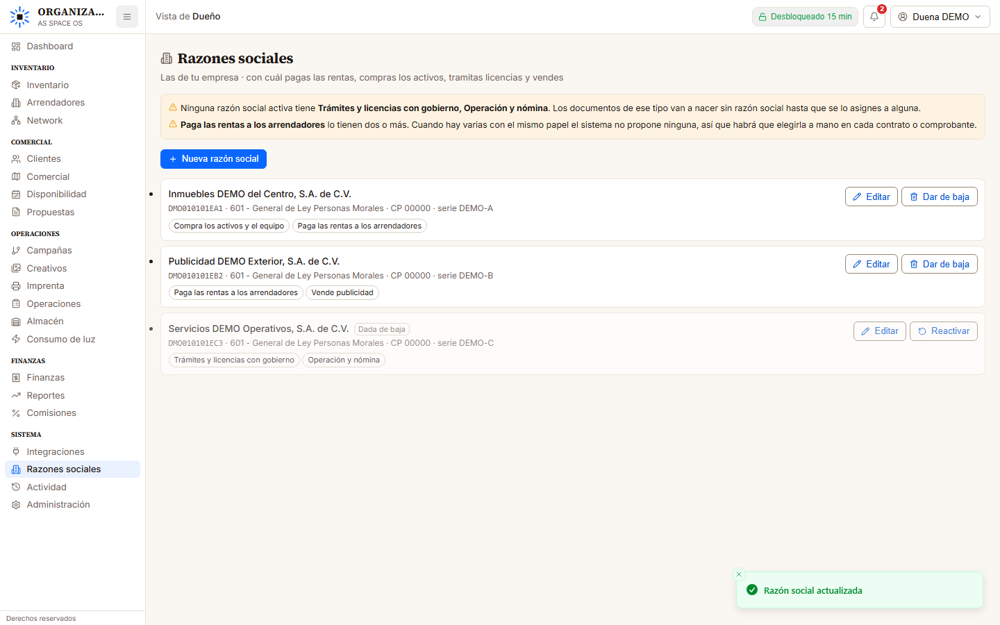
*Captura — apartado 3.2, avisos provocados a propósito para esta pasada.*

---

## 4 · Decir con qué razón social se paga cada renta y se emite cada comprobante

### 4.1 · Asignar la razón social que paga un contrato de renta

**Empiezas en:** la ficha del contrato de arrendamiento.

**Vas a conseguir:** que quede escrito a nombre de qué sociedad tuya se paga esa renta.

1. Abre el contrato.
2. Busca el dato **«La paga»**.

   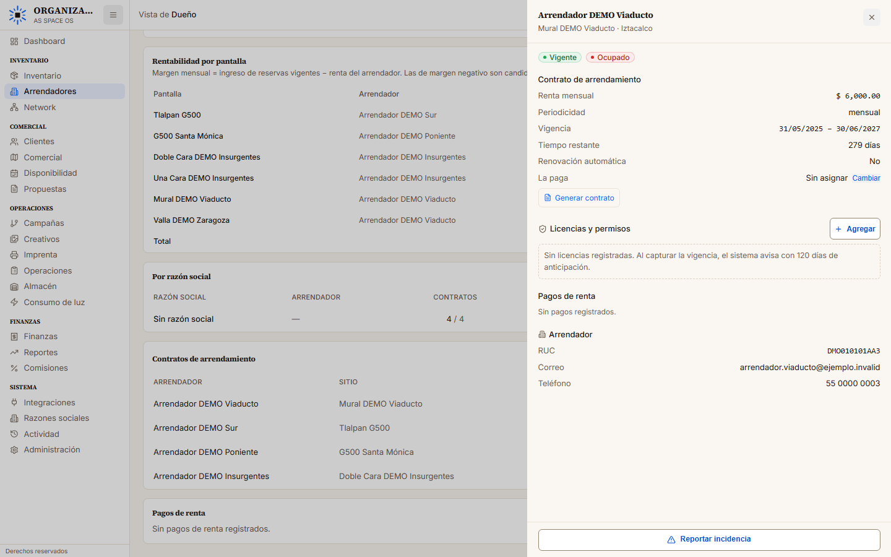
   *Captura — apartado 4.1, pasos 1-2.*

3. Pulsa **«Cambiar»**.
4. Elige la razón social en el selector.

   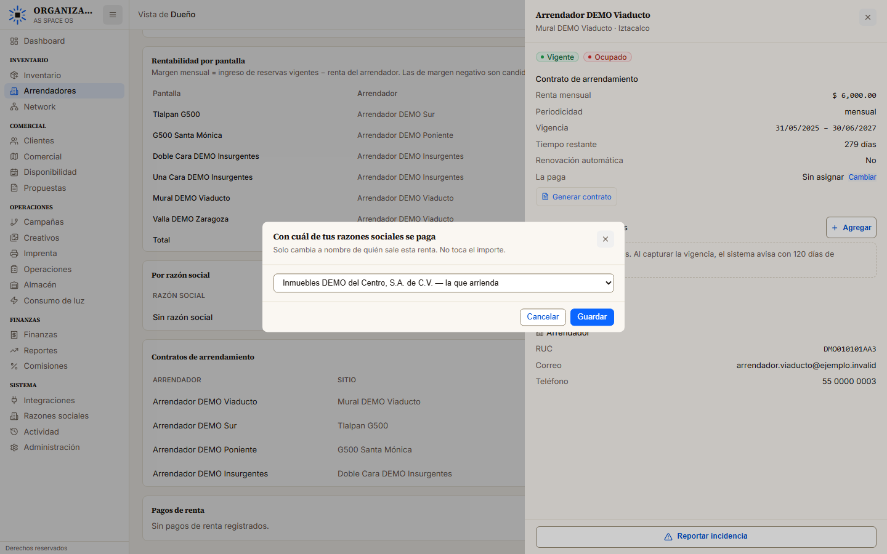
   *Captura — apartado 4.1, pasos 3-4. El selector marca con «— la que arrienda» la que
   tiene el papel.*

5. Pulsa **«Guardar»**.

   Si ya desbloqueaste los cambios en los últimos minutos (el botón de la barra superior
   dice **«Desbloqueado … min»**), se guarda y pasas directo a «Salió bien si».

   Si no, el cuadro se queda abierto, avisa de que tu organización pide la contraseña para
   confirmar los cambios sensibles y **aparece el campo donde teclearla**, debajo del
   selector. Sigue con el paso 6.

6. Teclea tu contraseña en ese campo y pulsa **«Confirmar y guardar»**. No hace falta
   volver a elegir la razón social: la que elegiste sigue puesta.

**Salió bien si:** aparece el aviso **«Razón social asignada al contrato»** y, en la misma
ficha, **«La paga»** deja de decir «Sin asignar» y muestra el nombre de la razón social que
elegiste.

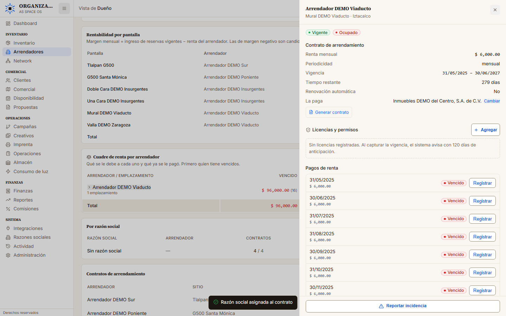
*Captura — apartado 4.1, «Salió bien si».*

> [!success] 2026-09-25 · **corregido: el cuadro ya te pide la contraseña**
> Hasta el 24/09 este apartado tenía tres pasos más —cerrar la ficha, ir a «Cambios
> bloqueados» arriba a la derecha, desbloquear y volver a empezar— porque el cuadro
> avisaba de que hacía falta la contraseña **y no pintaba dónde teclearla**. Ya la pide
> en el sitio, así que ese rodeo desapareció del texto.
>
> **El camino viejo sigue funcionando** si lo prefieres: desbloquear desde la barra
> superior antes de empezar te ahorra el paso 6, y es lo cómodo si vas a asignar varias
> razones sociales seguidas. No es obligatorio para ninguna.
>
> Asignar la razón social que paga viaja por el mismo camino que el importe de la renta, y
> ese camino pide tu contraseña antes de guardar: es el mismo candado de facturar y de
> registrar un pago.
>
> Si entraste con Google y nunca te pusieron contraseña, pídesela a quien administra tu
> cuenta **antes** de sentarte a asignar razones sociales.

> [!warning] Las dos capturas del rodeo se retiraron, y falta una nueva
> Las fotos de los antiguos pasos 5 y 7 enseñaban el cuadro **sin** el campo y el
> desbloqueo desde la barra superior. Retratan una pantalla que ya no existe, así que no
> se dejan como si fueran el estado de hoy. **Falta la captura del cuadro con el campo de
> la contraseña dentro** — anotado en `manuales/capturas-pendientes.md`.

Si el contrato está incompleto, el selector también aparece dentro de **«Completar
información»**, junto con el resto de los datos que faltan. Ese formulario se comporta
igual desde el 25/09: si los cambios están bloqueados, el campo de la contraseña sale
debajo y **los cuatro datos que ya capturaste se quedan puestos** — antes había que
salir a desbloquear y volver a teclearlos todos.

Y lo mismo el cuadro de **registrar el pago de una renta**, en la misma ficha: teclea la
contraseña ahí y pulsa «Confirmar y guardar». Ojo, porque **el botón de registrar el
pago que sale en la lista —el de un solo clic— todavía no la pide**: para ese sigue
haciendo falta desbloquear antes desde la barra superior.

> [!note] Captura: la ficha de un contrato mostrando «La paga» con su botón «Cambiar», y el
> cuadro de un solo campo que se abre al pulsarlo

*Las capturas de esta nota están en los pasos 2 a 5, arriba.*

### 4.2 · Asignar la razón social que emite un comprobante

**Empiezas en:** el menú lateral, entrada **«Finanzas»**. El botón de facturar **no está
en la ficha de la campaña**: la campaña solo te dice si su candado está completo.

1. Abre **«Finanzas»** y busca la tarjeta **«Listas para facturar»**. Ahí salen las
   campañas con el candado completo (orden de compra y evidencias) y sin comprobante.

   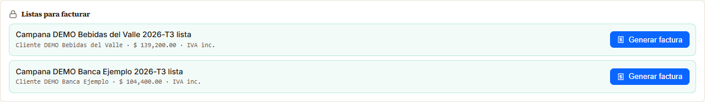
   *Captura — apartado 4.2, paso 1.*

2. Pulsa **«Generar factura»** en la campaña que toca.
3. En el cuadro, revisa **«Con cuál de tus razones sociales se emite»**: trae propuesta la
   que tiene el papel de ventas, marcada «— la que vende». Cámbiala si no es la correcta.

   
   *Captura — apartado 4.2, pasos 2-3.*

4. Pulsa **«Emitir factura»**.

**Salió bien si:** la campaña sale de «Listas para facturar» y su comprobante aparece en
**«Cobranza»**, con **«Emite»** y el nombre de la razón social bajo el folio.

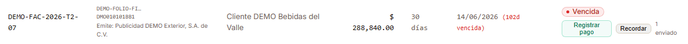
*Captura — apartado 4.2, «Salió bien si». Las dos campañas listas para facturar las siembra
`manuales/preparar-base-2026-09-18.mjs`: la base de demostración deja facturadas todas las
suyas.*

> [!danger] La emisora se decide al emitir, y después no se cambia
> No existe forma de reasignar la razón social de un comprobante ya emitido. Si te
> equivocas, el documento queda emitido a nombre de quien elegiste. **Revísalo antes de
> confirmar.**

> [!info] Elegir la emisora no cambia ni un importe
> El subtotal, el impuesto y el total los sigue calculando el sistema a partir del
> presupuesto de la campaña y de la tasa del cliente. La razón social no entra en ningún
> cálculo.

### 4.3 · Por qué a veces el sistema te propone una razón social y a veces no

El sistema **no adivina**. La regla es ésta:

| Situación | Qué hace el sistema |
|---|---|
| Una sola razón social tiene el papel de arrendamientos | La propone al asignar un contrato |
| Una sola tiene el papel de ventas | La propone al emitir un comprobante |
| **Dos o más** lo tienen | **No propone ninguna**: eliges tú |
| Ninguna lo tiene | No propone ninguna |

Con dos candidatas, elegir una sería emitir a nombre de la sociedad equivocada sin que
nadie lo hubiera decidido. Por eso el sistema prefiere no proponer.

Y si el documento **ya tiene** una razón social asignada, ésa es la que se te muestra,
aunque esté dada de baja. Lo que ya decidiste manda sobre la sugerencia.

El selector te ofrece **todas** las razones sociales activas, no solo las que tienen el
papel. El papel decide la sugerencia, no lo que está permitido.

---

## 5 · «Sin asignar» no es un error

Los contratos y los comprobantes creados **antes del 17 de septiembre de 2026** no tienen
razón social, y se muestran así: **«Sin asignar»**.

Es deliberado. Nadie sabe a nombre de qué sociedad se hicieron, y el sistema **no se lo
inventa**. Una razón social puesta a la ligera en un documento fiscal viejo es peor que un
hueco declarado.

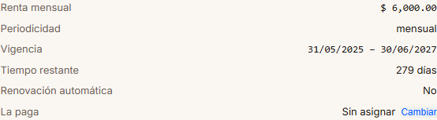
*Captura — apartado 5. En pantalla se lee «Sin asignar», con mayúscula.*

Qué hacer con ellos:

- **Los contratos de renta sí se pueden asignar hacia atrás**, con el procedimiento del
  apartado 4.1. Ve haciéndolo a medida que los toques.
- **Los comprobantes ya emitidos no.** Se quedan «Sin asignar» y así se muestran.

> [!info] «Razon social no disponible» es otra cosa
> Si en lugar de «Sin asignar» lees **«Razon social no disponible»**, el documento **sí**
> tiene una razón social asignada: lo que pasa es que la pantalla todavía no acabó de
> cargar su nombre. Recarga la pantalla. No es lo mismo que un documento sin asignar, y por
> eso el sistema lo dice distinto.

---

## 6 · Decidir cuándo esta instalación toma la versión nueva

**Solo si tu cuenta tiene permiso de Administración.** Ver el estado exige permiso de
**ver**; cambiar el modo o instalar exige permiso de **aprobar**.

**Empiezas en:** **«Administración»**, pestaña **«Configuración»**. La tarjeta
**«Actualizaciones»** es la primera de esa pestaña.

SPACE OS se pone al día solo, de madrugada. Esta tarjeta existe para que el dueño de la
instalación pueda decidir otra cosa: ver qué versión hay disponible y elegir cuándo entra.

### 6.1 · Saber en qué situación estás

La tarjeta lo dice en una frase, y de esa frase sale si tienes algo que hacer o no.

| Lo que dice | Qué significa | Qué te toca |
|---|---|---|
| **«Al día: corre … la misma que hay disponible»** | No hay nada nuevo. Es la única frase en verde | Nada |
| **«Hay una versión nueva disponible … Esperando tu aprobación para instalarla»** | Estás en modo con aprobación y hay novedad | Decidir (apartado 6.3) |
| **«Hay … disponible. Se instalará sola en la próxima ventana automática, de madrugada (04:17)»** | Estás en modo automática | Nada |
| **«Aprobaste …: se instalará en los próximos minutos, o de madrugada a más tardar»** | Ya decidiste | Esperar |
| **«Lo que aprobaste ya no es lo disponible: salió una versión más nueva»** | Tu aprobación caducó | Volver a aprobar, o no se instalará nada |
| **«Esta instancia todavía no se ha comprobado contra el registro»** | Todavía no se sabe si hay novedad | Volver más tarde |
| **«Se comprobó … pero el actualizador no pudo leer el digest de la imagen …»** | Hay un problema que no se arregla desde esta pantalla | **Avisar a quien opera el servidor** |

Debajo de la frase hay cuatro datos: la versión **instalada**, la **disponible**, cuántas
**migraciones** trae —los cambios que hay que aplicarle a la base de datos— y cuándo se
**comprobó** por última vez.

*Captura — apartado 6.1, «Esta instancia todavía no se ha comprobado», tal como la dejó la
instalación local sin tocar nada.*

*Captura — apartado 6.1, «Hay una versión nueva disponible … Esperando tu aprobación».
**Este estado se preparó a mano en la instalación local**: en una instalación real lo
escribe el actualizador del servidor al encontrar una versión nueva en el registro, y en
local no hay actualizador. Las versiones (v0.7.0, v0.8.0) son de ejemplo. Lo mismo vale para
las capturas del 6.2 y el 6.3.*

> [!warning] Un guion en «Migraciones» no quiere decir cero
> Significa que **no se pudieron contar**, no que no haya ninguna. Es justo la diferencia
> que conviene mirar antes de pulsar un botón que corta el servicio.

### 6.2 · Elegir el modo

1. Pulsa **«Con aprobación»** si quieres decidir tú cuándo entra cada versión. Con una
   versión esperando, debajo aparece el botón **«Instalar»**.

   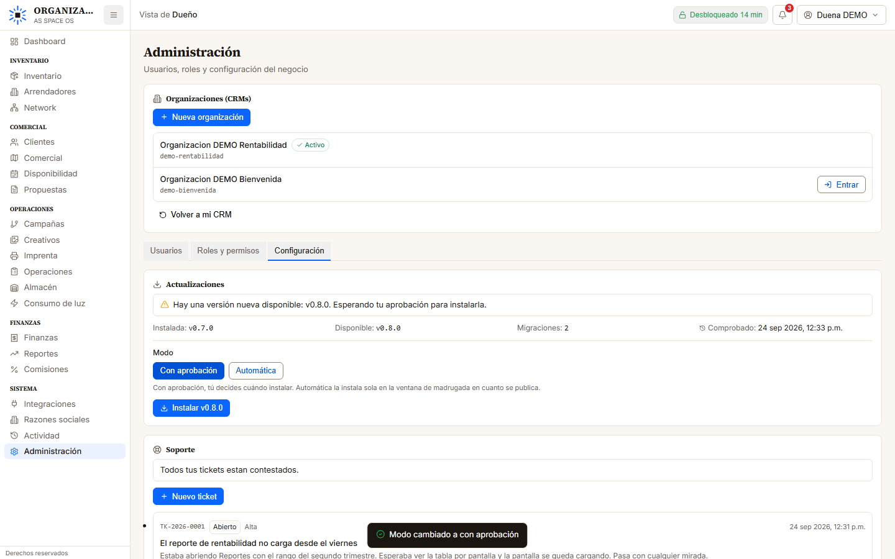
   *Captura — apartado 6.2, paso 1. Versión disponible preparada a mano en local (ver 6.1).*

2. Pulsa **«Automática»** si prefieres que se instale sola, de madrugada, en cuanto se
   publique. En este modo **no hay botón «Instalar»**: la frase te dice cuándo entrará.

   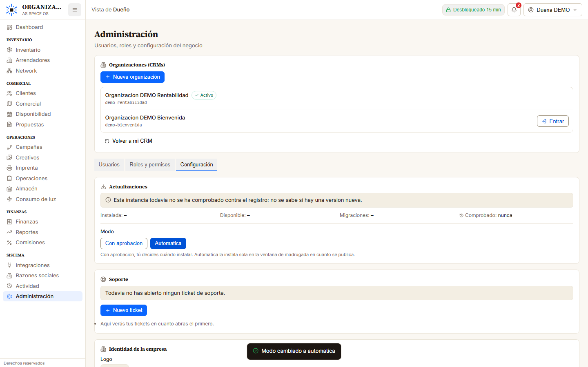
   *Captura — apartado 6.2, paso 2. Versión disponible preparada a mano en local (ver 6.1).*

**Salió bien si:** aparece el aviso **«Modo cambiado a con aprobación»** o **«Modo cambiado
a automática»**, y el botón que elegiste queda marcado.

> [!info] «Con aprobación» no es «más adelante»: es «hasta que alguien entre»
> En ese modo la versión nueva espera indefinidamente. Si nadie abre esta pantalla, la
> instalación se queda donde está — que puede ser justo lo que quieres, pero conviene
> saberlo.

### 6.3 · Instalar la versión nueva

**Empiezas en:** la misma tarjeta, con una versión esperando aprobación.

1. Pulsa **«Instalar»**, que lleva escrito el número de la versión disponible (en la
   captura del 6.1, **«Instalar v0.8.0»**).
2. Lee la confirmación. Dice qué versión vas a instalar, cuántas migraciones trae y que el
   servicio se corta mientras dura.

   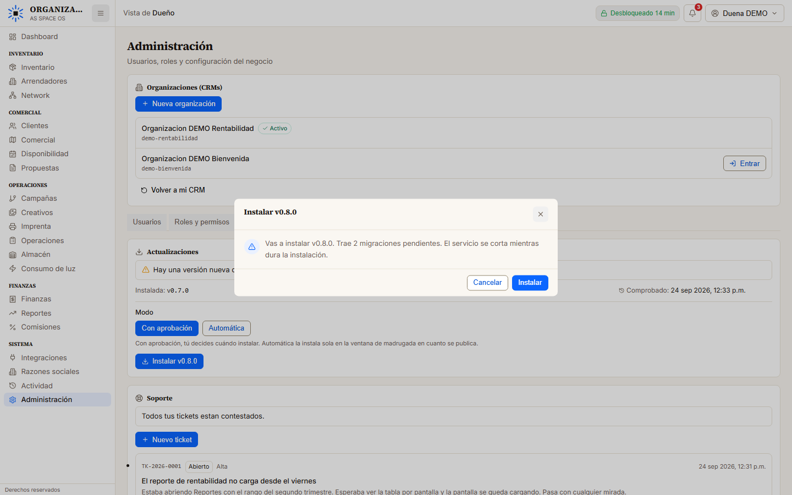
   *Captura — apartado 6.3, pasos 1-2. Versión disponible preparada a mano en local (ver 6.1).*

3. Pulsa **«Instalar»** en la confirmación.

**Salió bien si:** aparece el aviso **«Instalación aprobada: se instalará en los próximos
minutos»** y la frase de arriba pasa a decir que aprobaste esa versión.

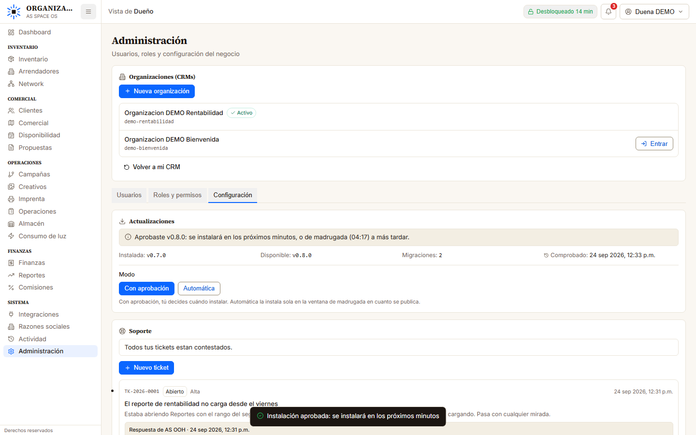
*Captura — apartado 6.3, «Salió bien si». En la instalación local esto solo guardó la
aprobación: no hay actualizador que instale nada, así que no se instaló ninguna versión.*

> [!danger] Instalar corta el servicio y cambia la base de datos
> Mientras dura la instalación nadie de tu empresa puede usar la aplicación. Elige una hora
> en la que no estorbe; si no tienes una razón para instalar ya, deja que entre de
> madrugada.

> [!warning] Aprobar no es instalar en ese segundo
> Lo que guardas es una aprobación: la instalación la hace el servidor en los minutos
> siguientes, o en la ventana de madrugada a más tardar. Y si mientras tanto sale una
> versión todavía más nueva, **tu aprobación deja de valer**: la tarjeta te lo dice y hay
> que aprobar otra vez.

**Si no ves la tarjeta**, en su lugar leerás: *«Ver y decidir la actualización de esta
instancia está reservado a quien tenga el permiso de Administración → ver. Pídeselo a quien
administre los roles y permisos de tu organización.»*

> [!note] Captura: la tarjeta «Actualizaciones» con una versión nueva esperando aprobación
> —los dos botones de modo, los cuatro datos y el botón «Instalar»— y, aparte, el cuadro de
> confirmación abierto

---

## 7 · Pedirle ayuda a AS OOH desde la aplicación

**Solo si tu cuenta tiene permiso de Administración.** Ver los tickets exige permiso de
**ver**; abrir uno exige permiso de **crear**.

**Empiezas en:** **«Administración»**, pestaña **«Configuración»**, tarjeta **«Soporte»**,
justo debajo de «Actualizaciones».

Hasta ahora un fallo se contaba por teléfono y no quedaba escrito en ninguna parte. Desde
esta tarjeta se escribe, queda con fecha y estado, y la respuesta se lee sin salir de la
aplicación.

> [!danger] Quien encuentra el fallo casi nunca es quien puede reportarlo
> **Solo quien puede abrir «Administración» puede abrir un ticket.** Un operario que
> encuentra un fallo montando una lona, o quien captura una campaña y ve algo raro, **no
> tiene esta pantalla**: tiene que contárselo a quien administre el sistema en tu empresa,
> y esa persona abre el ticket. Conviene decirlo en la capacitación, o el fallo se queda en
> una conversación de pasillo.

### 7.1 · Abrir un ticket

1. Pulsa **«Nuevo ticket»**.
2. Escribe el **«Asunto»**.
3. En **«Cuéntanos qué pasa»**, describe el problema: qué estabas haciendo, qué esperabas y
   qué pasó. Caben hasta 4 000 caracteres.
4. Elige la **«Prioridad»**: «Baja», «Normal», «Alta» o «Urgente».

   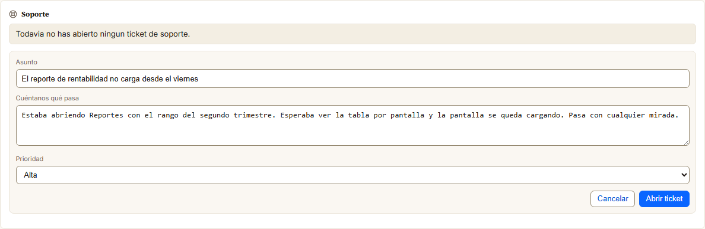
   *Captura — apartado 7.1, pasos 1-4.*

5. Pulsa **«Abrir ticket»**.

**Salió bien si:** aparece el aviso **«Ticket abierto»** con su folio, y el ticket encabeza
la lista marcado como **«Abierto»**.

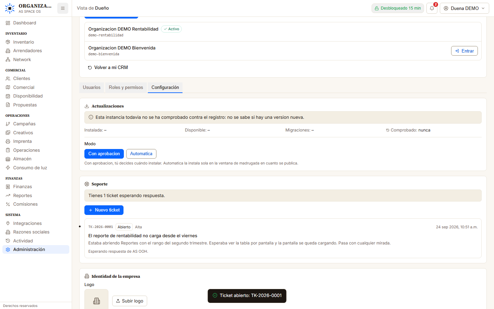
*Captura — apartado 7.1, «Salió bien si».*

> [!info] El asunto y el texto son obligatorios
> El botón no se activa hasta que los dos tienen algo escrito. No es un capricho del
> formulario: un ticket sin texto no se puede atender.

### 7.2 · Leer la respuesta

**Empiezas en:** la misma tarjeta.

Arriba de la lista, una frase te resume la situación: cuántos tickets están **esperando
respuesta**, o **«Todos tus tickets estan contestados»** cuando no queda ninguno.

Cada ticket muestra su folio, su estado —**«Abierto»**, **«En proceso»**, **«Resuelto»** o
**«Cerrado»**—, su prioridad y su fecha. Debajo de tu texto verás una de dos cosas:

- **«Esperando respuesta de AS OOH»**, o
- el recuadro **«Respuesta de AS OOH»** con la fecha y lo que te contestaron.

**Salió bien si:** el ticket que te importaba muestra su recuadro de respuesta.

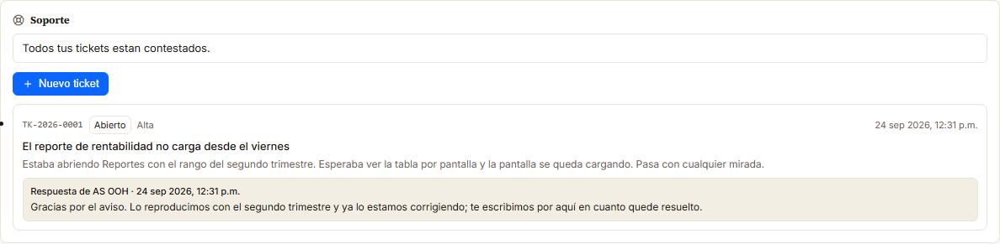
*Captura — apartado 7.2. La respuesta entró por la misma puerta que usa el panel de AS
OOH (`PATCH /api/tickets`), llamada contra la instalación local; el panel en sí no sale
en la imagen. Fíjate en que el ticket sigue «Abierto»: contestar no lo resuelve (7.3).*

> [!warning] Nadie te avisa cuando te contestan
> No llega correo ni notificación. Si estás esperando una respuesta, entra a mirar.

### 7.3 · Lo que un ticket no hace

- **No admite adjuntos.** Es texto y solo texto: no se pueden subir capturas ni archivos.
  Si necesitas enseñar una pantalla, descríbela y acuerda el envío por otro camino.
- **No cambia de estado porque te contesten.** Responder y resolver son cosas distintas: te
  pueden contestar pidiendo más datos y el ticket sigue abierto.
- **No sustituye a quien administra tu organización.** Un dato de negocio que no cuadra
  —un margen raro, una razón social equivocada— se arregla dentro de tu empresa. Ver el
  apartado 10.2.

> [!note] Captura: la tarjeta «Soporte» con el formulario de nuevo ticket abierto y, debajo,
> un ticket ya contestado mostrando su recuadro «Respuesta de AS OOH»

---

## 8 · Capturar el recibo de luz

**Solo si tu cuenta tiene permiso de Operaciones.**

La regla es **un recibo por predio y por mes**. El medidor normalmente es del predio, no de
cada pantalla, así que el importe se captura una vez y el sistema lo reparte entre las
pantallas de ese predio **igual que reparte la renta**.

> [!info] Quien captura el recibo no es quien lee el reporte
> Un perfil de Operaciones teclea el recibo; el margen que ese recibo cambia lo ve un perfil
> de Finanzas o el Dueño. Son dos permisos distintos a propósito. Si capturas recibos y no
> puedes abrir el reporte de rentabilidad, no es una falla.

### 8.1 · Capturar un recibo

**Empiezas en:** la pantalla de consumo de luz.

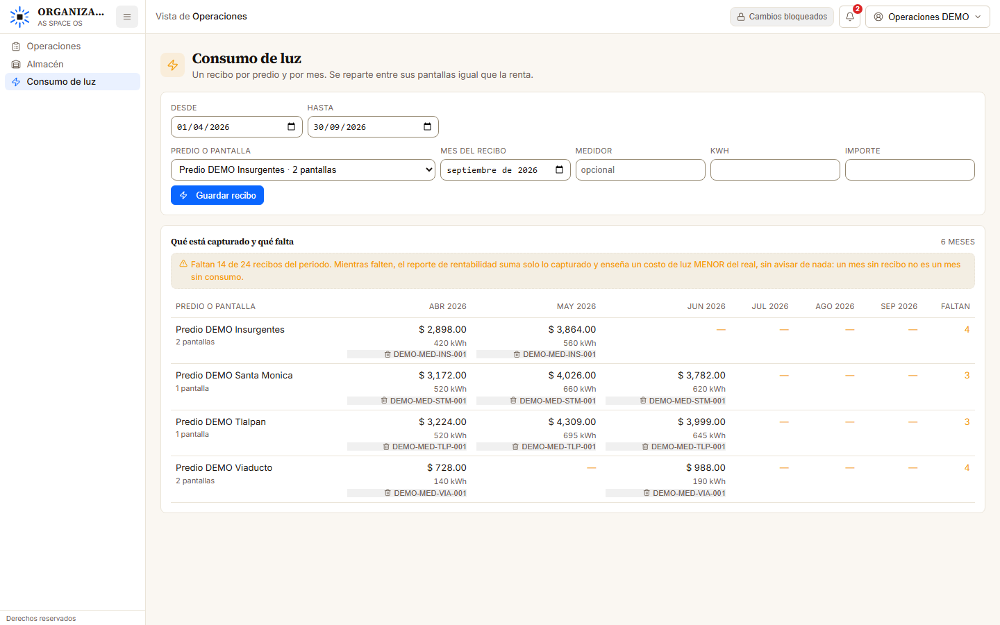
*Captura — apartados 8.1 y 8.4.*

1. Elige el predio.
2. Elige el mes al que corresponde el recibo.
3. Escribe el número de medidor, si lo tienes anotado.
4. Escribe los kilovatios-hora del recibo.
5. Escribe el importe.

   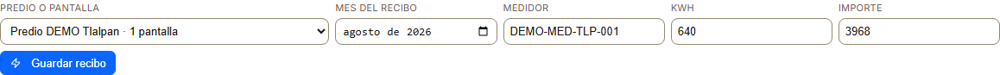
   *Captura — apartado 8.1, pasos 1-5.*

6. Guarda.

**Salió bien si:** la celda de ese predio y ese mes deja de estar en ámbar y muestra el
importe, el consumo y el medidor. El contador de recibos que faltan baja en uno.

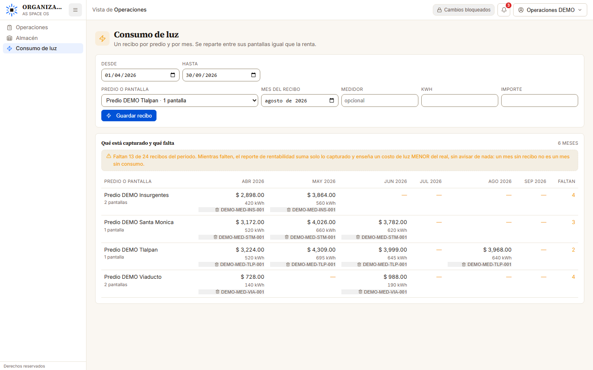
*Captura — apartado 8.1, «Salió bien si».*

Al guardar, **el predio y el mes se quedan puestos** y las cifras se limpian. Está pensado
para capturar un lote de recibos seguidos sin volver a elegir el predio cada vez.

> [!warning] Las cifras se limpian a propósito, y conviene entender por qué
> Si el importe anterior se quedara en el campo, sería facilísimo teclear dos veces la misma
> cantidad sin darte cuenta. Un importe repetido **no da ningún error**: solo hace que el
> costo de la luz de ese mes salga más alto de lo que fue.

> [!note] Captura: la rejilla de predios por meses, con celdas capturadas y celdas en ámbar,
> y el aviso de cuántos recibos faltan

*Las capturas de esta nota están al principio del apartado 8.1 y en el paso 5.*

### 8.2 · Un predio con dos medidores

Si el predio tiene más de un medidor, captura **un recibo por cada uno**, con su número de
medidor anotado. El sistema los suma.

No los sumes tú en una sola línea. El total quedaría bien, pero perderías el detalle de qué
consume cada medidor.

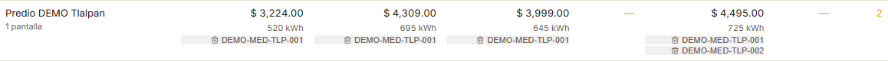
*Captura — apartado 8.2.*

### 8.3 · Corregir un recibo mal capturado

**No hay edición.** Si te equivocaste, borra el recibo y captúralo de nuevo.

1. Localiza el recibo en la pantalla. Cada uno se identifica por su número de medidor (o
   «sin número» si no lo tiene), debajo de la cifra, con un icono de papelera.
2. Pulsa el icono de papelera. Se abre el cuadro **«Borrar este recibo»**, que dice de qué
   medidor, qué mes y qué importe es. Confírmalo con **«Borrar el recibo»**.

   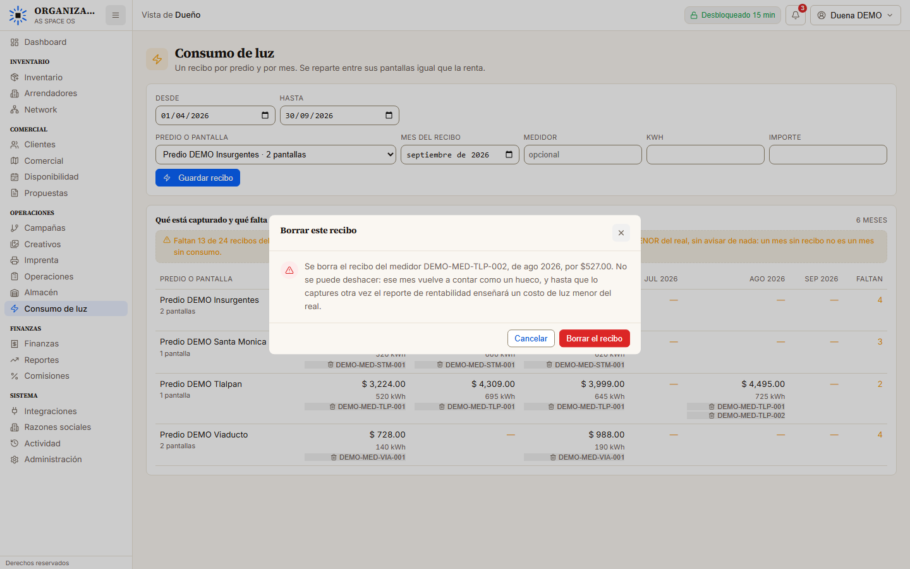
   *Captura — apartado 8.3, paso 2.*

   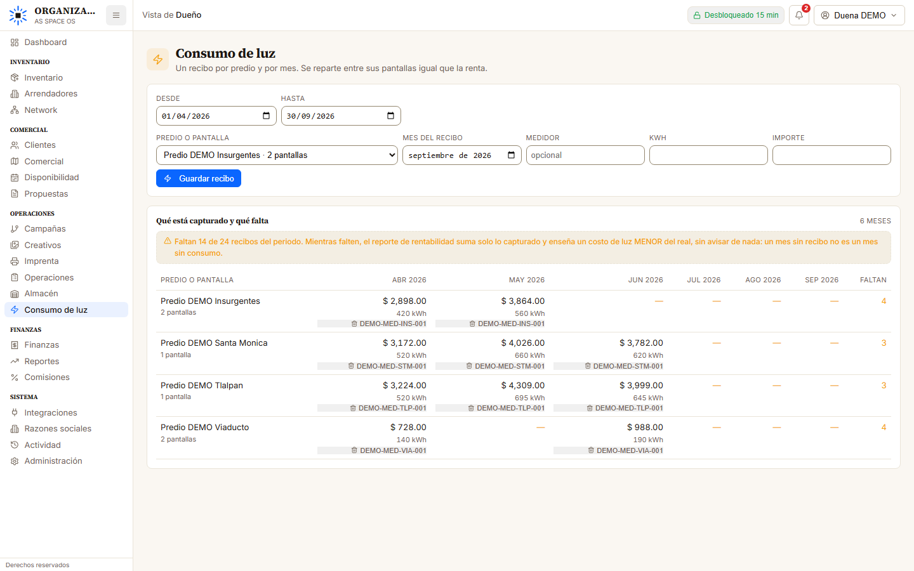
   *Captura — apartado 8.3, tras el paso 2.*

3. Captúralo otra vez con las cifras correctas.

> [!warning] El borrado existe precisamente porque no puedes capturarlo dos veces
> El sistema rechaza el mismo recibo repetido, así que un importe con un cero de más se
> quedaría inflando el costo de ese mes para siempre si no pudieras borrarlo.

> [!warning] Un perfil de Operaciones puede capturar un recibo, pero no borrarlo
> La papelera se le pinta igual, pero borrar exige el permiso de **aprobar** en
> Operaciones, que ese perfil no tiene. Al confirmar sale en rojo **«No tienes permiso para
> esta acción»**, encima de la rejilla, y el recibo se queda. Pídele el borrado a quien
> tenga ese permiso (en la práctica, el Dueño).

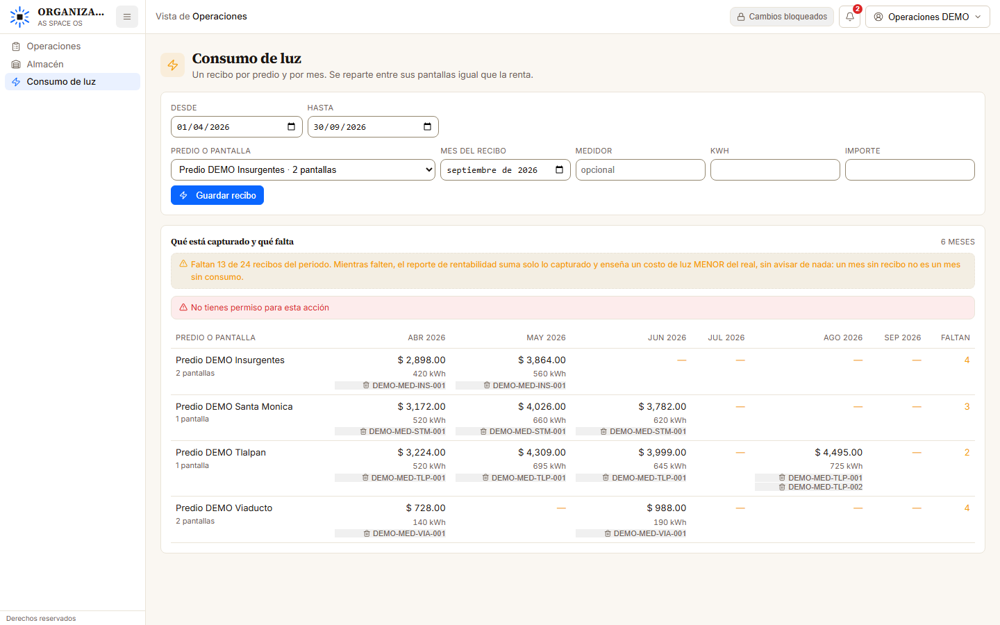
*Captura — apartado 8.3, con un perfil de Operaciones.*

### 8.4 · Ver qué recibos te faltan

Eso es lo más útil de esta pantalla, más que capturar.

La pantalla se organiza como una **rejilla de predios por meses**. Cada celda es un recibo.
Las que faltan salen **en ámbar y con una raya**, no con un cero: un «$0.00» afirmaría que
ese mes no se gastó luz, y una celda en blanco no diría nada.

Arriba verás un aviso del estilo **«Faltan 18 de 18 recibos del periodo»**.

**Salió bien si:** el aviso llega a cero y no queda ninguna celda en ámbar en el periodo que
te interesa.

> [!info] Si no falta ninguno, el sistema también te lo dice
> Lo dice en gris, no en ámbar. «No falta ninguno» y «no te lo digo» se ven igual si no hay
> texto, y eso no vale.

---

## 9 · Saber qué pantallas te están costando dinero

**Solo si tu cuenta tiene permiso de Finanzas.** En la práctica, el Dueño y el perfil de
Finanzas.

El reporte contesta una sola pregunta —qué ingresa y qué cuesta cada cosa— y te deja
mirarla de cinco formas. **No son cinco reportes**: es una pantalla con un selector.

> [!success] 2026-09-21 · Qué ve exactamente un perfil de Operaciones si lo intenta
> Verificado con una cuenta OPERACIONES real: la entrada **«Reportes» no aparece en su
> menú** —el menú de Operaciones solo trae Operaciones, Almacén y Consumo de luz—, y si
> escribe la dirección `/reportes/` a mano, **no llega a verla**. El sistema lo manda de
> vuelta a `/operaciones/`, su propio tablero, al instante y sin ningún mensaje de error:
> ni un 403 en pantalla, ni un aviso de «no tienes permiso». Simplemente nunca aparece
> Reportes, como si esa dirección no existiera para él.
>
> Esto pasa ANTES de que la pantalla llegue a pedir datos al servidor: la decide el propio
> menú (`components/demo/shell/nav.ts:138`, la entrada de Reportes solo lista
> `roles: ['DUENO', 'FINANZAS']`) y la reafirma la compuerta de la aplicación
> (`components/demo/shell/compuerta.ts:59-66` y `AuthGate.tsx:73`, que redirige a
> `landingDeRol(rol)` en cuanto detecta que el rol no alcanza el módulo de la ruta).

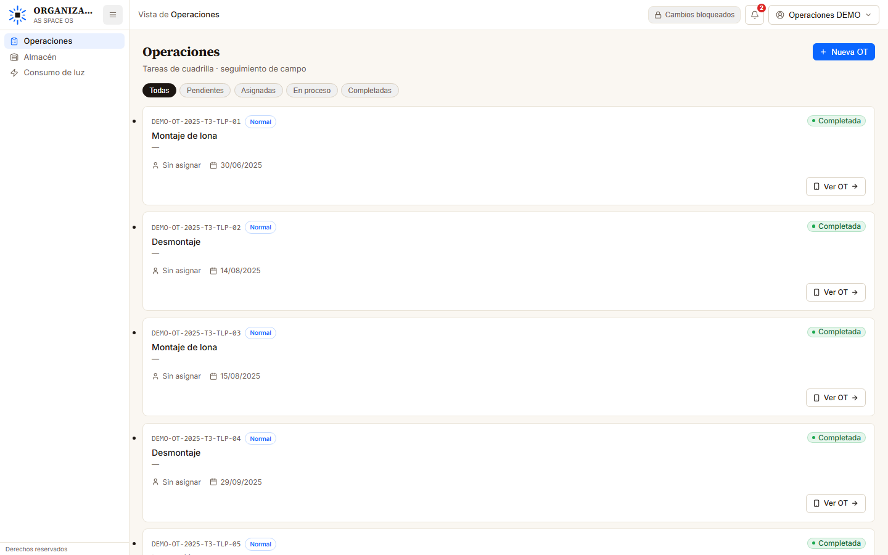
*Captura — apartado 9. Retomada el 2026-09-24: el mismo comportamiento que el 21/09.*

### 9.1 · Sacar el reporte

**Empiezas en:** el menú lateral, en la entrada de reportes.

1. Abre la pantalla de reportes.

   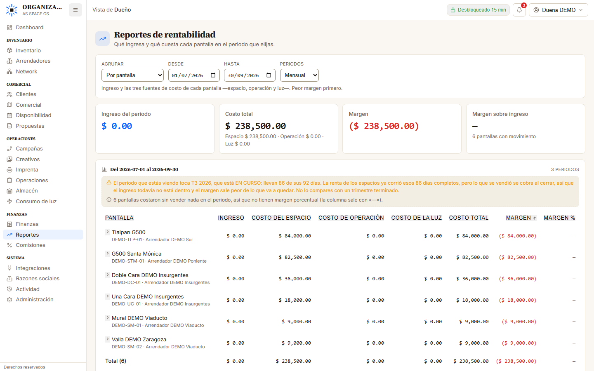
   *Captura — apartados 9.1 y 9.2. Tomada el 2026-09-24, dentro del trimestre jul-sep
   2026: el reporte abrió ahí solo, sin tocar las fechas.*

2. Elige cómo quieres mirar: por pantalla, por trimestre, por operación, por metro cuadrado
   o por consumo de luz.
3. Ajusta las fechas de **«desde»** y **«hasta»** si el periodo que trae no es el que
   quieres.
4. Elige si quieres el desglose por mes o por trimestre.

**Salió bien si:** aparece la tabla con una fila por pantalla —o por trimestre, según lo que
elegiste—, los indicadores de arriba con el ingreso, el costo y el margen, y el pie con los
totales.

Las fechas **no traen valor por omisión más allá del periodo de apertura**, y son
obligatorias. Si pones un rango al revés, el sistema te lo dice y no calcula.

> [!note] Captura: la pantalla de reportes abierta, con el selector de las cinco miradas, el
> rango de fechas, los indicadores de arriba y la tabla

*La captura de esta nota está en el paso 1, arriba.*

> [!warning] 2026-09-21 · La pantalla ya no ofrece cinco miradas: ofrece SEIS
> El selector «Agrupar» trae hoy: «Por pantalla» · «Por trimestre» · «Por operación» ·
> «Por metro cuadrado» · «Por consumo de luz» · **«Por razón social»**. La sexta no la
> documenta ningún apartado de este manual — entró con el commit `30af088`
> («feat(reportes): la sexta dimension — por razon social»), posterior a la redacción del
> 18/09. No es un error de este manual en el sentido de que diga algo falso: es que quedó
> incompleto por un cambio de producto que llegó después. Se deja constancia aquí; añadir
> el apartado 9.3-bis con «Por razón social» es trabajo aparte, no de esta pasada.
>
> Cita: `apps/web/components/demo/reportes/consulta.ts:58-92` (`DIMENSIONES_UI`, con las
> seis entradas).

### 9.2 · El reporte abre en el trimestre en curso, y avisa de que está incompleto

**Esto es lo primero que vas a ver, y lo primero que hay que entender.**

Al abrir, el reporte se planta en el **trimestre que está corriendo ahora mismo**. Y un
trimestre a medias **siempre se lee peor de lo que es**.

El motivo es de negocio, no del sistema: la renta a los arrendadores **ya corrió** todos los
días transcurridos, y lo que vendiste **se cobra al cerrar**. Así que el costo ya está
dentro y el ingreso todavía no.

Por eso lo normal es que al abrir veas algo como `Ingreso $0.00` y un margen en negativo.
**No es una pérdida real.**

Encima de la tabla sale un **aviso en ámbar**, el primero de todos, que dice tres cosas:

1. que el periodo sigue abierto, y **cuántos días lleva corridos de cuántos** (por ejemplo,
   «80 de sus 92 días»);
2. por qué eso hace que el margen salga peor de lo que va a quedar;
3. que ese periodo **no se compara** con un trimestre ya terminado.

**Para ver cifras definitivas**, mueve el rango a un trimestre que ya cerró. Cuando lo
hagas, **el aviso ámbar desaparece**, y esa desaparición es información: te está diciendo
que lo que estás viendo ya no va a cambiar.

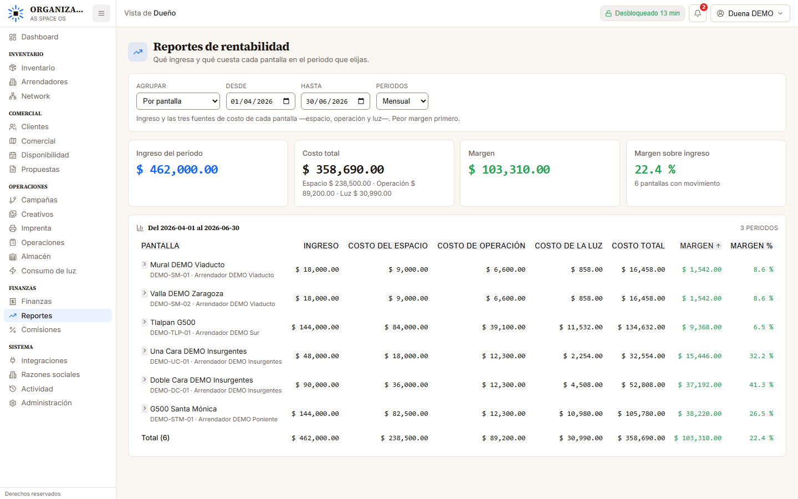
*Captura — apartado 9.2, con T2 2026.*

> [!warning] Basta un solo día de solape para que el aviso vuelva
> Si estiras el rango un día dentro del trimestre en curso, el aviso reaparece. Y con razón:
> ese día ya trae renta pagada y todavía no trae el ingreso que lo acompaña.

> [!success] 2026-09-21 · El texto exacto del aviso ámbar, palabra por palabra
> Verificado en pantalla el 2026-09-21, con el reporte abierto de forma natural (sin tocar
> el rango) en jul-sep 2026:
>
> *«El periodo que estás viendo toca T3 2026, que está EN CURSO: llevan 83 de sus 92 días.
> La renta de los espacios ya corrió esos 83 días completos, pero lo que se vendió se cobra
> al cerrar, así que el ingreso todavía no está dentro y el margen sale peor de lo que va a
> quedar. No lo compares con un trimestre terminado.»*
>
> Los números («83 de sus 92») cambian con la fecha en la que se mire; el resto de la frase
> no. Cita: `apps/web/components/demo/reportes/tabla.ts:662`.

### 9.3 · Las cinco formas de mirar

Cada forma cambia **las columnas de la tabla y el orden en que salen las filas**. No es la
misma tabla con otro título.

#### Por pantalla

Una fila por pantalla. Salen primero las de **peor margen**.

Es la mirada que contesta «¿qué pantallas están perdiendo dinero?».

#### Por trimestre

Una fila por trimestre. Salen en **orden cronológico**, no por importe: es una serie de
tiempo, no un ranking.

Un trimestre sin movimiento **sí aparece, en cero**. Un hueco en una serie se lee como
«faltan datos»; un cero se lee como «no pasó nada», que es la verdad.

> [!info] Aquí una fila no es una pantalla
> En esta mirada, cada fila es un trimestre entero con todas tus pantallas dentro. Los
> avisos que hablan de pantallas no salen aquí, precisamente porque dirían algo falso.

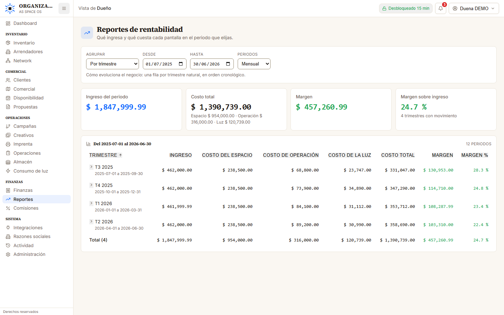
*Captura — apartado 9.3, «Por trimestre». Las miradas de este apartado se tomaron todas
con el mismo rango, los cuatro trimestres cerrados de la base de demostración.*

#### Por operación

Una fila por pantalla, con **cuántas visitas** recibió, **qué proporción de su ingreso se
comió la operación** y **cuántas horas** pasó alguien en sitio. Bajo el nombre de cada
pantalla verás el desglose por tipo de visita, del estilo «Desmontaje 2 · Inspección 1».

Salen primero las de **más costo de operación**, no las de peor margen. Es deliberado: una
pantalla con margen horrible por una renta cara **no es un problema de operación**, y por
peor margen saldría primera tapando justo a las que sí lo son.

Ésta es la mirada que contesta «tienen las mismas campañas, pero a una van a cada rato a
arreglarla».

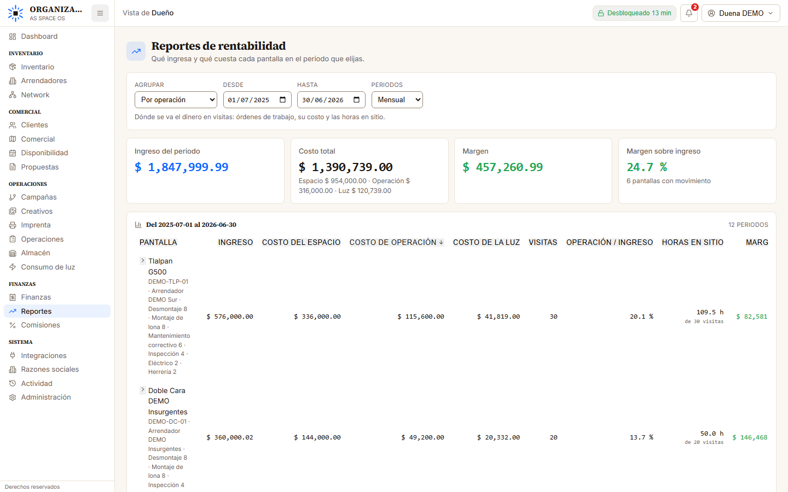
*Captura — apartado 9.3, «Por operación».*

#### Por metro cuadrado

Una fila por pantalla estática, con su **superficie**, su **ingreso por metro** y su
**margen por metro**. Salen primero las de peor margen por metro.

Lee el apartado 9.4 antes de usar esta mirada: deja pantallas fuera, y te dice cuáles.

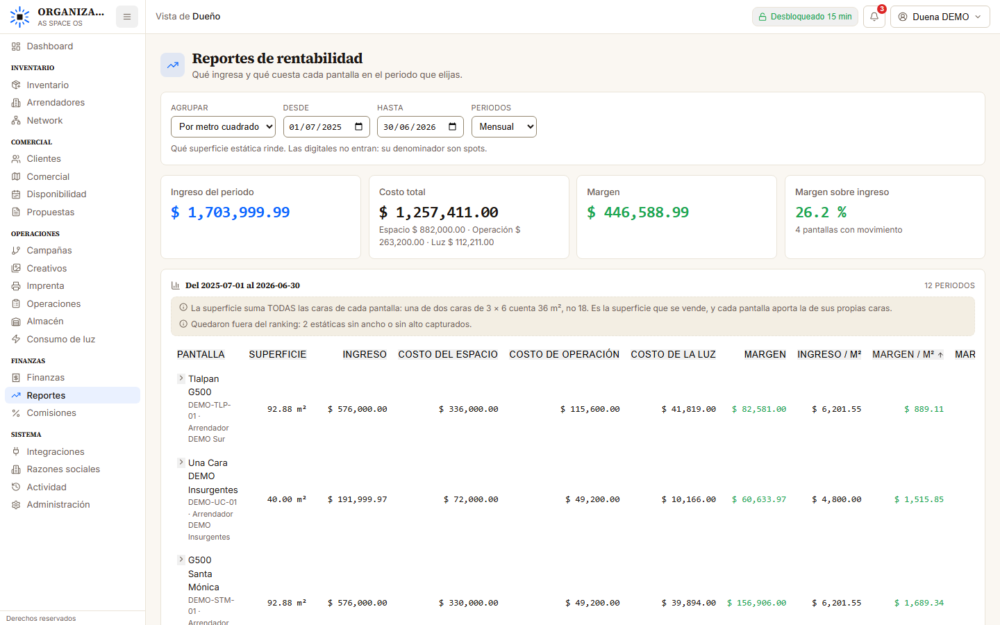
*Captura — apartado 9.3, «Por metro cuadrado».*

#### Por consumo de luz

Una fila por pantalla, con los **kilovatios-hora** que le tocaron y su **costo por
kilovatio-hora**. Salen primero las de **más costo de energía**, por el mismo motivo que la
mirada por operación.

Si una pantalla no tiene consumo, su costo por kilovatio-hora sale como **«—»** y no como
«$0.00». Un cero se leería como «aquí la luz es gratis», que es lo contrario de «no hay
consumo con el que calcularlo».

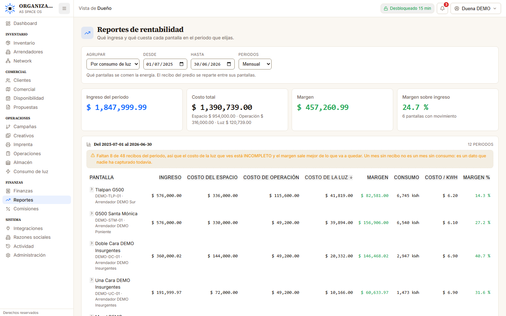
*Captura — apartado 9.3, «Por consumo de luz».*

> [!info] La luz cuenta en TODAS las miradas, no solo en ésta
> El costo de la energía entra en el costo total y en el margen de las cinco. Si no fuera
> así, la misma pantalla daría dos márgenes distintos según cómo la miraras, y los dos
> parecerían correctos.

### 9.4 · Lo que el reporte no sabe, te lo dice

Ésta es la parte que más preguntas genera, y la que conviene leer despacio. **Un número que
miente es peor que no tener el número**, así que el reporte declara sus huecos encima de la
tabla en vez de disimularlos.

Son cinco avisos. El primero va en ámbar; los demás en gris.

| Aviso | Qué te está diciendo |
|---|---|
| **Periodo en curso** | El único en ámbar. Ver el apartado 9.2 |
| **Sin contrato** | Esas pantallas salen con costo de espacio en cero **porque falta capturar el contrato**, no porque el espacio sea gratis. Su margen se lee mejor de lo que es |
| **Sin ingreso** | Costaron y no vendieron. Son justo las que este reporte existe para encontrar |
| **Exclusiones por metro cuadrado** | Cuántas pantallas quedaron fuera del ranking por metro, y por qué |
| **Convención del metro cuadrado** | Qué cuenta como metro cuadrado. Ver el apartado 9.5 |

*Captura — apartados 9.4 y 9.5, recortada de la mirada por metro cuadrado.*

#### Qué deja fuera la mirada por metro cuadrado

Deja fuera dos grupos, y **te dice cuántas de cada uno**:

- **Las pantallas digitales.** Una pantalla digital se vende por spots, no por metros. Una
  pantalla de led que vende doce spots al día no se compara con una valla de la misma
  superficie, y mezclarlas produce un ranking sin sentido.
- **Las estáticas sin medidas capturadas.** Sin ancho y alto no hay superficie, y dividir
  por un dato que no está **no da un error: da una cifra**, y la cifra se ve creíble.

El aviso sale **también cuando no se excluyó ninguna**. «No excluí ninguna» y «no te lo
digo» se ven igual si no hay texto.

Solo se cuentan como excluidas las pantallas que **habrían salido en el reporte**, es decir,
las que tuvieron movimiento en el periodo. Un catálogo con trescientas digitales dormidas
no te dirá «excluí 300»: el recuento contesta «cuántas filas te falta ver».

#### Qué deja fuera la mirada por consumo de luz

Aquí el hueco es **más peligroso que en el metro cuadrado**, y por eso se declara con más
cuidado: una pantalla sin recibo capturado sale con **costo de luz en cero**, que es
indistinguible de una pantalla que de verdad no gasta luz. La fila se queda y la cifra
parece completa.

El reporte cuenta por eso **cuántos recibos faltan**: cuántos pares de punto de medición y
mes no tienen recibo capturado. Si ese número no es cero, el costo de la luz que estás
viendo está por debajo del real.

Y hay un segundo caso, el de los **recibos sin destino**: un recibo de un predio que
**todavía no tiene pantallas dadas de alta**. Ese importe no le toca a nadie y desaparecería
del reporte sin dar ningún error, así que el sistema lo cuenta aparte y te dice cuánto es.

> [!warning] Si el reporte te dice que faltan recibos, no compares márgenes todavía
> Dos pantallas con distinta cobertura de recibos no son comparables. Captura los recibos
> que faltan (apartado 8) y vuelve.

### 9.5 · El metro cuadrado suma todas las caras

Una pantalla de **dos caras de 3 × 6 cuenta 36 metros cuadrados**, no 18.

La razón es de negocio: si vendes las dos caras, las dos son superficie que monetizas. El
metro cuadrado mide **la superficie que se vende**, no la del soporte.

El número de caras sale de **cada pantalla**, no de un multiplicador general. Una pantalla
de una cara aporta una, una de tres aporta tres, y una a la que no se le capturaron caras
cuenta como una sola —el sistema no inventa superficie.

El reporte **declara esta convención en pantalla**, encima de la tabla, con este texto:

> La superficie suma TODAS las caras de cada pantalla: una de dos caras de 3 × 6 cuenta
> 36 m², no 18. Es la superficie que se vende, y cada pantalla aporta la de sus propias
> caras.

Está escrito ahí porque una cifra por metro cuadrado **no se puede conciliar con nada** si
no dice qué cuenta como metro cuadrado.

> [!info] Esto cambia el orden del ranking por metro, y no cambia ninguna cifra de dinero
> Al contar todas las caras, la superficie sube y los cocientes por metro bajan. El ingreso,
> el costo y el margen **no se mueven**. Si comparas con una impresión vieja del reporte,
> eso es lo único que va a estar distinto.

### 9.6 · Ver el detalle de una fila

Cada fila se puede desplegar para ver su desglose periodo por periodo, con el ingreso, el
costo del espacio, el costo de operación, el margen y las visitas de cada uno.

El desglose solo se ofrece **cuando hay más de un periodo** en el rango. Con uno solo
repetiría la fila de arriba.

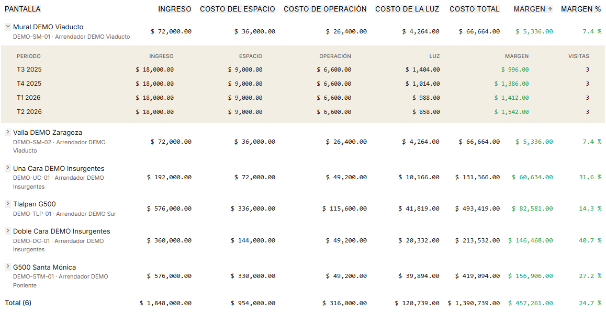
*Captura — apartado 9.6. Se despliega con la flecha a la izquierda del nombre («Ver el
desglose por periodo»).*

### 9.7 · Cómo leer los totales del pie

El pie **no totaliza todas las columnas**, y las que deja en blanco las deja a propósito.

Las columnas que son un promedio o un cociente —como el margen por metro cuadrado— no se
pueden sumar: el promedio de los cocientes de las filas **no es** el cociente del total,
porque cada pantalla tiene otra superficie. Un número ahí sería una cifra que no es de
nadie.

---

## 10 · Cuando algo falla

### 10.1 · Mensajes que vas a ver, y qué significan

| Lo que ves | Qué pasó | Qué hacer |
|---|---|---|
| **«El registro ya existe»** al guardar un recibo de luz | Ya hay un recibo de ese predio, ese mes y ese medidor | Comprueba si ya lo capturaste. Si es un segundo medidor, anota su número y vuelve a intentar |
| **«Sin asignar»** en un contrato o comprobante | Ese documento no tiene razón social. Normal en todo lo anterior al 17 de septiembre | En contratos, asígnala (apartado 4.1). En comprobantes emitidos, se queda así |
| **«Razon social no disponible»** | El documento **sí** tiene razón social, pero la pantalla no acabó de cargar su nombre | Recarga la pantalla |
| El reporte dice que **no hubo movimiento** en el periodo | Ninguna pantalla tuvo ingreso, ni renta, ni visitas en ese rango | Comprueba primero las fechas. Si son correctas, es que ese periodo está realmente vacío |
| El reporte dice que **no se pudo calcular** | La pantalla no recibió respuesta, o la respuesta vino con error | Vuelve a intentar. Si se repite, avisa a quien administra tu instalación |
| El sistema te pide **tu contraseña** al asignar la razón social de un contrato, al completarlo, al registrar el pago de una renta, al **emitir una factura**, al **registrar un cobro** o al **renovar un contrato** | Es el candado de los cambios sensibles | Tecléala en el campo que sale en el mismo cuadro. Si no tienes contraseña porque entras con Google, pídesela a tu administrador |
| Pulsas **«Registrar pago»** en la lista de rentas, o **«Renovar»** en un contrato, y se abre un cuadro pidiéndote la contraseña | Esas dos acciones son de un solo clic: no tienen cuadro propio, así que el cuadro **aparece** solo cuando hace falta la clave | Tecléala ahí y pulsa «Confirmar». Cancelar no hace nada: el pago o la renovación no se llegan a mandar |
| Te dice que **hace falta tu contraseña** y no hay ningún campo donde escribirla | Estás en una de las pantallas que **todavía** no lo pide en el sitio: la tabla de **Inventario**, el **alta de contrato** y **editar o eliminar una pantalla** desde Comercial | Cierra el cuadro, desbloquea en **«Cambios bloqueados»** arriba a la derecha y vuelve a intentarlo |
| Te dice que **ya contestaste** el cuestionario de bienvenida | Ya existe al menos una razón social | Ve a **«Razones sociales»** a cambiar lo que haga falta |
| **«Esta cuenta entra con Google…»** al intentar entrar | A esa cuenta se le cerró la entrada por contraseña | Entra con **«Continuar con Google»** (apartado 1.3) |
| **«Ver y decidir la actualización … está reservado a quien tenga el permiso de Administración → ver»** | Tu cuenta no tiene permiso de Administración | Pídeselo a quien administra los roles de tu organización |
| **«Ver y abrir tickets de soporte está reservado a quien tenga el permiso de Administración → ver»** | Lo mismo, en la tarjeta de soporte | Pídele a esa persona que abra el ticket por ti (apartado 7) |
| **«No se pudo cargar el estado de la actualización»** o **«No se pudieron cargar tus tickets de soporte»** | La tarjeta no recibió respuesta | Recarga. Si se repite, es de quien opera el servidor, no de tu organización |
| **«…el actualizador no pudo leer el digest de la imagen…»** | Esta instalación no puede instalar nada hasta que alguien lo revise | Avisa a quien opera el servidor. No es algo que se arregle desde la pantalla |

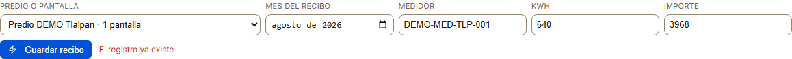
*Captura — apartado 10.1, «El registro ya existe».*

### 10.2 · A quién avisar

- **Un dato de negocio que no cuadra** —un margen raro, un recibo que no aparece, una razón
  social equivocada en un contrato— lo resuelve quien administra tu organización, con
  permiso de Administración. Empieza por ahí.
- **Una pantalla que no carga, un error que se repite o un mensaje que no está en esta
  tabla** es para AS OOH, que es quien da soporte de SPACE OS. Se le escribe desde la propia
  aplicación, con un ticket (apartado 7). Anota qué estabas haciendo y qué fechas tenías
  puestas en el reporte.
- **Y si tu cuenta no puede abrir Administración**, no tienes cómo escribir ese ticket:
  cuéntaselo a quien administre el sistema en tu empresa y que lo abra esa persona. Es una
  limitación conocida, no un fallo de tu cuenta.

### 10.3 · Si te falta una pantalla del menú

Cada perfil ve solo lo que le toca.

| Si no encuentras… | Te falta el permiso de… |
|---|---|
| **«Razones sociales»** | Administración |
| la pantalla de reportes | Finanzas |
| la pantalla de consumo de luz | Operaciones |
| las tarjetas **«Actualizaciones»** y **«Soporte»** dentro de «Administración» | Administración |

Pídeselo a quien administra tu organización.

---

## Relacionadas

[[08-Manuales/manual-tecnico-2026-09-15]] ·
[[02-Backend/entidades-fiscales]] · [[02-Backend/cuestionario-bienvenida]] ·
[[02-Backend/multi-entidad-en-uso]] · [[02-Backend/energia-consumos]] ·
[[02-Backend/reportes-rentabilidad]] · [[02-Backend/reportes-dimensiones]] ·
[[03-Frontend/pantalla-reportes]]

---

## PENDIENTES

> [!success] 2026-09-18, tarde · **ocho de los catorce, cerrados MIRANDO la aplicación**
> Se levantó la aplicación con la base de demostración ya sembrada y se comprobaron
> uno por uno. Lo de abajo **ya no se pregunta: se afirma**, con el texto tal como
> sale en pantalla.
>
> **La entrada del reporte se llama «Reportes»**, en el bloque de Finanzas.
>
> **Las cinco miradas del selector**, literales: «Por pantalla» · «Por trimestre» ·
> «Por operación» · «Por metro cuadrado» · **«Por consumo de luz»**. Ninguna dice ya
> «(en preparación)».
>
> **Consumo de luz SÍ tiene entrada propia**, en el bloque de Operaciones, después
> de Almacén. El hueco que este manual reportaba **estaba cerrado antes de que se
> escribiera**: la nota de origen describía el estado anterior. Un perfil de
> Operaciones sí tiene forma de llegar.
>
> **Los campos de la captura**, en orden: `DESDE` · `HASTA` · `PREDIO O PANTALLA` ·
> `MES DEL RECIBO` · `MEDIDOR` (marcado *opcional*) · `KWH` · `IMPORTE`, y el botón
> **«Guardar recibo»**.
>
> **Los botones de «Razones sociales»**: **«+ Nueva razón social»**, y en cada
> renglón **«Editar»** y **«Dar de baja»**.
>
> **Las etiquetas de los cinco papeles**, tal como se leen: «Paga las rentas a los
> arrendadores» · «Compra los activos y el equipo» · «Tramites y licencias con
> gobierno» · «Operacion y nomina» · «Vende publicidad».
>
> **El aviso de los recibos que faltan**, literal:
> *«Faltan 14 de 24 recibos del periodo. Mientras falten, el reporte de rentabilidad
> suma solo lo capturado y enseña un costo de luz MENOR del real, sin avisar de
> nada: un mes sin recibo no es un mes sin consumo.»*
> Y los meses sin recibo se pintan con **una raya ámbar**, nunca con `$0.00`.
>
> **Las columnas del reporte**, como encabezados reales: `Pantalla` · `Ingreso` ·
> `Costo del espacio` · `Costo de operación` · **`Costo de la luz`** · `Costo total` ·
> `Margen` · `Margen %`. Cada renglón lleva además **«Ver el desglose por periodo»**.

> [!success] 2026-09-21 · Cinco de los seis, cerrados MIRANDO la aplicación (y con capturas)
> Se levantó la aplicación con `next build && next start` (no `next dev`: ver el aviso al
> principio de este manual) contra la base de demostración `demo-rentabilidad`, sembrada
> con `scripts/semilla-demo.mjs`, y se recorrió cada flujo con Playwright
> (`manuales/capturas-2026-09-18.spec.ts`), con capturas en `capturas-2026-09-18/`.
>
> **2. El botón del cuestionario de bienvenida es «Guardar y continuar»**, no «Enviar».
> Confirmado con una organización sin ninguna razón social (ver el apartado 2.1).
>
> **3. El texto exacto del aviso ámbar de periodo en curso** está citado palabra por
> palabra en el apartado 9.2.
>
> **4. El texto de los avisos de papel sin dueño y papel compartido** está citado palabra
> por palabra en el apartado 3.2, provocado a propósito porque en la demostración cada
> papel tiene una sola dueña.
>
> **5.** *(Retirado el 2026-09-24: lo que decía del borrado de recibos —que no pedía
> confirmación y que el 403 de Operaciones se llevaba la rejilla— ya no es cierto. El
> apartado 8.3 describe lo que hace hoy la aplicación.)*
>
> **6. Un perfil de Operaciones que intenta `/reportes/` no ve ni un 403 ni un mensaje**:
> el sistema lo redirige de inmediato a su propio tablero (`/operaciones/`), y la entrada
> «Reportes» ni siquiera aparece en su menú. Ver el apartado 9.
>
> **Hallazgo aparte, no pedido por ninguno de los seis:** el selector de reportes ya no
> ofrece cinco miradas, ofrece **seis** — «Por razón social» se añadió después de escribirse
> este manual (commit `30af088`). Ver el aviso en el apartado 9.1.

> [!warning] 2026-09-24 · las tres secciones nuevas se escribieron SIN recorrer la aplicación
> Los apartados **1 (códigos de recuperación)**, **6 (actualizaciones)** y **7 (soporte)**
> se midieron **leyendo el código que los produce**, no mirando la pantalla: esta pasada fue
> de solo lectura y no se levantó la aplicación ni se tomó ninguna captura —hay un cambio de
> estilos a punto de desplegarse que añade un contorno de 1 px a casi toda la interfaz, y
> cualquier captura de hoy quedaría desfasada en cuanto entre.
>
> Los textos entre comillas están copiados del código, no recordados:
> `app/(app)/(shell)/codigos-recuperacion/page.tsx`,
> `components/demo/admin/actualizaciones-ui.ts`,
> `components/demo/admin/ActualizacionesPanel.tsx`,
> `components/demo/admin/tickets-ui.ts` y
> `components/demo/admin/TicketsPanel.tsx`.
>
> Los permisos también están medidos en el servidor, no supuestos:
> `app/api/actualizaciones/route.ts` (GET `administracion:ver`, PATCH
> `administracion:aprobar`) y `app/api/tickets/route.ts` (GET `administracion:ver`, POST
> `administracion:crear`).
>
> **Lo que falta es la pasada delante de la pantalla**, como la del 21/09: confirmar que los
> botones se llaman así en una instalación real y que los tres flujos se recorren de
> principio a fin.

> [!important] 2026-09-24, tarde · el manual completo, con fotos, y SEIS cosas que el texto dice mal
> Se recorrieron los diez apartados delante de la aplicación —`next build && next start`
> en local, contra una base propia y desechable (`spaces_manual_0924`, que prepara
> `manuales/preparar-base-2026-09-18.mjs`), con `manuales/capturas-2026-09-18.spec.ts`—.
> Salieron **39 capturas**, todas en `capturas-2026-09-18/`, y **se renumeraron por
> apartado**: `NN-MM-PP` es apartado, subapartado y paso, así que el nombre ya vuelve a
> coincidir con el sitio donde está. Con eso se cierran dos puntos de la lista de abajo:
> los apartados 1, 6 y 7 ya tienen fotos (salvo lo que no se puede ver en local), y los
> nombres ya no están corridos. El cambio de bordes que se esperaba ya estaba en `main`.
>
> **Lo que no se pudo fotografiar**, con su motivo, está en
> `manuales/capturas-pendientes.md`. Tras la segunda pasada de la tarde queda **solo el
> 1.1** (exige entrar con Google). El 4.2 ya tiene sus pasos, con dos campañas listas para
> facturar que siembra el preparador de la base, y el 6.3 también, con la versión
> disponible **preparada a mano** en la base local: en una instalación real ese dato lo
> escribe el actualizador, y los pies de foto lo dicen.
>
> **Lo que el texto decía y la pantalla no, y cómo quedó** (segunda pasada, misma tarde):
>
> 1. **2.1, «Salió bien si»**: «Guardar y continuar» lleva al **Dashboard**, no a «Razones
>    sociales» (`app/(app)/bienvenida/page.tsx`, `alTerminar`). **Corregido el manual.**
> 2. **4.1, el cuadro no pide la contraseña.** Ver el defecto abierto de abajo. **Corregido
>    el manual** con el rodeo que funciona hoy (pasos 5-8), y el código **no se tocó**.
> 3. **4.1, la ficha se quedaba en «Sin asignar» al guardar.** Era la página, que guardaba
>    una copia del contrato. **Corregido el código** (`fix(arrendadores)`, solo interfaz,
>    con su prueba): la ficha se actualiza sola.
> 4. **8.3**: borrar un recibo **sí pide confirmación** y el 403 de Operaciones **ya no se
>    lleva la rejilla**. **Corregido el manual** y retirado el aviso viejo del 21/09.
> 5. **«Sin asignar»** va con mayúscula en pantalla. **Corregido el manual.**
> 6. **6.1, la tarjeta de actualizaciones escribía sin acentos.** Era un defecto de la
>    aplicación, no del manual. **Corregido el código** (`fix(ui)`); los textos que cita el
>    apartado 6 ya coinciden con la pantalla.
>
> **Y dos cosas de la pantalla que el manual no menciona:** en «Códigos de recuperación»
> los botones y el campo de contraseña **no tienen aspecto de botón ni de campo** (salen
> como texto suelto, ver 01-02-01 y 01-02-02), y los campos del formulario de ticket no
> están asociados a su etiqueta (`<label>` sin `htmlFor`), lo que los deja mudos para un
> lector de pantalla.
>
> **Medido, para el punto abierto de abajo:** un lote trae **10 códigos**, en dos
> columnas, con la forma `XXXXX-XXXXX-XXXXX`. Y el segundo lote solo pide contraseña si
> el primero se **confirmó** con «Ya los guardé» y «Continuar»: la regla del servidor mira
> esa confirmación, no si existe un lote.

### Lo que quedó abierto el 2026-09-24

- ~~**DEFECTO — espera aprobación humana (zona roja R1, sesión).** El cuadro «Con cuál de
  tus razones sociales se paga» no abre el candado cuando el servidor pide la
  contraseña.~~ **CORREGIDO el 2026-09-25** con aprobación explícita del dueño, en
  `fix/contrasena-contrato-sin-campo`. Ya pide la contraseña dentro del propio cuadro, y
  el apartado 4.1 quedó sin el rodeo. La causa era que **el campo no existía**: `password`
  no aparecía ni una vez en `ContratoSheet.tsx`. La secuencia dejó de copiarse a mano y
  vive en `apps/web/lib/cambios-candado.ts`, con el campo en
  `apps/web/components/demo/ui/CampoContrasena.tsx`.
  ~~**Siguen con el defecto, y no entraban en la aprobación:** «Completar información»
  (`CompletarContratoModal`) y el cuadro de registrar un pago de renta (`PagoModal`), los
  dos en el mismo archivo.~~ **CORREGIDOS la misma tarde**, en
  `fix/candado-completar-y-pago`, con la aprobación ampliada del dueño («si arregla los
  dos diálogos que faltan»). El de pagos **toca dinero (zona roja R4)**, y además tenía
  un agravante: mandaba el aviso a una **notificación flotante que se desvanece**, así
  que el usuario perdía de vista la instrucción. Ahora el mensaje vive dentro del cuadro.
  Y un detalle relacionado, que sigue abierto: el comentario de
  `components/demo/shell/DesbloqueoCambios.tsx` dice que al Dueño el botón «no le sale
  nunca», y en la pasada del 24/09 **le salió**.
- **DEFECTO — otras pantallas que piden la contraseña y tampoco la pintan. NUEVO el
  2026-09-25 por la tarde, y medido, no supuesto.** Al arreglar los tres cuadros de la
  ficha del contrato se barrió la aplicación entera por los dos extremos: qué rutas
  llevan candado en el servidor, y qué pantalla consume cada una. Salieron **12 puntos de
  llamada en 6 archivos** que reciben el mismo 403 y no ofrecen dónde teclear.

  **CUATRO CERRADOS el 2026-09-25 por la tarde**, con aprobación explícita del dueño («si
  arregla el 1 y el 2»), en `fix/candado-dinero-y-renovar` — los tres de dinero y el que
  no decía nada:
  - ~~**Registrar el pago de una renta desde la lista**, el botón de un solo clic
    (`components/demo/arrendadores/PagosRentaCard.tsx`). **Es dinero.**~~ Ahora el 403
    **abre un cuadro** con el campo dentro. Es el camino más transitado de los dos que
    llevan a esa misma operación.
  - ~~**Emitir una factura** y **registrar el cobro de una factura**
    (`app/(app)/(shell)/finanzas/page.tsx`). **Las dos son dinero.**~~ Las dos ya tenían
    cuadro propio, así que el campo va **dentro**, debajo de lo que se va a confirmar, y
    los datos capturados se conservan.
  - ~~**El botón «Renovar»** de la ficha del contrato **no tiene ni `try/catch`**~~
    **Corregidos sus DOS defectos:** ahora pide la contraseña en un cuadro que aparece, y
    —lo que no era del candado— **cualquier** fallo de esa ruta se ve. Antes un 500 o la
    red caída eran tan invisibles como el 403.

  **La regla que se adoptó, y vale para lo que venga:** la contraseña se pide **dentro del
  cuadro donde se confirma la acción**; si la acción no tiene cuadro, el 403 **abre uno**
  atado a esa acción exacta. Ya no se manda a nadie a «Cambios bloqueados» por estos
  cuatro caminos.

  **SIGUEN ABIERTOS los otros ocho**, y ahí el rodeo por «Cambios bloqueados» es
  obligatorio:
  - **Editar la renta, la tarifa o el arrendador desde la tabla de Inventario**
    (`components/demo/inventario/InventarioTabla.tsx`, cinco sitios) — cuatro de ellos
    **se tragan el mensaje del servidor** y enseñan un «No se pudo actualizar» genérico,
    que es peor que el aviso: ni siquiera dice que falta la contraseña.
  - **Alta de contrato** (`components/demo/inventario/ContratoWizard.tsx`) y **editar
    o eliminar una pantalla** (`components/demo/comercial/SiteFicha.tsx`, dos sitios).

  **No se tocaron a propósito:** la aprobación del dueño era para los cuatro de arriba.
  Cada uno es una decisión aparte, y la lista está para que se tome con los números
  delante y no de memoria.

- **Un guard que ninguna pantalla puede disparar.** `PATCH /api/arrendadores/:id` pide
  reautenticación **solo si el cambio toca la cuenta bancaria o la forma de pago**
  (`app/api/arrendadores/[id]/route.ts:23-39`) — es, por diseño, el cambio de dinero más
  sensible que hay: a dónde se paga la renta. Medido el 25/09: **ninguna pantalla manda
  esos dos campos**, así que hoy la cuenta bancaria de un arrendador no se puede cambiar
  desde la aplicación. El guard está bien; lo que falta es la pantalla.

- **La tarjeta «Soporte» también escribe sin acentos** («Todavia no has abierto ningun
  ticket», «Todos tus tickets estan contestados», `components/demo/admin/tickets-ui.ts`), y
  «Razon social no disponible» igual (`components/demo/razones-sociales/asignacion.ts:130`).
  Es el mismo defecto que se corrigió en «Actualizaciones»; no entraba en el encargo de esta
  pasada.
- **No hay por dónde entrar con un código de recuperación.** El servidor los acepta, pero
  ninguna pantalla los pide: la de acceso no tiene campo ni enlace para teclearlos. Medido
  buscando quién llama a esa puerta en toda la aplicación: solo la llaman las pruebas.
  Mientras siga así, un Dueño que pierda su cuenta de Google no tiene salida por su cuenta.
  **Es una decisión de producto, no de este manual.**
- ~~**Cuántos códigos trae un lote, y qué forma tienen.**~~ **Cerrado el 24/09, tarde:**
  diez, con la forma `XXXXX-XXXXX-XXXXX`, en dos columnas.
- **Cómo se vuelve a la pantalla de códigos.** Existe —y desde ella se generan otros— pero
  **no aparece en el menú lateral**. Hoy solo se llega escribiendo la dirección. Si el
  apartado 1.2 va a ser utilizable, hace falta una entrada desde el perfil del usuario.
- **Qué ve exactamente quien tiene «ver» pero no «aprobar» en Administración.** La tarjeta
  de actualizaciones se le pinta entera, con sus dos botones de modo y el de instalar; el
  servidor se los rechazará al pulsarlos. No se comprobó qué mensaje recibe, así que el
  apartado 6 no lo describe.
- **Nadie avisa de que un ticket fue contestado.** Está dicho en el apartado 7.2 porque es
  el comportamiento real, pero conviene decidir si se acepta o se cierra: hoy la respuesta
  solo se descubre entrando a mirar.
- ~~**Faltan cuatro capturas.**~~ **Cerrado el 24/09, tarde:** las cuatro están tomadas (la
  de «Actualizaciones» con la versión preparada a mano en local). El cambio de bordes ya
  estaba en `main`.
- ~~**Los nombres de los archivos de captura no coinciden con el número de apartado.**~~
  **Cerrado el 24/09, tarde:** renumerados `NN-MM-PP` por apartado, subapartado y paso.

### El que sigue abierto — es una decisión de negocio, no técnica

1. **¿Se levanta un inventario nuevo antes del lanzamiento?** Esta pregunta **no se puede
   contestar recorriendo la aplicación**: no es un comportamiento del sistema, es una
   decisión de qué inventario enseñar el día del SUMMIT. El inventario vigente
   (`vault/00-Inventario/inventario-2026-08-11.md`) sigue siendo del 15 de septiembre y
   anterior a razones sociales, consumo de luz y reportes de rentabilidad. Queda para quien
   decide el guion de la demostración, no para esta pasada.
